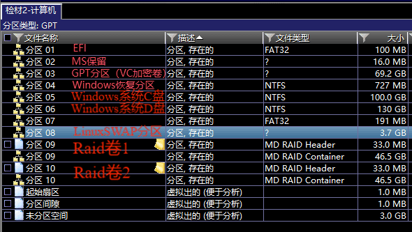

# 2025 年第五届 FIC 全国网络空间取证大赛决赛题解

!!! info "Author"
    NoahTie, BlackBird, Hypnotics. @ 猫猫啥也不会

| Part                           |  Author   |
| ------------------------------ |:---------:|
| 检材 1                         |  NoahTie  |
| 检材 2                         |  NoahTie  | 
| 检材 3                          |  NoahTie  |
| 检材 3 - 逆向部分              | BlackBird |
| 检材 4                        |  NoahTie  |
| 检材 4 - 逆向部分              | BlackBird |
| 检材 5                          | BlackBird |
| 综合分析                       |  NoahTie  |


!!! info "检材容器信息"
    检材容器密码: `F!C_2025-Final@决~赛#x7Pz!`

    检材容器 MD5: `935160a30f6636cf6d32710e83fb48c5`


## 比赛信息

!!! info "Info"
    以下内容节选自官方提供的竞赛手册, 并整合了比赛平台中的信息.


### 案件背景

在 FIC 线上赛各位取证专家的帮助下, 警方通过互联网线索成功锁定了陈某. 

李某失联后, 陈某终日值惶, 打算掩盖并消除其在黑产活动的痕迹, 于是对部分电子设备行了数据重置和销毁. 警方对陈某实施抓捕过程中, 发现陈某加密了其电脑系统, 并且重置了手机数据. 最终在陈某家中找到了陈某备用手机, 电脑, 尚未重置的服务器及路由器. 

据陈某交代备用机由于只用作网站测试和钓鱼攻击, 未对数据进行处理; 电脑上制作了多系统, 加密系统密码为"`2025=(20+25)^2`", 大部分钱财相关内容都保留在了加密系统上.

请各位取证专家根据组委会提供的检材, 还原陈某的黑产犯罪痕迹.


### 比赛内容及取证工具

比赛内容包括但不限于: 

- 计算机取证分析
- 手机取证分析
- 服务器分析
- 物联网取证分析
- 流量分析
- 多媒体内容分析
- ARM 系统分析
- 互联网取证
- 程序功能分析
- APP 分析
- 数据分析

参赛队伍根据比赛内容自行准备取证工具,  建议包含如下类别: 

- 容器软件, 如 VeraCrypt 等
- 镜像挂载软件, 如 FTKimager 等
- 虚拟机环境, 如 QEMU 等
- 屏幕录像软件
- 介质取证分析软件
- 手机取证分析软件
- 服务器取证分析软件
- PE/ELF 程序分析工具
- APP 分析工具
- Python 程序分析工具
- Raid 重组工具
- 文本查看/十六进制查看/编解码等通用工具
- 多媒体内容分析工具
- 流量分析工具
- 接口测试工具 


## 比赛及复盘时用到的软硬件清单

!!! info "Info"
    标注 \* 的项为仅复盘时使用的

### 硬件

- 100M 交换机 (搭建队内局域网)
- Ubuntu 笔记本电脑 (搭建队内协作工具: Hedge Doc, FTP Server, VoceChat)
- Windows 笔记本电脑 \* 3 (主力机, 其中 1 台搭建 Qwen 14B 大模型)
- Android 手机 (测试机)


### 软件

- 介质取证工具
    - 火眼证据分析
    - X-Ways Forensics
- 镜像仿真工具 & 虚拟机工具
    - 火眼仿真取证
    - VMware Workstation Pro
    - QEMU
- IDE / 文本编辑器 / Hex 编辑器
    - VS Code
    - Kate
    - 010 Editor
    - Excel
- 数据库工具
    - DB Browser for SQLite
- APK 分析工具
    - 雷电 APP 智能分析
- 二进制分析工具
    - IDA Pro
    - Detect It Easy
    - pyinstxtrctor-ng
    - pyligual
    - GDB
- 加密货币相关工具
    - BIP-39 Standalone
    - \* BIPs Git Respository
- 隐写分析工具
    - foremost
    - \* binwalk
- 哈希爆破工具
    - HashCat
- 流量分析工具
    - 科来网络分析系统
    - \* WireShark
- 杂项
    - CyberChef (加解密/编解码)
    - WindTerm (远程终端)
    - IrfanView (图片查看器)
    - VeraCrypt
    - KeePass 2
    - ADB
    - HashMyFiles
    - Python 3.13
        - ipython
        - pycryptodome
        - \* pyotp
        - \* unicorn
    - Audacity (音频编辑)
    - NodeJS
    - gcc
    - HedgeDoc (协作文档)
    - \* WPeChat (大模型二进制分析插件)
    - Ollama (本地大模型部署)
        - Qwen3 14B
    - xftp 


## 检材 1 - Android 手机

以下题目请分析检材 1.

该检材是雷电手机快取软件提取得到的备份文件, 详细的信息可以在 tar 包中的 `ThunderForensic.json` 中看到.


### 01 该检材的蓝牙 mac 地址为

!!! note "答案"
    A4:55:90:15:2E:76

在火眼的自动取证结果的"基本信息 -> 设备信息"中可以看到设备的蓝牙信息:


### 02 该检材的系统 Linux 内核版本号为

!!! note "答案"
    4.14.186

在提取的系统配置中可以看到恢复进程的版本信息, 其中包含了 Linux 的内核版本信息: 


可以通过在检材 tar 文件中全局搜索"Linux version"字样来找到该文件.


### 03 该检材中实际使用的密码管理软件的软件包包名为

!!! note "答案"
    `design.codeux.authpass.fdroid`

题目描述具有提示性, 限定了是"实际使用"的密码管理软件. 因此可以猜到检材中有不止一个密码管理软件, 而实际在使用的只有其中一个.

在自动取证结果的"基本信息 -> 应用列表"中筛选"其它"类别的应用, 并依最近使用的时间降序排序, 可以看到几个值得注意的包名:


其中的 `design.codeux.authpass.fdroid` (AuthPass), `com.kunzisoft.keepass.libre` (KeePassDX), `com.ivanovsky.passnotes` (KeePassVault) 及 `keepass2android.keepass2android` (Keepass2Android Password Safe) 均为密码管理器, 均支持 KeePass 的数据库格式.

依次查看上述 4 个应用的数据目录`/data/user/0/design.codeux.authpass.fdroid`, `/data/user/0/com.kunzisoft.keepass.libre`, `/data/user/0/com.ivanovsky.passnotes` 及 `/data/user/0/keepass2android.keepass2android` 之后可以判断出来只有 `design.codeux.authpass.fdroid` 保存有密码, 存储密码的文件为 `/data/user/0/design.codeux.authpass.fdroid/app_flutter/我的密码.kdbx`.

比较有趣的是, 这几个应用以及之后遇到的应用均可在 F-droid 下载.

另外, 即使这里一开始误判了实际使用的密码管理软件, 知道使用的是 KeePass 的情况下, 在检材中搜索 KeePass 数据库的后缀名 `.kdbx` 也可以确定实际使用的密码管理软件.


### 04 该检材中密码管理软件的主密钥为

!!! note "答案"
    `Save my P Ass.`

在自动取证结果的"基本信息 -> 便签"中可以看到与 KeePass 口令相关的记录:


```text
Save my P Ass.
here is password for keepass
```

乍一看好像没有记录口令, 但其实第一行的 `Save my P Ass.` 就是 KeePass 的主口令. 使用任意兼容 KeePass 2 的应用打开上题中找到的 `我的密码.kdbx`, 即可验证. 我使用的是原版的 KeePass Password Safe: 


双击项的标题列可以进行编辑, 双击其它列可以复制口令. 也可以直接在"File -> Export"中将所有口令导出为未加密的 html 文件:


### 05 该检材中保存的 `github.com` 密码为

!!! note "答案"
    Forensix777

这道题是有些干扰在的, 有 2 条记录都与"github"有关, URL 为 `github.com` 的记录更符合题目描述一些: 


### 06 该检材 root 工具的版本为

!!! note "答案"
    27.0

在应用列表中可以看到安装了 Magisk, 但镜像提取时并没有提取 `/data/app` 目录下的文件, 看不到安装的应用的详细信息:


在存储的根目录 `/storage/emulated/0/Magisk-v27.0.apk` 存储着一个 Magisk 的安装包, 版本为"27.0".


由此推断手机上安装的 Magisk 的版本.


## 检材 1 - Debian Linux 容器

以下题目请分析检材 1 中的容器.


### 仿真

Linux 容器位于 `/storage/emulated/0/UUID`. 在配置文件 `/data/user/0/ru.meefik.linuxdeploy/files/config/linux.conf` 中可以看到该容器的存储位置:


在 ES 文件管理器的数据目录中, 可以看到保存了 ES 文件编辑器的历史记录的数据库中有以下信息:


将该容器挂载为新检材, 查看其文件系统. 发现 `/boot` 是空的, 没有内核:


题目中也明确说到这是个"容器", 而非虚拟机, 猜测 Linux 系统使用的是 Android 系统的 Linux 内核. 之前的题目也问到了 Android 系统的 Linux 内核版本是 `4.14.186`.

到此为止, 可以想到 2 种仿真方案:

1. 在 QEMU 虚拟机安装 ARM 架构的 Debian 发行版, 之后挂载 `UUID` 容器, 通过 `chroot` 将系统根目录切换到 `UUID` 中.
2. 在有 ROOT 权限的 Android 测试机中安装 Linux Deploy 应用, 再将其所有数据文件全部导入至测试机中. 由于该容器中的二进制文件需要使用 ARM 架构的 Linux 内核, 因此在大部分 Windows 平台的 Android 虚拟机(X86_64 架构)中无法正常运行. 目前找到的唯一可行的虚拟机方案是 Android Studio 内建的 AVD Emulator 中的 ARM 架构的模拟器.

两者的难度分别来自于配置 QEMU 的过程及硬件要求. 不过好在这部分题目也基本可以在不仿真的情况下完成.


#### 方案一 通过 QEMU 虚拟机仿真容器

需要安装一个 ARM64 架构的 Debian 或其发行版的虚拟机, 计算机检材中提供了 ARM64 架构 Ubuntu 的 ISO 镜像. 

VMware 不支持在 x86_64 宿主机上安装 ARM64 架构的客户机. 在 Windows 上只能用 QEMU 来安装. 倒是可以直接使用之后的 OpenWRT, 但还是要面对 QEMU 的各种参数的问题. 关于使用 QEMU 安装各种主流操作系统虚拟机的方法, 可以参考 [QEMU/Guests - Computernewb Wiki](https://computernewb.com/wiki/QEMU/Guests). 该网站针对的是 x86_64 架构的虚拟机, 安装 arm64 架构的虚拟机时只需要将其中使用的 QEMU 的二进制文件改为 `qemu-system-arm64` 即可.

创建虚拟磁盘:

```bash
qemu-img create -f qcow2 /PATH/TO/DISK_IMAGE 50G
```

启动虚拟机并挂载 Ubuntu 的安装媒体, 如果在 Linux 宿主机上, 可以使用 KVM(`-enable-kvm`):

```bash
qemu-system-arm64 -hda /PATH/TO/DISK_IMAGE -cdrom /PATH/TO/Ubuntu_ISO -boot d -cpu host -m 4G -vga std -net nic,model=virtio -net user -usbdevice tablet -localtime
```

使用 GUI 界面安装完 Ubuntu 之后, 系统将自动关闭/重启, 之后再次启动系统时使用的指令:

```bash
qemu-system-arm64 -hda /PATH/TO/DISK_IMAGE -hdb /PATH/TO/MOUNT_DISK_IMAGE -boot c -cpu host -m 4G -vga std -net nic,model=virtio -net user -usbdevice tablet -localtime 
```

将其中的"/PATH/TO/MOUNT_DISK_IMAGE"修改为到 `UUID` 容器的地址即可在虚拟机中挂载 `UUID` 到 `hdb`.

进入系统之后挂载 sdb:

```bash
mkdir /mnt/uuid
mount /dev/sdb /mnt/uuid
```

再通过 `chroot` 修改系统的根目录到挂载的分区, 并获取一个 shell:

```bash
chroot /mnt/uuid /bin/sh
```


#### 方案二 通过 Android 测试机部署容器

检材中没有 BusyBox 的 APK, 需要额外下载安装. 我的测试机安装有 BusyBox, 这一步直接跳过了.

ADB 连接, 安装检材中 Linux Deploy 的 APK: `/storage/emulated/0/1hlnet/ru.meefik.linuxdeploy/2025-05-09-10-29-40-844-user_0/base.apk`: 


将 `/data/user/0/ru.meefik.linuxdeploy/` 和 `UUID` 容器通过 `adb push` 复制到手机存储中: 


之后需要在 adb shell 中通过 `run-as` 来复制文件, 否则可能出现权限问题. 

给予 Linux Deploy ROOT 权限:


可以看到配置已经正常读取:


点击启动:


在电脑上运行 x11 Server, ssh 连接: 


### 07 找到该手机上的 Linux 容器, 并回答下列问题, 该 Linux 发行版名称为

!!! note "答案"
    debian

手机上安装了包名为 `ru.meefik.linuxdeploy` 的应用, 看名字与部署 Linux 相关: 


也可以找到该应用的安装包, 位于 `/storage/emulated/0/1hlnet/ru.meefik.linuxdeploy/2025-05-09-10-29-40-844-user_0/base.apk`: 


找到应用的数据目录, 在其中看到 Linux 容器的配置信息 `/data/user/0/ru.meefik.linuxdeploy/files/config/linux.conf`:


可以看到其发行版为 `Debian`.


### 08 该系统默认桌面环境为

> A. KDE
> 
> B. GNOME
> 
> C. XFCE
> 
> D. DDE
> 

!!! note "答案"
    C

接上题. 在配置文件中可以看到桌面环境是 `xfce`:


### 09 该系统的 android 用户密码为

!!! note "答案"
    99c26da5

接上题. 在配置文件中可以看到密码是 `99c26da5`: 


### 10 浏览器下载的文件名为

!!! note "答案"
    reshacker_setup.exe

在火眼自动取证结果的"Chromium浏览器"中可以看到下载记录:


### 11 陈某使用过的 github 代理的域名为

!!! note "答案"
    gh.viru.sh

在火眼自动取证结果的"Linux 基本信息 -> 历史命令" 中:


通过代理 clone 了 `aircrack-ng` 的仓库.


### 12 助记词程序 `recphrase` 使用的壳类型为

!!! note "答案"
    UPX

导出程序文件 `recphrase`, 用 DIE 查一下:


发现是 UPX 4.22, 下个对应版本的 UPX 脱壳就行:


### 13 程序运行后第 2 列第 3 行助记词为

!!! note "答案"
    village

接上题. 如果之前仔细看了 Shell 的历史记录, 就会看到执行了 Python 脚本 `reco.py` 并且疑似进行了打包和加 UPX 壳操作:


与 `recphrase` 在相同位置有另外一个 ELF 文件 `reco`, 两者哈希值一致, 为同一文件:


如果之前仿真了容器, 可以直接运行, 通过 X11 看到图形界面.

用 `pyinstxtractor` 解包: 


之后可以使用 Python 3.11 直接运行解包出的 `reco.pyc`, 或者使用 Python 字节码逆向工具还原出 py 源码. 这里推荐基于机器学习模型的工具 `pylingual`, 相比其它传统工具效果更好. 可以使用[在线服务](https://pylingual.io), 也可以部署到本地. 还原出的源码:

```python
# Decompiled with PyLingual (https://pylingual.io)
# Internal filename: reco.py
# Bytecode version: 3.11a7e (3495)

import matplotlib.pyplot as plt
from matplotlib.font_manager import FontProperties
import string

fig, axes = plt.subplots(4, 3, figsize=(12, 12))
axes = axes.flatten()
word_codes_list = [
    [115, 101, 115, 115, 105, 111, 110], 
    [102, 101, 118, 101, 114], 
    [115, 112, 111, 110, 115, 111, 114], 
    [99, 114, 111, 117, 99, 104], 
    [116, 105, 99, 107, 101, 116], 
    [116, 119, 105, 115, 116], 
    [97, 112, 112, 114, 111, 118, 101], 
    [118, 105, 108, 108, 97, 103, 101], 
    [102, 105, 110, 105, 115, 104], 
    [115, 113, 117, 97, 114, 101], 
    [97, 108, 115, 111], 
    [99, 111, 111, 107]
]

for i, word_codes in enumerate(word_codes_list):
    ax = axes[i]
    ax.set_xlim(0, len(word_codes) + 1)
    ax.set_ylim(0, 3)
    ax.set_xticks([])
    ax.set_yticks([])
    word = ''.join([chr(code) for code in word_codes])
    ax.text(0.5, 1.5, word, fontsize=24, ha='left', va='center')
plt.tight_layout()
plt.show()
```

运行代码:


助记词是: `session fever sponsor crouch ticket twist approve village finish square also cook`


### 14 该组助记词对应的钱包种子前 8 位为

!!! note "答案"
    e08478b0

用 BIP-39 计算一下:


恢复种子是 `e08478b0ca12153b4ae26d05fc50e5bbf122307d7d431c9d59e1f6bc7d9a835c7d3d384bb4011aeb7540acef56129ad620839d24383a1308997905c9c0586611`.


### 15 钓鱼网站 `phishing` 的后台用户密码加密算法为

!!! note "答案"
    pbkdf2_sha256

在 `/root/phishing` 目录找到 Django 框架编写的网站源码.

在 `db.sqlite3` 数据库的 `auth_user` 表中可以找到 Django 默认格式的密码哈希:


### 16 钓鱼网站超管用户的弱口令为

!!! note "答案"
    123456

HashCat 爆破时提示哈希长度错误, 但 WiKi 看了眼, 哈希的格式是没有错的. 最后直接 Python 脚本爆破:


还好密码够弱, 在弱口令字典里面也是比较靠前的位置.


### 17 宝塔面板的入口为

!!! note "答案"
    /a2d3e161

可以根据浏览器的历史记录来推断:


### 18 宝塔面板运行在 aarch64 内核时报错的 so 文件为

!!! note "答案"
    PluginLoader.so

在宝塔面板的错误日志 `/www/server/panel/logs/error.log` 中可以看到:


## 检材 2 - 未加密的 Windows 系统

整个镜像中有 10 个分区, 包含 2 个 Windows 操作系统和 1 个 Kali Linux 操作系统:



在 EFI 分区中可以看到操作系统的引导:


其中除了 Windows 和 Kali Linux 的引导之外, 还有 VeraCrypt 的引导, 说明设备中使用 VeraCrypt 加密了系统盘.

在 Boot 中也有 VeraCrypt 留下的备份文件:


### 01 该检材系统中设备名称为 neo4chen 的系统分区的 sha256 值为

!!! note "答案"
    E2219548F5A8E61F373258EB658625ADDA7BF858A83AD8D6E4213BCD8ECEB423

在检材信息中找到 Windows 的系统分区计算 SHA256 即可:


### 02 上题系统中, 曾被远程控制的 ip 为

!!! note "答案"
    192.168.3.14


## 检材 2 - 加密的 Windows 系统

仿真起来长这样子:


需要对分辨率进行修改。


### 出题人: "回"字的四种写法

#### 仿真系统, 通过远程桌面操作

仿真系统, 通过远程桌面 RDP 连接虚拟机. 这样操作界面会稍微大一些. 在设置中调整缩放比率即可恢复正常的桌面. 这是我们在比赛中使用的方法.


#### 仿真系统, 通过命令调整分辨率

盲操, Win+R 打开运行, 输入 wt 或 pwsh 或 cmd 打开控制台. 之后屏幕焦点会自动移动至打开的新窗口. 

但是这种方法需要虚拟机联网下载需要用到的工具, 在比赛的离线环境中难以实现.


#### 安装 VMware Tools 自动调整分辨率

在 VMware 的虚拟机选单中选择"重新安装 VMware Tools". 接着会弹出光盘自动播放, 直接回车就是启动安装. 接着一路按 Alt+N 或回车安装.

安装好之后重启就会自动调整好分辨率了. 不想重启的话在桌面右键, 在显示设置中将缩放比例修改一下就会刷新分辨率配置了. 之后文件导出也比较方便.


#### 在分区 3 未加密系统中挂载加密分区

在 VeraCrypt 中有曾经挂载分区留下的记录, 可以看到加密卷为 `\Device\Harddisk0\Partition3`.


在加载选项中勾选 V 和 U 选项, 输入密码 `2025=(20+25)^2`, 勾选使用 PIM 码并留空, 挂载.


### 03 陈某通过物理方式保存助记词的东西名为

!!! note "答案"
    时光密钥

桌面上有一堆 steam 的 url 快捷方式, 用命令行直接全删掉:

```powershell
Remove-Item *.url                   # Alias: rm *.url
```

之后可以看到桌面上有个 jpg 图片 `死神来了.jpg`, 内容是助记词记录板的照片:


在 `图片` 文件夹中还有另外 1 张助记词记录版的照片:


照片中的标题都是"时光密钥".


### 04 陈某保存记录完整助记词的文件的 md5 值为

!!! note "答案"
    c2a8300c87f86bd04b4aea42e7d6b83c

计算 `⚫1【】0.jpg` 的 MD5 哈希:


### 05 陈某交代 XI 位为 `2^1`, 上题文件对应中文助记词不包含一下哪一项

> A. 摇
> 
> B. 选
> 
> C. 的
> 
> D. 以
> 

!!! warning "本题存疑"
    官方答案: C

    我的答案: ABCD

上题中找到的 2 张图片分辨率接近, 但 `⚫1【】0.jpg` 的大小是另外 1 张图片的约 2 倍. 


用 foremost 拆分一下 `⚫1【】0.jpg`, 得到 2 张图片:


拆分出来的第 2 张图片是完整的:


BIP-39 的助记词每个对应一个 0 - 2047 之间(10 bit)的数字, 将这些数字全部转换为 2 进制, 去除 CheckSum 后拼接起来就是 16 进制的 BIP-39 Seed 了. 参考: [Mnemonic Generation (BIP39) Simply Explained](https://medium.com/coinmonks/mnemonic-generation-bip39-simply-explained-e9ac18db9477).

而助记词板的作用就是记录助记词对应的 2 进制的值. BIP-39 助记词列表共 2048 个单词, 对应 `0b0000000000`(0) 至 `0b1111111111`(2047). 中文的 BIP-39 助记词列表可以在 [bip-0039-wordlists](https://github.com/bitcoin/bips/blob/master/bip-0039/bip-0039-wordlists.md) 找到.

但是这道题因为给出的线索太模糊, 导致无法确定真实的助记词. 按照提示 `XOR 1988` 应该要对恢复出来的 2 进制做异或.

首先, 题目中说到 XI 位为 `2^1`, 这样一来助记词板上记录的数值范围就是 0 - 4094 间的偶数. 如果 I 位是最低位(2^0), 其余左移 1 位(依大端序表示), 最终恢复出来的结果与官方给出的答案并不一致:

| I   | II  | III | IV  | V   | VI  | VII | VIII | IX  | X   | XI  |
| --- | --- | --- | --- | --- | --- | --- | ---- | --- | --- | --- |
| 0   | 10  | 9   | 8   | 7   | 6   | 5   | 4    | 3   | 2   | 1   |


如果认为 X 位为 `2^0`, XI 为 `2^1`, 其余各位循环右移 2 位(依小端序表示), 也不对:

| I   | II  | III | IV  | V   | VI  | VII | VIII | IX  | X   | XI  |
| --- | --- | --- | --- | --- | --- | --- | ---- | --- | --- | --- |
| 2   | 3   | 4   | 5   | 6   | 7   | 8   | 9    | 10  | 0   | 1   |


如果认为题目中给出的 XI 位实际上为 `2^0`, 恢复出来的结果依然与官方答案不一致:

| I   | II  | III | IV  | V   | VI  | VII | VIII | IX  | X   | XI  |
| --- | --- | --- | --- | --- | --- | --- | ---- | --- | --- | --- |
| 10  | 9   | 8   | 7   | 6   | 5   | 4   | 3    | 2   | 1   | 0   | 


但是, 当我试着从答案反推的时候发现了问题:

以"以"为例, 其在中文助记词列表中位于第 17 位(数组下标从 0 开始), 对应 10 进制数字为 17:


计算 `17^1988` 再转 2 进制得到 `11111010101`.


那么, 按理来说我应该在助记词板上看到`11111010101`的序列, 有 1 行很像(XI 位实际上为 `2^0`), 但不完全相同:


助记词板上的这行转换成 10 进制是 `18`, 仅比"以"实际对应的 10 进制小 1. 对另外 2 个字符"摇"和"选"进行相同的处理后, 也有相同的情况.

由此, 大致可以判断, 出题人在出题时直接将助记词的行号当作了其索引, 导致用助记词板恢复出来的每个助记词都在真实助记词的下一行. 依此恢复出来与选项一致的助记词:


### 06 该检材加密系统中陈某自白的录音最后修改时间为

!!! note "答案"
    2025-05-14 20:59:20

这道题难就难在找到录音文件了.

在 `音乐` 文件夹中可以看到一个音乐文件, 歌手叫"陈浩南":


查看属性:


### 07 陈某和李某共同出行的户外活动为

!!! note "答案"
    钓鱼

导出听一下. 刚开始就听到有摩斯电码的声音, 是下一道题用到的.

在大约 33 秒处提到钓鱼.


### 08 陈某自白中的隐藏的"学习资料"所在服务器 IP 地址为

!!! note "答案"
    114.51.41.91

摩斯电码的声音很明显, 在频谱图里可以清晰地看到:


转写一下就是 `.----/.----/....-/`.

之后还有几段:

- 0:57 左右: `...../.----/`
- 2:17 左右: `....-/.----/`
- 3:36 左右: `----./.----`

这几段分别是 `114`/`51`/`41`/`91`, 大概是个 IP 地址吧(大嘘). 属于是看到前 3 个数字已经猜到后面是啥了.


### 09 存放欠条的加密容器文件名为

!!! note "答案"
    我的手机号

在快捷访问列表中有 1 个自定义的固定项 `kali`:


进入文件夹看到其中除了一些虚拟机的文件之外, 还有一个名为 `我的手机号` 的文件, 导出到实机.


用 16 进制编辑器浏览一下文件内容, 怀疑是加密容器:


文件名为容器密码的提示, 联系初赛中得到的陈某的 2 个手机号, 尝试进行解密, 发现 `13170010703` 和 `3170010703` 均可解密容器. 两个密码可以打开不同的加密卷:


图片文件内容分别为左、右半边的欠条:


这里使用的是 VeraCrypt 的隐藏加密卷功能. 这部分内容可以参考 [盘古石杯2023初赛题解 - XDforensics-Wiki](https://forensics.xidian.edu.cn/wiki/PGS2023Preliminary/#9keepassmaster-password) 中关于 TrueCrypt 隐藏容器的介绍, 与 VeraCrypt 的隐藏加密卷原理及功能均类似.


### 10 该容器欠条中赵某欠陈某多少虚拟币

!!! note "答案"
    0.079 BTC

接上提, 两张欠条拼接起来:


### 11 该检材中 Ubuntu 光盘文件的系统内核版本号为

!!! note "答案"
    4.15.0

从 ISO 文件中提取 `\install\initrd.gz\initrd`, 使用 Hex 编辑器打开, 搜索"firmware"即可找到 Linux 内核版本:


`initrd` 实际上是一个 `Cpio` 归档文件, 可以用 Linux 的 `cpio` 指令或任何现代化的压缩工具(例如, 7zip)解压:


在其中的 `lib/firmware` 目录中可以清晰地看到内核版本:


## 检材 2 - Kali Linux 系统

这个 Raid 比较好组, 因为 MD Raid Header 是完整的, 理论上所有工具都能自动重组.

用 UFS 的话还是加载镜像之后自动就重组好了. 这里演示一下用 X-Ways Forensics 手动重组的过程:

打开 2 个 Raid 分区:


将鼠标悬停在 MD Raid Header 右侧的信息图标上, 可以看到 Raid 的参数是 `Raid0, 条带大小是 1024`:


在"专业工具"中选择"重组 Raid"选项, 添加 2 个卷并修改条带大小:


重组之后是 EXT4 格式的分区:


之后对重组的卷制作镜像, 可用于仿真或火眼自动分析.

仿真因为硬盘的 UUID 变化, 导致 grub 找不到 boot, 需要手动修复:


之后输入命令:

```grub
insmod normal
normal
```

就可以正常启动系统了.

系统里有 `haobei` 和 `root` 用户, 平时常用的是 `haobei`.


### 12 该系统的当前状态为

> A. Poweroff (S5)
> 
> B. Sleep (S2)
> 
> C. Hibernate (S4)
> 
> D. Poweron (G0)
> 

!!! note "答案"
    C

在系统日志中可以到在 5 月 15 日系统进入了休眠状态. 我这里是在介质取证软件里导出 `/var/log/journal` 到本地之后在 wsl 里运行的 `journalctl`, 也可以直接在仿真系统里面查看日志.


`last` 指令看到最近登录的信息, 发现系统最近一次登录的用户是 `haobei`, 且未登出:


### 13 该系统使用了什么阵列

!!! note "答案"
    Raid0

见上述 Raid 重组过程.


### 14 系统自带记事本软件中记录的密码的未知位数有几位

!!! note "答案"
    4

仿真之后进入系统, 点击任务栏上的 Mousepad 图标, 弹出了恢复会话的提示:


恢复之后看到内容为爆破掩码 `chewhaoN@%d%d%d%d`:


没有仿真的话得想到 Kali 自带的文本编辑器是 Mousepad, 然后去 haobei 的用户目录找 Mousepad 的缓存文件:


### 15 系统自带记事本内容缓存在重组后逻辑分区中的起始偏移地址为

!!! note "答案"
    0296D90000

见上题. 


### 16 Chrome 浏览器插件的保护密码为

!!! note "答案"
    chewhaoN@6087

启动 Chrome 之后就发现有一个插件因为不安全被禁用了, 查看插件发现从文件安装了扩展:


插件文件目录是 `/home/haobei/extension`, 导出目录查看代码, 但是用处不大; 数据存储在 `/home/haobei/.config/google-chrome/Default/Sync Extension Settings/papfghiicpioleonmjldcjdjglakpkcg/` 目录下, 其中的 log 中包含了一些加密时使用的参数:

```json
{ 
    "58384e73-5c98-433d-87bc-165f7f0ddad6": {
        "account":"chenhaoren",
        "encrypted":true,
        "hash":"58384e73-5c98-433d-87bc-165f7f0ddad6",
        "index":1,
        "secret":"U2FsdGVkX1+eacsEnU0gCAZ1MQR8aoQKWZIH8oRlWkkdnsm0SrMfmXK98hBGaAqr",
        "type":"totp"
    },
    
    "key": {
        "enc":"U2FsdGVkX18Tb9IA8UF4TbpMQjOs4IqZBTIkldDlgn9vw1gIF9ltOirI/lf1SCGh9hAskbnb7cIsoJL6mNii7pQ1SDSt9R7vzF3Y+/d/fPtKXHMisjbQK/U6t+3wREAuoKQ4yZ24iuw+KZ6CW9bl6ULp3nVx0B8QpueW95sw0KOtmOMpmD19nO6gkFvMohcB",
        "hash":"$argon2id$v=19$m=16384,t=1,p=1$k6EZEDdQYyn+/0GlJtZGpg$hicAuwJorE73Moj+Po2Txda8hyoPPGYa"
    }
}
```

这道题动调会比较容易看到加解密逻辑, 从而爆破密码. 在仿真的 Kali Linux 里面运行 Chrome 浏览器, 由于插件是以开发者模式加载的, 直接点击插件在弹出窗口右键点击 Inspect 即可进入调试.

浏览一下插件主要的代码, 发现一处与加密有关的代码, 打断点. 或者用 Chrome 自动打下的断点也可以. 随便输入一个密码.

跟进一段, 发现加密使用的是 NodeJS 的包 `Crypto-JS` 提供的 AES 加密, 使用 PassPhrase 加解密, 过程中 IV & Salt 均自动生成.


继续跟进, 在报错密码错误前的最后一处函数调用:


看到用输入的密码(这里是 `123456`)对 `encKey.enc` 进行了解密, 并通过 argon 对解密结果进行了验证. `encKey.enc` 与 `encKey.hash` 的值分别是上述找到的 log 文件中的 `key.enc` 与 `key.hash`.

那么, 爆破密码时就需要使用 `Argon2` 来确认是否爆破成功. 由于 `Crypto-JS` 和 `Argon2` 的实现属实有些复杂, 没办法很快重写出相同功能的代码, 这里直接使用 NodeJS 进行爆破. 需要使用到的 NodeJS 的模块均可在 Chrome 的调试界面导出, 有网的环境可以直接用 npm 下载.

```sh
npm i crypto-js argon2
```

写代码的时候要注意 `Argon2` 的 `Verify` 是异步函数.

```js
const CryptoJS = require('crypto-js');
const argon2 = require('argon2');

const encrypted = 'U2FsdGVkX18Tb9IA8UF4TbpMQjOs4IqZBTIkldDlgn9vw1gIF9ltOirI/lf1SCGh9hAskbnb7cIsoJL6mNii7pQ1SDSt9R7vzF3Y+/d/fPtKXHMisjbQK/U6t+3wREAuoKQ4yZ24iuw+KZ6CW9bl6ULp3nVx0B8QpueW95sw0KOtmOMpmD19nO6gkFvMohcB';
const hashedPassword = '$argon2id$v=19$m=16384,t=1,p=1$k6EZEDdQYyn+/0GlJtZGpg$hicAuwJorE73Moj+Po2Txda8hyoPPGYa';
const prefix = 'chewhaoN@';

(async () => {
    for (let i = 0; i <= 9999; i++){
        const password = prefix + i.toString().padStart(4, '0');
        try {
            const decrypted = CryptoJS.AES.decrypt(encrypted, password).toString();
            if (!plaintext || plaintext.length === 0) continue;
            if (await argon2.verify(hashedPassword, plaintext)){
                console.log('[+] Password Cracked: ', password);
                console.log('[+] Plaintext:', plaintext);
                break;
            }
        } catch (e){
            continue;
        }
    }
})();
```


如果使用正确的密码继续跟进, 会发现上述解密得到的明文还会再次被用作解密的密钥.

完成最终的解密并将 Hex 转换为字符串可以得到:


### 17 Chrome 浏览器插件存放的令牌的名称为

!!! note "答案"
    chenhaoren

用密码解密之后看到:


在之前看到 log 的话, 也可以猜到令牌名称. 如果在自己电脑上安装插件并添加令牌的话, 可以通过查看本地文件来进行验证.


### 18 该检材 Linux 系统浏览器插件存放的令牌在 2022-05-12 00:54:10 时的令牌为

!!! note "答案"
    080000

这道题稍微有些问题, 因为题目中没有明确说明时区. Kali Linux 的系统时区为 `New York/America`.

修改系统时间后查看. 或者将 TOTP 导入到其它 2FAS 应用中也可以看到, 但要注意系统的时区问题. Python 的 `pyotp` 用起来稍微方便一点:


## 检材 3 - Ubuntu Linux 服务器

本题中的服务器使用第三方的用户认证服务, 替换了系统自带的认证. 因此, 火眼无法正常修改用户密码. 需要先通过介质取证软件找到密码之后才能进入仿真系统或修改密码.

参考第 04 - 07 题进入系统后, 需要修改网卡配置文件 `/etc/netplan/50-cloud-init.yaml` 为 dhcp:


之后应用 `netplan` 配置:

```sh
sudo netplan apply
```


系统的 `sshd` 没有运行, 需要手动启动:

```sh
sudo service ssh start
```


由于服务器中 web_api 容器的 MYSQL 配置使用了外部机器, 导致服务无法正常运行, 需要手动修改 MYSQL 的配置信息:

```bash
sudo bash
docker stop d4cb
vim /var/lib/docker/containers/d4cb231cae7fcef2c84d1418adb31450d37bc4bcef00268cd13607971ee8b38f/config.v2.json
systemctl stop docker.socket
systemctl restart docker
systemctl start docker.socket
docker start d4cb 4ff3
```


不过这也就是个 NodeJS 的项目, 直接把整个项目源码复制到 Linux 虚拟机或者 wsl 重启一个服务也行. 因为用到了 Linux 的 so 共享库, Windows 起不起来.


### 01 该操作系统版本号为

!!! note "答案"
    24.04.1

在火眼自动分析结果的"系统信息"中:


### 02 该主机名为

!!! note "答案"
    api-server-2

见上题.


### 03 该 ens33 网卡 IP 地址为

!!! note "答案"
    172.16.10.254

高版本的 Ubuntu 的网卡配置由 netplan 接管, 配置文件位于 `/etc/netplan/`:


### 04 操作系统登录使用了第三方身份验证, 该技术为

> A. pam_pwdfile
> 
> B. pam_ldap
> 
> C. Google Auth
> 
> D. pam_krb5
> 

!!! note "答案"
    A

在历史命令中可以看到安装并启用 `pam_pwdfile` 的过程:


并可在 `/etc/my_two_factor_pwdfile` 找到用于认证的文件.


### 05 该身份验证的加密算法为

> A. Bcrypt
> 
> B. MD5
> 
> C. DES
> 
> D. AES
> 

!!! note "答案"
    A

接上题. 打开文件后可以看到是 Bcrypt 格式的 Hash:


### 06 该保存 king 用户密码的文件名为

!!! note "答案"
    my_two_factor_pwdfile

接上题.


### 07 尝试爆破 king 用户, 其密码为(king字母加3个数字)

!!! note "答案"
    king110

用 HashCat 爆破:

```sh
./hashcat -m 3200 -a 3 '$2a$10$V/8GUI5aTNSnbFodPjP7Zu6vCFSXmvdd9oKHGtWv/vbT3Q4LLTCcW' king?d?d?d
```


### 08 该 WEB-API 配置的 MySQL 数据库服务器地址为

!!! note "答案"
    172.16.10.200

可以在 `/home/king/web-api/docker-compose.yml` 中看到容器的配置信息:

```yaml
version: "3.8"
services:
  api:
    image: web-api:latest
    container_name: web_api
    cap_add:
      - SYS_PTRACE
    restart: unless-stopped
    ports:
      - "3000:3000"
    environment:
      MYSQL_HOST: 172.16.10.200
      MYSQL_PORT: 3306
      MYSQL_USER: root
      MYSQL_PASSWORD: "7001"
      MYSQL_DATABASE: product_db
      JWT_SECRET: zhaohong_key
      JWT_EXPIRES_IN: 24h
      PORT: 3000
      NODE_ENV: development
```

仿真之后看 Docker 容器环境变量也可以:

```sh
sudo docker inspect d4cb | grep MYSQL
```


### 09 其中用于 WEB-API 测试的流量包文件名为

!!! note "答案"
    test.pcap

在历史命令中看到运行过 `tcpdump`, 输出到文件 `test/test.pcap`:


## 检材 3 - 流量包分析部分

找到该文件(`/home/king/test/test.pcap`)并导出, 用 WireShark 或科来网络分析系统打开, 只涉及 HTTP 流量用 Charles 也行. 这里以 WireShark 为例.


### 10 统计其中 admin 用户成功登录的次数为

!!! note "答案"
    3

登录一般是 POST 请求, 过滤一下:

```python
http.request.method=="POST"
```

看到只有 3 个 POST 请求, 并且请求体中的 JSON 的 `username` 均为 `admin`. 追踪 HTTP 流:


可以看到 3 次登录使用相同的用户信息(`admin`: `zhaohong666`)且均成功登录.


### 11 找出用户最后一次查看的商品型号为

!!! note "答案"
    hx-101

大致浏览一下流量包, 里面夹杂了大量的漏洞扫描器的流量, 特征是 `User-Agent` 为 `Mozilla/4.0 (compatible; Win32; WinHttp.WinHttpRequest.5)`, 过滤一下并之查看请求:

```python
not http contains "Mozilla/4.0 (compatible; Win32; WinHttp.WinHttpRequest.5)" and http.request
```


其中 `/api/products/*` URI 的请求疑似访问了商品信息, 追踪 HTTP 流:


## 检材 3 - Docker 容器部分

以下题目请分析检材 3 WEB-API 容器.


### 12 该容器镜像 ID 前六位为

!!! note "答案"
    d4cb23

仿真后查看容器信息:

```sh
sudo docker ps -a
```

或 

```sh
sudo docker container ls -a
```


也可以在火眼自动分析得到的 Docker 容器信息中看到:


### 13 该容器的核心服务编程语言为

> A. JAVA
> 
> B. PHP
> 
> C. NODEJS
> 
> D. C#
> 

!!! note "答案"
    C

进入容器的文件系统, 查看工作目录:

```sh
sudo docker exec -it d4cb /bin/bash
ls -l
```


这道题也稍微有一些问题: NodeJS 并非编程语言, 而是基于 JavaScript 语言的后端开发框架.

不过无伤大雅, 并不影响做题.

到这里会发现一个问题, 这个容器重启的频率太高了. 这算是一个容器内服务没有正常运行的提示吧.


### 14 该容器所用域名为

!!! note "答案"
    api-server.com

进入 Nginx 的容器, 查看 Nginx 的配置文件:

```bash
docker exec -it 832 /bin/bash
nginx -t
cat /etc/nginx/nginx.conf 
cat /etc/nginx/conf.d/api-server.conf 
```


### 15 该容器 access_log 日志文件名为

!!! note "答案"
    api-server-access.log

见上题.


### 16 该容器的 FLAG2 的接口 URL 为

!!! note "答案"
    /api/auth/flag2

在 `/app/index.js` 中看到使用的路由:


在 `/app/src/routes/auth.routes.js` 中看到下一级路由:


### 17 该容器的服务运行状态的接口 URL 为

!!! note "答案"
    /api/health

见上题.


### 18 该容器中访问 FLAG2 接口后，会提示需要在什么调试器下运行

> A. GDB
> 
> B. Frida
> 
> C. rr
> 
> D. Treace
> 

!!! note "答案"
    A

见 16 题.

在 `app/utils/encryption.js` 中能看到 js 函数:


调用了 `app/libJiami.so` 中的函数.


### 19 该容器的 admin 用户的登录密码为

!!! note "答案"
    zhaohong666

有 2 种做法, 一是根据流量包判断密码; 二是做完后面的逆向之后直接解密数据库中的用户密码.


### 20 该容器的数据库内容被 SO 所加密, 该 SO 文件名为

!!! note "答案"
    libJiami.so

整个 `app` 目录中只有 1 个 so 文件 `libJiami.so`, 看名字大概也能猜出来是干什么的了.

在 `app/src/utils/encryption.js` 中能看到详细调用.


## 检材 3 - 逆向部分

以下题目继续分析上述 so 文件.


### 21 该文件的编译器类型为

> A. VC
> 
> B. DELPHI
> 
> C. GCC
> 
> D. VB
> 

!!! note "答案"
    C

可以直接通过 DIE 查看程序的相关信息: 


DIE 的原理大致是解析二进制程序的基础结构(文件头, 表, 节等信息)之后, 再使用内置的引擎执行签名文件(感觉叫签名文件不是很好理解, 可以理解为指纹/规则文件), 获得相关内容. 具体的检测原理可以查看 DIE 的签名库: 


这里对检测 gcc 的规则做一个初步的解析: 

``` c
// DIE's signature file
init("compiler", "gcc");
function getGCCVersion(nOffset, nSize)
{
    var sResult = "";
    var nOffset = ELF.findString(nOffset, nSize, "GCC:");
    if (nOffset != -1)
    {
        sResult = ELF.getString(nOffset + 5, 100);
    }
    return sResult;
}

function detect(bShowType, bShowVersion, bShowOptions)
{
    if (ELF.compareEP("31ed5e89e183e4..50545268........68........515668........e8"))
    {
        if (ELF.compareEP("$$$$$$$$57565383ec..8b7424..8b7c24..8b5c24..b8........85c00f84........8b0d........85c90f94c025........a3........8b5424..8b4c24..8d44....a3........8b5424..8915........90", 29))
        {
            sVersion = "4.7.2(exe)";
            bDetected = 1;
        }

        // snip

        else if (ELF.compareEP("$$$$$$$$55ba........89e557565381ec........85d20f85........8b45..8b4d..8915........8d54", 29))

        {
            sVersion = "4.1.2(exe)";
            bDetected = 1;
        }
    }
    else if (ELF.compareEP("31ed5589e583e4..8d45..83ec..50ff75..52e8$$$$$$$$5589e557565383ec..8b5d..8b7d..8d74....8935........85db7e..8b0785c074..a3........0fb610"))
    {
        sVersion = "4.4.7(exe)"; // BSD
        bDetected = 1;
    }

    // snip

    else if (ELF.isSectionNamePresent(".gcc_except_table"))
    {
        bDetected = 1;
    }
    var nSection = ELF.getSectionNumber(".comment");
    if (nSection != -1 && sVersion == "")
    {
        var sGCCVersion = getGCCVersion(ELF.getSectionFileOffset(nSection), ELF.getSectionFileSize(nSection));
        if (sGCCVersion != "")
        {
            sVersion = sGCCVersion;
            bDetected = 1;

            // DIE's signature file
            init("compiler", "gcc");

            function getGCCVersion(nOffset, nSize)
            {
                var sResult = "";
                var nOffset = ELF.findString(nOffset, nSize, "GCC:");
                if (nOffset != -1)
                {
                    sResult = ELF.getString(nOffset + 5, 100);
                }
                return sResult;
            }
            
            function detect(bShowType, bShowVersion, bShowOptions)
            {
                if (ELF.compareEP("31ed5e89e183e4..50545268........68........515668........e8"))
                {
                    if (ELF.compareEP("$$$$$$$$57565383ec..8b7424..8b7c24..8b5c24..b8........85c00f84........8b0d........85c90f94c025........a3........8b5424..8b4c24..8d44....a3........8b5424..8915........90", 29))
                    {
                        sVersion = "4.7.2(exe)";
                        bDetected = 1;
                    }

                    // snip

                    else if (ELF.compareEP("$$$$$$$$55ba........89e557565381ec........85d20f85........8b45..8b4d..8915........8d54", 29))
                    {
                        sVersion = "4.1.2(exe)";
                        bDetected = 1;
                    }
                }
                else if (ELF.compareEP("31ed5589e583e4..8d45..83ec..50ff75..52e8$$$$$$$$5589e557565383ec..8b5d..8b7d..8d74....8935........85db7e..8b0785c074..a3........0fb610"))
                {
                    sVersion = "4.4.7(exe)"; // BSD
                    bDetected = 1;
                }

                // snip

                else if (ELF.isSectionNamePresent(".gcc_except_table"))
                {
                    bDetected = 1;
                }
                var nSection = ELF.getSectionNumber(".comment");
                if (nSection != -1 && sVersion == "")
                {
                    var sGCCVersion = getGCCVersion(ELF.getSectionFileOffset(nSection), ELF.getSectionFileSize(nSection));
                    if (sGCCVersion != "")
                    {
                        sVersion = sGCCVersion;
                        bDetected = 1;
                    }
                }
                if (sVersion == "")
                {
                    if (ELF.isOverlayPresent()) // TODO Check!!!
                    {
                        var sGCCVersion = getGCCVersion(ELF.getOverlayOffset(), Math.min(8192, ELF.getOverlaySize()));
                        if (sGCCVersion != "")
                        {
                            sVersion = sGCCVersion; // Version mb corrupted!
                            bDetected = 1;
                            
                            // DIE's signature file
                            init("compiler", "gcc");
                            function getGCCVersion(nOffset, nSize)
                            {
                                var sResult = "";
                                var nOffset = ELF.findString(nOffset, nSize, "GCC:");
                                if (nOffset != -1)
                                {
                                    sResult = ELF.getString(nOffset + 5, 100);
                                }
                                return sResult;
                            }
                            function detect(bShowType, bShowVersion, bShowOptions)
                            {
                                if (ELF.compareEP("31ed5e89e183e4..50545268........68........515668........e8"))
                                {
                                    if (ELF.compareEP("$$$$$$$$57565383ec..8b7424..8b7c24..8b5c24..b8........85c00f84........8b0d........85c90f94c025........a3........8b5424..8b4c24..8d44....a3........8b5424..8915........90", 29))
                                    {
                                        sVersion = "4.7.2(exe)";
                                        bDetected = 1;
                                    }

                                    // snip

                                    else if (ELF.compareEP("$$$$$$$$55ba........89e557565381ec........85d20f85........8b45..8b4d..8915........8d54", 29))
                                    {
                                        sVersion = "4.1.2(exe)";
                                        bDetected = 1;
                                    }
                                }
                                else if (ELF.compareEP("31ed5589e583e4..8d45..83ec..50ff75..52e8$$$$$$$$5589e557565383ec..8b5d..8b7d..8d74....8935........85db7e..8b0785c074..a3........0fb610"))
                                {
                                    sVersion = "4.4.7(exe)"; // BSD
                                    bDetected = 1;
                                }

                                // snip

                                else if (ELF.isSectionNamePresent(".gcc_except_table"))
                                {
                                    bDetected = 1;
                                }
                                var nSection = ELF.getSectionNumber(".comment");
                                if (nSection != -1 && sVersion == "")
                                {
                                    var sGCCVersion = getGCCVersion(ELF.getSectionFileOffset(nSection), ELF.getSectionFileSize(nSection));
                                    if (sGCCVersion != "")
                                    {
                                        sVersion = sGCCVersion;
                                        bDetected = 1;
                                    }
                                }
                                if (sVersion == "")
                                {
                                    if (ELF.isOverlayPresent()) // TODO Check!!!
                                    {
                                        var sGCCVersion = getGCCVersion(ELF.getOverlayOffset(), Math.min(8192, ELF.getOverlaySize()));
                                        if (sGCCVersion != "")
                                        {
                                            sVersion = sGCCVersion; // Version mb corrupted!
                                            bDetected = 1;
                                        }
                                    }
                                }
                                return result(bShowType, bShowVersion, bShowOptions);
                            }
                        }
                    }
                }
                return result(bShowType, bShowVersion, bShowOptions);
            }
        }
    }
    if (sVersion == "")
    {
        if (ELF.isOverlayPresent()) // TODO Check!!!
        {
            var sGCCVersion = getGCCVersion(ELF.getOverlayOffset(), Math.min(8192, ELF.getOverlaySize()));
            if (sGCCVersion != "")
            {
                sVersion = sGCCVersion; // Version mb corrupted!
                bDetected = 1;
            }
        }
    }
    return result(bShowType, bShowVersion, bShowOptions);
}
```

  

由于不同编译器/平台/架构的函数序言/程序入口点部分的独特点, 该程序首先使用 `ELF.compareEP()` 函数来比较程序入口点的机器码模式. 当直接的机器码模式匹配失败时, 检测器会转向其他证据来源: 查看 `.strtab` 中的 `gcc2_compiled`, 查看 `.dynstr` 中的 `GCC_3.0`, 是否有异常节 `gcc_except_table`, 注释节区的相关记录. 当上述检测方案都失效之后, 会直接在附加节中进行暴力搜索.


### 22 在 SO 文件的 `encrypt` 函数中, 该加密算法为

> A. DES
> 
> B. AES-128
> 
> C. AES-192
> 
> D. AES-256
> 

!!! note "答案"
    D

根据函数名称很轻易得知该函数的加密算法为 `aes_256_cbc`:

``` c
char *__fastcall encrypt(char *s)
{
  __int64 v1; // rbp
  unsigned int v2; // ebx
  __int64 Aeskey; // r13
  __int64 v4; // rax
  int v5; // ebx
  unsigned int v6; // ebx
  __int64 v7; // rax
  __int64 v8; // rbp
  __int64 v9; // rax
  __int64 v10; // r12
  __int64 v11; // rbp
  size_t *v12; // rbx
  size_t v13; // r13
  void *v14; // r12
  int v16; // [rsp+0h] [rbp-434h] BYREF
  size_t *v17; // [rsp+4h] [rbp-430h] BYREF
  _BYTE v18[1064]; // [rsp+Ch] [rbp-428h] BYREF
  
  if ( !s )
    return strdup(&byte_201E);
  v1 = EVP_CIPHER_CTX_new();
  v2 = strlen(s);
  Aeskey = getAeskey();
  v4 = EVP_aes_256_cbc();
  EVP_EncryptInit_ex(v1, v4, 0, Aeskey, &AES_IV);
  EVP_EncryptUpdate(v1, v18, &v16, s, v2);
  v5 = v16;
  EVP_EncryptFinal_ex(v1, &v18[v16], &v16);
  v6 = v16 + v5;
  EVP_CIPHER_CTX_free(v1);
  v7 = BIO_f_base64();
  v8 = BIO_new(v7);
  v9 = BIO_s_mem();
  v10 = BIO_new(v9);
  BIO_set_flags(v8, 256);
  v11 = BIO_push(v8, v10);
  BIO_write(v11, v18, v6);
  BIO_ctrl(v11, 11, 0, 0);
  BIO_ctrl(v11, 115, 0, &v17);
  v12 = v17;
  v13 = *v17;
  v14 = malloc(*v17 + 1);
  memcpy(v14, (const void *)v12[1], v13);
  *((_BYTE *)v14 + *v12) = 0;
  BIO_free_all(v11);
  return (char *)v14;
}

```


### 23 尝试分析 `getAeskey` 函数, 该 KEY 值为

!!! note "答案"
    zhaohongzhaohongzhaohongzhaohong

首先查看该函数: 

```c
_int128 *getAeskey()
{
  char v0; // dl
  __int64 v1; // rax
  __int64 v2; // rax
  __int64 i; // rdx
  __int64 j; // rax
  __int64 k; // rax
  __m128i v6; // xmm1
  __m128i v7; // xmm2
  __int128 *result; // rax
  _OWORD v9[6]; // [rsp+0h] [rbp-198h]
  __m128i v10; // [rsp+60h] [rbp-138h] BYREF
  _DWORD v11[9]; // [rsp+70h] [rbp-128h] BYREF
  __int64 v12; // [rsp+94h] [rbp-104h]
  __int64 v13; // [rsp+9Ch] [rbp-FCh]
  __int64 v14; // [rsp+A4h] [rbp-F4h]
  __int64 v15; // [rsp+ACh] [rbp-ECh]
  __int64 v16; // [rsp+B4h] [rbp-E4h]
  __int64 v17; // [rsp+BCh] [rbp-DCh]
  __int64 v18; // [rsp+C4h] [rbp-D4h]
  __int64 v19; // [rsp+CCh] [rbp-CCh]
  __int64 v20; // [rsp+D4h] [rbp-C4h]
  __int64 v21; // [rsp+DCh] [rbp-BCh]
  __int64 v22; // [rsp+E4h] [rbp-B4h]
  __int64 v23; // [rsp+ECh] [rbp-ACh]
  __int64 v24; // [rsp+F4h] [rbp-A4h]
  __int64 v25; // [rsp+FCh] [rbp-9Ch]
  __int64 v26; // [rsp+104h] [rbp-94h]
  int v27; // [rsp+10Ch] [rbp-8Ch]
  _DWORD v28[34]; // [rsp+110h] [rbp-88h]
  v0 = 35;
  v12 = 0xF00000002LL;
  v13 = 0x1C00000000LL;
  v14 = 0x900000005LL;
  v15 = 0xC0000001FLL;
  v16 = 0x300000014LL;
  v17 = 0x1000000019LL;
  v18 = 0xE00000008LL;
  v19 = 0x1600000001LL;
  v20 = 0x60000001BLL;
  v21 = 0x120000000DLL;
  v22 = 0x40000001ELL;
  v23 = 0xA00000018LL;
  v24 = 0xB0000001ALL;
  v25 = 0x110000001DLL;
  v26 = 0x1700000015LL;
  v1 = 0;
  v27 = 19;
  v9[0] = _mm_load_si128((const __m128i *)&xmmword_2050);
  v9[1] = v9[0];
  while ( 1 )
  {
    *((_BYTE *)&v9[2] + v1++) = v0;
    if ( v1 == 32 )
      break;
    v0 = *((_BYTE *)v9 + (int)v11[v1 + 8]);
  }
  v2 = 0;
  for ( i = 7; ; i = (int)v11[v2 + 8] )
  {
    v28[i] = v2++;
    if ( v2 == 32 )
      break;
  }
  for ( j = 0; j != 32; ++j )
    *((_BYTE *)&v9[4] + j) = *((_BYTE *)&v9[2] + (int)v28[j]);
  for ( k = 0; k != 32; ++k )
    v10.m128i_i8[k] = *((_BYTE *)&v9[4] + k) ^ 0x44;
  v6 = _mm_loadu_si128(&v10);
  v7 = _mm_loadu_si128((const __m128i *)v11);
  byte_41A0 = 0;
  result = &aeskey_0;
  aeskey_0 = (__int128)v6;
  xmmword_4190 = (__int128)v7;
  return result;
}
```

这里我们提供三种方案(水平有限, 凑不够茴的 4 种写法): 

#### 程序再工程

该函数并没有调用其他函数以及其他复杂的全局变量等信息, 因此我们可以较为轻易地进行程序再工程: 

##### IDA反编译代码

IDA 出名在于其较为强大的反编译能力, 同时 IDA 也是反编译代码再编译成功率最高的工具, 我们这里直接尝试编译该函数的反编译代码, 但是该函数使用了 xmmword 等 128 寄存器, 较难处理.

##### AI重写

可以使用 WPeChat 插件, 很方便的实现. 但是实测 deepseek v3 效果一般, 最后是在 Gemini 上实现的, 确实非常厉害: 

```python
# prompt: Analyze the following C language pseudocode and restore it with python3 code. <code>pseudocode</code>
import sys 
   
# --- Global variables mimicking memory locations --- 
# These would be analogous to data segment variables in C, or static variables. 
   
# aeskey_0: Stores the first 16 bytes of the generated AES key. 
# Initialized as a 16-byte zeroed bytearray. It's modified by getAeskey(). 
aeskey_0 = bytearray(16) 
   
# xmmword_4190: Stores the second 16 bytes of the generated AES key. 
# Initialized as a 16-byte zeroed bytearray. It's modified by getAeskey(). 
xmmword_4190 = bytearray(16) 
   
# byte_41A0: A single byte, likely a status flag or similar. 
# Initialized to 0. It's modified by getAeskey(). 
byte_41A0 = 0 
   
# xmmword_2050: A 128-bit (16 byte) constant used in the key generation. 
# Its actual value is not provided in the C pseudocode snippet. 
# For this restoration, it's defined as a placeholder. 
# To get the specific key the original C code would produce, 
# this variable must be set to the correct 16-byte value. 
# Example: xmmword_2050 = b'\xDE\xAD\xBE\xEF' * 4 
xmmword_2050 = bytes(range(16))  # Default placeholder: b'\x00\x01\x02...\x0f' 
   
def getAeskey(): 
  """ 
  Restores the C pseudocode function getAeskey in Python. 
   
  This function computes a 256-bit AES key which is stored in the global 
  variables `aeskey_0` (first 128 bits) and `xmmword_4190` (second 128 bits). 
  The function itself returns the first 128 bits (the value of `aeskey_0`). 
   
  Key Assumptions Made During Restoration: 
  1.  `xmmword_2050`: This global 16-byte constant's value is crucial for the 
    key generation. It must be defined externally to this function. 
    A placeholder value is used by default if not set otherwise. 
  2.  Uninitialized Stack Variables in C: 
    The C pseudocode declares `_DWORD v11[9]` on the stack. 
    -  `v11[0]` through `v11[7]` are not explicitly initialized before `v11[0..3]` 
      (16 bytes) are loaded to form `v7` (which becomes `xmmword_4190`). 
      These are assumed to be 0 for deterministic behavior in this Python restoration. 
    -  `v11[8]` is also not explicitly initialized before being used as an index 
      source in the permutation logic. This is also assumed to be 0. 
    If these C stack variables had different values (e.g., non-zero garbage 
    from previous stack frames, or specific values set by a caller in a 
    larger context), the generated key would differ. 
  """ 
  global aeskey_0, xmmword_4190, byte_41A0, xmmword_2050 
   
  # --- Stack variable setup phase --- 
  # The C code uses a stack region starting with `v11[9]` followed by constants `v12` to `v27`. 
  # This region is treated as an array of DWORDs for indexing purposes. 
   
  # `mem_region_v11_parts` represents `v11[0..8]`. Assuming 0 based on analysis. 
  mem_region_v11_parts = [0] * 9  # Corresponds to _DWORD v11[9] 
   
  # Constants `v12` through `v27` are defined next. 
  # `__int64` values are split into two `_DWORD`s (low part, then high part). 
  # This matches little-endian representation where the low DWORD is at the lower address. 
  constants_as_dwords = [] 
  int64_constant_values = [ 
    0xF00000002,  # v12 
    0x1C00000000, # v13 
    0x900000005,  # v14 
    0xC0000001F,  # v15 
    0x300000014,  # v16 
    0x1000000019, # v17 
    0xE00000008,  # v18 
    0x1600000001, # v19 
    0x60000001B,  # v20 
    0x120000000D, # v21 
    0x40000001E,  # v22 
    0xA00000018,  # v23 
    0xB0000001A,  # v24 
    0x110000001D, # v25 
    0x1700000015  # v26 
  ] 
   
  for val64 in int64_constant_values: 
    constants_as_dwords.append(val64 & 0xFFFFFFFF)      # Lower DWORD 
    constants_as_dwords.append((val64 >> 32) & 0xFFFFFFFF) # Upper DWORD 
  v27_val = 19  # int v27 
  constants_as_dwords.append(v27_val & 0xFFFFFFFF) 
   
  # `full_dword_view` represents the contiguous memory region starting at `&v11[0]` 
  # and including the subsequent constants. Accesses like `v11[idx]` in C 
  # map to `full_dword_view[idx]` here. 
  full_dword_view = mem_region_v11_parts + constants_as_dwords 
  # Total length: 9 (for v11[0..8]) + 15*2 (for v12-v26) + 1 (for v27) = 40 DWORDs. 
  # Max index accessed is 39 (e.g., `v1 + 8` where `v1` is 31). 
   
  # `v9`: Represents `_OWORD v9[6]`, which is 6 * 16 = 96 bytes. 
  # Stored as a single bytearray for convenient byte-level access. 
  v9_data = bytearray(96) 
   
  # Initialize v9[0] and v9[1] 
  # v9[0] = _mm_load_si128((const __m128i *)&xmmword_2050); 
  # v9[1] = v9[0]; 
  if not isinstance(xmmword_2050, bytes) or len(xmmword_2050) != 16: 
    raise ValueError("Global xmmword_2050 must be a 16-byte `bytes` object.") 
  v9_data[0:16] = xmmword_2050  # v9[0] (bytes 0-15 of v9_data) 
  v9_data[16:32] = xmmword_2050  # v9[1] (bytes 16-31 of v9_data) 
   
  # --- First Loop: Scrambled fill of v9[2] and v9[3] --- 
  # This loop populates bytes 32-63 of `v9_data`. 
  # `v0` in C is a char, `v1` is its loop counter. 
  v0_current_byte = 35  # Initial value for `v0` (char) 
  # `v1_loop_idx` corresponds to `v1` before the `v1++` operation. 
  for v1_loop_idx in range(32):  # v1 goes from 0 up to 31 
    # C: *((_BYTE *)&v9[2] + v1++) = v0; 
    # `&v9[2]` corresponds to offset 32 in `v9_data`. 
    v9_data[32 + v1_loop_idx] = v0_current_byte & 0xFF # Store as byte 
   
    # `v1_after_increment` is `v1` after `v1++` for the rest of the C loop body 
    v1_after_increment = v1_loop_idx + 1 
    if v1_after_increment == 32: # Loop termination condition 
      break 
    # C: v0 = *((_BYTE *)v9 + (int)v11[v1 + 8]); 
    # `v1` here is `v1_after_increment`. 
    idx_for_v11_access = v1_after_increment + 8 
    v9_lookup_offset = full_dword_view[idx_for_v11_access] 
    if not (0 <= v9_lookup_offset < len(v9_data)): 
      raise IndexError(f"v9_lookup_offset {v9_lookup_offset} (from full_dword_view[{idx_for_v11_access}]) is out of bounds for v9_data.") 
    v0_current_byte = v9_data[v9_lookup_offset] 
   
  # --- Second Loop: Populate permutation array `v28` --- 
  # `v28_py_indices` corresponds to `_DWORD v28[34]` in C. 
  # Indices 0-31 are written to, based on values from `full_dword_view`. Max value is 31. 
  v28_py_indices = [-1] * 32  # Sufficient for indices 0-31. 
   
  # `v2_counter` corresponds to `v2` in C (0-31). 
  # `current_idx_for_v28_array` corresponds to `i` in C. 
  v2_counter = 0 
  current_idx_for_v28_array = 7  # Initial value for `i` 
  while True: 
    # C: v28[i] = v2++; 
    if not (0 <= current_idx_for_v28_array < len(v28_py_indices)): 
       raise IndexError(f"current_idx_for_v28_array {current_idx_for_v28_array} is out of bounds for v28_py_indices.") 
    v28_py_indices[current_idx_for_v28_array] = v2_counter 
    v2_counter += 1 # v2 is incremented 
    if v2_counter == 32: # Loop termination 
      break 
    # C: i = (int)v11[v2 + 8]; 
    # `v2` for this lookup is `v2_counter` (already incremented). 
    idx_for_v11_access_v28loop = v2_counter + 8 
    current_idx_for_v28_array = full_dword_view[idx_for_v11_access_v28loop] 
   
  # --- Third Loop: Permute bytes from v9[2]/v9[3] into v9[4]/v9[5] --- 
  # Source region: `v9_data[32:64]` (conceptually `&v9[2]`, 32 bytes) 
  # Destination region: `v9_data[64:96]` (conceptually `&v9[4]`, 32 bytes) 
  # `j_loop_idx` corresponds to `j` in C (0-31). 
  for j_loop_idx in range(32): 
    # C: *((_BYTE *)&v9[4] + j) = *((_BYTE *)&v9[2] + (int)v28[j]); 
    # Get permutation source index from `v28_py_indices`. This index is relative to start of v9[2] block. 
    permutation_source_offset_in_v9_2_block = v28_py_indices[j_loop_idx] 
    if not (0 <= permutation_source_offset_in_v9_2_block < 32): # Max offset in 32-byte block is 31 
       raise IndexError(f"Permutation source offset {permutation_source_offset_in_v9_2_block} is out of bounds for a 32-byte block.") 
   
    byte_to_permute = v9_data[32 + permutation_source_offset_in_v9_2_block] # Read from v9[2] block 
    v9_data[64 + j_loop_idx] = byte_to_permute # Write to v9[4] block 
   
  # --- Fourth Loop: XOR bytes from v9[4]/v9[5] into `v10_buffer` --- 
  # `v10` in C is `__m128i` (16 bytes), but `v10.m128i_i8[k]` access up to `k=31` 
  # implies it's used as a 32-byte buffer on the stack. 
  v10_buffer = bytearray(32) 
  # Source for XOR: `v9_data[64:96]` (conceptually `&v9[4]`) 
  # `k_loop_idx` corresponds to `k` in C (0-31). 
  for k_loop_idx in range(32): 
    # C: v10.m128i_i8[k] = *((_BYTE *)&v9[4] + k) ^ 0x44; 
    byte_from_permuted_v9_block = v9_data[64 + k_loop_idx] 
    v10_buffer[k_loop_idx] = byte_from_permuted_v9_block ^ 0x44 
   
  # --- Finalizing Key Parts --- 
  # C: v6 = _mm_loadu_si128(&v10); 
  # This loads the first 16 bytes of `v10_buffer`. 
  v6_loaded_16_bytes = v10_buffer[0:16] 
   
  # C: v7 = _mm_loadu_si128((const __m128i *)v11); 
  # This loads the first 16 bytes from memory starting at `&v11[0]`. 
  # This corresponds to `full_dword_view[0]` through `full_dword_view[3]`. 
  # These were assumed to be 0 (from `mem_region_v11_parts`). 
  v7_loaded_16_bytes_source_buffer = bytearray(16) 
  for i in range(4):  # 4 DWORDs form 16 bytes 
    dword_val = full_dword_view[i] 
    # Pack DWORD into 4 bytes (little-endian) into the buffer 
    v7_loaded_16_bytes_source_buffer[i*4 + 0] = (dword_val >> 0) & 0xFF 
    v7_loaded_16_bytes_source_buffer[i*4 + 1] = (dword_val >> 8) & 0xFF 
    v7_loaded_16_bytes_source_buffer[i*4 + 2] = (dword_val >> 16) & 0xFF 
    v7_loaded_16_bytes_source_buffer[i*4 + 3] = (dword_val >> 24) & 0xFF 
  v7_loaded_16_bytes = bytes(v7_loaded_16_bytes_source_buffer) # Convert to immutable bytes 
   
  # C: byte_41A0 = 0; 
  # This assignment modifies the global variable `byte_41A0`. 
  byte_41A0 = 0  # Python's global scope handles this. 
  # C: aeskey_0 = (__int128)v6; 
  # This assigns the 128-bit value from `v6` to the global `aeskey_0`. 
  aeskey_0[:] = v6_loaded_16_bytes # Update global bytearray in-place 
   
  # C: xmmword_4190 = (__int128)v7; 
  # This assigns the 128-bit value from `v7` to the global `xmmword_4190`. 
  xmmword_4190[:] = v7_loaded_16_bytes # Update global bytearray in-place 
   
  # The C function returns `&aeskey_0` (a pointer to the first key part). 
  # This Python function returns the value of `aeskey_0` as immutable `bytes`. 
  return bytes(aeskey_0) 
   
# --- Helper to print byte arrays in hex for debugging/verification --- 
def _print_bytes_hex(name, byte_data): 
  hex_string = ''.join(f'{b:02x}' for b in byte_data) 
  print(f"{name}: {hex_string}") 
   
if __name__ == '__main__': 
  print("Running AES key generation (Python restoration)...") 
  custom_xmmword_2050_val = int(46741931963535420569491455081441471550).to_bytes(16, 'little') 
  if len(custom_xmmword_2050_val) == 16: 
    xmmword_2050 = custom_xmmword_2050_val 
  else: 
    print(f"Error: Custom key material '{custom_xmmword_2050_val}' is not 16 bytes. Sticking to default for run 2.") 
   
  _print_bytes_hex("Input xmmword_2050", xmmword_2050) 
   
  # To ensure a clean state for globals if the function relied on their prior state 
  # (though this one overwrites them fully), re-initialize them: 
  aeskey_0 = bytearray(16) 
  xmmword_4190 = bytearray(16) 
  byte_41A0 = 0 # Reset as per C behavior before function call typically 
   
  key1_part1_custom = getAeskey() 
   
  # print("\nGenerated Key Components (Custom Run):") 
  print("\nGenerated Key Components (Custom Run):", key1_part1_custom) 
  _print_bytes_hex("aeskey_0 (Key Part 1)", key1_part1_custom) 
  _print_bytes_hex("xmmword_4190 (Key Part 2)", xmmword_4190) 
  print(f"byte_41A0: {byte_41A0}")

```

#### 模拟执行

如果可以, 用 AI 现场编写或者之前有这样的脚本积累, 使用 unicorn 来模拟执行: 

``` python
#!/usr/bin/env python3
# -*- coding: utf-8 -*-
  
import os
from unicorn import *
from unicorn.x86_const import *
from elftools.elf.elffile import ELFFile
from elftools.elf.sections import SymbolTableSection
from elftools.elf.segments import Segment
import struct
  
class SOEmulator:
    def __init__(self, so_path):
        self.so_path = so_path
        self.uc = None
        self.base_addr = 0x400000  # 基址
        self.stack_addr = 0x7fff0000  # 栈地址
        self.stack_size = 0x10000   # 栈大小
        self.elf_data = None
        self.symbols = {}
        self.elffile = None
        self.segments_info = []  # 存储段信息
        self.bss_info = None     # BSS段信息
        self.rodata_info = None  # rodata段信息
        
    def load_so_file(self):
        """加载SO文件并解析符号"""
        try:
            with open(self.so_path, 'rb') as f:
                self.elf_data = f.read()
            # 解析ELF文件获取符号表和段信息
            with open(self.so_path, 'rb') as f:
                self.elffile = ELFFile(f)
                # 解析程序头表，获取段信息
                self._parse_segments()
                # 解析BSS段信息
                self._parse_bss_section()
                # 解析rodata段信息
                self._parse_rodata_section()
                # 遍历所有section寻找符号表
                for section in self.elffile.iter_sections():
                    if isinstance(section, SymbolTableSection):
                        for symbol in section.iter_symbols():
                            if symbol.name and symbol['st_value'] != 0:
                                self.symbols[symbol.name] = symbol['st_value']
            print(f"[+] 成功加载SO文件: {self.so_path}")
            print(f"[+] 找到 {len(self.symbols)} 个符号")
            print(f"[+] 找到 {len(self.segments_info)} 个可加载段")
            if self.bss_info:
                print(f"[+] BSS段信息: 地址=0x{self.bss_info['addr']:x}, 大小=0x{self.bss_info['size']:x}")
            if self.rodata_info:
                print(f"[+] rodata段信息: 地址=0x{self.rodata_info['addr']:x}, 大小=0x{self.rodata_info['size']:x}")
            return True
        except Exception as e:
            print(f"[-] 加载SO文件失败: {e}")
            return False
            
    def _parse_segments(self):
        """解析ELF段信息"""
        for segment in self.elffile.iter_segments():
            if segment['p_type'] == 'PT_LOAD':  # 可加载段
                seg_info = {
                    'vaddr': segment['p_vaddr'],
                    'memsz': segment['p_memsz'],
                    'filesz': segment['p_filesz'],
                    'offset': segment['p_offset'],
                    'flags': segment['p_flags'],
                    'data': segment.data() if segment['p_filesz'] > 0 else b''
                }
                self.segments_info.append(seg_info)
                print(f"[+] 发现可加载段: 虚拟地址=0x{seg_info['vaddr']:x}, "
                      f"内存大小=0x{seg_info['memsz']:x}, 文件大小=0x{seg_info['filesz']:x}")
                      
    def _parse_bss_section(self):
        """解析BSS段信息"""
        bss_section = self.elffile.get_section_by_name('.bss')
        if bss_section:
            self.bss_info = {
                'addr': bss_section['sh_addr'],
                'size': bss_section['sh_size'],
                'offset': bss_section['sh_offset'],
                'data': None  # 将在后面提取实际数据
            }
            # 尝试从文件中提取BSS段的实际数据
            self._extract_bss_data()
            print(f"[+] 发现BSS段: 地址=0x{self.bss_info['addr']:x}, 大小=0x{self.bss_info['size']:x}")
            if self.bss_info['data']:
                print(f"[+] BSS段包含实际数据: {len(self.bss_info['data'])} 字节")
        else:
            print("[*] 未发现BSS段")
            
    def _extract_bss_data(self):
        """从SO文件中提取BSS段的实际数据"""
        if not self.bss_info:
            return
        try:
            # 方法1: 尝试从文件偏移位置读取数据
            if self.bss_info['offset'] > 0 and self.bss_info['offset'] < len(self.elf_data):
                # 从文件偏移位置读取数据
                available_size = min(self.bss_info['size'], len(self.elf_data) - self.bss_info['offset'])
                if available_size > 0:
                    file_data = self.elf_data[self.bss_info['offset']:self.bss_info['offset'] + available_size]
                    # 检查是否包含非零数据
                    if any(b != 0 for b in file_data):
                        # 如果数据不全为零，则保存
                        full_data = file_data + b'\x00' * (self.bss_info['size'] - len(file_data))
                        self.bss_info['data'] = full_data
                        print(f"[+] 从文件偏移0x{self.bss_info['offset']:x}提取BSS数据")
                        return
            # 方法2: 通过虚拟地址在已加载段中查找数据
            for seg in self.segments_info:
                seg_start = seg['vaddr']
                seg_end = seg_start + seg['filesz']
                bss_start = self.bss_info['addr']
                bss_end = bss_start + self.bss_info['size']
                # 检查BSS段是否与某个段重叠
                if seg_start <= bss_start < seg_end or seg_start < bss_end <= seg_end:
                    # 计算重叠部分
                    overlap_start = max(seg_start, bss_start)
                    overlap_end = min(seg_end, bss_end)
                    if overlap_start < overlap_end:
                        # 从段数据中提取重叠部分
                        seg_offset = overlap_start - seg_start
                        overlap_size = overlap_end - overlap_start
                        if seg_offset < len(seg['data']):
                            overlap_data = seg['data'][seg_offset:seg_offset + overlap_size]
                            # 构建完整的BSS数据
                            bss_data = b'\x00' * self.bss_info['size']
                            bss_offset = overlap_start - bss_start
                            # 复制重叠数据到BSS段对应位置
                            end_pos = min(bss_offset + len(overlap_data), len(bss_data))
                            bss_data = (bss_data[:bss_offset] +
                                       overlap_data[:end_pos - bss_offset] +
                                       bss_data[end_pos:])
                            # 检查是否包含有意义的数据
                            if any(b != 0 for b in bss_data):
                                self.bss_info['data'] = bss_data
                                print(f"[+] 从段数据中提取BSS初始数据 (重叠区域: 0x{overlap_start:x}-0x{overlap_end:x})")
                                return
            # 方法3: 查找.data段末尾到BSS段开始之间的数据
            data_section = self.elffile.get_section_by_name('.data')
            if data_section:
                data_end = data_section['sh_addr'] + data_section['sh_size']
                bss_start = self.bss_info['addr']
                # 如果BSS紧接在.data段后面，可能包含初始化数据
                if bss_start >= data_end and bss_start - data_end < 0x1000:  # 允许小间隙
                    # 尝试查找这部分数据
                    gap_start = data_end
                    gap_size = bss_start - data_end
                    # 在文件中查找对应的数据
                    for seg in self.segments_info:
                        if (seg['vaddr'] <= gap_start < seg['vaddr'] + seg['filesz'] and
                            gap_start + gap_size <= seg['vaddr'] + seg['filesz']):
                            gap_offset_in_seg = gap_start - seg['vaddr']
                            gap_data = seg['data'][gap_offset_in_seg:gap_offset_in_seg + gap_size]
                            # 构建BSS数据（间隙数据 + BSS区域）
                            bss_size = self.bss_info['size']
                            estimated_bss_data = gap_data + b'\x00' * (bss_size - len(gap_data)) if len(gap_data) < bss_size else gap_data[:bss_size]
                            if any(b != 0 for b in estimated_bss_data):
                                self.bss_info['data'] = estimated_bss_data
                                print(f"[+] 从.data段后提取BSS初始数据 (间隙数据: {len(gap_data)} 字节)")
                                return
            print("[*] BSS段使用零初始化")
        except Exception as e:
            print(f"[!] 提取BSS数据时出错: {e}, 使用零初始化")
            self.bss_info['data'] = None
            
    def _parse_rodata_section(self):
        """解析rodata段信息"""
        # 查找.rodata段
        rodata_section = self.elffile.get_section_by_name('.rodata')
        if rodata_section:
            self.rodata_info = {
                'addr': rodata_section['sh_addr'],
                'size': rodata_section['sh_size'],
                'offset': rodata_section['sh_offset'],
                'data': None
            }
            # 提取rodata段数据
            self._extract_rodata_data()
            print(f"[+] 发现.rodata段: 地址=0x{self.rodata_info['addr']:x}, 大小=0x{self.rodata_info['size']:x}")
            if self.rodata_info['data']:
                print(f"[+] rodata段包含数据: {len(self.rodata_info['data'])} 字节")
        else:
            # 也尝试查找其他可能的只读数据段
            for section_name in ['.rodata1', '.rodata.str1.1', '.rodata.str1.8', '.rodata.cst4', '.rodata.cst8']:
                section = self.elffile.get_section_by_name(section_name)
                if section and section['sh_size'] > 0:
                    self.rodata_info = {
                        'addr': section['sh_addr'],
                        'size': section['sh_size'],
                        'offset': section['sh_offset'],
                        'data': None,
                        'section_name': section_name
                    }
                    self._extract_rodata_data()
                    print(f"[+] 发现{section_name}段: 地址=0x{self.rodata_info['addr']:x}, 大小=0x{self.rodata_info['size']:x}")
                    break
            if not self.rodata_info:
                print("[*] 未发现rodata段")
                
    def _extract_rodata_data(self):
        """从SO文件中提取rodata段数据"""
        if not self.rodata_info:
            return
        try:
            # 方法1: 从文件偏移直接读取
            if (self.rodata_info['offset'] > 0 and
                self.rodata_info['offset'] < len(self.elf_data) and
                self.rodata_info['offset'] + self.rodata_info['size'] <= len(self.elf_data)):
                rodata_data = self.elf_data[self.rodata_info['offset']:
                                           self.rodata_info['offset'] + self.rodata_info['size']]
                self.rodata_info['data'] = rodata_data
                print(f"[+] 从文件偏移0x{self.rodata_info['offset']:x}提取rodata数据")
                return
            # 方法2: 从已加载的段中查找
            rodata_addr = self.rodata_info['addr']
            rodata_size = self.rodata_info['size']
            for seg in self.segments_info:
                seg_start = seg['vaddr']
                seg_end = seg_start + seg['filesz']
                # 检查rodata段是否在这个段内
                if seg_start <= rodata_addr < seg_end and rodata_addr + rodata_size <= seg_end:
                    # 计算在段内的偏移
                    offset_in_seg = rodata_addr - seg_start
                    rodata_data = seg['data'][offset_in_seg:offset_in_seg + rodata_size]
                    self.rodata_info['data'] = rodata_data
                    print(f"[+] 从段数据中提取rodata数据 (段内偏移: 0x{offset_in_seg:x})")
                    return
            print("[!] 无法提取rodata段数据")
        except Exception as e:
            print(f"[!] 提取rodata数据时出错: {e}")
            self.rodata_info['data'] = None
            
    def init_unicorn(self):
        """初始化Unicorn引擎"""
        try:
            # 创建x86-64架构的模拟器
            self.uc = Uc(UC_ARCH_X86, UC_MODE_64)
            # 计算所需的总内存大小
            max_addr = 0
            for seg in self.segments_info:
                seg_end = seg['vaddr'] + seg['memsz']
                if seg_end > max_addr:
                    max_addr = seg_end
            # 如果有BSS段，也要考虑其地址范围
            if self.bss_info:
                bss_end = self.bss_info['addr'] + self.bss_info['size']
                if bss_end > max_addr:
                    max_addr = bss_end
            # 如果有rodata段，也要考虑其地址范围
            if self.rodata_info:
                rodata_end = self.rodata_info['addr'] + self.rodata_info['size']
                if rodata_end > max_addr:
                    max_addr = rodata_end
            # 按页对齐计算内存大小
            total_size = ((max_addr + 0xfff) // 0x1000) * 0x1000
            # 映射所有需要的内存空间 (可读可写可执行)
            self.uc.mem_map(self.base_addr, total_size, UC_PROT_READ | UC_PROT_WRITE | UC_PROT_EXEC)
            print(f"[+] 映射内存: 基址=0x{self.base_addr:x}, 大小=0x{total_size:x}")
            # 加载所有段到内存
            self._load_segments()
            # 初始化BSS段
            self._init_bss_segment()
            # 加载rodata段
            self._load_rodata_segment()
            # 映射栈内存 (可读可写)
            self.uc.mem_map(self.stack_addr, self.stack_size, UC_PROT_READ | UC_PROT_WRITE)
            # 设置栈指针
            self.uc.reg_write(UC_X86_REG_RSP, self.stack_addr + self.stack_size - 0x1000)
            self.uc.reg_write(UC_X86_REG_RBP, self.stack_addr + self.stack_size - 0x1000)
            print("[+] Unicorn引擎初始化成功")
            return True
        except Exception as e:
            print(f"[-] Unicorn初始化失败: {e}")
            return False
            
    def _load_segments(self):
        """加载所有可加载段到内存"""
        for i, seg in enumerate(self.segments_info):
            target_addr = self.base_addr + seg['vaddr']
            # 写入文件数据部分
            if seg['filesz'] > 0:
                self.uc.mem_write(target_addr, seg['data'])
                print(f"[+] 加载段{i}: 文件数据写入到 0x{target_addr:x}, 大小=0x{seg['filesz']:x}")
            # 如果内存大小大于文件大小，剩余部分需要清零
            if seg['memsz'] > seg['filesz']:
                zero_size = seg['memsz'] - seg['filesz']
                zero_data = b'\x00' * zero_size
                self.uc.mem_write(target_addr + seg['filesz'], zero_data)
                print(f"[+] 段{i}: 零填充 0x{zero_size:x} 字节")
                
    def _init_bss_segment(self):
        """初始化BSS段"""
        if not self.bss_info:
            return
        bss_addr = self.base_addr + self.bss_info['addr']
        bss_size = self.bss_info['size']
        # 如果有提取到的BSS数据，使用它；否则使用零初始化
        if self.bss_info['data']:
            # 使用从SO文件中提取的实际BSS数据
            actual_data = self.bss_info['data']
            if len(actual_data) >= bss_size:
                bss_data = actual_data[:bss_size]
            else:
                # 如果提取的数据不够，用零填充
                bss_data = actual_data + b'\x00' * (bss_size - len(actual_data))
            self.uc.mem_write(bss_addr, bss_data)
            # 统计非零字节数
            non_zero_bytes = sum(1 for b in bss_data if b != 0)
            print(f"[+] BSS段加载完成: 地址=0x{bss_addr:x}, 大小=0x{bss_size:x}")
            print(f"    包含 {non_zero_bytes} 个非零字节, {bss_size - non_zero_bytes} 个零字节")
            # 显示前64字节的内容预览
            preview_size = min(64, len(bss_data))
            preview_data = bss_data[:preview_size]
            hex_preview = ' '.join(f'{b:02x}' for b in preview_data)
            print(f"    数据预览 (前{preview_size}字节): {hex_preview}")
        else:
            # 标准的零初始化
            zero_data = b'\x00' * bss_size
            self.uc.mem_write(bss_addr, zero_data)
            print(f"[+] BSS段初始化: 地址=0x{bss_addr:x}, 大小=0x{bss_size:x} (零初始化)")
        # 验证写入是否成功
        try:
            verification_data = self.uc.mem_read(bss_addr, min(16, bss_size))
            hex_verify = ' '.join(f'{b:02x}' for b in verification_data)
            print(f"    验证写入: {hex_verify}")
        except Exception as e:
            print(f"[!] BSS段验证失败: {e}")
            
    def _load_rodata_segment(self):
        """加载rodata段"""
        if not self.rodata_info or not self.rodata_info['data']:
            return
        rodata_addr = self.base_addr + self.rodata_info['addr']
        rodata_data = self.rodata_info['data']
        try:
            # 将rodata数据写入内存
            self.uc.mem_write(rodata_addr, rodata_data)
            section_name = self.rodata_info.get('section_name', '.rodata')
            print(f"[+] {section_name}段加载完成: 地址=0x{rodata_addr:x}, 大小=0x{len(rodata_data):x}")
            # 分析数据内容
            self._analyze_rodata_content(rodata_data)
            # 显示数据预览
            preview_size = min(64, len(rodata_data))
            preview_data = rodata_data[:preview_size]
            hex_preview = ' '.join(f'{b:02x}' for b in preview_data)
            print(f"    数据预览 (前{preview_size}字节): {hex_preview}")
            # 验证写入
            verification_data = self.uc.mem_read(rodata_addr, min(16, len(rodata_data)))
            hex_verify = ' '.join(f'{b:02x}' for b in verification_data)
            print(f"    验证写入: {hex_verify}")
        except Exception as e:
            print(f"[!] rodata段加载失败: {e}")
            
    def _analyze_rodata_content(self, data):
        """分析rodata段内容"""
        try:
            # 统计可打印字符
            printable_count = sum(1 for b in data if 32 <= b <= 126)
            # 查找字符串
            strings = []
            current_string = b""
            for b in data:
                if 32 <= b <= 126:  # 可打印字符
                    current_string += bytes([b])
                else:
                    if len(current_string) >= 4:  # 长度>=4的字符串
                        try:
                            strings.append(current_string.decode('ascii'))
                        except:
                            pass
                    current_string = b""
            # 处理最后一个字符串
            if len(current_string) >= 4:
                try:
                    strings.append(current_string.decode('ascii'))
                except:
                    pass
            print(f"    内容分析: {printable_count}/{len(data)} 可打印字符, 发现 {len(strings)} 个字符串")
            # 显示前几个字符串
            if strings:
                print("    发现的字符串:")
                for i, s in enumerate(strings[:5]):  # 只显示前5个
                    if len(s) > 50:
                        s = s[:47] + "..."
                    print(f"      [{i}] \"{s}\"")
                if len(strings) > 5:
                    print(f"      ... 还有 {len(strings) - 5} 个字符串")
        except Exception as e:
            print(f"    内容分析失败: {e}")
            
    def read_bss_data(self, offset, size):
        """读取BSS段数据"""
        if not self.bss_info:
            print("[-] 没有BSS段信息")
            return None
        if offset + size > self.bss_info['size']:
            print(f"[-] 读取超出BSS段范围")
            return None
        try:
            bss_addr = self.base_addr + self.bss_info['addr'] + offset
            data = self.uc.mem_read(bss_addr, size)
            return data
        except Exception as e:
            print(f"[-] 读取BSS段失败: {e}")
            return None
            
    def write_bss_data(self, offset, data):
        """写入数据到BSS段"""
        if not self.bss_info:
            print("[-] 没有BSS段信息")
            return False
        if offset + len(data) > self.bss_info['size']:
            print(f"[-] 写入超出BSS段范围")
            return False
        try:
            bss_addr = self.base_addr + self.bss_info['addr'] + offset
            self.uc.mem_write(bss_addr, data)
            print(f"[+] 写入BSS段: 偏移=0x{offset:x}, 大小={len(data)}")
            return True
        except Exception as e:
            print(f"[-] 写入BSS段失败: {e}")
            return False
    def setup_hooks(self):
        """设置钩子函数"""
        def hook_code(uc, address, size, user_data):
            """代码执行钩子"""
            print(f"[EXEC] 0x{address:x}: ", end="")
            try:
                machine_code = uc.mem_read(address, size)
                print(" ".join(f"{b:02x}" for b in machine_code))
            except:
                print("无法读取指令")
                
        def hook_mem_access(uc, access, address, size, value, user_data):
            """内存访问钩子"""
            if access == UC_MEM_WRITE:
                print(f"[MEM] WRITE: 0x{address:x} = 0x{value:x} (size: {size})")
            elif access == UC_MEM_READ:
                print(f"[MEM] READ: 0x{address:x} (size: {size})")
                
        def hook_intr(uc, intno, user_data):
            """中断钩子"""
            print(f"[INTR] 中断号: {intno}")
            if intno == 0x80:  # 系统调用
                # 获取系统调用号
                rax = uc.reg_read(UC_X86_REG_RAX)
                print(f"[SYSCALL] 系统调用号: {rax}")
        # 注册钩子 (可选，用于调试)
        # self.uc.hook_add(UC_HOOK_CODE, hook_code)
        # self.uc.hook_add(UC_HOOK_MEM_READ | UC_HOOK_MEM_WRITE, hook_mem_access)
        # self.uc.hook_add(UC_HOOK_INTR, hook_intr)
        
    def list_functions(self):
        """列出所有可用的函数"""
        print("\n[+] 可用函数列表:")
        for name, addr in self.symbols.items():
            print(f"  {name}: 0x{addr:x}")
            
    def get_bss_info(self):
        """获取BSS段信息"""
        if self.bss_info:
            return {
                'virtual_addr': self.bss_info['addr'],
                'runtime_addr': self.base_addr + self.bss_info['addr'],
                'size': self.bss_info['size'],
                'has_data': self.bss_info['data'] is not None,
                'data_preview': self.bss_info['data'][:64] if self.bss_info['data'] else None
            }
        return None
        
    def dump_bss_data(self, length=None):
        """dump BSS段数据"""
        if not self.bss_info:
            print("[-] 没有BSS段")
            return
        dump_size = length if length else min(self.bss_info['size'], 256)  # 默认显示前256字节
        data = self.read_bss_data(0, dump_size)
        if data:
            print(f"\n[+] BSS段数据 (显示前{dump_size}字节):")
            for i in range(0, len(data), 16):
                hex_part = ' '.join(f'{b:02x}' for b in data[i:i+16])
                ascii_part = ''.join(chr(b) if 32 <= b <= 126 else '.' for b in data[i:i+16])
                print(f"  {i:04x}: {hex_part:<48} {ascii_part}")
                
    def execute_function(self, func_name, args=None, timeout=1000):
        """执行指定函数"""
        if func_name not in self.symbols:
            print(f"[-] 函数 '{func_name}' 未找到")
            return None
        func_addr = self.base_addr + self.symbols[func_name]
        print(f"[+] 准备执行函数: {func_name} (地址: 0x{func_addr:x})")
        try:
            # 设置函数参数 (x86-64 calling convention)
            if args:
                arg_regs = [UC_X86_REG_RDI, UC_X86_REG_RSI, UC_X86_REG_RDX,
                           UC_X86_REG_RCX, UC_X86_REG_R8, UC_X86_REG_R9]
                for i, arg in enumerate(args[:6]):  # 前6个参数通过寄存器传递
                    self.uc.reg_write(arg_regs[i], arg)
            # 设置返回地址 (函数执行完毕后跳转到这里停止)
            ret_addr = 0xdeadbeef
            rsp = self.uc.reg_read(UC_X86_REG_RSP)
            self.uc.mem_write(rsp - 8, struct.pack('<Q', ret_addr))
            self.uc.reg_write(UC_X86_REG_RSP, rsp - 8)
            # 开始执行
            try:
                self.uc.emu_start(func_addr, ret_addr, timeout=timeout*1000)
                print("[+] 函数执行完毕")
                # 获取返回值 (存储在RAX寄存器中)
                result = self.uc.reg_read(UC_X86_REG_RAX)
                print(f"[+] 返回值: 0x{result:x} ({result})")
                return result
            except UcError as e:
                if e.errno == UC_ERR_FETCH_UNMAPPED:
                    print("[+] 函数正常返回 (到达返回地址)")
                    result = self.uc.reg_read(UC_X86_REG_RAX)
                    print(f"[+] 返回值: 0x{result:x} ({result})")
                    return result
                else:
                    print(f"[-] 执行错误: {e}")
                    return None
        except Exception as e:
            print(f"[-] 执行函数时出错: {e}")
            return None
  
def main():
    # 使用示例
    so_path = "./libJiami.so"  # 替换为你的SO文件路径
    if not os.path.exists(so_path):
        print(f"[-] SO文件不存在: {so_path}")
        print("[!] 请修改so_path变量为正确的SO文件路径")
        return
    # 创建模拟器实例
    emulator = SOEmulator(so_path)
    # 加载SO文件
    if not emulator.load_so_file():
        return
    # 初始化Unicorn引擎
    if not emulator.init_unicorn():
        return
    # 设置钩子 (可选，用于调试)
    emulator.setup_hooks()
    # 列出所有函数
    emulator.list_functions()
    # 显示BSS段信息
    bss_info = emulator.get_bss_info()
    if bss_info:
        print(f"\n[+] BSS段信息:")
        print(f"  虚拟地址: 0x{bss_info['virtual_addr']:x}")
        print(f"  运行时地址: 0x{bss_info['runtime_addr']:x}")
        print(f"  大小: 0x{bss_info['size']:x} ({bss_info['size']} 字节)")
        print(f"  包含数据: {'是' if bss_info['has_data'] else '否 (零初始化)'}")
        if bss_info['data_preview']:
            preview_hex = ' '.join(f'{b:02x}' for b in bss_info['data_preview'])
            print(f"  数据预览: {preview_hex}")
        # dump BSS段数据
        emulator.dump_bss_data()
    func_name = "getAeskey"  # 替换为你要执行的函数名
    args = []  # 函数参数 (可选)
    print(f"\n[+] 开始执行函数: {func_name}")
    result = emulator.execute_function(func_name, args)
    if result is not None:
        print(f"[+] 执行成功，返回值: {result}")
        # 函数执行后再次查看BSS段数据变化
        if bss_info:
            print(f"\n[+] 函数执行后BSS段数据:")
            emulator.dump_bss_data()
    else:
        print("[-] 执行失败")
  
if __name__ == "__main__":
    main()
    
"""
[+] BSS段数据 (显示前80字节):
  0000: 47 43 43 3a 20 28 44 65 62 69 61 6e 20 31 30 2e  GCC: (Debian 10.
  0010: 32 2e 31 2d 36 29 20 31 30 2e 32 2e 31 20 32 30  2.1-6) 10.2.1 20
  0020: 32 31 30 31 31 30 00 00 00 00 00 00 00 00 00 00  210110..........
  0030: 00 00 00 00 00 00 00 00 00 00 00 00 00 00 00 00  ................
  0040: 00 00 00 00 03 00 01 00 38 02 00 00 00 00 00 00  ........8.......
[+] 开始执行函数: getAeskey
[+] 准备执行函数: getAeskey (地址: 0x401350)
[+] 函数执行完毕
[+] 返回值: 0x404180 (4211072)
[+] 执行成功，返回值: 4211072
[+] 函数执行后BSS段数据:
[+] BSS段数据 (显示前80字节):
  0000: 47 43 43 3a 20 28 44 65 62 69 61 6e 20 31 30 2e  GCC: (Debian 10.
  0010: 32 2e 31 2d 36 29 20 31 30 2e 32 2e 31 20 32 30  2.1-6) 10.2.1 20
  0020: 7a 68 61 6f 68 6f 6e 67 7a 68 61 6f 68 6f 6e 67  zhaohongzhaohong
  0030: 7a 68 61 6f 68 6f 6e 67 7a 68 61 6f 68 6f 6e 67  zhaohongzhaohong
  0040: 00 00 00 00 03 00 01 00 38 02 00 00 00 00 00 00  ........8.......
"""
```


#### 导入调用

因为该文件是一个库文件, 因此我们需要写一个调用该文件的程序, 才可以执行`getAeskey`函数. 我们首先查看该库文件的函数导出表, 只有在导出表的函数, 我们可以通过符号正常的调用.


可以看到, 并没有我们想要的`getAeskey`函数, 我们只能查看该函数的交叉引用: 


交叉引用在 `encrypt` 和 `decrypt` 函数处. 这两个函数都在导出表中, 因此我们需要写一个程序来调用这两个函数中的任意一个, 然后执行之后读取存储在 `bss` 段中的 `KEY` 值。

或者我们直接通过 `/proc/{pid}/maps` 文件获取 `so` 文件加载基地址, 加上函数偏移量, 通过函数指针来调用, 这里我们选择函数指针调用, 以保障通用性.

##### Python

这里我们使用 `Ctypes`: 

```python
#!/usr/bin/env python3
# -*- coding: utf-8 -*-
  
import ctypes
import os
import subprocess
import struct
from pathlib import Path
  
class SOFileAnalyzer:
    def __init__(self, so_path):
        """
        初始化SO文件分析器
        Args:
            so_path: SO文件路径
        """
        self.so_path = so_path
        self.lib = None
        self.base_address = None

    def load_library(self):
        """加载SO库"""
        try:
            # 使用CDLL加载共享库
            self.lib = ctypes.CDLL(self.so_path)
            print(f"✓ 成功加载库: {self.so_path}")
            return True
        except Exception as e:
            print(f"✗ 加载库失败: {e}")
            return False

    def get_base_address(self):
        """获取SO文件的基地址"""
        try:
            # 方法1: 通过/proc/self/maps获取
            pid = os.getpid()
            with open(f'/proc/{pid}/maps', 'r') as f:
                for line in f:
                    if Path(self.so_path).name in line:
                        # 解析地址范围
                        addr_range = line.split()[0]
                        start_addr = int(addr_range.split('-')[0], 16)
                        self.base_address = start_addr
                        print(f"✓ 基地址: 0x{start_addr:x}")
                        return start_addr
        except Exception as e:
            print(f"✗ 获取基地址失败: {e}")
        return self.base_address

    def call_function(self, func_name, *args, **kwargs):
        """
        调用SO文件中的函数
        Args:
            func_name: 函数名
            *args: 函数参数
            **kwargs: 可选参数，如restype, argtypes, return_pointer_info
        """
        if not self.lib:
            print("✗ 库未加载")
            return None
        try:
            # 获取函数
            func = getattr(self.lib, func_name)
            # 设置返回类型和参数类型
            if 'restype' in kwargs:
                func.restype = kwargs['restype']
            if 'argtypes' in kwargs:
                func.argtypes = kwargs['argtypes']
            # 调用函数
            result = func(*args)
            # 处理指针返回值
            if 'return_pointer_info' in kwargs:
                pointer_info = kwargs['return_pointer_info']
                return self._handle_pointer_result(result, pointer_info, func_name)
            else:
                print(f"✓ 函数 {func_name} 调用成功，返回值: {result}")
                return result
        except Exception as e:
            print(f"✗ 调用函数 {func_name} 失败: {e}")
            return None

    def _handle_pointer_result(self, pointer_result, pointer_info, func_name):
        """
        处理指针类型的返回值
        Args:
            pointer_result: 函数返回的指针值
            pointer_info: 指针信息字典
                - type: 指针类型 ('string', 'int_array', 'struct', 'void')
                - size: 数组大小或结构体大小
                - struct_format: 结构体格式字符串
        """
        if not pointer_result:
            print(f"✓ 函数 {func_name} 返回空指针")
            return None
        try:
            ptr_type = pointer_info.get('type', 'void')
            ptr_address = pointer_result
            print(f"✓ 函数 {func_name} 返回指针: 0x{ptr_address:x}")
            if ptr_type == 'string':
                # 处理字符串指针
                str_ptr = ctypes.cast(ptr_address, ctypes.c_char_p)
                string_value = str_ptr.value.decode('utf-8') if str_ptr.value else ""
                print(f"  指针指向字符串: '{string_value}'")
                return string_value
            elif ptr_type == 'int_array':
                # 处理整数数组指针
                array_size = pointer_info.get('size', 1)
                int_array_type = ctypes.c_int * array_size
                int_ptr = ctypes.cast(ptr_address, ctypes.POINTER(int_array_type))
                array_values = list(int_ptr.contents)
                print(f"  指针指向整数数组: {array_values}")
                return array_values
            elif ptr_type == 'float_array':
                # 处理浮点数组指针
                array_size = pointer_info.get('size', 1)
                float_array_type = ctypes.c_float * array_size
                float_ptr = ctypes.cast(ptr_address, ctypes.POINTER(float_array_type))
                array_values = list(float_ptr.contents)
                print(f"  指针指向浮点数组: {array_values}")
                return array_values
            elif ptr_type == 'struct':
                # 处理结构体指针
                struct_size = pointer_info.get('size', 4)
                struct_format = pointer_info.get('struct_format', 'i')
                # 读取原始字节
                byte_array_type = ctypes.c_ubyte * struct_size
                byte_ptr = ctypes.cast(ptr_address, ctypes.POINTER(byte_array_type))
                raw_bytes = bytes(byte_ptr.contents)
                # 使用struct解包
                struct_values = struct.unpack(struct_format, raw_bytes)
                print(f"  指针指向结构体: {struct_values}")
                # 也可以转储原始字节
                hex_dump = " ".join(f"{b:02x}" for b in raw_bytes)
                print(f"  结构体原始字节: {hex_dump}")
                return struct_values
            elif ptr_type == 'void':
                # 处理void指针，只返回地址
                print(f"  void指针地址: 0x{ptr_address:x}")
                return ptr_address
            elif ptr_type == 'custom':
                # 自定义处理函数
                custom_handler = pointer_info.get('handler')
                if custom_handler:
                    return custom_handler(ptr_address)
        except Exception as e:
            print(f"✗ 处理指针返回值失败: {e}")
            return None

    def call_function_by_address(self, func_address, *args, **kwargs):
        """
        根据函数地址调用函数
        Args:
            func_address: 函数的绝对地址或相对于基地址的偏移
            *args: 函数参数
            **kwargs: 可选参数
                - restype: 返回类型
                - argtypes: 参数类型列表
                - return_pointer_info: 指针返回值信息
                - is_offset: 是否为相对偏移地址 (默认False)
                - calling_convention: 调用约定 ('cdecl', 'stdcall')
        """
        if not self.base_address and kwargs.get('is_offset', False):
            print("✗ 基地址未获取，无法使用偏移地址")
            return None
        try:
            # 计算实际函数地址
            if kwargs.get('is_offset', False):
                actual_address = self.base_address + func_address
                print(f"函数偏移: 0x{func_address:x}, 实际地址: 0x{actual_address:x}")
            else:
                actual_address = func_address
                print(f"函数地址: 0x{actual_address:x}")
            # 确定调用约定
            calling_convention = kwargs.get('calling_convention', 'cdecl')
            # 创建函数原型
            if calling_convention == 'stdcall':
                # Windows stdcall调用约定
                func_prototype = ctypes.WINFUNCTYPE(
                    kwargs.get('restype', ctypes.c_int),
                    *kwargs.get('argtypes', [])
                )
            else:
                # 默认cdecl调用约定 (Linux/Unix)
                func_prototype = ctypes.CFUNCTYPE(
                    kwargs.get('restype', ctypes.c_int),
                    *kwargs.get('argtypes', [])
                )
            # 将地址转换为函数指针
            func_ptr = func_prototype(actual_address)
            # 调用函数
            result = func_ptr(*args)
            # 处理指针返回值
            if 'return_pointer_info' in kwargs:
                pointer_info = kwargs['return_pointer_info']
                return self._handle_pointer_result(result, pointer_info, f"func@0x{actual_address:x}")
            else:
                print(f"✓ 函数调用成功 (地址: 0x{actual_address:x})，返回值: {result}")
                return result
        except Exception as e:
            print(f"✗ 按地址调用函数失败: {e}")
            return None

    def read_pointer_data(self, pointer_address, data_type, size=None):
        """
        根据指针地址读取数据
        Args:
            pointer_address: 指针地址
            data_type: 数据类型
            size: 数据大小（对于数组或字符串）
        """
        try:
            if data_type == 'string':
                str_ptr = ctypes.cast(pointer_address, ctypes.c_char_p)
                return str_ptr.value.decode('utf-8') if str_ptr.value else ""
            elif data_type == 'int':
                int_ptr = ctypes.cast(pointer_address, ctypes.POINTER(ctypes.c_int))
                return int_ptr.contents.value
            elif data_type == 'float':
                float_ptr = ctypes.cast(pointer_address, ctypes.POINTER(ctypes.c_float))
                return float_ptr.contents.value
            elif data_type == 'bytes':
                if size:
                    byte_array_type = ctypes.c_ubyte * size
                    byte_ptr = ctypes.cast(pointer_address, ctypes.POINTER(byte_array_type))
                    return bytes(byte_ptr.contents)
        except Exception as e:
            print(f"✗ 读取指针数据失败: {e}")
            return None

    def get_data_section_info(self):
        """获取data段信息"""
        try:
            # 使用readelf获取段信息
            result = subprocess.run(
                ['readelf', '-S', self.so_path],
                capture_output=True, text=True
            )
            data_sections = {}
            for line in result.stdout.split('\n'):
                if '.data' in line or '.bss' in line or '.rodata' in line:
                    parts = line.split()
                    if len(parts) >= 6:
                        section_name = parts[1].strip('[]')
                        offset = int(parts[4], 16)  # 文件偏移
                        vaddr = int(parts[3], 16)   # 虚拟地址偏移
                        size = int(parts[5], 16)    # 段大小
                        data_sections[section_name] = {
                            'offset': offset,
                            'vaddr': vaddr,
                            'size': size
                        }
            return data_sections
        except Exception as e:
            print(f"✗ 获取data段信息失败: {e}")
            return {}

    def read_data_at_offset(self, offset, size=4, data_type='int'):
        """
        根据基地址和偏移读取数据
        Args:
            offset: 相对于基地址的偏移
            size: 读取的字节数
            data_type: 数据类型 ('int', 'float', 'string', 'bytes')
        """
        if not self.base_address:
            print("✗ 基地址未获取")
            return None
        try:
            # 计算绝对地址
            abs_address = self.base_address + offset
            print(f"读取地址: 0x{abs_address:x} (基地址: 0x{self.base_address:x} + 偏移: 0x{offset:x})")
            # 创建指针
            if data_type == 'int':
                if size == 4:
                    ptr = ctypes.cast(abs_address, ctypes.POINTER(ctypes.c_int32))
                    value = ptr.contents.value
                elif size == 8:
                    ptr = ctypes.cast(abs_address, ctypes.POINTER(ctypes.c_int64))
                    value = ptr.contents.value
                else:
                    # 读取原始字节并转换
                    ptr = ctypes.cast(abs_address, ctypes.POINTER(ctypes.c_ubyte * size))
                    bytes_data = bytes(ptr.contents)
                    value = int.from_bytes(bytes_data, byteorder='little')
            elif data_type == 'float':
                if size == 4:
                    ptr = ctypes.cast(abs_address, ctypes.POINTER(ctypes.c_float))
                    value = ptr.contents.value
                elif size == 8:
                    ptr = ctypes.cast(abs_address, ctypes.POINTER(ctypes.c_double))
                    value = ptr.contents.value
            elif data_type == 'string':
                ptr = ctypes.cast(abs_address, ctypes.c_char_p)
                value = ptr.value.decode('utf-8') if ptr.value else None
            elif data_type == 'bytes':
                ptr = ctypes.cast(abs_address, ctypes.POINTER(ctypes.c_ubyte * size))
                value = bytes(ptr.contents)
            print(f"✓ 读取数据成功: {value} (类型: {data_type})")
            return value
        except Exception as e:
            print(f"✗ 读取数据失败: {e}")
            return None

    def dump_memory_region(self, offset, size=64):
        """转储指定内存区域"""
        if not self.base_address:
            print("✗ 基地址未获取")
            return
        try:
            abs_address = self.base_address + offset
            ptr = ctypes.cast(abs_address, ctypes.POINTER(ctypes.c_ubyte * size))
            data = bytes(ptr.contents)
            print(f"\n内存转储 (地址: 0x{abs_address:x}, 大小: {size} 字节):")
            print("-" * 60)
            for i in range(0, len(data), 16):
                # 地址
                addr_str = f"{abs_address + i:08x}: "
                # 十六进制
                hex_str = " ".join(f"{b:02x}" for b in data[i:i+16])
                hex_str = hex_str.ljust(48)
                # ASCII
                ascii_str = "".join(chr(b) if 32 <= b <= 126 else '.' for b in data[i:i+16])
                print(f"{addr_str}{hex_str} |{ascii_str}|")
        except Exception as e:
            print(f"✗ 内存转储失败: {e}")
  
  
def main():
    """主函数 - 使用示例"""
    # 替换为你的SO文件路径
    so_path = "./libJiami.so"  # 请替换为实际的so文件路径
    # 创建分析器
    analyzer = SOFileAnalyzer(so_path)
    # 1. 加载库
    if not analyzer.load_library():
        return
    # 2. 获取基地址
    base_addr = analyzer.get_base_address()
    if not base_addr:
        print("无法获取基地址")
        return
    func_addr = analyzer.base_address + 0x0000000000001350
    func_type = ctypes.CFUNCTYPE(ctypes.c_void_p)
    func = func_type(func_addr)
  
    result = func()
    print(f"函数调用结果: {hex(result)}")    
    print(analyzer.read_pointer_data(result, 'string'))
  
  
  
if __name__ == "__main__":
    main()
    
"""
✓ 成功加载库: ./libJiami.so
✓ 基地址: 0x7fbb845ff000
函数调用结果: 140443356508544
zhaohongzhaohongzhaohongzhaohong
"""
```


##### C

毕竟是 C 写的, C 调用也较为简单方便: 

```c
#include <stdio.h>
#include <stdlib.h>
#include <dlfcn.h>
#include <string.h>
// 函数指针类型定义
  
typedef __int128* (*getAeskey_func)();
  
// 通过/proc/self/maps获取基地址的备用方法
void* get_so_base_address(const char* so_name) {
    FILE* maps = fopen("/proc/self/maps", "r");
    if (!maps) {
        perror("无法打开/proc/self/maps");
        return NULL;
    }
    char line[1024];
    void* base_addr = NULL;
    while (fgets(line, sizeof(line), maps)) {
        if (strstr(line, so_name)) {
            // 解析地址范围，格式: 起始地址-结束地址 权限 偏移 设备 inode 路径
            char* dash = strchr(line, '-');
            if (dash) {
                *dash = '\0';
                base_addr = (void*)strtoul(line, NULL, 16);
                printf("从/proc/self/maps获取基地址: %p\n", base_addr);
                break;
            }
        }
    }
    fclose(maps);
    return base_addr;
}
  
  
int main() {
    void *handle;
    void *base_addr = NULL;
    const char* so_path = "/mnt/f/ficWP/libJiami.so";  // 修改为你的SO文件路径
    const char* so_name = "libJiami.so";  // SO文件名，用于proc/self/maps查找
    handle = dlopen(so_path, RTLD_NOW);
    if (!handle) {
        fprintf(stderr, "无法加载SO文件: %s\n", dlerror());
        return 1;
    }
    printf("成功加载SO文件: %s\n", so_path);
    printf("dlopen句柄: %p\n", handle);
  
    base_addr = get_so_base_address(so_name);
    if (base_addr) {
        printf("基地址: %p\n", base_addr);
    }
    size_t getAesKey_offset = 0x0000000000001350;
    printf("\n=== 通过偏移量调用函数 ===\n");
  
    getAeskey_func getAeskey = (getAeskey_func)((char*)base_addr + getAesKey_offset);
    printf("getAeskey函数地址: %p (基地址 + 0x%lx)\n", (void*)getAeskey, getAesKey_offset);
  
   void* result = getAeskey();
   printf("%s", result);
  
    return 0;
}

/*
编译：gcc loader.c -ldl
成功加载SO文件: /mnt/f/ficWP/libJiami.so
dlopen句柄: 0x5653f07112d0
从/proc/self/maps获取基地址: 0x7f3859fb5000
基地址: 0x7f3859fb5000
=== 通过偏移量调用函数 ===
getAeskey函数地址: 0x7f3859fb6350 (基地址 + 0x1350)
zhaohongzhaohongzhaohongzhaohong⏎  
*/
```


### 24 尝试分析 `get_flag1` 函数, 该返回值为

!!! note "答案"
    hong112233


### 25 尝试分析 `get_flag2` 函数, 该返回值为

!!! note "答案"
    hong

看着 `get_flag2` 的函数签名, 应该改函数也是需要调用执行, 我们参考 23 题的脚本, 执行一下：

``` C
#include <stdio.h>
#include <stdlib.h>
#include <dlfcn.h>
#include <string.h>
// 函数指针类型定义
  
typedef char* (*getflag2_func)();
  
// 通过/proc/self/maps获取基地址的备用方法
void* get_so_base_address(const char* so_name) {
    FILE* maps = fopen("/proc/self/maps", "r");
    if (!maps) {
        perror("无法打开/proc/self/maps");
        return NULL;
    }
    char line[1024];
    void* base_addr = NULL;
    while (fgets(line, sizeof(line), maps)) {
        if (strstr(line, so_name)) {
            // 解析地址范围，格式: 起始地址-结束地址 权限 偏移 设备 inode 路径
            char* dash = strchr(line, '-');
            if (dash) {
                *dash = '\0';
                base_addr = (void*)strtoul(line, NULL, 16);
                printf("从/proc/self/maps获取基地址: %p\n", base_addr);
                break;
            }
        }
    }
    fclose(maps);
    return base_addr;
}
  
  
int main() {
    void *handle;
    void *base_addr = NULL;
    // 1. 加载SO文件
    const char* so_path = "/mnt/f/ficWP/libJiami.so";  // 修改为你的SO文件路径
    const char* so_name = "libJiami.so";  // SO文件名，用于proc/self/maps查找
    handle = dlopen(so_path, RTLD_NOW);
    if (!handle) {
        fprintf(stderr, "无法加载SO文件: %s\n", dlerror());
        return 1;
    }
    printf("成功加载SO文件: %s\n", so_path);
    printf("dlopen句柄: %p\n", handle);
    // 2. 获取SO文件的实际基地址
    // 方法1: 使用dl_iterate_phdr
    base_addr = get_so_base_address(so_name);
    if (base_addr) {
        printf("基地址: %p\n", base_addr);
    }
    // 3. 通过偏移量计算函数地址并调用
    // 注意：这些偏移量需要通过反汇编工具(如objdump、readelf、IDA等)预先获取
    // 假设通过逆向分析得到的函数偏移量
    size_t getflag2_offset = 0x0000000000001750;
    printf("\n=== 通过偏移量调用函数 ===\n");
  
    getflag2_func getflag2 = (getflag2_func)((char*)base_addr + getflag2_offset);
    printf("getflag2函数地址: %p (基地址 + 0x%lx)\n", (void*)getflag2, getflag2_offset);
  
   void* result = getflag2();
   printf("%s", result);
  
    return 0;
}

/*
成功加载SO文件: /mnt/f/ficWP/libJiami.so
dlopen句柄: 0x55e81ed652d0
从/proc/self/maps获取基地址: 0x7fa3e6dc0000
基地址: 0x7fa3e6dc0000
=== 通过偏移量调用函数 ===
getflag2函数地址: 0x7fa3e6dc1750 (基地址 + 0x1750)
请使用gdb获取flag⏎
*/
```

该程序提示我们通过 gdb 调试才能获取 flag, 可以通过该函数的伪代码看出来, 该函数做了一个反向的反调试: 

``` C
char *get_flag2()
{
  void *v0; // rbp
  pthread_once(&init_once_control, (void (*)(void))init_tls_flag2);
  v0 = pthread_getspecific(flag2_key);
  if ( !v0 )
  {
    v0 = (void *)compute_flag2();
    pthread_setspecific(flag2_key, v0);
  }
  if ( (unsigned int)is_debugger_present() )
    return strdup((const char *)v0);
  else
    return strdup(&byte_2034);
}
```

这里又有很多种解决方案: 

1. 按照预期解, 用 gdb 调试上述代码生成的程序, 获取 flag 内容

2. 直接调用 `compute_flag2` 函数, 来获取 flag2

3. 对 `get_flag2` 进行 patch, 然后再执行上述程序, 就可以了

这里我们用最直接的方案 1 进行处理: 


### 26 尝试分析 `decrypt` 函数，该密文`dnJXwBR4qc+1Y4WB6ZxR0A==`的明文为

!!! note "答案"
    FICerisgood

这里要么再写一个 loader, 调用库里面的 `decrypt` 函数, 要么直接在 CyberChef 里面拼接: 


## 检材 3 - 数据分析部分

以下题目分析检材 3 中数据库的 products 表.

这部分题目有 2 种做法, 一是修复 Docker 中的 Web API 之后通过访问 `/api/product` URI 获取所有商品的信息, 再用 Python 等进行处理; 二是通过逆向部分获得的加密参数, 对数据库中的数据进行解密, 之后再进行数据分析.

这里采取后者, 这也是我在比赛时使用的方法.

将表导出为 csv 表格, 可以使用弘连的数据库取证或者 Navicat. 写一个 Python 脚本进行解密:

```python
import base64
import pandas as pd
from Crypto.Cipher import AES
from Crypto.Util.Padding import unpad
from Crypto import Random

KEY_HEX = "7a68616f686f6e677a68616f686f6e677a68616f686f6e677a68616f686f6e67"
key = bytes.fromhex(KEY_HEX)
iv = b"0123456789012345"

def decrypt_data(encrypted_str):
    try:
        encrypted_bytes = base64.b64decode(encrypted_str)
        cipher = AES.new(key, AES.MODE_CBC, iv)
        decrypted_padded = cipher.decrypt(encrypted_bytes)
        decrypted_data = unpad(decrypted_padded, AES.block_size)
        return decrypted_data.decode("utf-8")

    except Exception as e:
        return "[FAILED]"

def decrypt_csv(input_file, output_file):
    df = pd.read_csv(input_file)
    encrypted_columns = [
        "name_encrypted",
        "description_encrypted",
        "price_encrypted",
        "category_encrypted",
        "additional_data_encrypted"
    ]

    for col in encrypted_columns:
        if col in df.columns:
            new_col_name = col.replace("_encrypted", "")
            df[new_col_name] = df[col].apply(decrypt_data)

    df.to_csv(output_file, index=False, encoding="gbk")


if __name__ == "__main__":
    input_csv = "products.csv"
    output_csv = "products_decrypted.csv"
    decrypt_csv(input_csv, output_csv)
```


### 27 统计商品型号的种类数量(例如以 ZK/CW 等为前缀的型号)

!!! note "答案"
    5

用 `LEFT` 函数提取商品型号的前 2 位:


筛选中可以看到一共有 5 种前缀:


### 28 统计型号为"ZK"且颜色为灰色的商品的数量

!!! note "答案"
    29

用 `FIND` 函数寻找 `additional_data` 中包含"灰色"的商品, 并在上题中提取的型号前缀中筛选"ZK":


### 29 统计型号为"ZK"的总销售额(金额只保留整数部分, 不进行四舍五入)

!!! note "答案"
    106450


## 检材 4 - OpenWRT 路由器


### 仿真

使用火眼进行仿真, 需要修改网络配置为 NAT 模式. 火眼会通过 TAP 创建一个虚拟网络供 QEMU 虚拟机使用.


仿真之后可以通过 `ifconfig` 查看网卡配置. 

如果出现 `eth0` 网卡缺少 ipv4 (inet) 配置, 可以查看宿主机上的 TAP 网卡网关地址:


在虚拟机中执行 `ifconfig eth0 add inet 192.168.XXX.XXX` 在子网中为虚拟机分配 IP:


OpenWRT 控制 SSH 和 SFTP 连接的组件是 Dropbear, 配置文件位于 `/etc/config/dropbear`. 不过配置已经开启了 SSH 并允许通过口令登录: 

```config
# See https://openwrt.org/docs/guide-user/base-system/dropbear
config dropbear main
        option enable '1'
        option PasswordAuth '1'
        option RootPasswordAuth '1'
        option Port         '22'
#       option BannerFile   '/etc/banner'
```

接着需要关闭系统的防火墙:

```sh
service firewall stop
```

之后就可以通过 SSH 连接 OpenWRT 系统了. 这里遇到了 root 用户密码错误的情况, 需要手动修改密码:

```sh
passwd root
```


### 01 该检材的系统版本号为

!!! note "答案"
    24.10.0

仿真之后在 Banner 就可以看到系统版本了:


### 02 该检材的 LAN 口 IP 为

!!! note "答案"
    192.168.3.1

这道题需要的是原始 IP, 在火眼仿真使用 NAT 网络时检材的 IP 地址会发生变化. 可以单独仿真 1 个虚拟机查看.


### 03 该检材 OverlayFS 分区的大小为多少KB

!!! note "答案"
    8292024

通过 `df` 指令查看:


### 04 该检材中 VPN 网络私钥为

!!! note "答案"
    SLkCLyRhrkWIFgJWfEd0B7s99FYWJf9PUV+scj3Vw3U=

在 `/root` 目录下存储着一堆 VPN 服务器的软件包, 以及一对公私钥:


但是, 这对公私钥并非正在使用的 VPN 的密钥.

服务器开启着 Web CGI, 访问 80 端口. OpenWRT 自带 WireGuard VPN 服务, 主要用于安全连接路由器. 点击"状态"选单中的"WireGuard"选项:


或者在虚拟机中通过 `uci` 查看系统配置:


## 检材 4 - 逆向部分

嫌疑人交代其开发了一款专门用于收集其售出摄像头信息的服务程序.

这部分稍微麻烦一些的是如何导出文件. 在没有网络的环境下, 无法为 OpenWRT 安装新的软件包, 而检材中并没有安装 SFTP, 也无法使用 SCP 传输文件. 最简单的办法是: 待传输的文件复制到 Web CGI 的根目录, 之后直接通过 uhttp 服务访问文件.

```bash
cp ~/password_collector /www/
```


复杂一点的办法是, 在宿主机上开启反弹 Shell, 在虚拟机上通过 nc 连接.


### 05 请问该摄像头信息收集服务程序编译器版本为？

!!! note "答案"
    13.3.0

DIE 查看:


### 06 该摄像头信息收集程序支持的运行参数(命令行参数)数量为多少

!!! note "答案"
    2

接收 2 种参数, 分别是 `server` 与 `decrypt`.

```c
if ( argc <= 1 || !(unsigned int)strcmp(argv[1], "server") )
    start_http_server();
if ( !(unsigned int)strcmp(argv[1], "decrypt") )
{ 
    // snip
}
```


### 07 该摄像头信息收集程序使用了什么算法进行加密

> A. MD5
> 
> B. AES
> 
> C. BASE64
> 
> D. DES
> 

!!! warning "本题存疑"
    官方答案: BC

    我的答案: B

    官方答案中包含 Base64 的选项. 但 Base64 并非加密算法(Crypto Cipher), 而是 **编码方案(Encoding Scheme)** . 程序使用到的加密算法只有 AES.

跟进到 `start_http_server` 函数, 创建了一个 HTTP 连接:

```c
v4 = socket(2, 1, 0);
//snip
memset(v9, 0, 16);
v9[0] = 2;
v9[1] = ntohs(9999);
//snip
listen(v4, 3);
puts(a2025ficZhaohon);
puts("\n*****************************************");
puts(&a9999);
puts(&aPostLogin);
puts(&aPasswordData);
puts(&aVarLogCollecte_0);
v0 = puts("*****************************************");
print_serialNO(v0);
```

`puts` 输出的提示需要手动去转换成字符串:


提示密文保存在 `/var/log/collected.txt` 中.

接着是写入文件的代码:

```c
v3 = 0;
v1 = strlen(v13);
aes_encrypt(v13, v1, v14, &v3);
v7 = (const char *)base64_encode(v14, v3);
v8 = fopen64("/var/log/collected.txt", "a");
if ( v8 )
{
    fprintf(v8, "%s\n", v7);
    fclose(v8);
    send_http_response(v5, "HTTP/1.1 200 OK", "text/plain", "Data received and processed.");
}
else
{
    // Handle error
}
free(v7);
```

先将 `v13` (POST 数据) AES 加密, 之后进行 Base64 编码并保存到 `v7`. 接着用 `fprintf` 追加写入到文件 `/var/log/collected.txt`. 


### 08 该摄像头信息收集程序所使用的数据库文件名为

!!! note "答案"
    collected.txt

见上题.


### 09 该摄像头信息收集程序收集了以下哪些摄像头信息？

> A. IP 地址
> 
> B. 摄像头密码
> 
> C. 备注信息
> 
> D. 电话号码
> 

!!! note "答案"
    ABC

收集时对 POST 请求体整体进行了加密, 只能通过读取加密后的文件判断收集的信息类别. 但路由器上并没有 `/var/log/collected.txt` 文件. 手机中的 Linux 容器中存在被删除的该文件, 但也无法恢复.

唯一可以找到的相关信息是在安卓手机上的 Linux 容器里面, 在 shell 的历史记录中出现了:


只能相信这里解密的是摄像头收集的数据了. 对 `password_collector` 中解密部分逆向分析, 可以看到解密代码:


跟进 `key`, 发现密钥是 `0x00` ~ `0x0F`, IV 是 `0x00 * 16`, 加密算法是 `AES-ECB-128`, 在 CyberChef 解密: 


看到摄像头的 IP 地址. 后面的乱码是因为没有去掉 Padding 导致的, 实际明文没有这一段数据. 未能找到除 IP 之外的其他信息.


## 检材 5 - APP 分析

本部分中第 3 - 9 题需要比赛时官方提供的平台. 无法在没有平台的情况下复盘.


### 01 该检材的包名为

!!! note "答案"
    com.forensix.cam


### 02 该检材的签名证书 MD5 值为

!!! note "答案"
    7b1963b70fbac57a50836e9a044d0029

见上题


### 03 在尝试抓包登录 APP 时，登录请求中提交的参数包括(请使用比武 U 盘中提供的智能家居账号密码进行登录抓包)

> A. devicename
> 
> B. password
> 
> C. id
> 
> D. flag
> 

!!! note "答案"
    BCD

这里通过雷电自带的抓包功能便可以成功抓到数据包：


### 04 通过抓包分析登录请求，获取到的 flag 参数的值为

!!! note "答案"
    05d8cccb5f

见上题


### 05 该 APK 登录请求中携带了一个远程调证 ID, 分析该请求并提取该 ID, 统计其长度为

!!! info ""
    请提取该 ID 并在比武平台中进行调证，准备进入下一阶段分析, 可参考比武 U 盘中的手册

!!! note "答案"
    6

见上题


### 06 在登录成功后, 应用会跳转至"欢迎使用 forensix"界面. 该界面对应的 Activity 类的完整类名为

!!! note "答案"
    ABC

这里提供两个方案, 一是通过 MT 管理器的 Activity 记录功能:


在成功登录之后便可以看到该页面对应的 Activity.

二是可以通过adb指令 `adb shell dumpsys activity activities | findstr forensix`.


### 07 分析上述 Activity 类后, 发现其内部定义的 TAG 常量值为

!!! note "答案"
    222

在 jadx 翻找对应的方法即可.


### 08 请结合互联网分析 APP 调证检材, 该检材系统版本号为

!!! note "答案"
    11.11

在云取证平台上, 可以根据上述调证值获取服务器镜像


### 09 请结合互联网分析APP调证检材, 该检材系统内 FLAG 值为

!!! note "答案"
    778899

在 `/www` 路径下(我记得), 有一个网页里面有一串 `base64`, 解码后便得到该 flag 值.


## 综合分析

### 01 陈某进行了那些操作

> A. VC 加密 Linux 系统
> 
> B. VC 加密 Windows 系统
> 
> C. VC 加密文件
> 
> D. VC 加密系统容器
> 

!!! note "答案"
    BC

在检材 2 中, 有 Windows 系统被加密.

在检材 2 中被加密的 Windows 系统中, 有 Veracrypt 容器, 其中加密了欠条照片.


### 02 陈某没有使用过以下那种方式安装数据库

> A. 编译安装
> 
> B. 包管理器安装
> 
> C. 容器安装
> 
> D. 单文件
> 

!!! note "答案"
    A

包管理器安装是在 Kali 中, 在 `apt` 的 log `/var/log/apt/eipp.log.xz/eipp.log` 中可以看到通过 `apt` 安装的包信息, 其中包括安装 `mysql` 和 `mariadb` 的记录:


容器安装是在服务器的 mysql 容器.


### 03 陈某使用过以下那些系统

> A. Windows
> 
> B. MacOS
> 
> C. Debian
> 
> D. CentOS
> 
> E. Fedora
> 

!!! note "答案"
    AC

检材中有的操作系统发有: Android / Windows / Kali Linux / Ubuntu Linux / Debian Linux / OpenWRT.


### 04 以下说法正确的是

> 1. 陈某将正确的助记词藏在了 Linux 中
> 2. 陈某将正确的助记词藏在了 Windows 中
> 3. 陈某电子数据中保留了孙某的欠条
> 4. 陈某电子数据中保留了王某的欠条
> 5. 陈某使用 JAVA 搭建后台接口
> 6. 陈某和"香格里拉大酒店"有关
> 
> A. 1245
> 
> B. 2356
> 
> C. 146
> 
> D. 246
> 
> E. 1235
> 

!!! note "答案"
    C

正确的助记词位于被加密的 Windows 系统中的隐写图片.

欠条位于被加密的 Windows 系统中的加密容器, 包含王某的欠条.

后台接口(Docker 容器 web-api)使用 NodeJS 框架, 由 JavaScript 编写.

初赛中就知道陈某和"香格里拉大酒店"有关.


### 05 陈某现有电子数据没有以下那个 Linux 内核版本

> A. 4.14-arm
> 
> B. 6.6-arm
> 
> C. 4.15-x64
> 
> D. 6.8-x64
> 

!!! note "答案"
    C

Android 手机的 Linux 内核版本为 `4.14-arm`.

OpenWRT 的 Linux 内核版本为 `6.6-arm`.

Ubuntu 服务器的 Linux 内核版本为 `6.8-x64`.


### 06 陈某做为壁纸的邪影芳灵原图的 sm3 值为

!!! note "答案"
    0300A48E6ACEFEF6EBC6FF64B957B42880FEBB66B5C807C7E3D7D3C3CCAD2661

原图在手机中的 Linux 容器中:


### 07 陈某的真实 GitHub 密码为

!!! note "答案"
    Forensix666

