# 2021美亚杯个人赛

## 1. 工地主管电话的微信账号是什么?

> A. `Kasier751111`​ B. `Kasierlee751111`​ C. `Kasierlee`​ D. 以上皆非

　　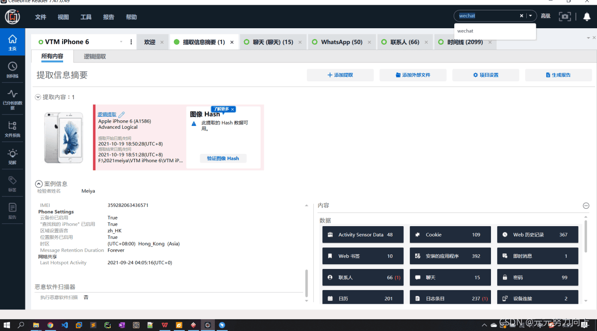{width="5.768055555555556in" height="3.2041666666666666in"}

　　这道题有两种说法：

　　一、找了一圈发现没有与 WeChat 相关的信息。故选 D

　　二、微信应该是 WhatsApp。

## 2.工地主管的隔空投送装置置编号是什么?

　　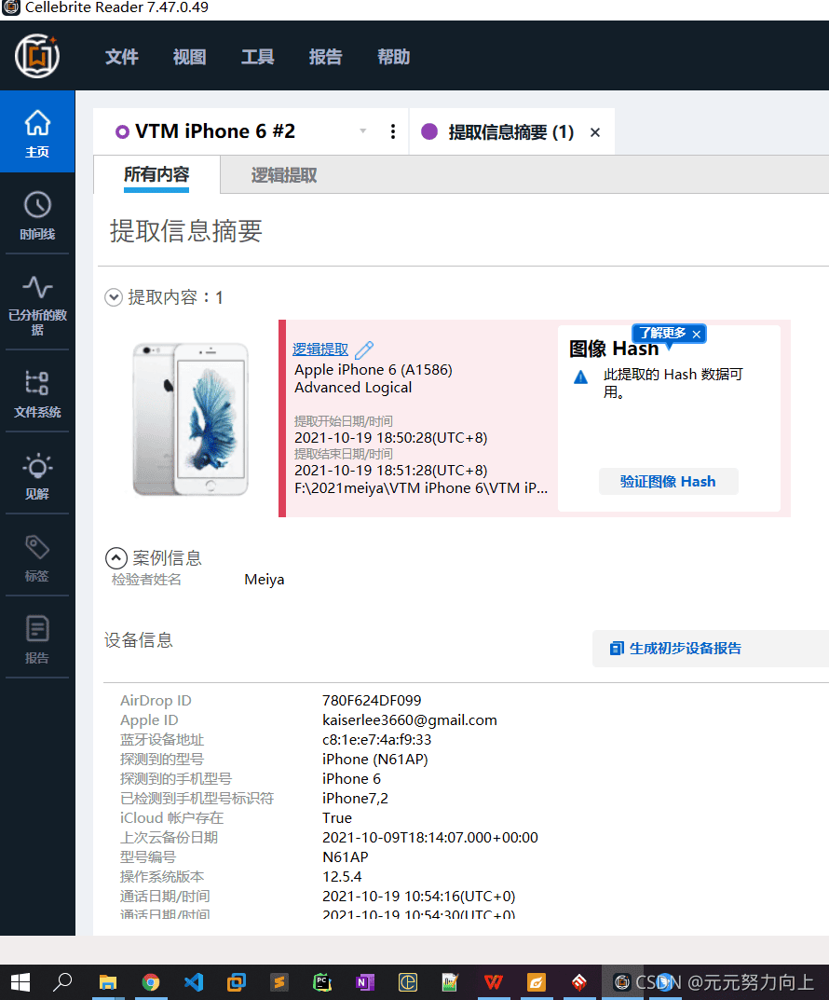{width="5.768055555555556in" height="6.955555555555556in"}

　　Airdrop (隔空投送) ID 为 `780F624DF099`​（苹果手机常识）

## 3.工地主管电话的哪一个应用程序有关于经纬度24.490474, 118.110220的纪录?

> A. 照片 B. WhatsApp C. Apple Maps D. 以上皆非

　　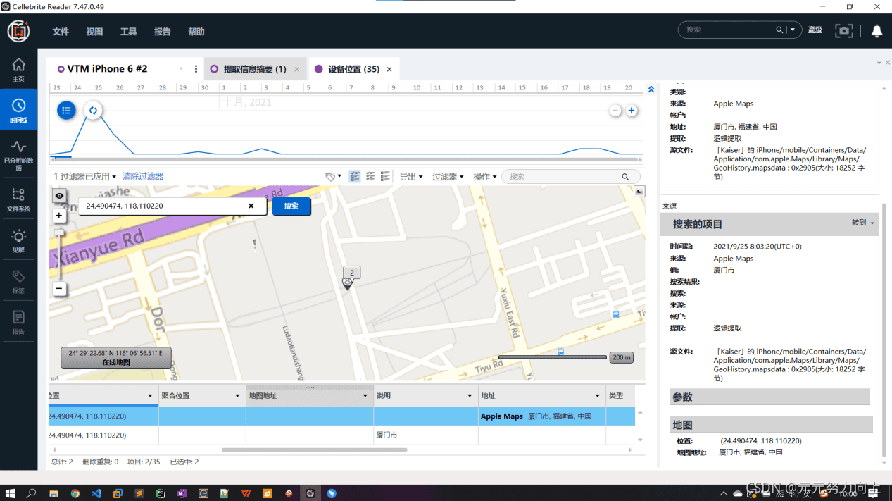{width="5.768055555555556in" height="3.2375in"}

　　搜索之后看见来源是 map

## 4.工地主管的手提电话中下列哪些数据正确?

> A. iOS 版本为 12.5.4 B. IMEI为 454120637213361 C. Apple ID 为 `kaiserlee3660@gmail.com`​ D.手机曾经安装 dropbox 应用程序

　　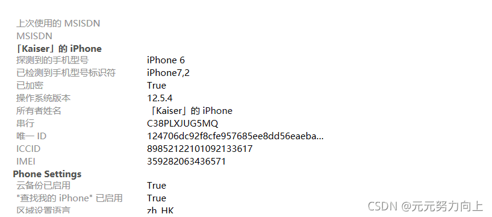{width="5.768055555555556in" height="2.542361111111111in"}

　　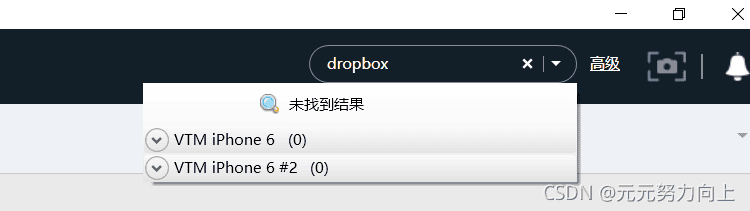{width="5.768055555555556in" height="1.625in"}

　　对比图片为 AC

## 5.工地主管的电话最常用的浏览器是什么

　　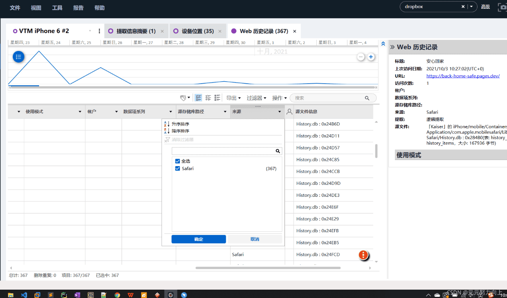{width="5.768055555555556in" height="3.3944444444444444in"}

　　直接浏览器过滤 很明显全都是 Safar

## 6.工地主管的电话连接过哪一个WiFi?

> A. Kaiser Lee B. Kaiser C. Free Wifi D. Kaiser Home

　　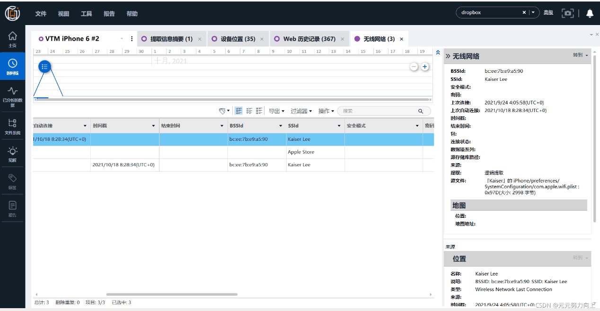{width="5.768055555555556in" height="2.9923611111111112in"}

　　在无线网络中可以看到是 Kaiser Lee

## 7.工地主管与 Alex Chan 的 Whatsapp 对话中，曾提及以下哪个 TeamViewer 的用户号码?

> A.435334881 B.453851521 C.435475200 D.456874155 E.435270306

　　先过滤一下

　　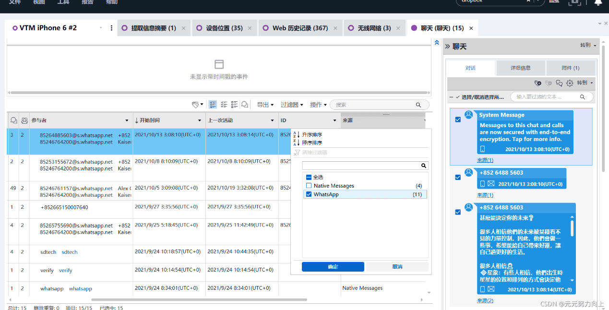{width="5.768055555555556in" height="2.9368055555555554in"}

　　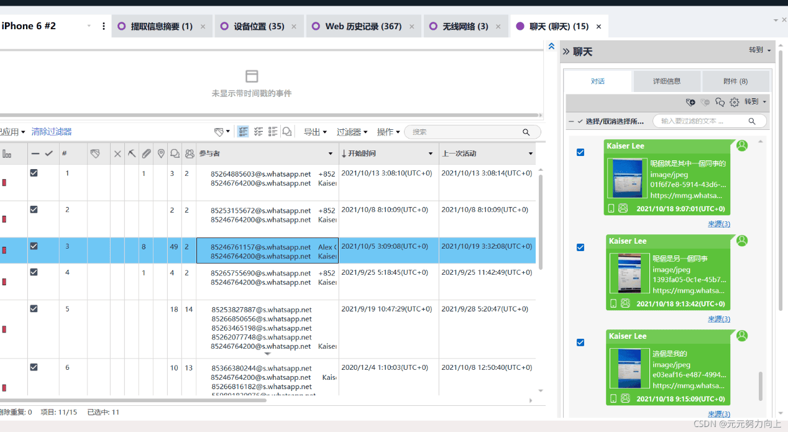{width="5.768055555555556in" height="3.161111111111111in"}

　　然后查看图片

　　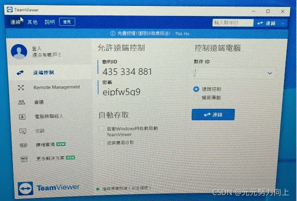{width="5.768055555555556in" height="3.907638888888889in"}

　　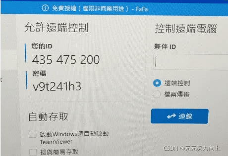{width="4.791666666666667in" height="3.2916666666666665in"}

　　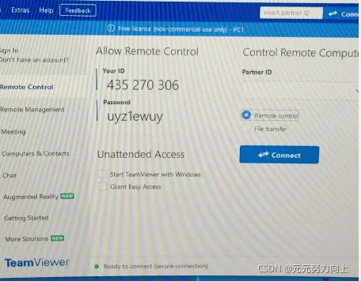{width="4.75in" height="3.7083333333333335in"}

　　故选择 ACE

## 8.工地主管的WhatsApp中有多少个黑名单的记录?

　　从源文件跳到该应用的数据库相关文件夹（右下角的源文件复制然后跳转到）

　　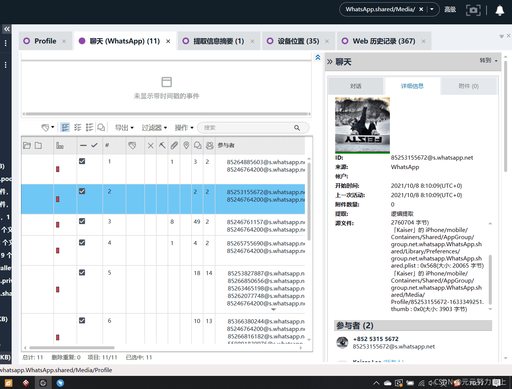{width="5.768055555555556in" height="4.377777777777778in"}

　　然后找到用户组分区数据库（看英文名字 chatstorage_sqlite 应该是和聊天分组有关的）

　　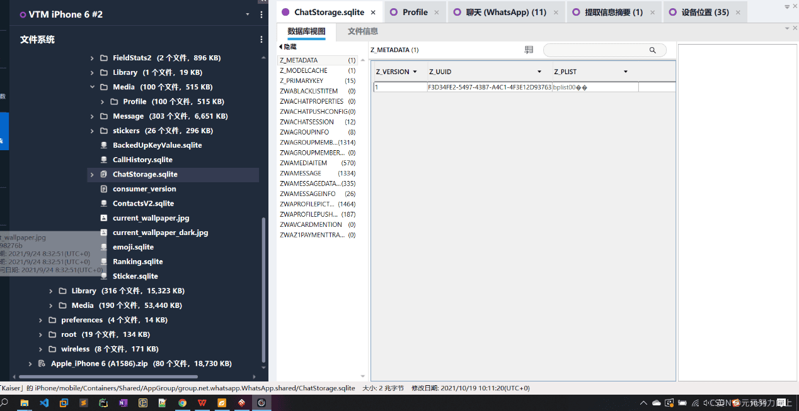{width="5.768055555555556in" height="2.9756944444444446in"}

　　点进去看一下找到黑名单（black）发现为 0

　　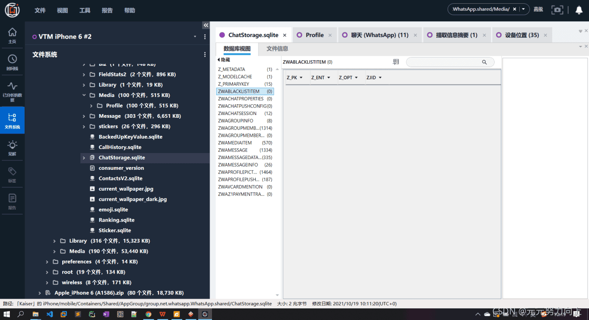{width="5.768055555555556in" height="3.142361111111111in"}

## 9.以下哪个蓝牙装置的 Uuid 曾连接过工地主管的手机?

> A.7F1FE70D-2B15-C245-853D-4196F13CC446 B.1B057C1D-83D3-99A6-D2B1-EC54846C7CEE C.134ACD1-83D3-99A6-D2B1-EC54846C7CEE D.7D1BE70D-2C16-D246-851D-491613DD776

　　这道题也是跳转源文件数据库

　　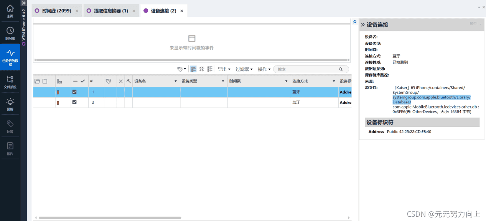{width="5.768055555555556in" height="2.6256944444444446in"}

　　看到了连接过的两个设备

　　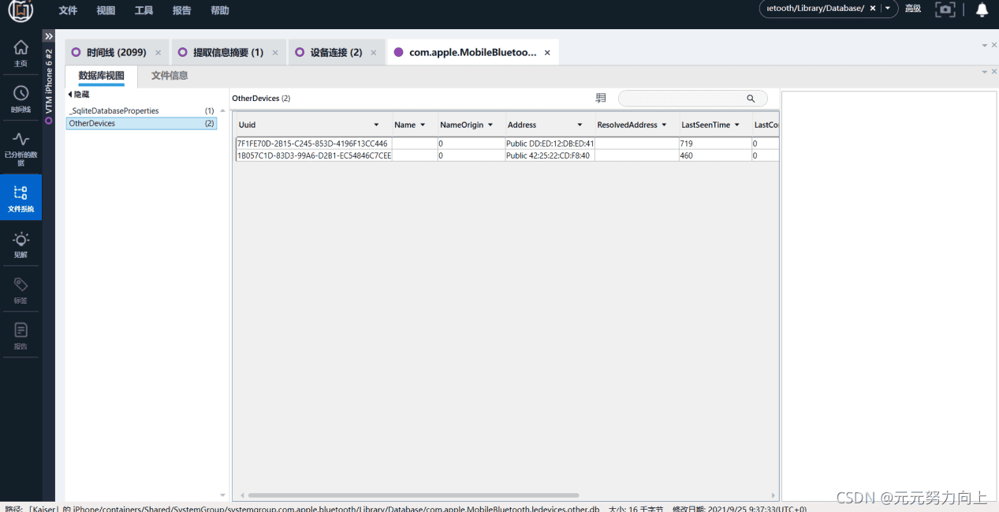{width="5.768055555555556in" height="2.953472222222222in"}

　　故为 AB

## 10.工地主管计算机的 E 盘的 Bitlocker 修复密钥标识符是甚么?

　　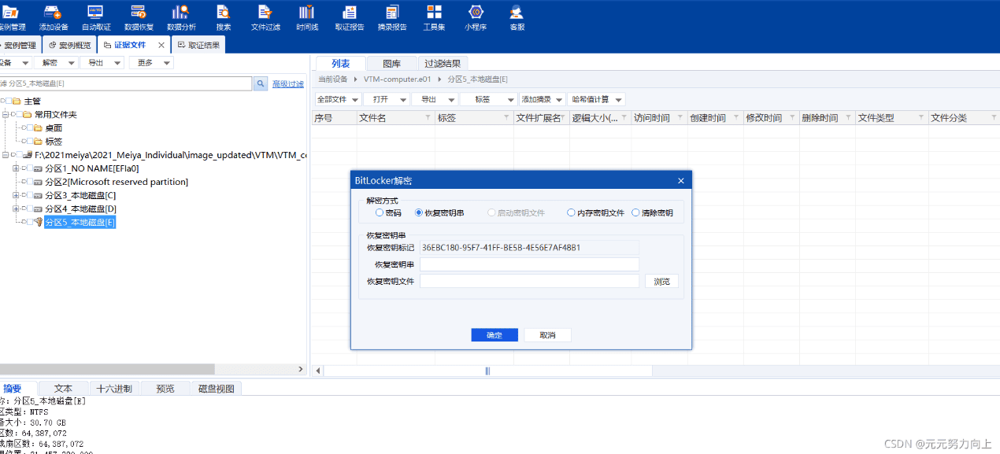{width="5.768055555555556in" height="2.620138888888889in"}

　　直接在 Bitlocker 解密里面可以看到标识符（右键点击，然后点击 Bitlocker）

## 11.工地主管计算机内的 FTP 程序 FileZilla 的用户名称是甚么?

　　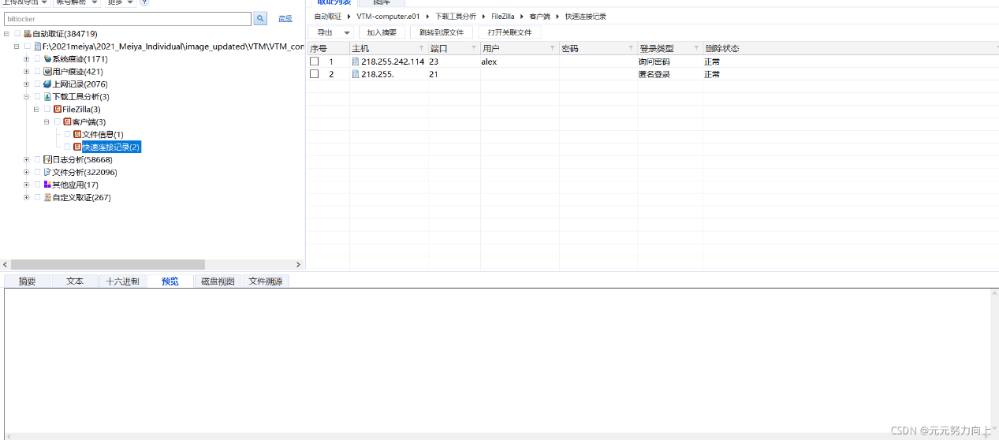{width="5.768055555555556in" height="2.5381944444444446in"}

　　Alex

## 12.工地主管的 Team Viewer ID 是甚么?

　　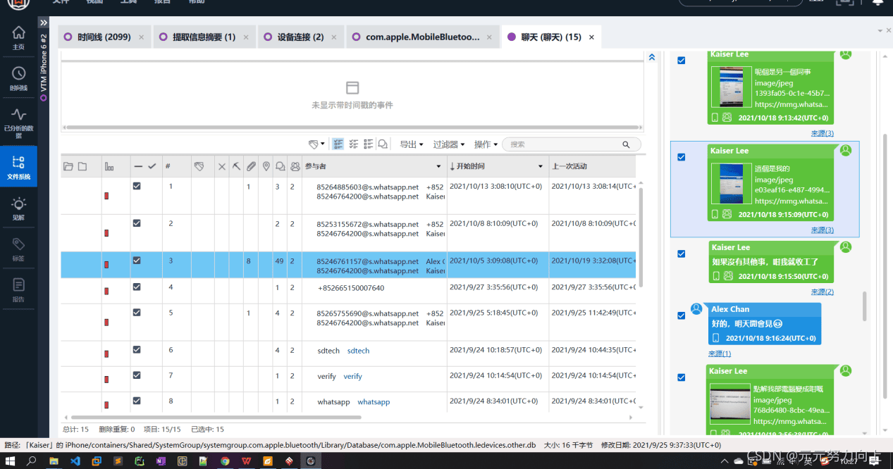{width="5.768055555555556in" height="3.033333333333333in"}

　　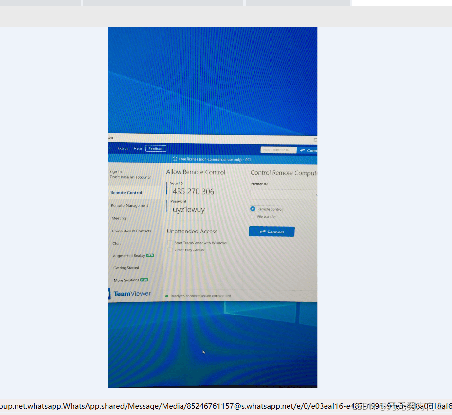{width="5.768055555555556in" height="5.311111111111111in"}

　　故结果为 435270306

## 13.工地主管的 Team Viewer 与哪一个 ID 连接?

　　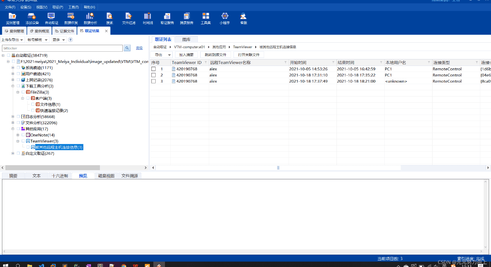{width="5.768055555555556in" height="3.1458333333333335in"}

　　直接在取证大师其他应用里面查看,是 420190768

## 14.工地主管曾用计算机浏览器作搜寻，以下哪一个关键词他曾经搜寻?

> A.tiktok B.web whatsapp C.facebook D.lihkg E.hkgolden F.web wechat

　　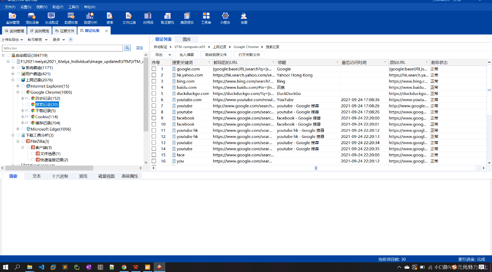{width="5.768055555555556in" height="3.19375in"}

　　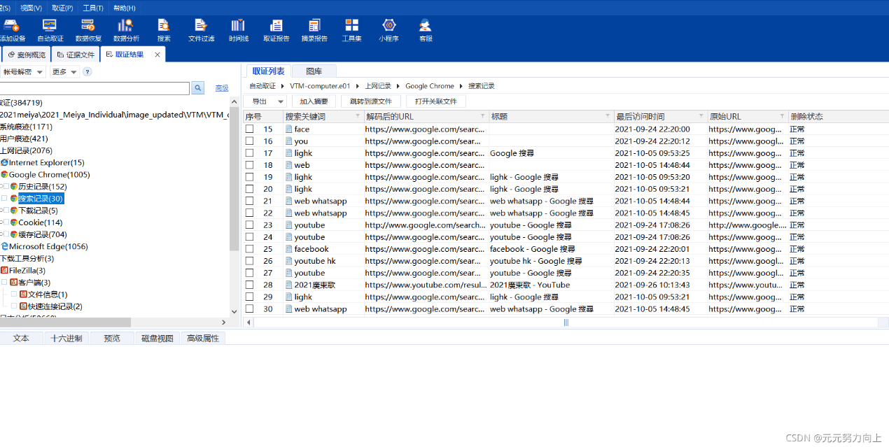{width="5.768055555555556in" height="2.9034722222222222in"}

　　在 用户痕迹->上网记录->搜索记录 搜索可以看到

## 15.工地主管计算机的 Windows 系统的产品标识符是甚么?

　　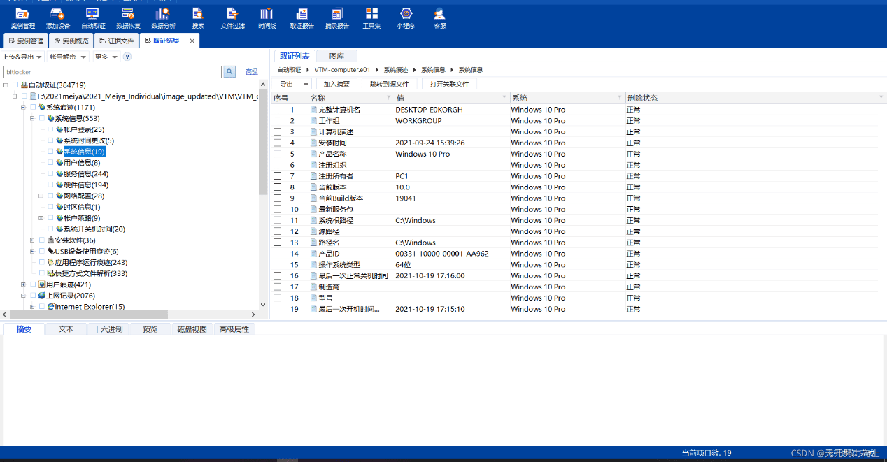{width="5.768055555555556in" height="3.0069444444444446in"}

　　系统信息里面可寻到

## 16.工地主管曾用计算机使用 WhatsApp，他曾和以下哪个电话号码沟通?

　　这道题是真的不懂怎么写，欢迎师傅留言

## 17.工地主管计算机的用户名称是甚么?其用户标识符是甚么?

> A.用户名称: PC1 B.用户名称:PC2 C.用户名称: PC3 D.用户标识符:0x000003E7 E.用户标识符:0x000003E8 F.用户标识符:0x000003E9

　　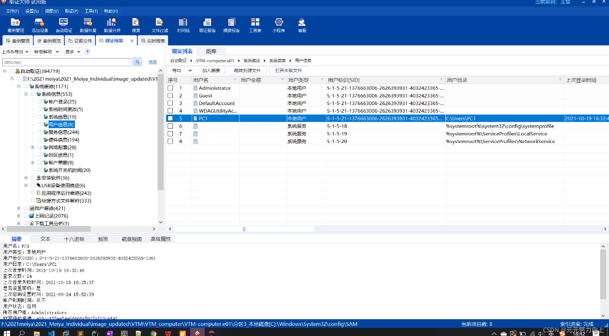{width="5.768055555555556in" height="3.1819444444444445in"}

　　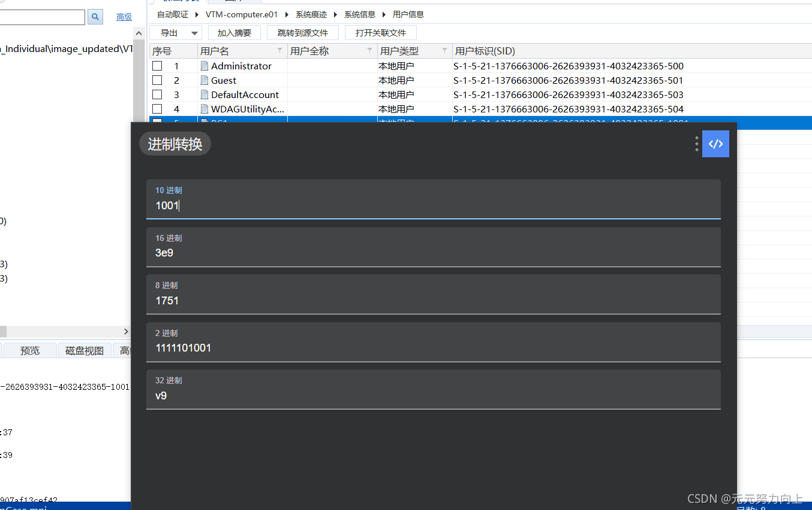{width="5.768055555555556in" height="3.634027777777778in"}

　　在用户信息找到 pc1 然后把后边 4 位 10 进制转化了得到 16 进制

　　主管的电脑名字为 pc1 标志位 3e9

## 18.工地主管计算机的预设浏览器是甚么?

> A.Chrome B.Firefox C.Safari D.以上皆否

　　仿真出来后直接看

　　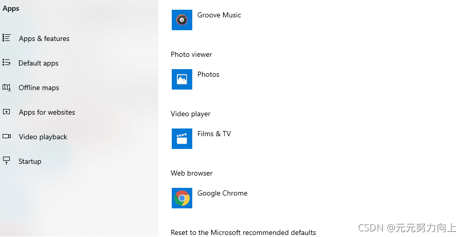{width="5.768055555555556in" height="2.952777777777778in"}

## 19.工地主管计算机的其中一个分区被人加密，分区内的电子表格 Material3.xlsx 的哈希值(SHA1)是甚么?#19-material3xlsx-sha1 "Permanent link")

　　在 ftp 服务器的取证材料中找到 Bitlocker 的秘钥

　　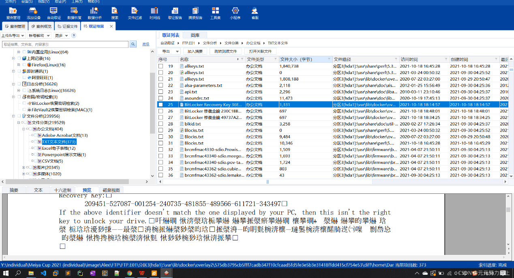{width="5.768055555555556in" height="3.1243055555555554in"}

　　把主管 E 盘恢复

　　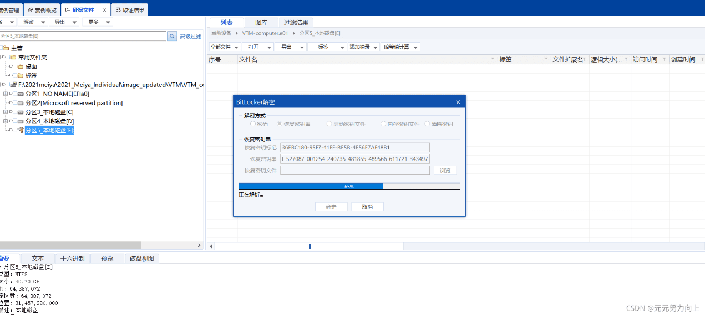{width="5.768055555555556in" height="2.584722222222222in"}

　　找到电子表格 Material3.xlsx

　　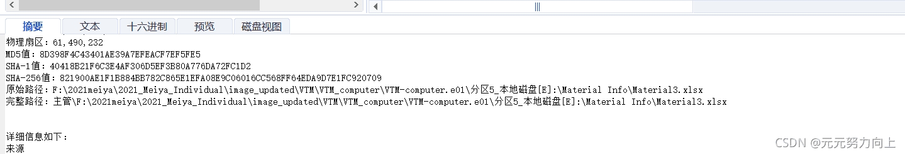{width="5.768055555555556in" height="0.9909722222222223in"}

　　得到 40418B21F6C3E4AF306D5EF3B80A776DA72FC1D2

## 20.路由器的记录中显示以下有哪些IP是公司的电子器材?

> A.192.168.40.128 B.192.168.40.129 C.192.168.40.130 D.192.168.40.131 E.192.168.40.132

　　直接把这几个都搜索了

　　然后只有最后一个没有故选 abcd

## 21.路由器的记录中显示公司的计算机下载了 FTP 软件，该下载网站的 IP 是什麼?

　　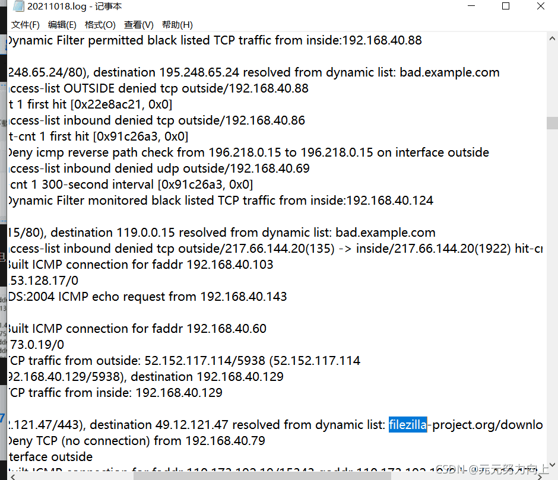{width="5.768055555555556in" height="4.9631944444444445in"}

　　工地主管的 pc 上有 FileZilla

　　直接在路由器 log 里面直接搜索

　　得到下载该网站的 ip 是 49.12.121.47

## 22.路由器的记录中显示公司计算机的资料用 FTP 软件传到了甚么 IP 地址及利用端口?link")

> A.IP地址: `2*.2*.2*.114`​ B.IP地址: `8*.8*.1*.20`​ C.IP地址: `1*.1*.0*.13`​ D.端口: `21`​ E.端口: `80`​

　　在取证大师里面可以找到 然后在路由器日志里面搜索（众所周知 FileZilla 是一款 ftp 软件，直接搜索）

　　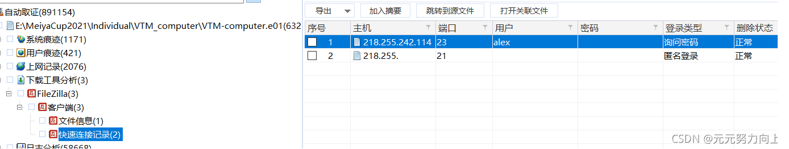{width="5.768055555555556in" height="1.09375in"}

　　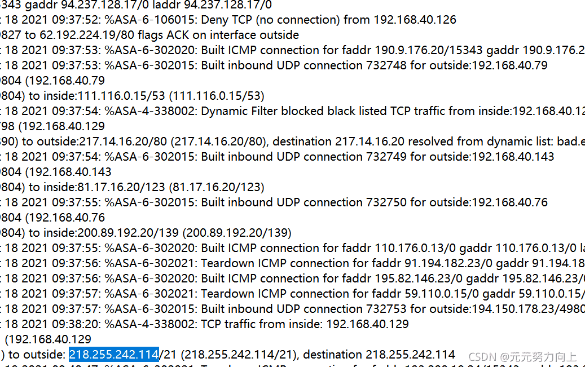{width="5.768055555555556in" height="3.622916666666667in"}

　　对应上边取证大师里的 得到利用 21 端口

## 23.路由器的记录中显示以下哪些关键词是表示公司计算机与外界网络联机?

> A.destination B.ICMP echo request C.inside D.outside E.以上皆是

　　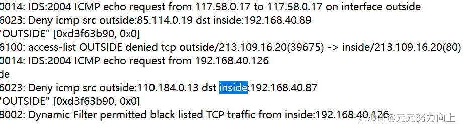{width="5.768055555555556in" height="1.5847222222222221in"}

　　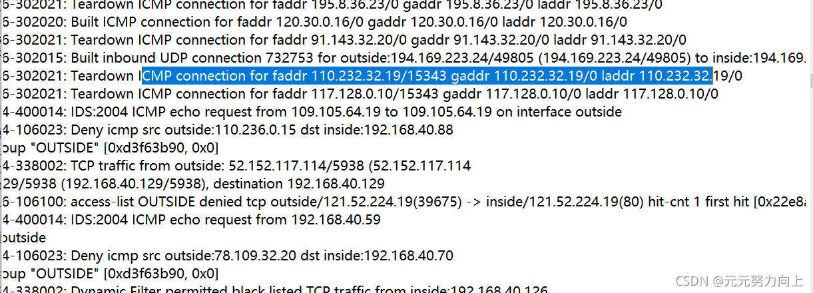{width="5.768055555555556in" height="2.0791666666666666in"}

　　算是网络的基本知识了，`outside`​ 表示外网地址，`inside`​ 表示内网地址，`destination`​ 表示目标地址， `ICMP echo request`​ 是 ICMP 回应请求报文（Ping 指令可以产生）。

　　因此选 D

## 24.路由器的记录中显示哪一个 IP 曾以 teamviewer 连接公司计算机?

> A. 110.152.0.14 B.52.152.117.114 C.180.152.0.13 D.83.26.80.131

　　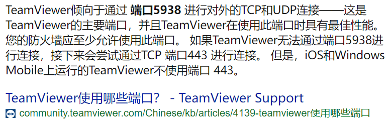​

　　teamviewer 主要使用 5938 端口进行通信，在 log 中通过正则搜索：`tcp outside/\d+\.\d+\.\d+\.\d+\(5938\)`​

## 25.路由器的记录中显示以下哪一个有可能是以 teamviewer 遥控公司计算机的时间?link")

> A.09:31,09:37 B.09:33,09:39 C.10:29,10:36 D.10:40 E.10:42

　　用 vscode 打开或者用 notpad++ 打开

　　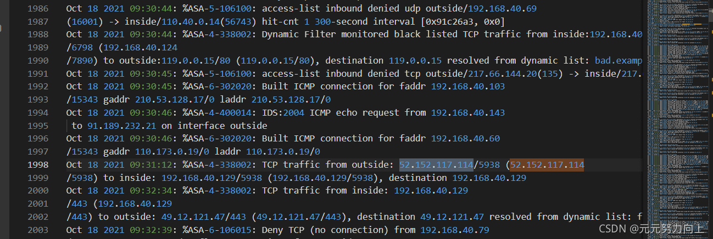{width="5.768055555555556in" height="1.9368055555555554in"}

　　从 9:31-->10:42

## 26.路由器的记录中显示有多少电子器材有可能曾被入侵?

　　在前边的主管的电脑上的 teamview 上可看出链接了 3 台电脑。从手机 iphon6 里面也能看到（曾经发过的3张照片）

## 27.阿力士 iPhone12pro 电话于 2021 年 10 月 21 日，以下哪张相片可能曾被分享（UTC+8）？#27-iphone12pro-2021-10-21-utc8 "Permanent link")

> A. IMG_0011.HEIC B. IMG_0010.HEIC C. IMG_0009.HEIC D. IMG_0008.HEIC E. IMG_0007.HEIC

　　被分享过的图片会生成不带元数据的缩略图，所以直接在图像里过滤

　　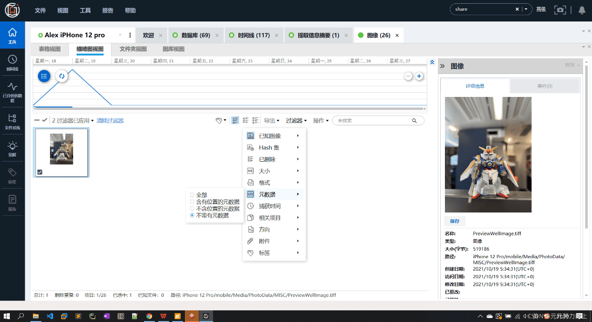{width="5.768055555555556in" height="3.14375in"}

## ## 28.阿力士 iPhone 12 pro 电话中哪一张相片可能曾被修改拍摄时间?

> A.IMG_0011.HEIC B.IMG_0010.HEIC C.IMG_0009.HEIC D.IMG_0008.HEIC

　　综合上一题之后应该是先把这张图片的时间给修改了然后又分享出去，故有两张雷同的图片

　　{width="5.768055555555556in" height="2.6618055555555555in"}

## 29.阿力士 iPhone 12 pro 的 GSM 媒体访问控制地址是什么?

　　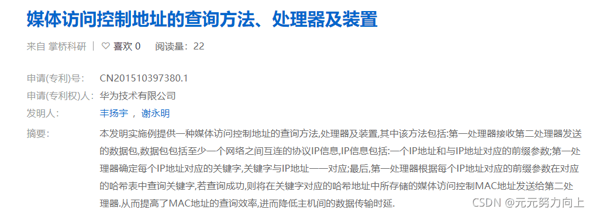{width="5.768055555555556in" height="2.0833333333333335in"}

　　查过资料

　　阿力士 iPhone 12 pro 的 GSM 媒体访问控制地址应该是本机的 Mac 地址

　　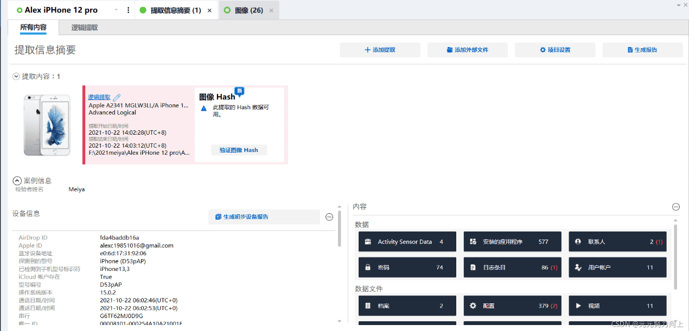{width="5.768055555555556in" height="2.782638888888889in"}

　　e0:6d:17:31:92:06

## 30.阿力士的 iphone 12 pro 以什么屏幕密码保护?

> A.6位阿拉伯数字密码 B.4位阿拉伯数字密码 C.图形密码 D.以上皆非

## 31.阿力士 iphone 12 pro 内以下哪一张相片是实况相片(live Photos)?"Permanent link")

> A.IMG_0011.HEIC B.IMG_0010.HEIC C.IMG_0012.HEIC D.IMG_0009.HEIC

　　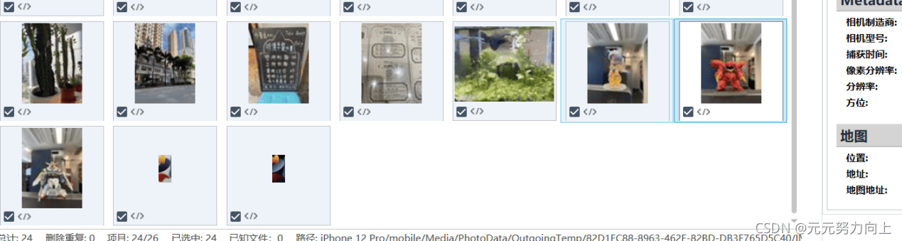{width="5.768055555555556in" height="1.542361111111111in"}

　　c 选项没有故不选

## 32.以下哪一个是阿力士 iphone 12 pro 可能曾经连接的装置名称?

> A.Chris's MacBook Pro B.Chirs's iPhone C.Chirs's Computer D.Chirs's Linux

　　在联系人里面可以看到曾经和这个人连接过

　　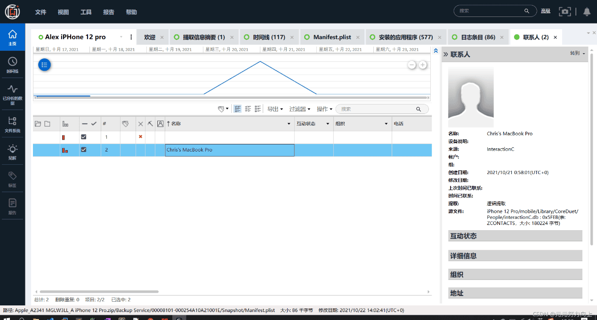{width="5.768055555555556in" height="3.0909722222222222in"}

## 33.接上题，记录连接时间是什么时候(UTC+8)?

> A.2021年10月21日 00:58:01 B.2021年10月21日 08:58:01 C.2021年10月21日 00:58:29 D.2021年10月21日 08:58:29

　　接上题

　　{width="5.768055555555556in" height="3.0909722222222222in"}

## 34.阿力士 iPhone XR 中在软件 WhatsApp 中工地主管与阿力士的对话中曾提到:[巨叫我俾钱喎，BTC 係唔係呢个啊?]，在进行电子数据取证分析后，以下哪一个是有可能关于此对话的正确描述?

> A 此对话被Kariser Lee删除 B.此对话的附件为一张图片文件 C.此对话被Alex Chan删除 D.此对话是引用Alex Chan回复

　　{width="5.508333333333334in" height="4.133333333333334in"}

　　查看之前的聊天记录可以看到

## 35.阿力士 iPhone XR 的 WhatsApp 对话中，阿力士曾要求工地主管支付多少个 BTC?"Permanent link")

　　10 个

　　见 34 题图片

## 36.阿力士 iPhone XR 中 IMG_0056.HEIC 的图像与 5005.JPG (MD5:96c48152249536d14eaa80086c92fcb9)看似为同一张相片，在电子数据取证分析下，以下哪样描述是正确?forensics.xidian.edu.cn/wiki/Meiya2021WP_Indivdual/#36-iphone-xr-img_0056heic-5005jpg-md596c48152249536d14eaa80086c92fcb9 "Permanent link")

> A.储存在不同的.db里 B.有不同哈希值 C. IMG_0056.HEIC为原图,5005.JPG(MD5:96c48152249536d14eaa80086c92fcb9)为缩略图 D.IMG 0056.HEIC 曾被开启过，所以在I0S系统中创建了缩略图5005.JPG(MD5:96c48152249536d14eaa80086c92fcb9)

　　BCD

　　这个是 电子数据取证分析的常识可以积累一下

## 37.阿力士 iPhone XR 中相片檔 IMG_0056.HEIC 提供了什么电子数据取证的信息?"Permanent link")

> A.此相片是由隔空投送(Airdrop)得来 B.此相片由iPhone XR拍摄 C.此相片的拍摄时间为2021-10-21 17:45:48(UTC+8) D.此相片的拍摄时间为2021-09-08 17:35:00(UTC+8)

　　这个要在数据库里面查看，所以要跳到数据库里面查看信息

　　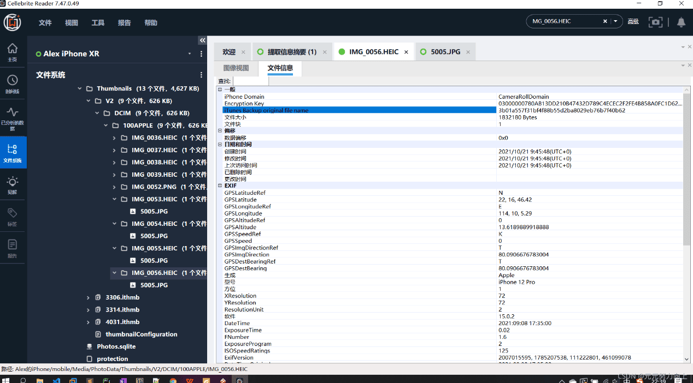{width="5.768055555555556in" height="3.19375in"}

## 38.阿力士 iPhone XR 中阿力士的电邮账户 `Alexc19851016@gmail.com`​ 的密码有可能是什么?#38-iphone-xr-alexc19851016gmailcom "Permanent link")

> A.Ac19851016 B.Alex1985! C.Aa475869! D.以上皆非

　　这个找了好久发现在 notes 里面（众所周知记笔记是一个好习惯！！！）

　　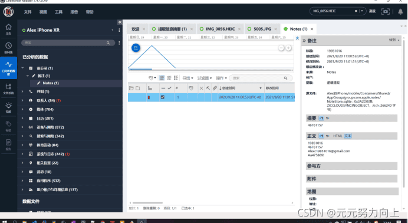{width="6.725in" height="3.6774562554680665in"}

## 39.阿力士 iPhone XR 曾经连接 Wifi "Alex Home" 的密码是什么?link")

　　这个在密码里面打开之后 看用户的名字直接过滤也行

　　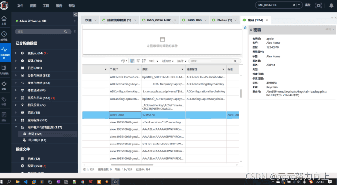{width="5.768055555555556in" height="3.1680555555555556in"}

　　密码：12345678

## 40.阿力士 iPhone XR 经 iCloud 备份的最后时间是什么?(UTC+8)?

> A.2021-10-21 17:51:38(UTC+8) B.2021-10-21 18:02:13+(UTC+8) C.2021-10-21 09:51:38(UTC+8) D.2021-10-21 10:02:13+(UTC+8)

　　直接在设备信息里可以看到

　　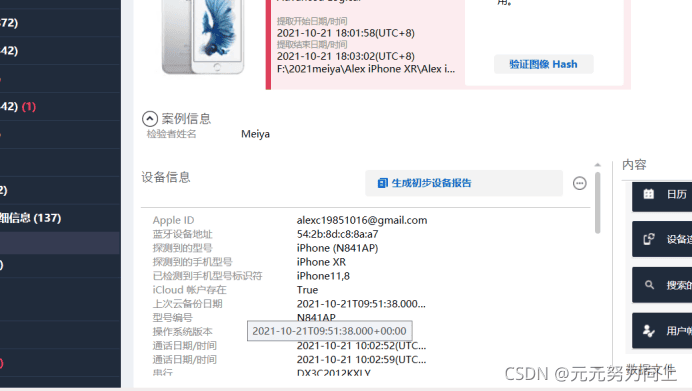{width="5.768055555555556in" height="3.261111111111111in"}

## 41.阿力士 iPhone XR 中的 iBoot 版本是 iBoot-____?

　　这个可以在文件系统里面找到（这个看好多才知道在这能看到，只能记住吧）

　　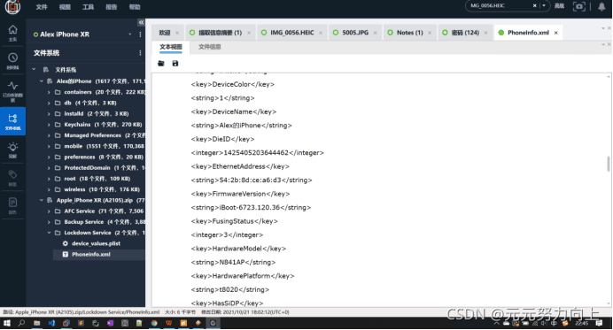{width="5.768055555555556in" height="3.107638888888889in"}

　　iBoot-6723.120.36

## 42.多选题阿力士 iPhone XR 中的 WhatsApp 群组【团购-新鲜猪肉牛肉-东涌群组-9/30】有以下哪一个成员?#42-iphone-xr-whatsapp-930 "Permanent link")

> A. `85260617332@s.whatsapp.net`​ B. `85260452579@s.whatsapp.net`​ C. `85248791565@s.whatsapp.net`​ D. `85264630956@s.whatsapp.net`​

　　在聊天中可以找到

　　AD

　　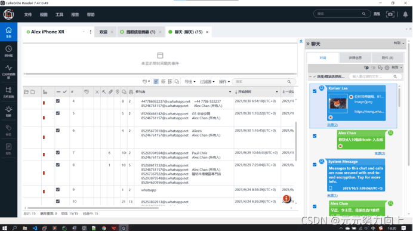{width="6.492785433070866in" height="3.6333333333333333in"}

## 43.阿力士的计算机显示曾于 hongkongcard\.com 的论坛登记成为会员，以下哪个是他的帐户密码?#43-hongkongcardcom "Permanent link")

> A.Aa475869! B.Bb475869! C.Cd475869! D.以上皆非

　　在搜索记录里面搜索一下 hongkongcard\.com，过滤出来

　　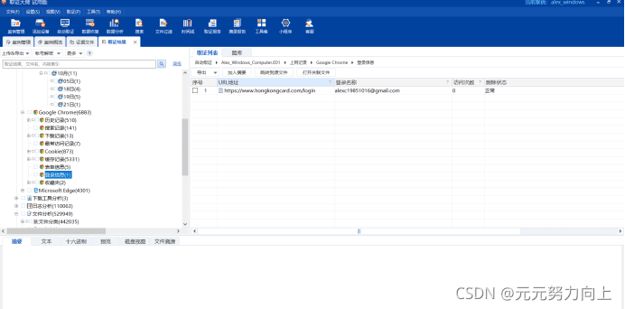{width="5.768055555555556in" height="2.8541666666666665in"}

　　然后在笔记里面可以看到 gmail 的密码

　　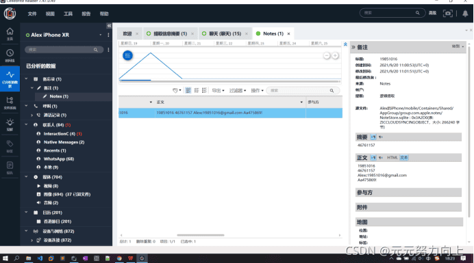{width="5.768055555555556in" height="3.207638888888889in"}

## 44.阿力士的计算机显示阿力士曾用什么方法进入受害者(主管)的计算机?

> A.远程操控 B.特洛伊木马程序 C.勒索软件 D.恶意软件

　　这道题简直在送分呀肯定是远程操控呀

　　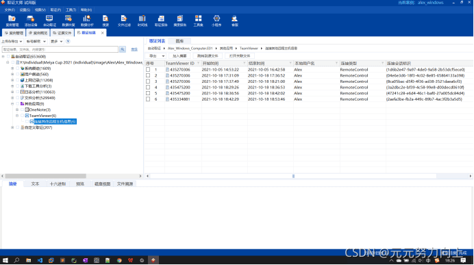{width="5.768055555555556in" height="3.227777777777778in"}

## 45.续上题，阿力士最后一次进入受害者(主管)计算机的时间是什么?

> A.于2021年10月18日 10时36分 B.于2021年10月18日 18时36分 C.于2021年10月18日 06时53分 D.于2021年10月18日 18时42分

　　在控制信息里面可以看到

　　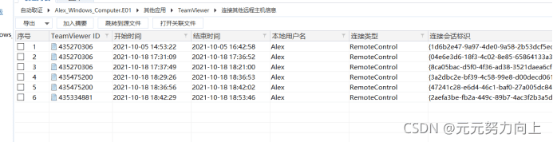{width="5.768055555555556in" height="1.4784722222222222in"}

## 46.阿力士的计算机显示他曾经使用 FTP 程序，FTP 的主机 IP 地址是什麼?

　　直接在 ftp 软件里看

　　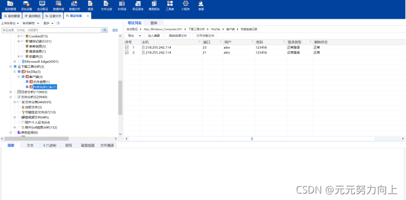{width="5.768055555555556in" height="2.8409722222222222in"}

　　得到 218255242114

## 47.阿力士的计算机显示于 2021 年 9 月至 2021 年 11 月期间，计算机曾被登入过多少次?"Permanent link")

　　在系统信息 账户登录可以看到

　　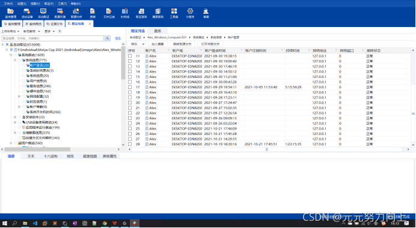{width="5.768055555555556in" height="3.167361111111111in"}

　　共 28 次

## 48.阿力士计算机所安装的 Microsoft Office 2007 是以下哪一个版本?link")

　　在安装软件里可以看到

　　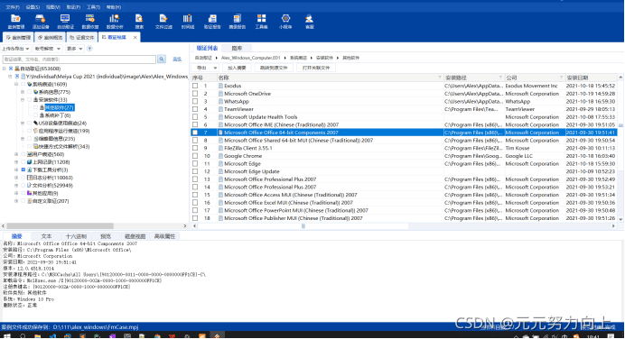{width="5.768055555555556in" height="3.134027777777778in"}

　　12.0.4518.1014

　　或者直接仿真出来看

## 49.以下是阿力士计算机中的 Basic data partition (EFI 3) 的 Volume ID?#49-basic-data-partition-efi-3-volume-id "Permanent link")

　　打开 X-waysForensics，找一下，分区

　　在 `3\System Volume Information\SPP\OnlineMetadataCache`​:下面的两个文件都能看见 VolumeID: {9705c469-7dca-4d55-ae76-7481b9f1428e}

## 50.阿力士计算机的 Windows product ID 是什么?

　　直接在系统痕迹，系统信息，系统信息里面可以找到

　　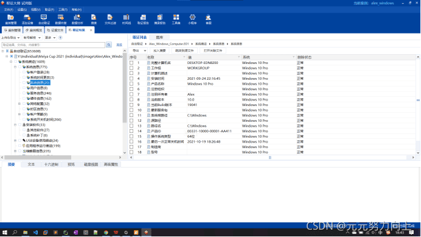{width="5.768055555555556in" height="3.240972222222222in"}

　　答案为00331-10000-00001-AA411

## 51.阿力士计算机曾经下载一张猴子的图片，以下哪一项描述正确?

> A.该图片是由`https://encrypted-tbn0.gstatic.com/images?q=tbn:ANd9GcSgn6ABvcqTfFPjclbjc9hdx1H4P1QsAuVyTQ&usqp=CAU`​下载的 B.该图片经过加密 C.该图片于2021-09-30下载 D.该图片是由GIF档转换成PNG檔

　　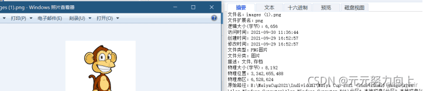{width="5.768055555555556in" height="1.25in"}

　　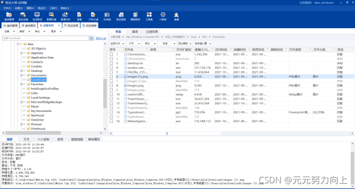{width="5.768055555555556in" height="3.067361111111111in"}

　　看信息分析即可得出答案

## 52.阿力士计算机所安装的 Microsoft Office 2007 的密钥是甚么?

　　在 office 里面工程文件夹里面可以找到 key 文件

　　{width="5.768055555555556in" height="3.127083333333333in"}

　　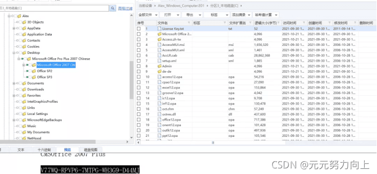{width="5.768055555555556in" height="2.675in"}

　　V77WQ-RPVP6-7MTPG-WH3G9-D44M

## 53.阿力士 FTP 服务器用户使用命令行安装了甚么程序?

> A.Docker B.Chrome C.FileZilla D.TeamViewer

　　直接在取证大师里面看 linux 的终端记录

　　{width="5.768055555555556in" height="3.213888888888889in"}

　　安装了 docker

## 54.以下哪些档案于阿力士 FTP 服务器曾重复出现?

> A.Material1 B.Material2 C.Material3 D.Staff1 E.Staff2 F.Staft3

　　直接在文件分类里面找 Excel 表格里面看

　　由图可知

　　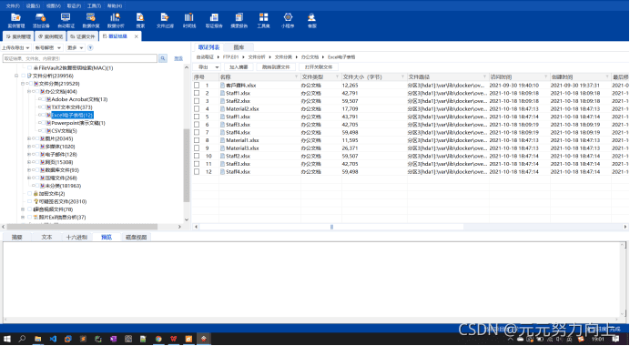{width="5.768055555555556in" height="3.167361111111111in"}

## 55.在阿力士 FTP 服务器中，文件夹___曾被用户变更了访问权限

　　寻找 chmod 命令看哪个文件被修改的权限

　　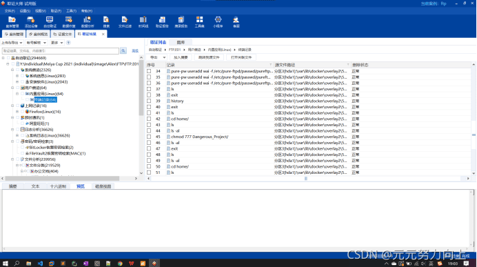{width="5.768055555555556in" height="3.227777777777778in"}

　　Dangerous_Project 被修改了权限

## 56.在阿力士 FTP 服务器建设后，有___个额外用户被加入

　　寻找 pure 命令寻找增加的用户

　　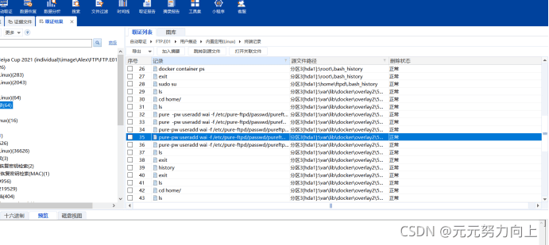{width="5.768055555555556in" height="2.5770833333333334in"}

　　只加了 1 个用户 wei

## 57.根据阿力士 FTP 服务器设定显示，此服务器是以___方式连接网络，且是一个__网络状态"Permanent link")

> A.无线，公开 B.无线，私人 C.有线，公开 D.有线，私人

　　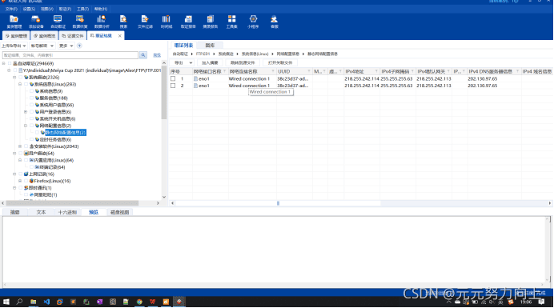{width="5.768055555555556in" height="3.207638888888889in"}

　　ip 地址为公网的

　　故为有线 公开

## 58.阿力士 FTP 服务器设定最多使用者数目是___

　　找到配置文件然后打开查看

　　{width="5.768055555555556in" height="3.120833333333333in"}

　　发现最大（max）50 个

## 59.阿力士 FTP 服务器使用 Docker 安装了一个 FTP 程序为____。

　　寻找安装 ftp 的命令（这些都是基本的 linux 命令）

　　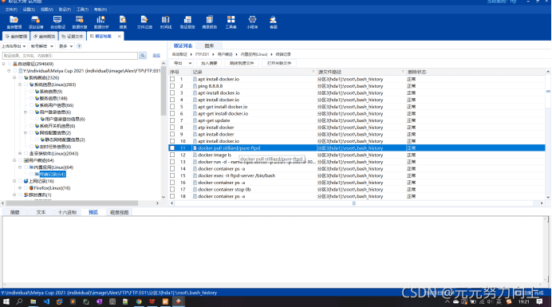{width="5.768055555555556in" height="3.207638888888889in"}

　　故答案为 stilliard/pure-ftpd。

## 60.阿力士 FTP 服务器曾使用过甚么版本的 Linux 内核?

> A.linux-headers-5.11.0-16 B.linux-headers-5.11.0-17 C.linux-headers-5.11.0-36 D.linux-headers-5.11.0-37 E.linux-headers-5.11.0-40

　　直接仿真出来然后输入 `uname -r`​ 查看内核版本

　　{width="5.768055555555556in" height="2.7006944444444443in"}

## 61.阿力士 FTP 服务器的磁盘分区，有以下哪一种文件系统?

> A.FAT16 B.FAT32 C.ExFAT D.HFS+ E.Ext4

　　直接查看 ftp 的文件系统类型

　　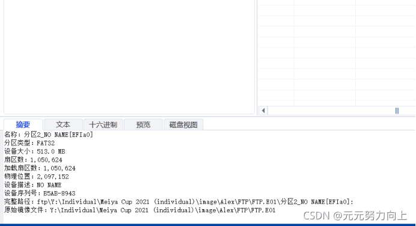{width="5.768055555555556in" height="3.134027777777778in"}

　　{width="5.768055555555556in" height="2.060416666666667in"}

## 62.阿力士FTP服务器用户输入了指令___去检查现存的Docker容器

　　又是一个考察 linux 的命令的,直接看

　　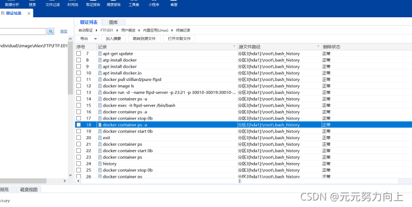{width="5.768055555555556in" height="2.9006944444444445in"}

　　查看 docker 的命令为 docker container ps -a
