# 美亚杯 2022 个人赛题解

> 压缩包解压密码: `MeiyaCup2022`
> 
> 容器密码: `CZDGm#&2_Ns$7wSMn%ZGr7xntcHS7d5uFta#Up9544jx_cvP$uFM7?pTDa*jN&QyFDLS8U%hx$fXN^BY$Xsj+3@F^y#4QFXb*Uq@wLmkCE7?&Yp+nX6s@hKrzpVE%v?&`
> 


## 案情简介

> 2022 年 10 月，有市民因收到伪冒快递公司的电邮，不慎在犯罪嫌疑人架设的假网站上输入了个人信用卡资料，导致经济损失。经警方调查，发现其中一名受骗市民男子李大輝(TaiFai)的信用卡曾经被犯罪嫌疑人在市内的商店购物。后来警方根据IP地址，锁定及拘捕了一名男子林浚熙（阿熙ChunHei），并在他的居所发现了一批怀疑是作案用的电脑及手机。经取证调查后，警方发现阿熙除上述案件外，他还牵涉其他的一些犯罪活动。 警方的电子数据取证小组在现场作出初步调查，并对涉案设备进行了电子数据取证。请你根据得到的资料，协助将事件经过还原。
> 

## 王晓琳的手机

### 1 王晓琳手机的 IMEI

> ==352978115584444==
> 

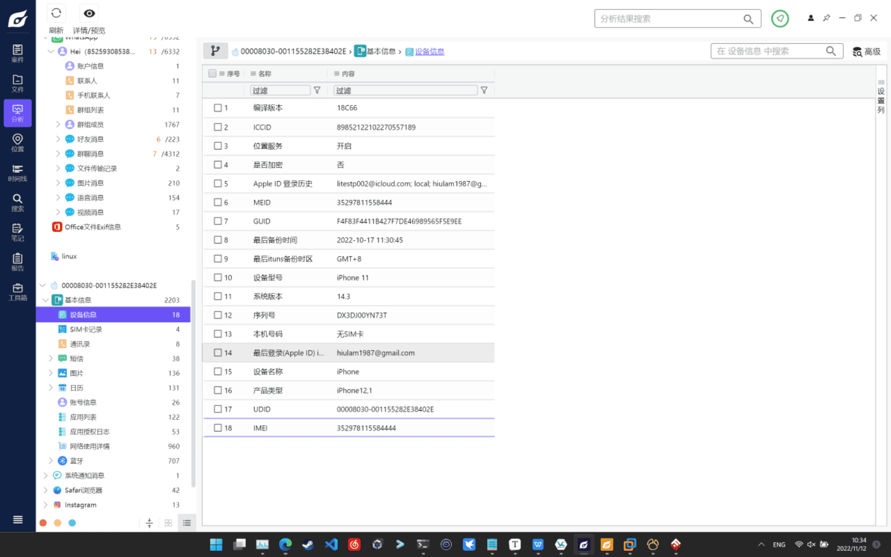


### 2 王晓琳的手机安装了什么即时通讯软件

> ==A.WhatsApp==
> 
> B.WeChat
> 
> C.LINE
> 
> D.Signal
> 
> E.QQ
> 


### 3 王晓琳于什么日子和时间曾经通过即时通讯软件发出一个 PDF 档案

> A.2022-09-30 18:30:28
> 
> ==B.2022-09-30 17:39:53==
> 
> C.2022-10-01 17:39:53
> 
> D.2022-10-01 16:30:22
> 


### 4 承上题，这个 PDF 档案的 MD5 哈希值

> ==AE0D6735BBE45B0B8F1AB7838623D9C8==
> 

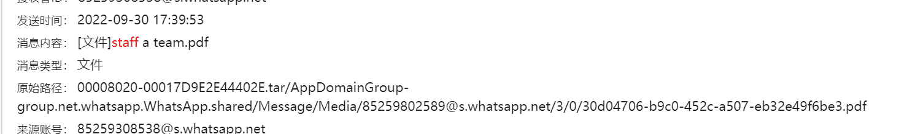


### 5 王晓琳将这个 PDF 档案发给一个用户, 该用户的手机号码

> A.85269707307
> 
> B.85297663607
> 
> ==C.85259308538==
> 
> D.85246427813
> 


### 6 王晓琳发出这个 PDF 档案的原因

> A.错误发出
> 
> ==B.寻求协助==
> 
> C.分享档案内容
> 
> D.无法开启
> 


### 7 承上题，分析王晓琳与上述用户的对话，他们的关系

> A.家人
> 
> B.客户
> 
> C.师生
> 
> ==D.同事==
> 

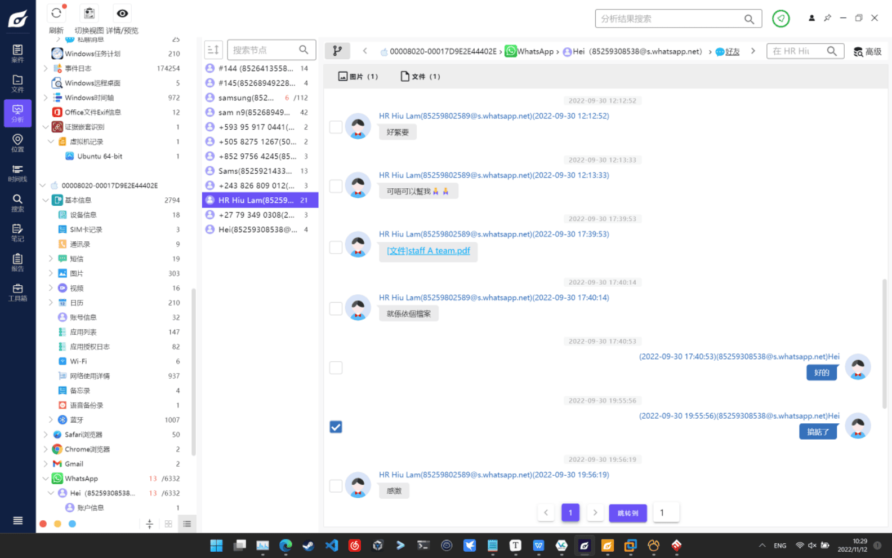


### 8 王晓琳于何时要求上述用户删除一张照片

> A.2022-09-30
> 
> B.2022-10-06
> 
> C.2022-09-28
> 
> ==D.2022-10-03==
> 


### 9 承上题，该用户向王晓琳提出什么要求以删除这张照片

> A.性服务
> 
> ==B.金钱==
> 
> C.毒品
> 
> D.加密货币
> 

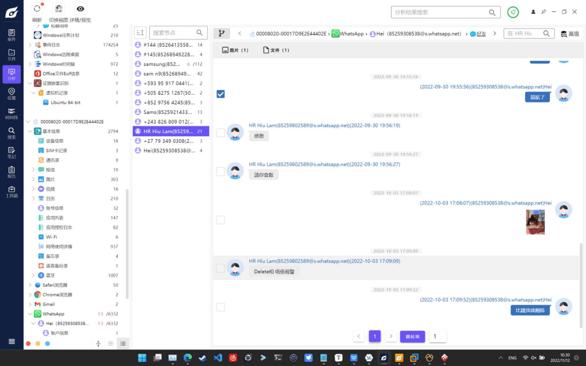


### 10 王晓琳的手机里有什么电子书藉

> A.水浒传
> 
> ==B.三国演义==
> 
> C.红楼梦
> 
> D.西游记
> 

手机中只安装了系统自带的 iBooks, 其备份文件位于 `/AppDomainGroup-group.com.apple.iBooks/`. 

在其中的 `Documents\BKLibrary` 目录下可以找到一个数据库, 其中存有书籍信息.

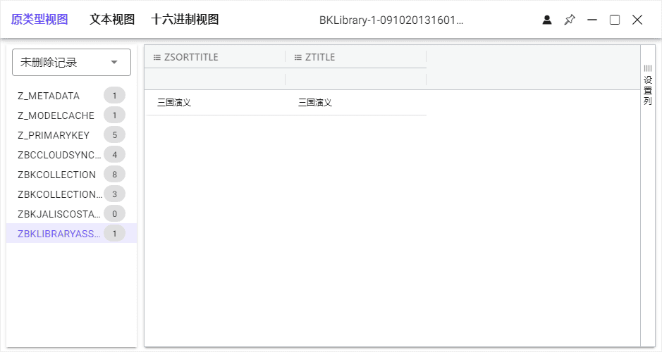


### 11 王晓琳在这本电子书藉里最后对哪段文字加入了重点标示效果

> A.武松那日早饭罢
> 
> ==B.卿有何妙计==
> 
> C.宝玉已是三杯过去了
> 
> D.就除他做个弼马温罢
> 

在其中的 `Documents\StoreFiles` 目录下可以找到一个数据库, 其中存储有批注信息.


### 12 王晓琳的手机里有一个 MTR Mobile 的手机程序。检视其数据库的数据，王晓琳于2022年10月11日22:04时将一行程加入书签，这段行程的起点及终点站

> ==A.青衣==
> 
> B.红磡
> 
> ==C.沙田==
> 
> D.尖沙咀
> 
> E.康城
> 

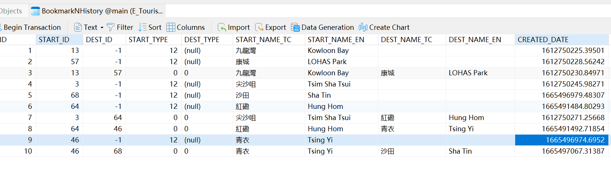

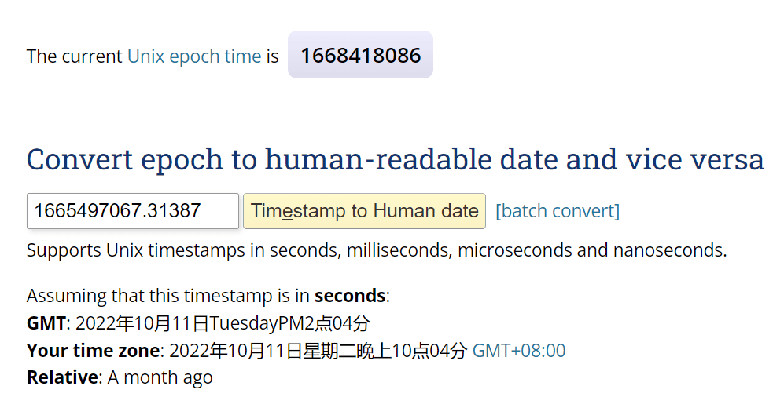


### 13 王晓琳于2022年10月2日使用她的手机拍摄了多少张的照片

> ==90==
> 

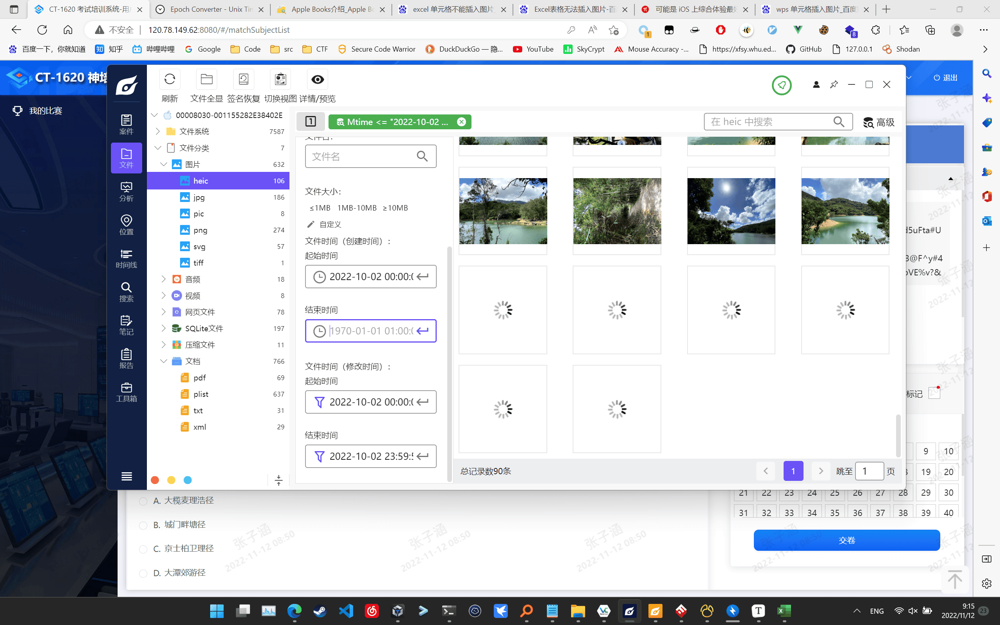


### 14 检视王晓琳的手机照片，她于2022年10月2日到过什么地方

> A.大榄麦理浩径
> 
> B.大潭郊游径
> 
> ==C.城门畔塘径==
> 
> D.京士柏卫理径
> 


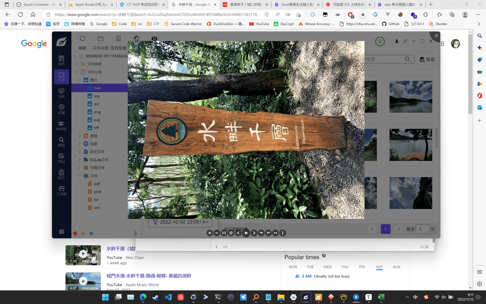


## 李大辉的手机

### 15 李大辉使用的是一台LG V10手机，它的型号

> A.LGH961C
> 
> ==B.LGH961N==
> 
> C.LGH961D
> 
> D.LGH960C
> 
> E.LGH960H
> 

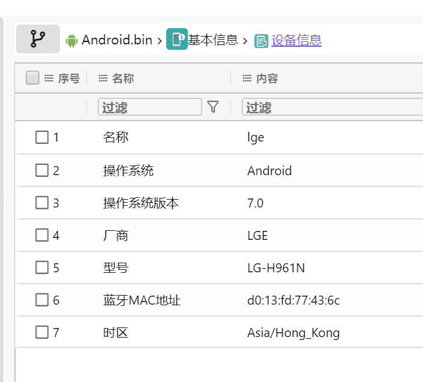


### 16 李大辉的手机最常搜索的类别

> A.运动
> 
> ==B.护肤品==
> 
> C.旅游
> 
> D.学校
> 

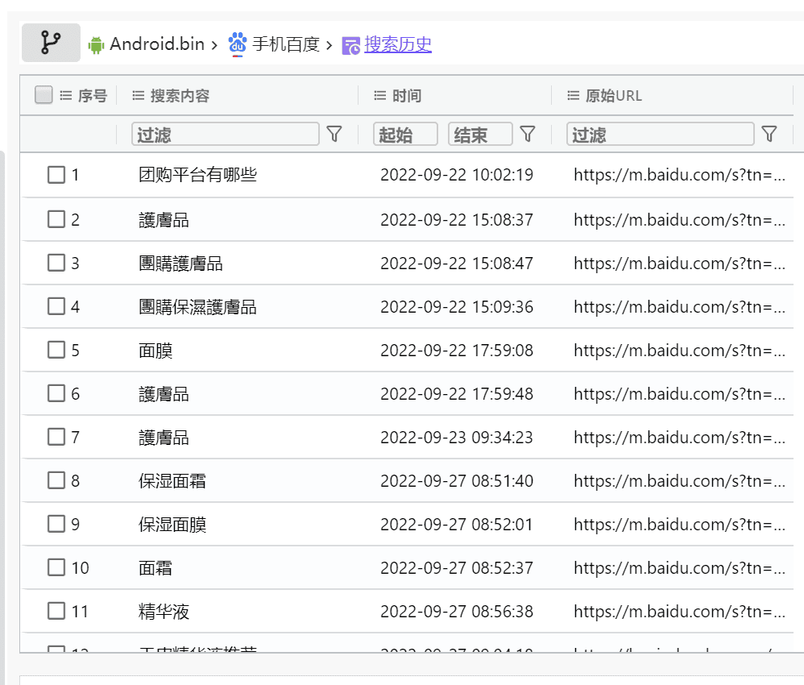


### 17 李大辉最近光顾了一家美丰快运公司，这快递件的单号

> ==4567 5678 1234 4567==
> 

在相册缩略图中可以看到疑似快递单的图片, 但清晰度太差, 看不清楚.

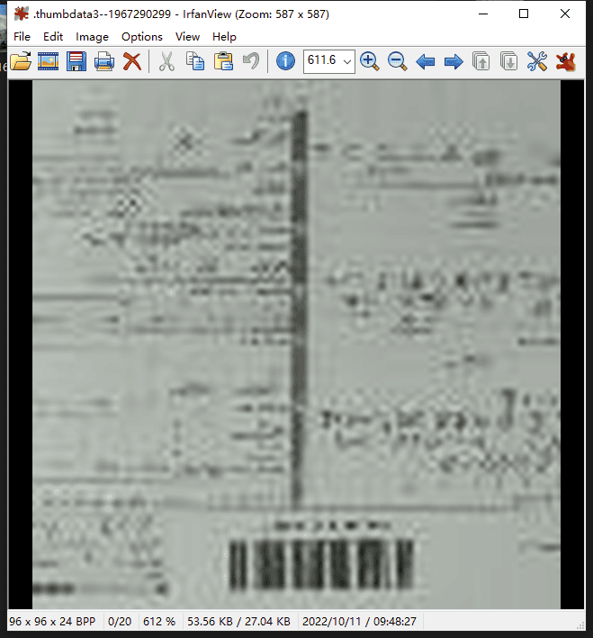

既然缩略图在 DCIM 里, 说明曾经拍过快递单的照片, 但被删除了. 此外, 在各种社交媒体中也没有找到有发送这张照片.

在翻看了手机里所有文件大小大于 100 KB 的图片文件之后依然没有找到. 猜测是某个软件保存了照片的缓存, 扩展名发生了变化.

对镜像进行文件特征分析, 在分析结果中找到了另一张文件的缓存 `54363de6fa6ac19d7b38ae4a8660622b498e4017c9c9fa77edafaae214e49b8e.tmp`, 跳转到源路径之后, 在同一个文件夹中可以找到运单的照片缓存`/分区57/data/com.google.android.apps.photos/cache/glide_cache/54363de6fa6ac19d7b38ae4a8660622b498e4017c9c9fa77edafaae214e49b8e.tmp`. 这是谷歌相册的相册封面缓存.


### 18 李大辉收到的电邮中有一个钓鱼链结，这个链结的地址

> A.https://bit.ly/5vM12
> 
> B.以上皆非
> 
> ==C.https://bit.ly/3yeARc0==
> 
> D.http://bit.ly/Hell0
> 

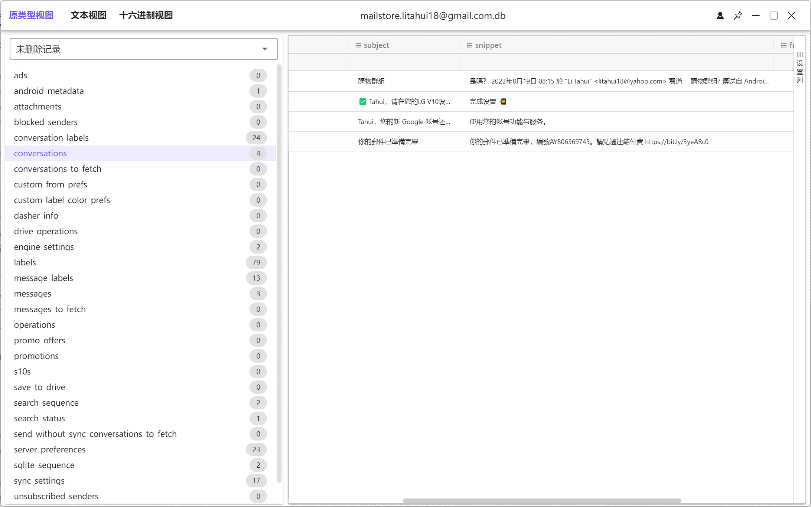


### 19 承上题，这封电邮是从哪个电邮地址寄出的

> A.2020ChanChan\@hotmail.com
> 
> B.以上皆非
> 
> C.Cavinchow456\@yahoo.com
> 
> ==D.30624700Peter\@proton.me==
> 

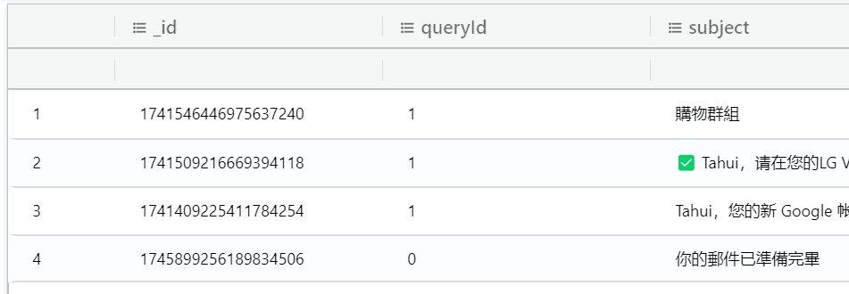

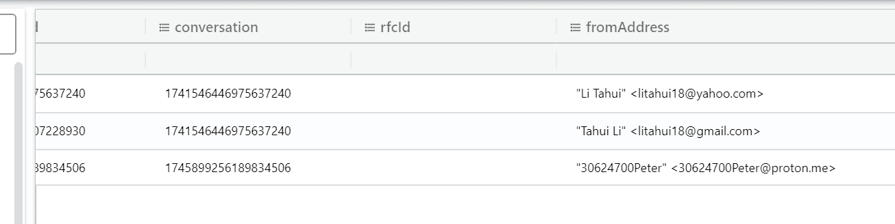


### 20 承上题，寄出这封电邮的IP

> A.10.13.105.56
> 
> B.以上皆非
> 
> ==C.65.54.185.39==
> 
> D.58.152.110.218
> 

此题或许无解. 安卓版的 gmail 并不会下载完整的电邮信息, 而是从服务器获取一个通过 zlib 压缩过的二进制文件, 并将文件解析之后存入数据库, 其中只包含发信邮箱 & 收信邮箱 & 邮件标题 & 邮件正文等信息.

不过排除法可以得出答案 (前提是不选 B):

- 首先, 我们可以排除 B 选项, 因为 A 网段为 10 的 ip 地址是保留 ip.
- 在 ip 查询网站上搜索一下剩下的 2 个 ip 地址, 发现 D 选项为微软所拥有的 ip 地址.
- 而 C 选项香港的一家名为 "网上行" 的网络供应商所拥有的 ip 地址. 结合案件情况, 或许发件人使用的网络由此公司提供.


### 21 李大辉手机有一个 order.xlsx 的档案被加密了，解密钥匙是

> ==A.Nov2022!==
> 
> B.2022_Nov!
> 
> C.20221101
> 
> D.P@ssw0rd!
> 


### 22 香港的街道上每一枝街灯都有编号。 分析李大辉手机里的程序KMB 1933，一枝街灯在经度22.4160270000，纬度114.2139450000附近，它的编号是

> ==CE1453==
> 

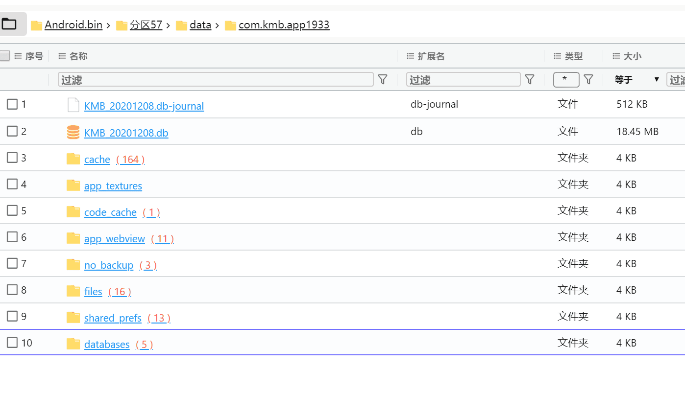

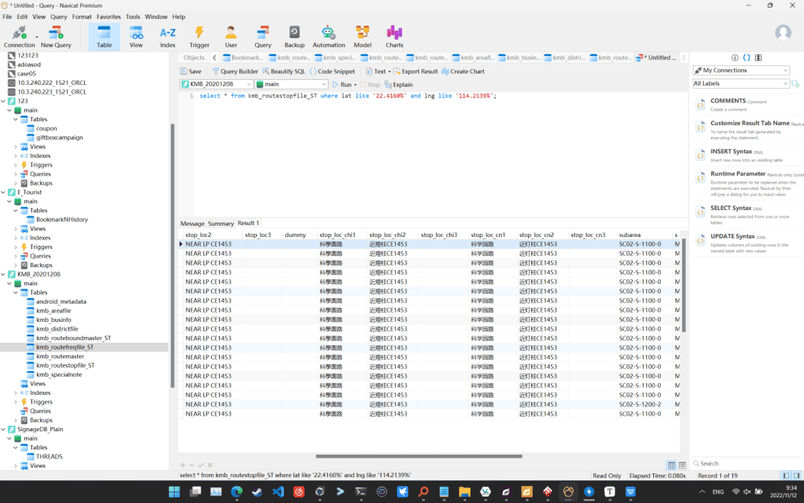


### 23 李大辉的手机里有一张由该手机拍的照片，照片的元资料曾被修改，这张照片的档案名是

> ==20220922_152622.jpg==
> 

DCIM 中只有一个文件的创建日期与修改日期不同. 查看图片元数据发现, 其拍摄日期被修改.

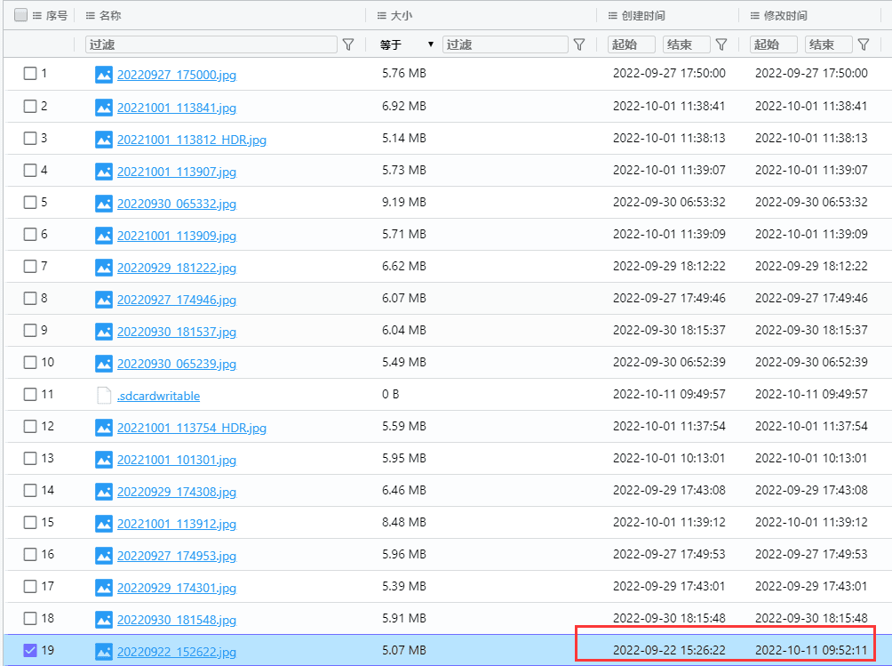


### 24 分析李大辉的手机里的资料，他在哪一间公司工作

> A.盛大国际有限公司
> 
> ==B.美丽好化妆品公司==
> 
> C.步步高贸易公司
> 
> D.永恒化妆品公司
> 

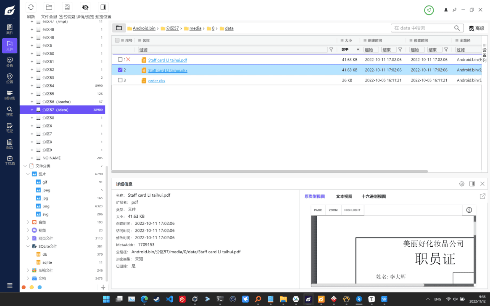

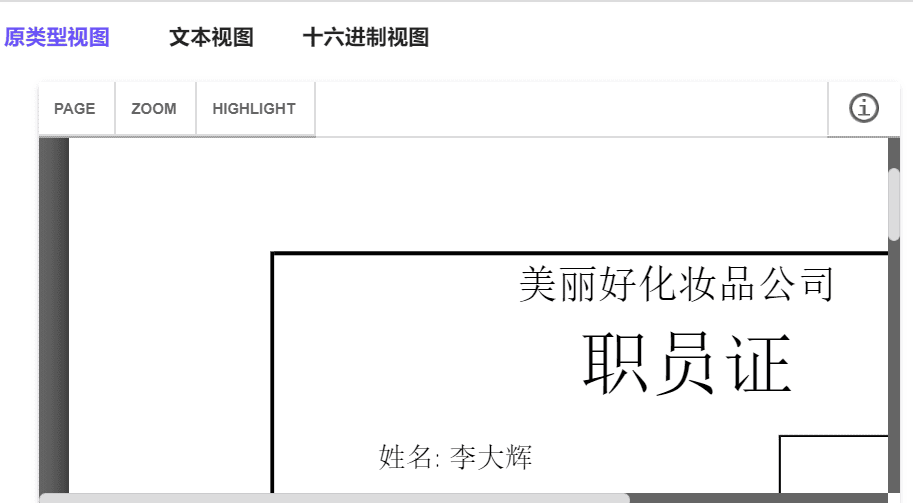


## 林浚熙的手机

### 25 林浚熙曾经以手机登录Google账户的验证码

> ==G785186==
>

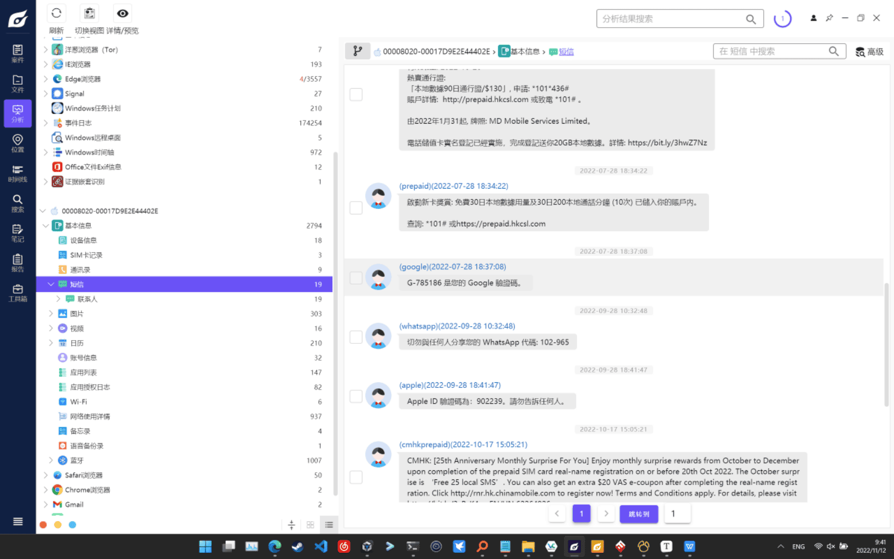


### 26 林浚熙手机的 WhatsApp 号码

> ==85259308538==
> 

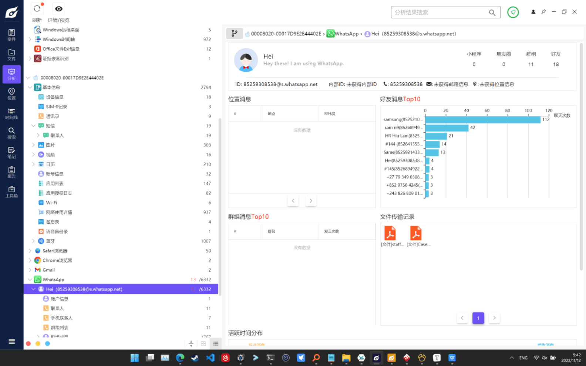


### 27 通过分析林浚熙手机的照片，判断他在何处偷拍王晓琳

> A.游泳池
> 
> B.交通工具
> 
> C.郊野公园
> 
> ==D.酒店房间==
> 


### 28 林浚熙曾经删掉自己拍摄的照片，这张照片的档案名

> ==IMG0444.JPG==
> 

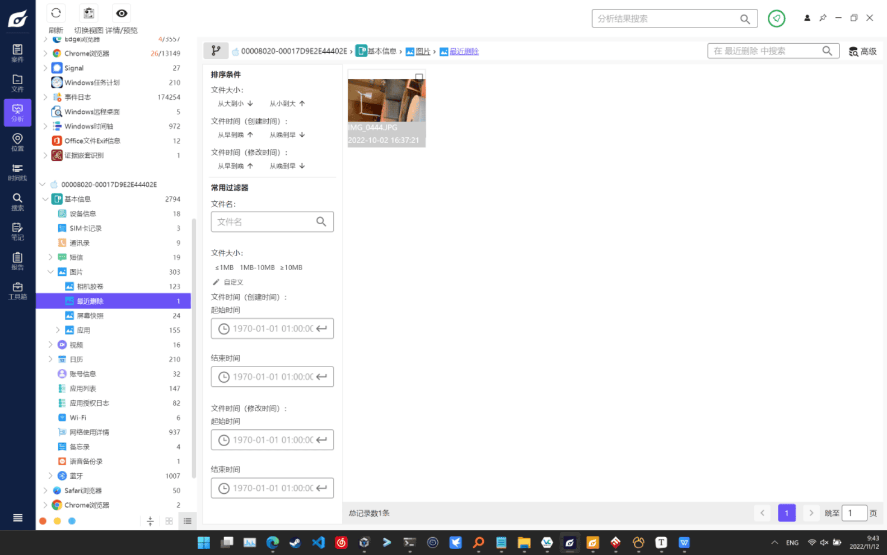


### 29 王晓琳曾经发送一个PDF档案予林浚熙，这个档案的文件签名是

> ==D0 DF 11 E0==
> 

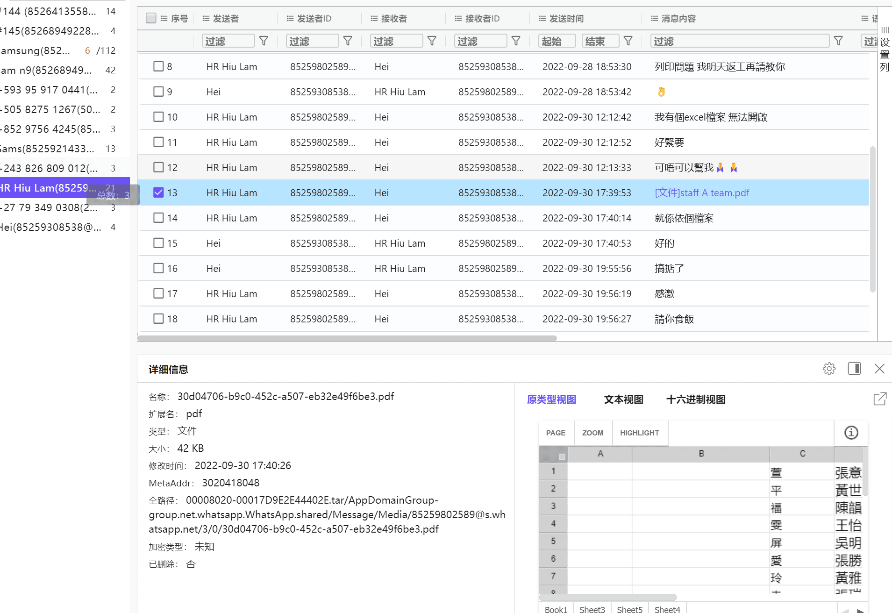

文件签名其实就是我们常说的文件头, 这个 PDF 扩展名的文件实际上是一个 Excel 表格文件.

这个文件格式与现在常见的 Office Open XML(OOXML) 格式的文档不同, 它是由 2007 版本之前的 Office 组件创建的 OLESS(OLE Structured Storage) 格式文件.


### 30 承上题，该PDF档案内包含一位曾经被骗的受害者资料。分析林浚熙手机的数据，这位受害者的英文名字

> ==WONG SAI PING==
> 

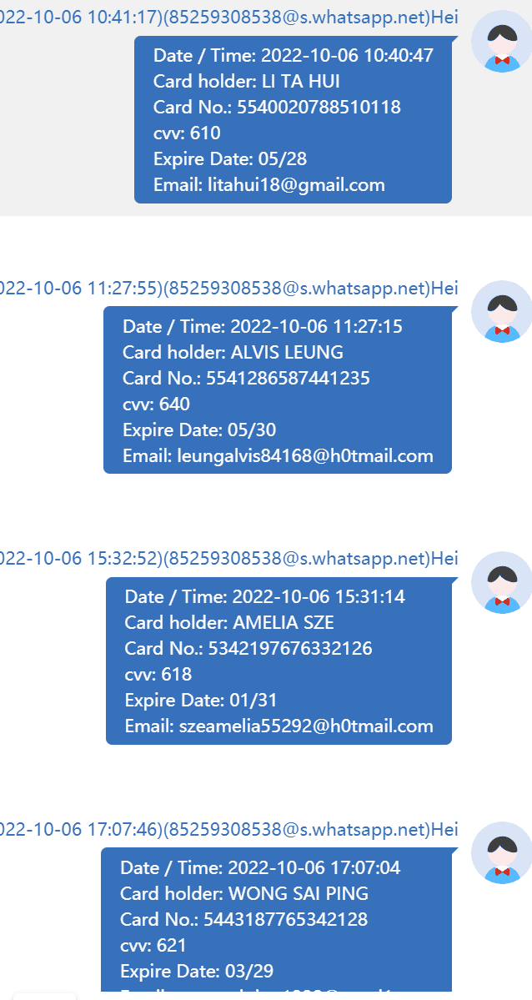

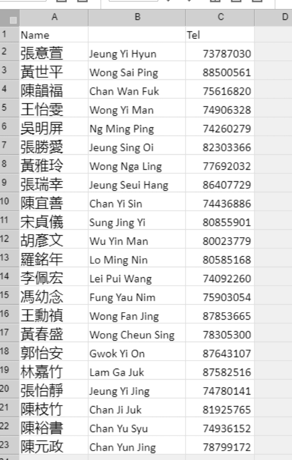


### 31 分析林浚熙手机上的数据，他在2022年10月17日计划去什么地方?

> ==A.沙田站==
> 
> B.以上皆非
> 
> C.荃湾站
> 
> D.国际金融中心二期
> 

手机上安装的全部与行程可能相关的应用有: `com.kmb.app1933`(公交信息软件) & `com.apple.map`(系统地图服务) & `com.google.Maps`(谷歌地图) & `com.waze.iphone`(导航软件).

逐一查看数据库后发现, waze 的数据量非常大, 看起来是经常使用的.

在 `/AppDomain-com.waze.iphone/Documents/user.db` 中的 `EVENTS_PLACES` 表中可以看到路程规划信息. 


转换一下时间戳看到 2022-10-17 有计划去沙田站.


### 32 承上题，上述行程的结束时间

> ==2022-10-12 09:45:00==
> 

见上题


### 33 于林浚熙的手机里，在2022年9月1日或以后，由其他手机拍摄的档案名是

> 此题存疑.
> 

[Local Photo Library Photos.sqlite Query Variations & WHERE statements – The Forensic Scooter](https://theforensicscooter.com/2022/02/21/photos-sqlite-update/)


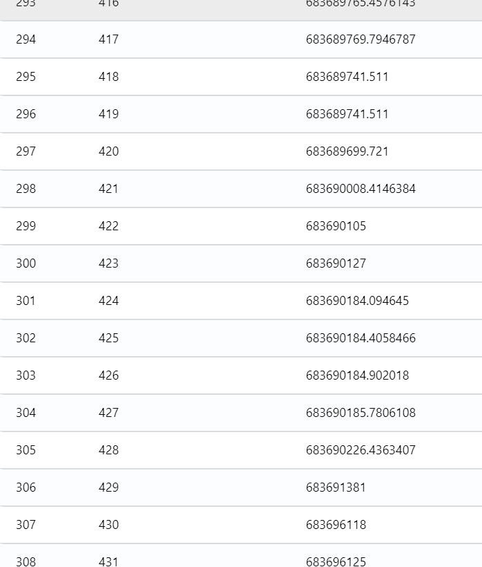

PK>=293的满足9月1号之后

这道题出现了一些问题, 根据 EXIF 信息, 一共找到 3 张由 iPhone XS 拍摄且创建日期在 2022-09-01 后的照片. (林浚熙的手机型号是 iPhone XR)

如果非要说是哪一张的话, 更有可能是 IMG_0421.HEIC 或 IMG0_0420.HEIC 之中的一张, 因为手机里面还存输了一张明显与 IMG_0422.HEIC 一起拍摄的另外一张照片.


### 34 根据照片的数据库资料，哪一个栏目标题可以显示这张照片的接收方式

> ==A:ZIMPORTEDFROMSOURCEIDENTIFIER==
>
> B:ZIMPORTEDBYBUNDLEIDENTIFIER
>
> C:ZRECEIVEDFROMIDENTIFIER
>
> D:ZRECEIVEMETHODIDENTIFIER

栏目标题 = 字段名

写一个简单的 python 脚本提取数据库里的所有字段信息:

```python
import sqlite3
import json

con = sqlite3.connect("./Photos.sqlite")
cur = con.cursor()
tables = cur.execute("SELECT name FROM sqlite_master WHERE type = 'table' ORDER BY name;").fetchall()
tables_parsed = dict()

for tablename in tables:
    tablename = tablename[0]
    tables_parsed[tablename] = list()
    cols = cur.execute(f"PRAGMA table_info({tablename});").fetchall()
    for col in cols:
        tables_parsed[tablename].append(col[1])
con.close()

with open("./Photos.josn", "w") as json_file:
    json.dump(tables_parsed, json_file, indent=4)

find = [
    "ZIMPORTEDFROMSOURCEIDENTIFIER",
    "ZIMPORTEDBYBUNDLEIDENTIFIER",
    "ZRECEIVEDFROMIDENTIFIER",
    "ZRECEIVEMETHODIDENTIFIER"
    ]

  

for table_name, table_columns in tables_parsed.items():
    for col_name in find:
        if col_name in table_columns:
            print(f"{col_name} in {table_name}")
```

只能找到 `ZIMPORTEDBYBUNDLEIDENTIFIER` 字段, 位于 `ZADDITIONALASSETATTRIBUTES` & `ZCLOUDMASTER` & `ZGENERICALBUM` 三个表中.


### 35 承上题，这张照片通过什么方式接收

> A.WhatsApp软件传送
> 
> B.蓝牙传送
> 
> C.Signal软件传送
> 
> D.网页下载
> 
> ==E.以上皆非==
> 

使用[ScottKjr3347/iOS_Local_PL_Photos.sqlite_Queries](https://github.com/ScottKjr3347/iOS_Local_PL_Photos.sqlite_Queries)提供的 sqlite 脚本, 可以看到照片的来源是 `com.apple.sharingd`, 应该是苹果的 AirDrop:

>NAME: sharingd -- Sharing Daemon that enables AirDrop, Shared Computers, and Remote Disc in the Finder.
>
>SYNOPSIS: sharingd
>
>DESCRIPTION: sharingd is used by the Finder to enable AirDrop file sharing, connecting to shared computers, and accessing Remote Discs from other computers.
>


### 36 承上题，这张照片原本的档案名是

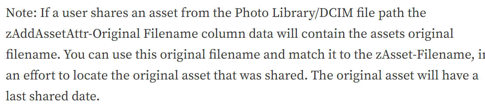


### 37 林浚熙手机里有一个备忘录被上了锁，这个备忘录的名称是

> ==Halo==
> 

备忘录的数据被存储在 `/AppDomainGroup-group.com.apple.notes/NoteStore.sqlite`

在表 `ZICCLOUDSYNCINGOBJECT` 中可以看到加密情况: 


不过, 这里有两个脚本被加了密. 不过在解密之后, 只有其中一个备忘录中存在数字. 参见下题.


### 38 承上题，上述备忘录的内容有一串数字是

> ==123456==
> 

这道题有些麻烦, 或许是因为 ios 新版本的 Notes 应用的数据库结构发生了变化, 现有的解析脚本都不能顺利解析. 不过, 既然我们只需要备忘录的标题和内容, 完全可以用比较粗暴简单的办法解决问题: 将脚本中获取上述两个字段的地方做修改. 

关于解密原理可以看这个: [Ciofeca Forensics - Revisiting Apple Notes (5): Encrypted Notes](https://www.ciofecaforensics.com/2020/07/31/apple-notes-revisited-encrypted-notes/)

我使用的脚本是 [threeplanetssoftware/apple_cloud_notes_parser: Parser for Apple Notes data stored on the Cloud as seen on Apple handsets (github.com)](https://github.com/threeplanetssoftware/apple_cloud_notes_parser). 这里给出在 Debian 上的操作流程. 不建议使用 Windows, 因为在编译 Ruby 的 OpenSSL Gem 时会出问题.

安装环境及 Gem:

```bash
sudo apt-get install build-essential libsqlite3-dev zlib1g-dev git ruby-full ruby-bundler libssl-dev
git clone https://github.com/threeplanetssoftware/apple_cloud_notes_parser.git
cd apple_cloud_notes_parser
bundle install
```

如果卡在 bundle install, 网络环境问题, 需要换源:

```bash
sed -i "s/rubygems.org/gems.ruby-china.com/g" Gemfile
```

然后就需要对脚本进行修改了. 要修改的是 `lib/AppleNote.rb` 和 `lib/AppleNoteStore.rb` 两个源码.

- 在 `lib/AppleNoteStore.rb` 中找到 "Skipping Note ID" 这个字符串, 将这句 logger 所在的整个 if...else...end 代码块注释掉, 只保留 `@notes[tmp_note.note_id] = tmp_note` 这一行.
- 在 `lib/AppleNote.rb` 中找到 `to_csv` 函数, 将其中的 `@account.name` 和 `@folder.name` 修改为 `""`.
- 同一个文件中, 找到 `generate_html` 函数, 将其中的 `#{@account.name}` 和 `#{@folder.name}` 删除.

由于需要爆破密码, 还需要从网上找一个弱口令字典.

最后执行脚本:

```bash
ruby notes_cloud_ripper.rb -w /path/to/passwords.dict -f /path/to/NoteStore.sqlite
```

爆出来密码是 `234567`, 备忘录的内容是 `Halo\n123456`.

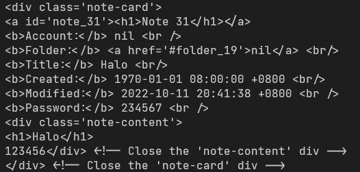


## 林浚熙的计算机

### 39 林浚熙计算机的操作系统版本

> A.Windows 10 Home 21H2
> 
> ==B.Windows 10 Pro for Workstations 21H2==
> 
> C.Windows 10 Pro 22H2
> 
> D.Windows 10 Pro for Workstations 21H1
> 

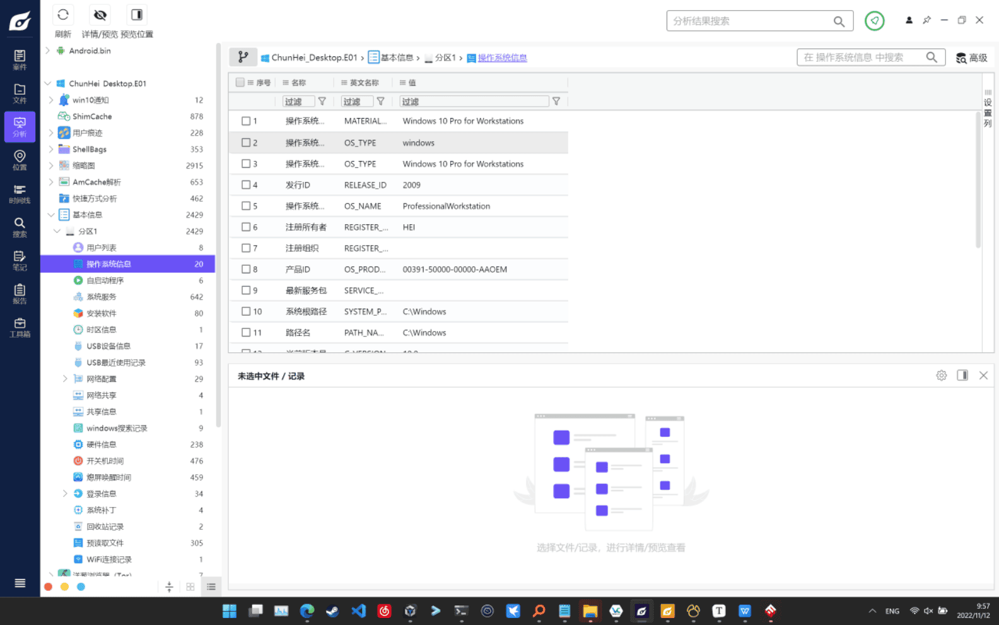

仿真后能看到是21H2..


### 40 林浚熙计算机安装了什么虚拟专用网络软件?

> ==EXPRESSVPN==
> 

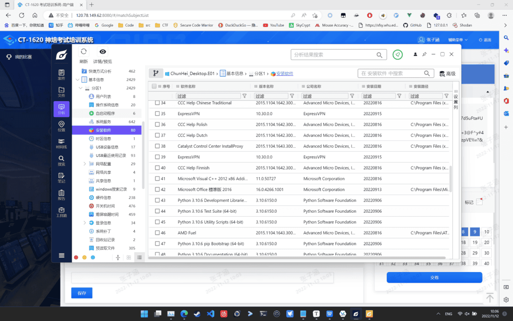


### 41 承上题，分析该虚拟专用网络的日志，他在哪天安装该虚拟专用网络

> ==20220915==
> 

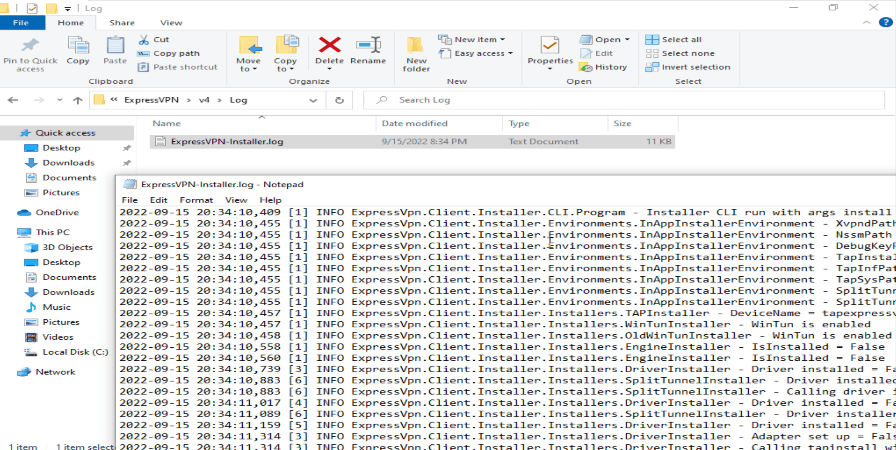


### 42 检视林浚熙计算机的数据，他使用哪种加密货币以支付虚拟专用网络软件?

> ==BITCOIN==
> 

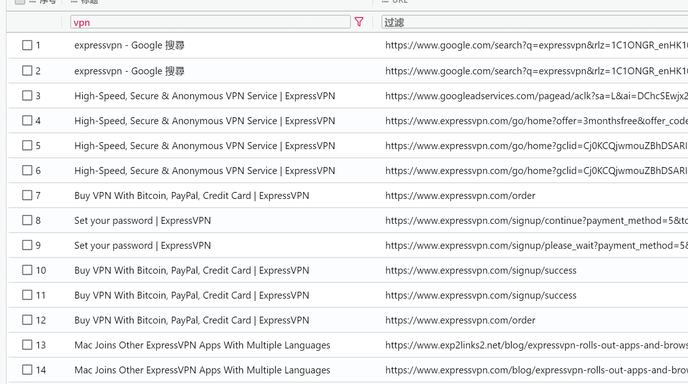


### 43 林浚熙的加密贷币钱包名称

> ==tellaw_ieh==
> 

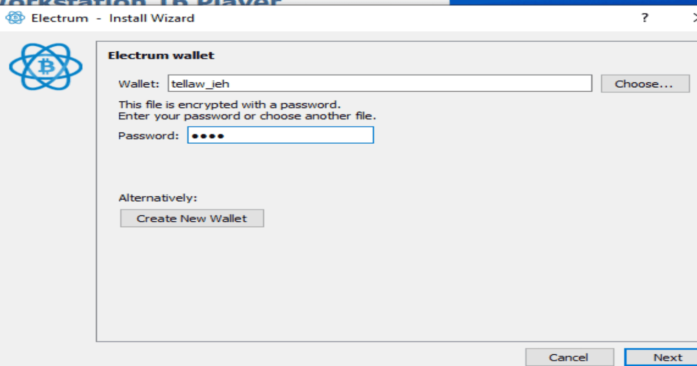


### 44 林浚熙计算机里安装了哪个浏览器

> ==A.Tor Browser==
> 
> ==B.Google Chrome==
> 
> ==C.Internet Explorer==
> 
> ==D.Microsoft Edge==
> 
> E.Opera
> 

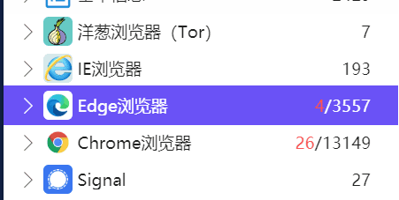


### 45 林浚熙使用浏览器Google Chrome曾经浏览最多的网站

> ==A.https://web.whatsapp.com==
> 
> B.https://gmail.com
> 
> C.https://mail.google.com/mail
> 
> D.https://facebook.com
> 


### 46 除了上述网站,林浚熙曾使用Google Chrome搜索过什么

> ==A.image教学==
> 
> ==B.php sql教学==
> 
> ==C.electrum教学==
> 
> D.javascript教学
> 
> ==E.tor教学==
> 

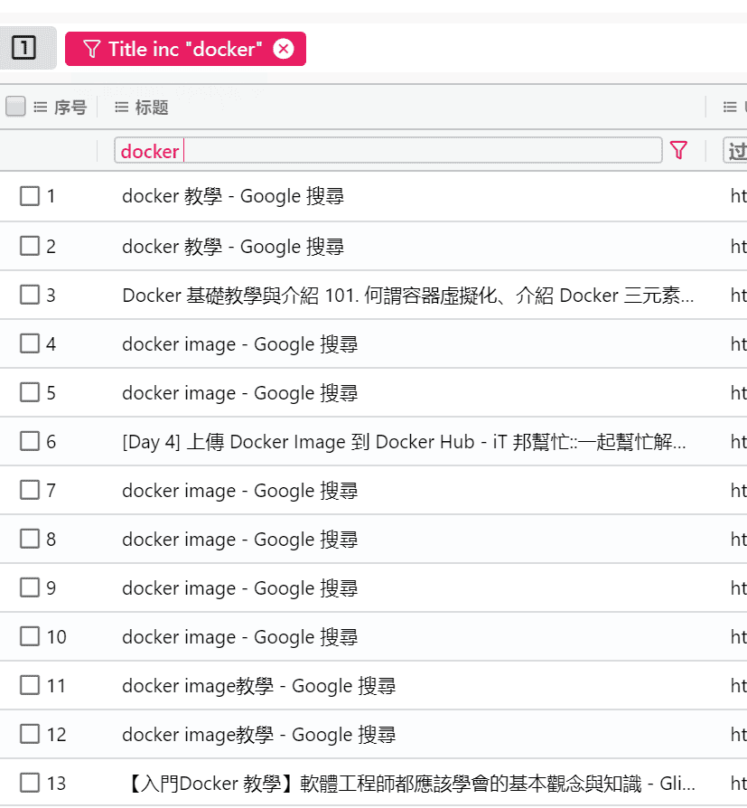


### 47 林浚熙的计算机安装了一个通讯软件 Signal，它的用戶資訊儲存路径是

> A.\Program Files (x86)\Signal
> 
> B.\Users\HEI\Desktop\Signal
> 
> ==C.\Users\HEI\AppData\Roaming\Signal==
> 
> D.\Users\user\Roaming\Signal
> 

[image-20221114223912747](./attachments/image-20221114223912747.png)


### 48 Signal 采用一个档案存放用户的聊天记录，它的档案名是

> ==DB.SQLITE==
> 

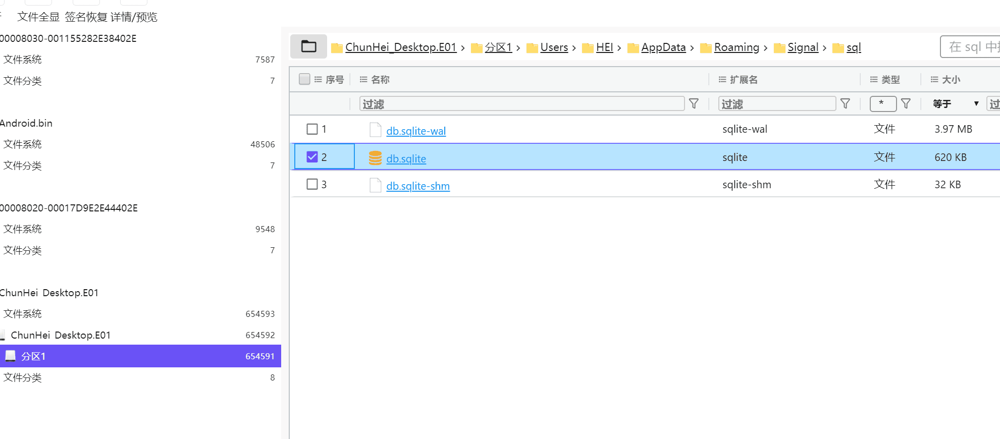


### 49 承上题，对上述档案迸行分析，林浚熙的联络人当中有多少人安装了Signal

> ==1==
> 


### 50 林浚熙在Signal曾与某人对话，那人的手机号码是

> ==+852 70711901==
> 

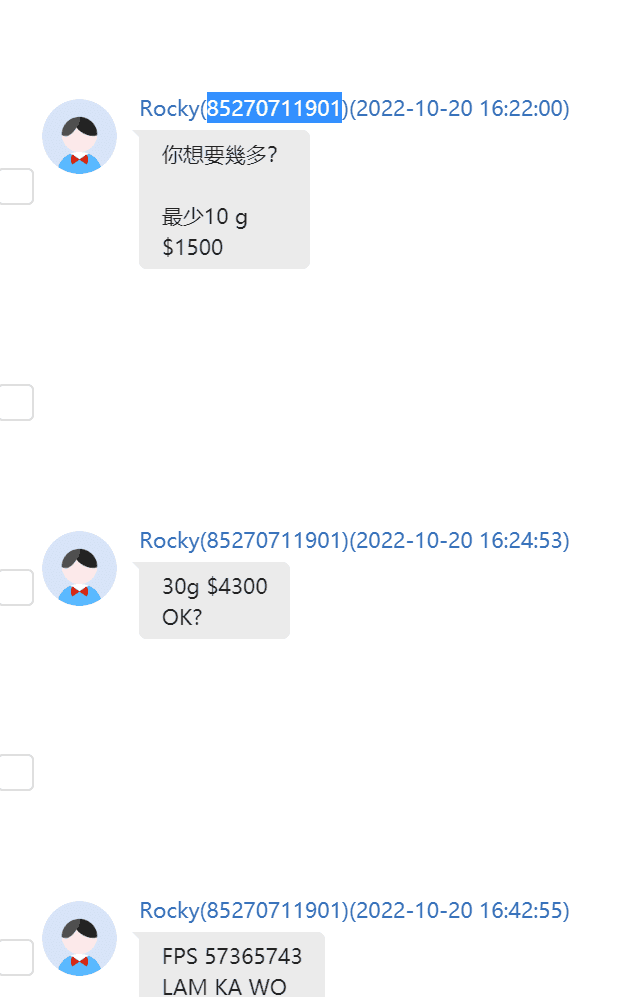


### 51 承上题，两人在Signal的对话中有些讯息包含附件，这些讯息的ID包括

 > ==A.9729bf92-ab9c-45f7-8147-66234296aele==
 > 
 > B.5b9650fe-3bb6-4182-9900-f56177003672
 > 
 > ==C.46a8762b-78ea-49aa-a6f5-b24975ec189f==
 > 
 > D.47233ffe-1a73-4b3d-b97c-626246ec3129
 > 

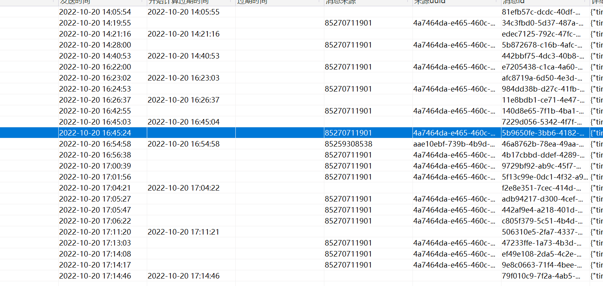

### 52 承上题，林浚熙曾经于2022年10月20日轉账予上述对话人士, 那次轉賬的参考编号是

> ==N91088774024==
> 

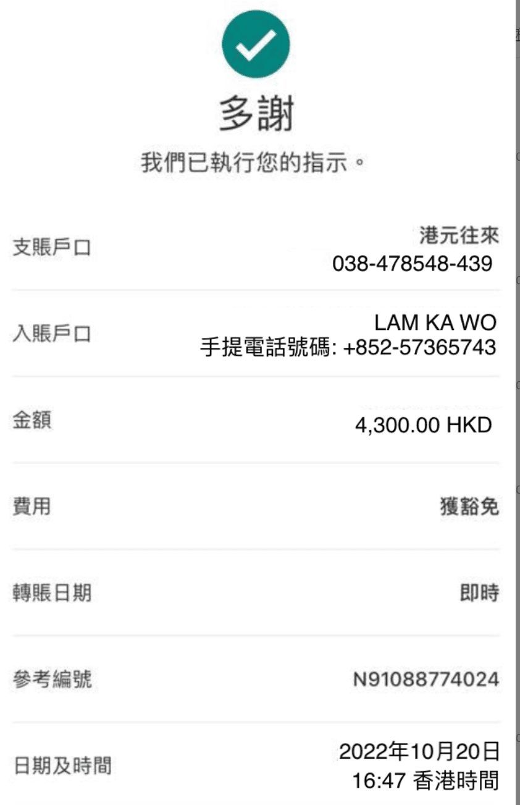


### 53 林浚熙的计算机安装了多少台虚拟机

> A.2
> 
> B.4
> 
> ==C.1==
> 
> D.3
> 

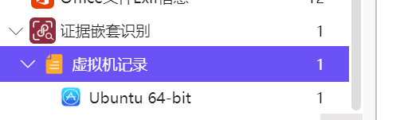


### 54 林浚熙的计算机里的虚拟机存放在什么路径

> A.\Program Files\Virtual Machines
> 
> B.\User\HEI\Roaming\Virtual Machines\
> 
> C.\Users\Public\Documents\Virtual Machines
> 
> ==D.\Users\HEI\Documents\Virtual Machines==
> 

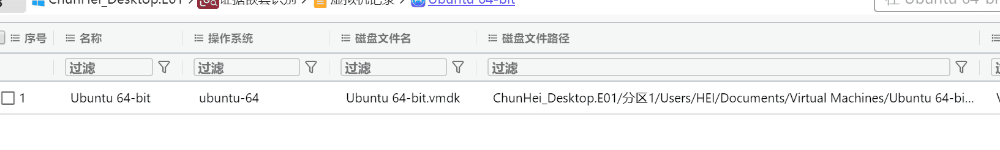


### 55 虚拟机使用什么版本的作业系统

> A.CentOS Linux release 7.6.1810(Core)
> 
> B.CentOS Linux 7.5.1804 (Core)
> 
> C.Ubuntu 22.04.1 LTS
> 
> ==D.Ubuntu 20.04.5 LTS==
> 

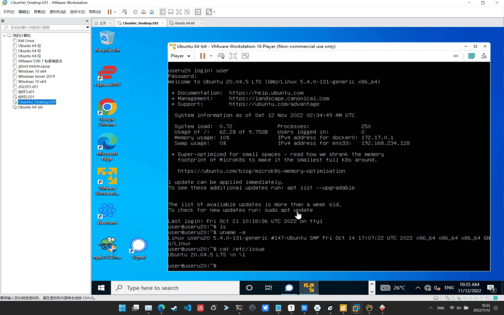


### 56 虚拟机中的文件传输服务器有哪些用户

> A.man
> 
> B.root
> 
> ==C.ftpuser==
> 
> D.nobody
> 
> E.admin
> 

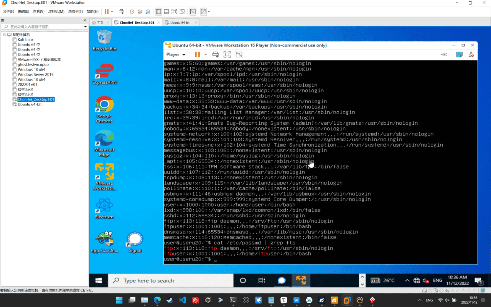


### 57 虚拟机设置了什么网页服务器

> ==A.APACHE==
> 
> B.LIGHTTPD
> 
> C.IIS
> 
> ==D.NGINX==
> 
> E.WORDPRESS
> 

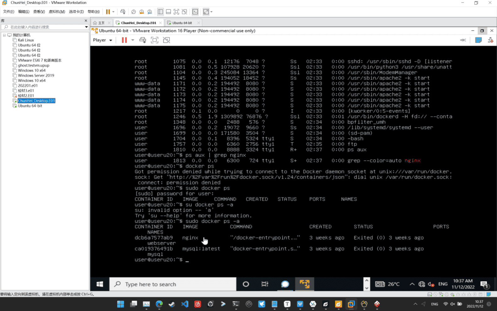


### 58 网页服务器目录内有图片档案，而此档案的储存位置是

> A./var/www/post
> 
> ==B./var/www/html/post/css==
> 
> C./var/www/html/post
> 
> D./var/www/html/post/src
> 
> E./var/www/html/post/vendor
> 

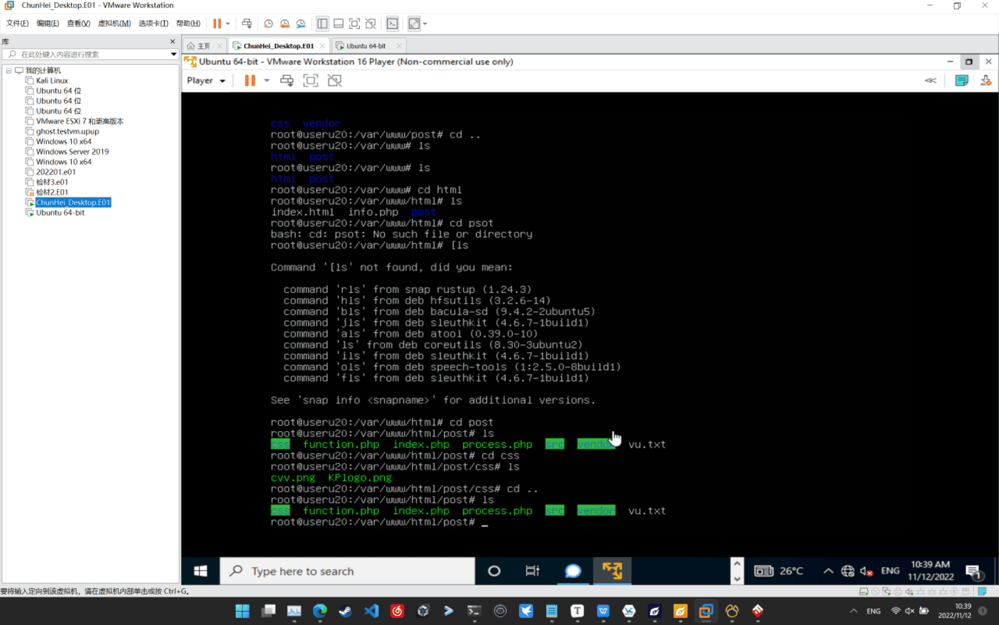


### 59 分析网页服务器的网站数据，假网站的公司名称是什么

> ==A.Krick Post Global Logistics==
> 
> B.Krick Global Logistics
> 
> C.Global Logistics
> 
> D.Krick Post
> 

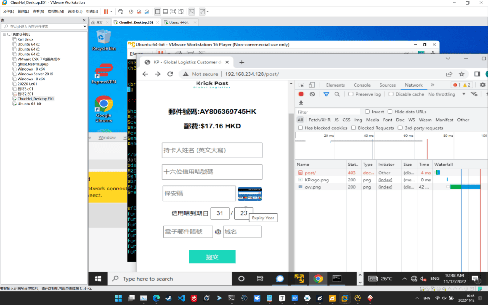


### 60 检视假网站首页的显示，AY806369745HK代表什么

> A.邮件序号
> 
> ==B.邮件号码==
> 
> C.邮件收费号码
> 
> D.邮件参考号码
> 


### 61 分析假网站的资料，当受害人经假网站输入数据后，网站会产生一个档案，它的档案名是

> ==vu.txt==
> 


### 62 分析假网站档案process.php源码, 推测此档案的用途可能是

> ==A.发出邮件==
> 
> B.改变函数
> 
> ==C.产生档案==
> 
> D.更新数据库
> 

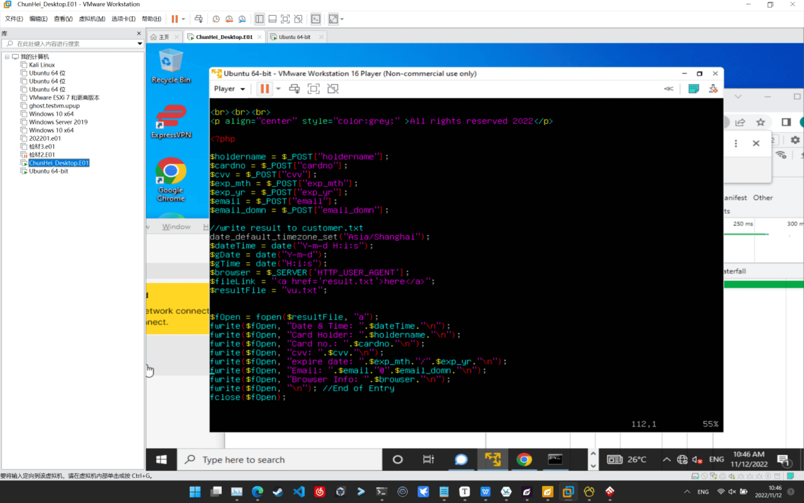


### 63 检视档案process.php源码, 林浚熙的电邮密码是

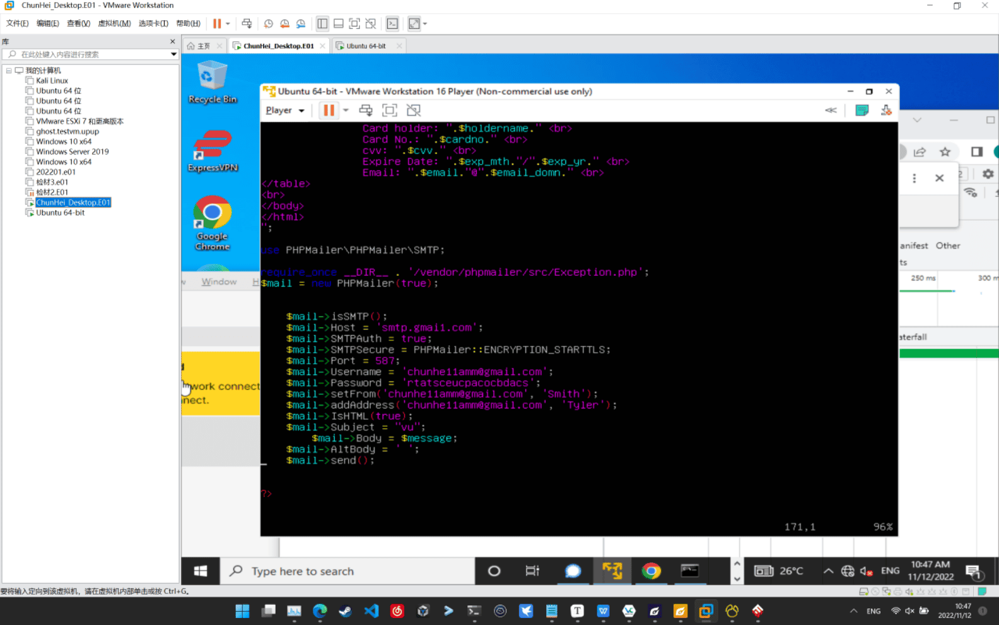


### 64 分析档案process.php源码, 它不会收集哪些资料

> ==A.电话号码==
> 
> B.信用卡号码
> 
> C.电邮地址
> 
> ==D.GPS位置==
> 
> ==E.短讯验证码==
> 


### 65 虚拟机安装了Docker程序，列出一个以5作为开端的Docker镜像ID

> ==5d58c024174d==
> 

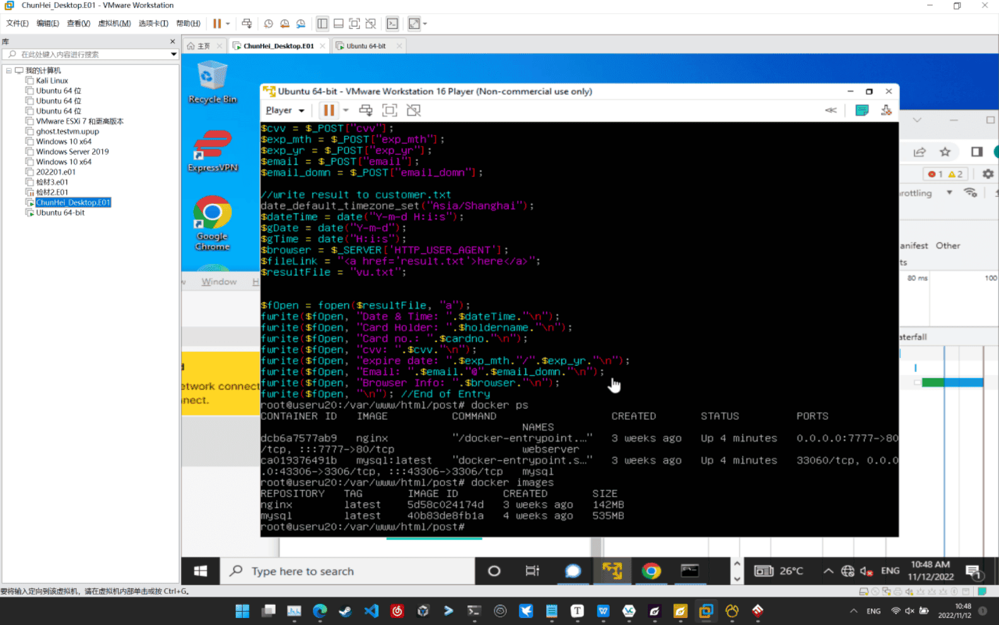


### 66 Docker容器mysql对外开放的通讯端口是

> ==43306==
> 

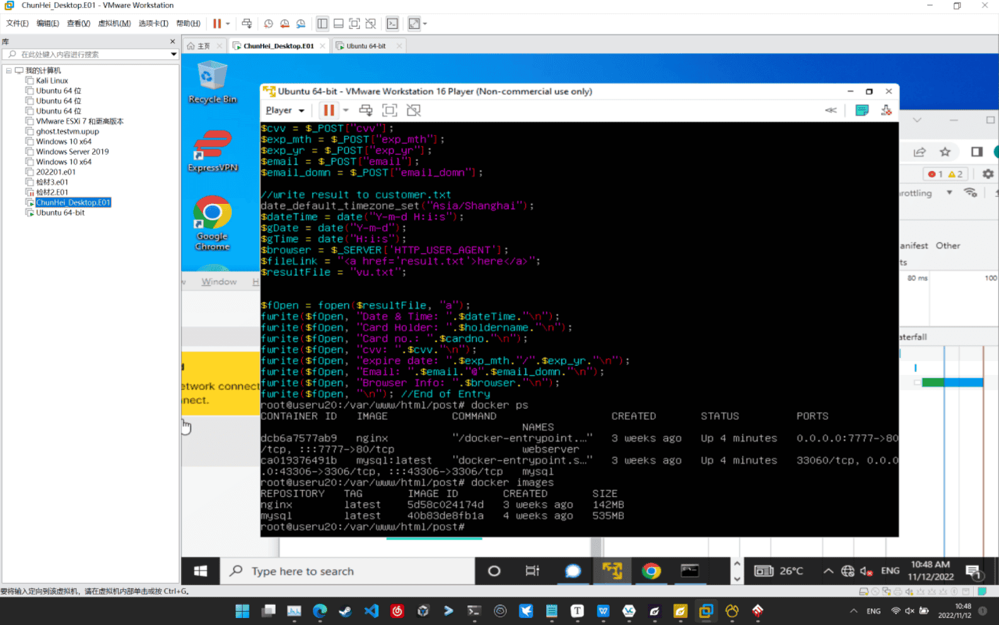


### 67 Docker容器mysql，用户root的密码是

> ==2wsx3edc==
> 

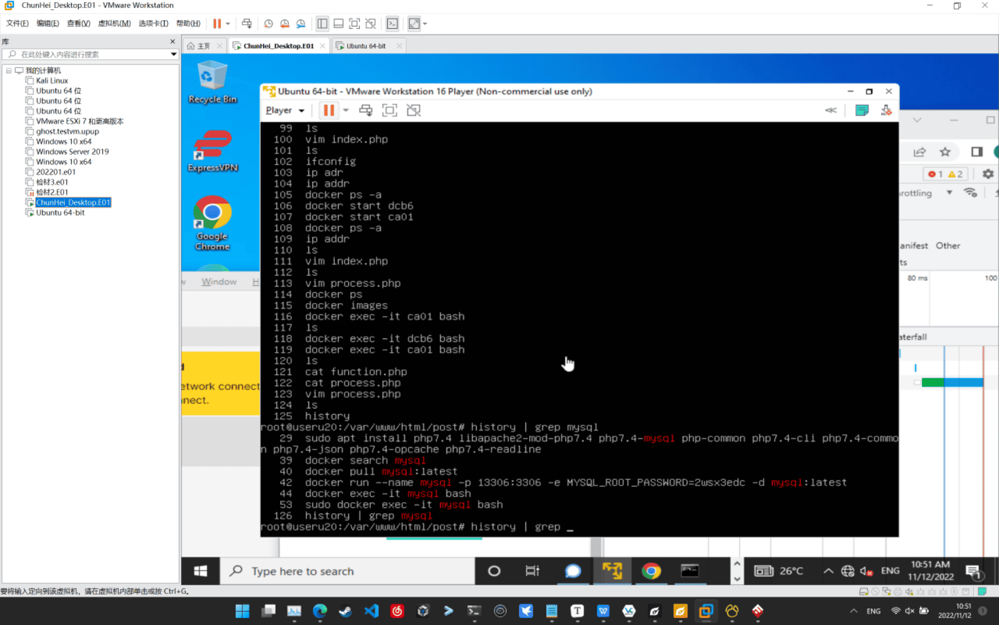


### 68 Docker容器mysql里哪一个数据库储存了大量个人资料

> ==krickpost==
> 

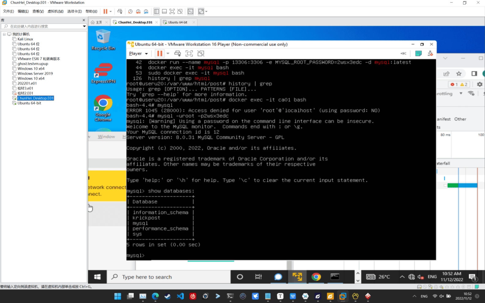


### 69 检视Docker容器mysql内数据库里的资料，李大辉的出生日期

> ==1985-02-14==
> 

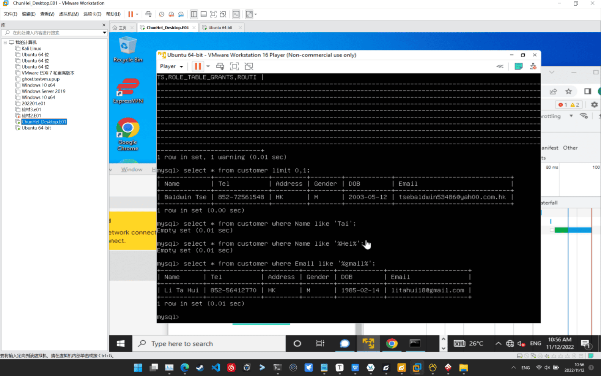


## 综合分析

### 70 通过取证调查结果迸行分析 (包括但不限于以上问题及情节)，林浚熙的行为涉及哪一种罪案

> ==A.勒索金钱==
> 
> B.抢劫
> 
> ==C.购买毒品==
> 
> D.传送儿童色情物品
> 
> ==E.诈骗==
> 


