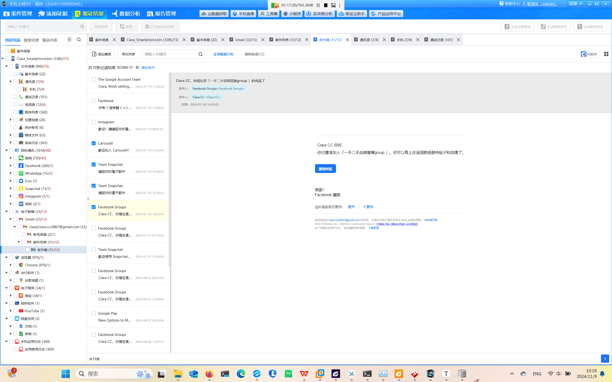
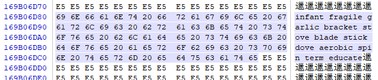
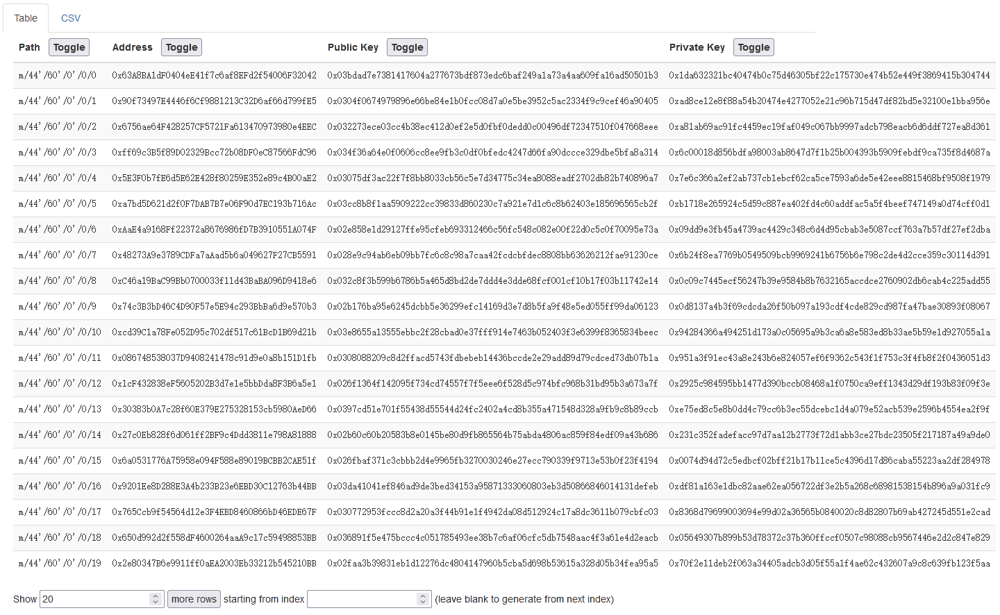

# 美亚杯2024个人赛题解

> Author: Rockspace2333 & HorizonChaser & GoldenPigeon @ 和我组一辈子的美亚杯参赛队吧, 我什么都会做的,  NoahTie @ 猫猫啥也不会
>

## **写在前面**

检材容器密码: `eS2%u@q#hake2#Z@6LWpQ8^T(R7cg95m\Bv+y;$=/dqxYnEusFf)tb>:HKHwy+e%cR\r=9j:GsK)AV52/3hXfdv8#u7a6JQ^pz><YPNkq*!&`

### **From Rockspace2333 & HorizonChaser & GoldenPigeon @ 和我组一辈子的美亚杯参赛队...**

这次比赛全程使用的综合取证软件是弘连的火眼证据分析,  绝大多数题目都可以完成自动取证.

感谢上海弘连网络科技有限公司为我们提供的软件支持! 

与 2023 年美亚杯线上赛不同的是, 今年的线上赛不允许使用互联网查询资料.

### **From NoahTie @ 猫猫啥也不会**

按照个人习惯, 我补充及重写的复盘部分大多使用弘连的取证软件.

24 年下半年因为考研的缘故, 24年的美亚杯 & 数证杯 & FIC 我都没有参加. 不过好在考上研了, 在 XD Forensics 的时间可以再续 3 年了. 

24 美亚的复盘是我回归之后做的第一个比赛复盘, 有学弟们去年写好的复盘, 我做的事情基本上就是解决一点没有解决的问题 & 添加一些我之前也接触过的不多的知识性内容 & 很少的纠错.

## **案情**

于 2024 月 8 月某日,  警方接获一名本地女子 Emma 报案,  指她的姊姊 Clara 失联多天,  希望报告一宗失踪人口的案件. 现在你被委派处理这宗案件. 于处理该案件期间,  你在 Emma 的同意下提取了她手机的资料,  并且协助警方对 Clara 及其丈夫 David 的电子装备进行取证工作. 请分析以下的资料,  还原事件经过.

**资料:**

1. Emma 的 iOS 手机镜像档案 (Emma_Mobile_Image.zip)
2. Clara 的安卓手机镜像档案 (Clara_Smartphone.bin)
3. David 的 Windows 系统计算器镜像档案 (David_Laptop_64GB.e01)
4. David 的 8GB U 盘镜像档案 (David_USB_8GB.e01)
5. David 的安卓手机镜像档案 (David_Smartphone_1.zip)
6. David 的 Windows 系统计算器内存档案 (RAM_Capture_David_Laptop.raw)

**建议软件列表:**

1. Windows 系统分析工具
2. 数据库分析工具 (参考例子：DB browser for SQLite,  Plist Editor Pro)
3. 手机系统分析工具 (参考例子：手机大师,  Autopsy)
4. 内存分析工具 (参考例子: Volatility)

## **Emma 的手机**

> Emma 已经几天没有收到她姐姐 Clara 的消息了, 报警失踪, 她焦虑地将手机提交给警察, 希望能找到线索. 
> 
> 警察将手机交给你进行电子数据取证. 你成功提取了Emma手机的镜像 `Emma_Mobile.zip`. 
> 
> 请根据取证结果回答以下问题. 
> 

本部分题目关联的检材 `Emma_Mobile.zip` 是文件集合, 数据库文件(`DB` 目录)和 plist (`plist` 目录)按照文件类型归类. 本身不是镜像文件, 仅提取了部分文件系统中的文件(`Active` 目录), 因此将整个压缩包放入取证软件进行自动取证也会缺少很多信息. 

~~但是, 你说巧不巧, 我电脑上有 AutoPsy.~~ 


AutoPsy 虽然不如商业软件强, 但是兼容性非常强, 各种提取软件生成的奇奇怪怪的格式的文件集合, 多少都能识别出来一些.

接下来的部分题目在 AutoPsy 中完成.

这部分题目考察手动取证的能力(指翻数据库).


### 1.Emma 和 Clara 的微信聊天记录, Emma 最后到警署报案并拍摄写有报案编号的卡片, 拍摄时的经纬值是多少?

> ==A. 22.451721666667,  114.171853333333==	
>
> B. 22.451553333333,  114.172845		
> 
> C. 22.451928333333,  114.170503333333	
> 
> D. 22.451638333333,  114.16993
> 

微信的数据中编号最大的文件 `314.pic`. 这个编号对应的是微信的消息数据库里的编号. 


在来自微信的数据库 `message_2.sqlite` 中可以找到这条消息的 xml 原始数据:


```xml
<msg><appinfo><appid></appid><appname></appname><version>0</version><isforceupdate>1</isforceupdate><mediatagname></mediatagname><messageext></messageext><messageaction></messageaction></appinfo><MMAsset><m_assetUrlForSystem><![CDATA[F58B98FE-8010-44B7-8BF7-F23AF15DCFCA/L0/001]]></m_assetUrlForSystem><m_isNeedOriginImage>0</m_isNeedOriginImage><m_isFailedFromIcloud>0</m_isFailedFromIcloud><m_isLoadingFromIcloud>0</m_isLoadingFromIcloud></MMAsset></msg>
```

其中可以看到 `<m_assetUrlForSystem><![CDATA[F58B98FE-8010-44B7-8BF7-F23AF15DCFCA/L0/001]]></m_assetUrlForSystem>` 意为来自系统的附件路径, 附件的 GUID 为 `F58B98FE-8010-44B7-8BF7-F23AF15DCFCA`. 

在 iOS 系统的相册数据库 `photos.db` 中可以找到对应的 GUID:


对应的经纬度为`22.45172166666667 & 114.17185333333333`.


### 2.2024 年 8 月 30 日下午 2 点后 Emma 共致电 Clara 多少次?

> A. 85
> 
> B. 86
> 
> C. 87
> 
> ==D. 88==
> 

在 `DB\AddressBook.sqlitedb.db` 中可以看到 Clara 的手机号码:


在 `DB\CallHistory.storedata.db` 中查询 2024 年 8 月 30 日下午 2 点(Cocoa Core Time: 746690400)后拨打 Clara 号码的次数: 

```sql
SELECT *
    FROM ZCALLRECORD
    WHERE ZADDRESS=63791704 AND ZDATE >= 746690400;
```


在 AutoPsy 中也可以看到自动识别到的结果(时间显示为 UTC):


### 3.根据 Emma 和 Clara 的微信聊天记录, Clara 失踪前曾告诉 Emma 会到哪里?

> ==A. 到酒店和丈夫David庆祝结婚周年==		
> 
> B. 吃自助餐		
> 
> C. 约了朋友见面		
> 
> D. 去旅行
> 

还是在 `DB\message_2.sqlite` 中:


### 4.Emma 的 iPhone XR 内微信应用程序的版本是多少?

> ==8.0.50==


### 5.Emma 手机中下列哪个选项是正确的?

> A. iOS 版本为 17.6.1
> 
> ==B. IMEI 为 356414106484705==
> 
> C. Apple ID 为 `Emma1761@gmail.com`
> 
> ==D. 手机曾经安装 Metamask 应用程序==
> 


### 6.Emma 手机中 Apple ID 的注册电子邮箱是多少?

> ==emmaemma.851231\@gmail.com==
> 

见上题.


### 7.在 2024 年, Emma 手机上曾记录的电话卡集成电路卡标识符(ICCID)是多少?

> ==8985200000826445829==
> 


火眼中也能看到: 


### 8.Emma 手机的蓝牙设备名称"ELK-BLEDOM"的通用唯一标识符(UUID)是什么?

> ==8D13F23C-E73C-6A98-AA4F-16C8D7A5F826==
> 

火眼里只看到蓝牙的 MAC 地址:


但其实火眼的蓝牙信息就来自于`DB/com.apple.MobileBluetooth.ledevices.other.db`, 其中包含了 UUID 字段, 应该是火眼的开发者考虑到实际应用的情况, 没有将 UUID 展示出来. 在实际运用中, 不会用到 UUID, 而是 MAC 地址.

UUID 可以在蓝牙的数据库中找到:


### 剧情 1

> 你发现了一些线索, Emma 看起来也很可疑, 她似乎背负了大量债务. 
> 


### 9.Emma 手机内 Safari 浏览记录中网页 `https://racing.hkjc.com/` 的网站标题是什么?

> A. 香港马会奖券有限公司		
> 
> B. 六合彩 - Google 搜索		
> 
> C. 快易钱:网上贷款财务公司 | 足不出户现金即日到手		
> 
> ==D. 赛马信息 - 香港赛马会==
> 


### 10.Emma 向 Clara 透露什么原因令 Emma 欠下巨债?

> A. 投资孖展		
> 
> B. 虚拟货币失利		
> 
> C. 网上赌博		
> 
> ==D. 以上皆是==
> 


参考第 1 题.

### 11.收债人要求 Emma 还款数量?

> A. 港币$786,990
> 
> B. 港币$878,990
> 
> ==C. 港币$786,980==
> 
> D. 港币$745,330
> 

~~粤韵风华~~


### 12.Emma 发送了多少张 `.PNG` 图片给 Clara, 证明自己正被人追债?

> A. 6
> 
> ==B. 7==
> 
> C. 8
> 
> D. 9
> 

还是在微信的聊天记录里面: 


对应的图片可以在微信的存储目录里找到, 是短信的截图:


### 13.Emma 用来浏览虚拟货币的网址?

> A. Google.com		
> 
> B. Facebook.com		
> 
> ==C. IntellaX.io==		
> 
> D. Yahoo.com
> 

这其实都不需要翻镜像就能猜到吧...


### 14.参考浏览器记录, 有多少网址与"bet365"有关? 

> ==A. 3==			
> 
> B. 13		
> 
> C. 9			
> 
> D. 12
> 

直接全局搜索字符串, 发现 Safari 浏览记录(`SafariTabs.db`)中有 1 条, `Bookmarks.db` 中有 2 条, 共 3 条:


### 剧情 2

> 你还发现了一些与不当使用他人加密钱包相关的痕迹. 
> 

### 15.Emma 用了哪些恢复短语(Recovery Phrase)进入 David 的虚拟货币账户?

> A. stock, avocado, grab, clay
> 
> B. light, sadness, segment, ancient
> 
> C. toe, talk, elder, oil
> 
> ==D. 以上皆是==
> 

微信的聊天记录中看到:


找消息 id 224 对应的图片文件:


### 16.Emma 从 David 处窃取的虚拟货币的名称是什么?

> ==A. IDFC==
> 
> B. ICAC
> 
> C. INIC
> 
> D. IFCC
> 

见上题. 找到消息 id 206 对应的图片文件:


### 17.Clara 偷拍的照片中, David 的虚拟货币余额是多少?

> A. 3266378.99
> 
> B. 1044749.22
> 
> C. ==5022915.66==
> 
> D. 7822468.44
> 

见上题.


### 18.Emma 在偷窃 David 的虚拟货币前, Emma 曾向 Clara 透露有什么事发生在 Emma 身上?

> A. 中彩票
> 
> ==B. 欠债==
> 
> C. 升职
> 
> D. 失业
> 

微信聊天记录一直在聊欠债的事情.

### 剧情 3

> 你查看了 Emma 手机中的一些照片数字信息, 以获取更多与失踪案件的信息.
> 

### 19.Emma 的 iPhone XR 中"IMG_0008.HEIC"的图像与相片名字为的"5005.JPG"看似为同一张相片, 在数码法理鉴证分析下, 以下哪样描述是正确?

> 本题存疑.
> 

> A. 储存在不同的.db檔案里
> 
> ==B. 有不同哈希值==
> 
> ==C. IMG_0008.HEIC 为原图, "5005.JPG"为并非原图==
> 
> D. IMG_0008.HEIC 和名字"5005.JPG"是同一张相片
> 

`IMG_0008.HEIC` 的信息存在于 `Photos.db` 中:


图片的 UUID 在微信的聊天记录数据库中出现了:


在微信聊天记录中的 id 是 82, 可以找到对应的图片:


`5005.JPG` 未找到. 按照逻辑来说, `IMG_0008.HEIC` 应为 iOS 相机拍摄的原图, 而 `5005.JPG` 可能是在发送到微信时生成的压缩后的图片.


### 20.Emma 的 iPhone XR 中"IMG_0009.HEIC"的图像显示拍摄参数怎样

> ==A. iPhone XR back camera 4.25mm f/1.8==
> 
> B. iPhone XR back camera 4.25mm f/2.8
> 
> C. iPhone XR back camera 4.25mm f/2
> 
> D. iPhone XR back camera 4.25mm f/1.6
> 

所有照片都是同样的拍摄参数.


### 21.Emma 的 iPhone XR 中相片文件"IMG_0009.HEIC"提供了什么电子证据信息?

> A. 此相片是由隔空投送 (Airdrop)得来
> 
> ==B. 此相片由iPhone XR拍摄==
> 
> ==C. 此相片的拍摄时间为2024-08-05 13:38:15(UTC+8)==
> 
> D. 此相片的拍摄时间为2024-08-06 08:30:52(UTC+8)
> 

见上题. 可以看出是由 iPhone XR 拍摄, 把时间戳转换成 UTC+8 是2024-08-05 13:38:15. 


### 22.Emma 的 iPhone XR 内以下哪张照片是实况照片(Live Photos)?

> ==A. IMG_0002.HEIC==
> 
> B. IMG_0005.HEIC
> 
> ==C. IMG_0004.HEIC==
> 
> D. IMG_0006.HEIC
> 

iPhone 中的实况照片扩展名为 `.HEIC`, 用 SQL 语句筛选一下扩展名符合且 `ZVIDEOCPDURATIONVALUE` (视频片段长度) 字段不为 0 的照片:

```sql
SELECT Z_PK, ZFILENAME 
    FROM ZASSET
    WHERE ZFILENAME LIKE '%.HEIC' 
        AND ZUNIFORMTYPEIDENTIFIER = 'public.heic' 
        AND ZVIDEOCPDURATIONVALUE != 0;
```


这题有点白给的, IMG_0005.HEIC 和 IMG_0006.HEIC 这两个文件根本不存在(实际扩展名为 PNG), 又是多选题, 排除一下也能选出来答案.


### 23.手机里有多少张照片是用手机后置摄像镜头拍摄的? 

> A. 5
> 
> B. 6
> 
> C. 7
> 
> ==D. 8==
> 

参见第 20 题中的数据库.


### 24.参考通讯记录, MesLocalID 为 224 的是什么类的文件?

> ==A. 相片==
> 
> B. 影片
> 
> C. 文件
> 
> D. 报表
> 

参见第 15 题.

---

## **Clara 的手机**

> 依据你在 Emma 的手机上找到的照片, 你告诉调查员 Clara 最后的位置是在湾仔的一家酒店. 
> 
> 根据你提供的信息, 调查员发现 Clara 在酒店去世, Clara 的手机在她的附近, 你对 Clara 的手机进行取证. 
> 
> 请根据取证结果, 参考 Clara_Smartphone.bin 回答以下问题.
> 

### 25.Clara 手机的 Android 操作系统版本是?

> ==A. 8.0.0==
> 
> B. 9.0.0
> 
> C. 8.1.0
> 
> D. 7.0.0
> 

又是这台 LG 手机, 老演员了...


### 26.Clara 手机的版本号(Build Number)是什么?

> OPR1.170623.026
> 

在 `build.prop` 文件内. 不同版本的安卓系统文件的位置可能不同, 检材中的位置是 `/build.prop`.

 


### 27.Clara 手机的 IMEI 号码是多少?

> ==351537092934716==
> 

当时不会, 复盘的时候用火眼建立了索引, 直接搜 IMEI 就搜出了手机上不知道是故意还是不小心存了 IMEI 的闲鱼数据文件. 这个故事告诉我们, 火眼的搜索其实很好用, 镜像挂载上来之后一定要第一时间建立索引以供搜索. 
 
 

#### **IMEI**

> IMEI (International Mobile Equipment Identity)是**国际移动设备识别码**, 用于在全球范围内唯一标识一部移动通信设备, 由15位数字组成, 其结构包括以下部分:
> 
> - ​**TAC**​(前 6 位): 设备型号核准码，标识品牌和型号;
> - ​**FAC**​(第 7-8 位): 早期设备的最终装配地代码;
> - ​**SNR**​(第 9-14 位): 设备序列号;
> - ​**CD**​(第15位): 校验码, 通过 Luhn 算法验证合法性.
> 
> 基带芯片是手机通信系统的核心组件之一, 负责处理通信协议, 信号编解码以及网络连接. IMEI信息通常存储在基带芯片相关的硬件模块(如 EFS 分区)中, 基带芯片通过读取这些信息完成设备身份认证. 基带芯片在建立网络连接时, 需向运营商发送IMEI以验证设备合法性.
> 
> 在某些特殊情况下, 设备可以没有 IMEI. 常见的情况之一就是基带分区损坏. 下图是我在备份后擦除了手机基带分区数据之后, 系统中对 IMEI 的显示:
> 
> 
> 


### 28.Emma 的微信账号是?

> ==wxid_ltrpgdhvilso22==
> 


### 29.Clara 的第一封电子邮件记录的日期?

> ==A. 2024-07-10==
> 
> B. 2024-07-18
> 
> C. 2024-07-23
> 
> D. 2024-07-30
> 

在数据库 `/data/com.google.android.gm/databases/bigTopDataDB.2017474332` 中, 火眼没有解析出来.


在 CyberChef 里面解一下码:


格式不清楚, 只能大概猜一下. 1:4 和 2:3 应该对应的是发送时间, 2:7 应该是接收时间.


最早的是数据库里第 1 条记录的邮件, 时间戳单位是 ms:


### 30.在通讯录中"David"的联系人信息还包括什么? 

> A. 出生日期
> 
> ==B. LinkedIn==
>
> C. 电子邮件
> 
> D. 地址
> 

找到 David, 跳转至源文件


可以在 `raw_contact` 表中看到 David 有 2 条记录, id 分别是 2 & 3.


在 `data` 表中可以看到 `raw_contact_id` 为 2 的 1 条记录为 LinkedIn 的个人页面网址: 


### 31.David 和 Clara 之间通话次数? 

> A. 0
> 
> ==B. 8==
> 
> C. 10
> 
> D. 24
> 


### 32.Clara 在 Chrome 浏览器搜索中哪天使用了关键词"popmart 炒价"? 

> A. 2024-08-10
> 
> B. ==2024-08-15==
> 
> C. 2024-08-20
> 
> D. 2024-08-25
> 


### 33.2024 年 7 月 30 日共收到多少封电子邮件?

> A. 2
> 
> B. 3
> 
> ==C. 4==
> 
> D. 5
> 




### 34.Clara 的 Gmail 账号是? 

> ==clara.ccc0807\@gmail.com==
> 


### 35.Clara 的手机安装了哪个版本的 WhatsApp?

> A. 241676000
> 
> B. 241676001
> 
> ==C. 241676004==
> 
> D. 241676007
> 


### 36.Clara 的 WhatsApp 账号?

> ==85263791704==
> 


### 37.Clara 的手机在什么时候安装了小红书 APP?
> A. 2024-07-10
> 
> ==B. 2024-07-16==
> 
> C. 2024-07-20
> 
> D. 2024-07-30
> 


### 38.2024 年 8 月 21 日 David 的虚拟货币钱包里有多少 IDFC?

> ==A. 5022915.66==
> 
> B. 3212695.22
> 
> C. 210355633.91
> 
> D. 以上皆不是
> 

在 Emma 手机部分也看到照片了.


### 39.Clara 注册的微信账号验证码是多少?

> ==945025==
> 


### 40.David 为庆祝结婚周年纪念预订了哪家酒店?

> ==CONRAD HONG KONG==
> 


### 41.哪个数据库文件存储了微信消息?

> ==ENMICROMSG.DB==
> 

转到源文件.


### 42.哪个数据库文件(.db)存储了 WhatsApp 讯息?

> ==MSGSTORE.DB==
> 

转到源文件.


### 43.Clara 在 2024 年 8 月 29 日拍了多少张照片?

> A. 0
> 
> ==B. 3==
> 
> C. 4
> 
> D. 5
> 


### 44.Emma 在 2024 年 8 月 6 日通过微信发送了多少张照片给 Clara? 

> ==A. 0==
> 
> B. 1
> 
> C. 5
> 
> D. 12
> 

应用规则筛选之后无命中结果.


### 45.照片"20240829_144717.jpg"的拍摄相机型号是什么?

> ==LG-H930==
> 

查看图片的 EXIF 信息:


### 46."20240821_121435.jpg"的储存路径是什么?

> ==A. /media/0/DCIM/Camera==
> 
> B. /media/1/DCIM/Camera
> 
> C. /media/00/DCIM/Camera
> 
> D. /media/11/DCIM/Camera
> 

~~emmm... 虽然这题本来就很简单, 但是, 你这个 media/00  media/11 是不是有点太过分了...~~


#### **关于 Andriod 的 `/media` 目录**

`/media` 目录是 Andriod 的挂载目录之一, 用于挂在外部存储设备.

在支持多用户的 Android 设备中, `0` 是主用户的外部存储挂载点, 是指向 `/storage/emulated/0/`(设备的内置存储模拟的“虚拟 SD 卡”路径)的符号链接.

当设备添加了新用户及设备连接了新的物理存储介质时, 系统可能会在 `/media` 目录下创建新的符号链接.


### 47.2024 年 8 月 20 日有多少张截图?

> ==4==
> 

筛选一下.


### 48.2024 年 8 月 22 日被删除微信消息的类型是?

> ==A. 照片==
> 
> B. 视频
> 
> C. 文本
> 
> D. 以上都不是
> 

当时一看这题感觉就耗时太久直接跳过了, 复盘的时候发现 Clara 手机上把助记词那张图片给删掉了, 现在看来就是这道题的答案.

---

## **David 的手机**

> 你在查看 Clara 的手机镜像后, 确定 Clara 是 David 的妻子, 调查员通过查询酒店预订记录确认了这一点. 
> 
> 他们现在定位 David 的住所, 以进行进一步调查. 
> 
> 你首先分析 David 的手机, 参考 David_Smartphone_1.zip.
> 


### 49.根据"Contents.db", David 手机接收了通讯软件 Telegram 的验证短信, 该验证码是多少?

> ==84298==
> 


### 50.David 把手机设置为个人热点, 请找出个人热点的密码. 

> ==wdfj5674==
> 


### 51.David 手机曾连接名为"MTR Free Wi-Fi"的WiFi.  

> ==对==
> 

香港地铁的免费 WiFi.


### 52.根据"com.tencent.mm_preferences.xml", David 的手机最后登录微信的微信 ID 是?

> ==wxid_rni3m2o8ngxe22==
> 

当时是挨个翻文件翻到的, 现在看来火眼直接搜就行. 


### 53.请指出哪一张图片是于 2024 年 8 月 28 日利用屏幕截取的.

> ==Screenshot_20240828-153836_Gmail.jpg==
> 


### 54.根据"Contents.db", David 手机的型号(Model)是?

> ==SM-G9500==
> 


### 55. 参考"Contents.db", David 所使用的手机 SIM 卡的序号?

> ==8985200000827530728==
> 


### 56. David 手机安装了应用程序 MetaMask. 根据"persist-root"中, MetaMask 钱包内有多少个账号?

> ==4==
> 

- 0xe90aD3f80e39E83B533eEF3ED23c641Ec51089c6
- 0x5aA371c585E7Dcd914BFd8a782A7471912cE777B
- 0x40ad807B862F0298d615E8db969FFf743Ac7d265
- 0x2acCe67E25C2D9e924f55960874CED06aCC4D0d3

文件内容是个 json:


直接搜索更快:


### 57.根据"persist-root"中, 何时从应用程序 MetaMask 发送虚拟货币至以下地址: 0X10A4F01B80203591CCEE76081A4489AE1CD1281C 

> A. 2024-08-11 1249(GMT+8)
> 
> ==B. 2024-08-14 1658 (GMT+8)==
> 
> C. 2024-08-14 1659 (GMT+8)
> 
> D. 2024-08-16 1724 (GMT+8)
> 

vscode 直接搜, 找到时间戳之后再转换. 把原 json 文件里的 engine 项导出成 json 文件之后会更清晰一点:


时间戳以毫秒为单位:


### 58.David 曾利用手机应用程序 MetaMask 三次发送虚拟货币失败. 根据"persist-root", 发送虚拟货币失败的原因是什么?

> A. 网络连接问题
> 
> B. 应用程序权限被拒
> 
> C. 接收地址错误
> 
> ==D. 手续费不足==
> 


---

## **内存取证**

> 你根据易失性(Volatility Level)优先次序, 进行内存取证分析 David 的笔记本电脑.
> 
> 参考 RAM_Capture_David_Laptop.RAW.
> 

火眼提供了用于内存分析的 GUI 工具, 功能也比较完善, 支持 BitLocker 密钥 & 微信QQ密钥的提取, 并且, 在工具的目录下有一套完整的包含 Windows 符号表和 Python 运行环境的 Volatility3. ~~别急, 等有生之年我的 Volingui 写好~~

### 59.以下哪一个不是程序"firefox.exe"的 PID?

> A. 9240
> 
> B. 8732
> 
> ==C. 5260==
> 
> D. 3108
> 


### 60.汇出 PID 为 724 的程序, 其哈希值(SHA-256)是? 

> ==本题存疑==
> 
> 参考答案: 
> 
> ==89CF04B53119D36654BC5E7EEB5D0829A84238EE03FAA9A03948F5BF4BE44583== (官方答案) 或 
> 
> 362AB9743FF5D0F95831306A780FC3E418990F535013C80212DD85CB88EF7427
> 

Vol3 一把梭. 注意 vol2 可能存在提取失败的问题, 对于 Windows 版本高于 10 的内存镜像, 不应该使用 vol2 进行分析.


另一种思路: 找到 PID 724 对应 lsass.exe 后,  去 David 笔记本镜像里面计算该文件对应的 SHA256.


这里会发现通过 vol3 导出的 ==进程内存转储== 和硬盘镜像中提取到的 ==程序文件== 的 SHA256 不同. 

对比之后可以看到两个文件之间完全不同:


学过操作系统之后, 应该很清楚进程内存转储和原始程序文件为什么不同. 常见的原因大致为:

- 进程转储包含完整的地址空间
- 动态链接库的加载
- 内存对齐与填充

因此, 这道题是存在一定歧义的. 如果说要从内存镜像中导出, 那么导出的就不仅仅是程序, 而是进程的内存转储; 但题目中描述的又是汇(导)出"程序", 而程序只能从硬盘镜像中提取得到.


### 61.哪一个是执行 PID 为 724 的程序的 SID? 

> ==S-1-5-18==
> 

这道题不用镜像也可以做出来. lsass.exe 是系统进程, 负责认证及安全相关任务, 父进程为 wininit.exe, 执行用户为 SYSTEM, 其 SID 固定为 S-1-5-18.


使用 Vol3 也可以看到运行进程的 SIDs:


第一个输出 `S-1-5-18(Local System)` 是运行 lsass.exe 进程的 SID, 其他 SID 表示其所属的权限组或安全上下文.

#### **常用熟知 SID**

来自 volatility3:

```json
{
        "S-1-0": "Null Authority",
        "S-1-0-0": "Nobody",
        "S-1-1": "World Authority",
        "S-1-1-0": "Everyone",
        "S-1-2": "Local Authority",
        "S-1-2-0": "Local (Users with the ability to log in locally)",
        "S-1-2-1": "Console Logon (Users who are logged onto the physical console)",
        "S-1-3": "Creator Authority",
        "S-1-3-0": "Creator Owner",
        "S-1-3-1": "Creator Group",
        "S-1-3-2": "Creator Owner Server",
        "S-1-3-3": "Creator Group Server",
        "S-1-3-4": "Owner Rights",
        "S-1-4": "Non-unique Authority",
        "S-1-5": "NT Authority",
        "S-1-5-1": "Dialup",
        "S-1-5-2": "Network",
        "S-1-5-3": "Batch",
        "S-1-5-4": "Interactive",
        "S-1-5-6": "Service",
        "S-1-5-7": "Anonymous",
        "S-1-5-8": "Proxy",
        "S-1-5-9": "Enterprise Domain Controllers",
        "S-1-5-10": "Principal Self",
        "S-1-5-11": "Authenticated Users",
        "S-1-5-12": "Restricted Code",
        "S-1-5-13": "Terminal Server Users",
        "S-1-5-14": "Remote Interactive Logon",
        "S-1-5-15": "This Organization",
        "S-1-5-17": "This Organization (Used by the default IIS user)",
        "S-1-5-18": "Local System",
        "S-1-5-19": "NT Authority",
        "S-1-5-20": "NT Authority",
        "S-1-5-32-544": "Administrators",
        "S-1-5-32-545": "Users",
        "S-1-5-32-546": "Guests",
        "S-1-5-32-555": "BUILTIN\\Remote Desktop Users",
        "S-1-5-80": "NT Service",
        "S-1-5-32-578": "Hyper-V Admins",
        "S-1-5-32-579": "Access Control Assistance Ops",
        "S-1-5-32-580": "Remote Management Users",
        "S-1-5-65-1": "This Organization Certificate (Kerberos PAC)",
        "S-1-5-84-0-0-0-0-0": "Usermode Drivers",
        "S-1-5-113": "Local Account",
        "S-1-5-114": "Local Account (Member of Administrators)",
        "S-1-15-2-1": "Application Package Context",
        "S-1-18-1": "Authentication Authority Asserted Identity",
        "S-1-18-2": "Service Asserted Identity"
    }
```


### 62.账户 David Tenth 的 NT LAN Manager 的哈希值(NTLM Hash)?

> ==e14a21fefc5dd81275bb87228586cffc==
> 


或者使用 vol3 命令行:


### **David 的 U 盘部分**

> 在取证中, 你发现 D 盘被 BitLocker 加密.
> 
> U 盘上可能有一些线索, 你对 U 盘进行了取证.
> 
> 参考 David_USB_8GB.e01.
> 

这部分关于 NTFS 文件系统的 DataRun 的题目表述实在有点令人难以理解. 如果不是稍微对 MFT 熟悉一些, 我或许连题目都看不懂... 我对题解中的题目表述做出了一些修改, 至少让大多数人能读懂吧.


### 63.David 的 U 盘文件系统的格式?
> ==A. NTFS==
> 
> B. FAT32
> 
> C. exFAT
> 
> D. ReFS
> 


或者在 XWays Forensics 中将镜像转换为磁盘后查看技术细节:


### 64.David 的 U 盘文件系统中, 每簇定义了多少字节?

> A. 128
> 
> B. 256
> 
> ==C. 512==
> 
> D. 1024
> 

见上题.


### 65.David 的 U 盘中有多少个已删除的文件?

> ==A. 1==
> 
> B. 2
> 
> C. 3
> 
> D. 4
> 

XWF 中可以看到:


火眼中也可以看到:


### 66.已删除的文件的 Run List 的 Run Offset 是多少? 

> A. 16
> 
> B. 32
> 
> ==C. 64==
> 
> D. 128
> 

用 010 Editor 或者 MFT Browser 都能比较直观的看到.


Datarun Offset 是 MFT 文件项中, Datarun Header(flag: 0x80 00 00 00)起始位置到 Datarun 的 Offset.


关于 NTFS 的文档: [Concepts - NTFS Documentation](https://www.reddragonfly.org/ntfs/concepts/)


### 67.已删除文件的第一个 DataRun 的十六进制值(小端序)是多少? 

> ==A. 0x4C3F0DB522==
> 
> B. 0x4C3F0D22B5
> 
> C. 0x224C3F0DB5
> 
> D. 0x3F4C0DB522
> 

小端序需要将文件中看到的内容(大端序)按字节逆序.

见上题.


### 68.已删除的文件的实际大小(字节)是多少?

> ==1796178==
> 

MFT Browser:


XWF:


### 69.已删除文件的第一个 DataRun 的 Offset 是多少?

> ==19519==
> 

见第 66 题图, 文件 bitlocker_key.jpg 未分段, 因此只有 1 条 DataRun: 22 B5 0D 3F 4C 00

- 头 = 0x22 - 2 字节长度, 2 字节 Offset
- 文件长度(簇) = 0x0DB5 (2 字节)
- Offset(逻辑簇号) = 0x4C3F (2 字节)
- 终止 = 00 (代表文件的 DataRun 结束. 如果不为 00, 代表文件有分段, 此处为下一条 DataRun 的头)

因此, 文件的 DataRun 表明这是一个没有分段的文件, 起始于逻辑簇号 0x4C3F(19519), 长度为 0x0DB5(3509) 个簇.

在 MFT Browser 中也能看到数据摘要:


### 70.已删除的文件的第一个 DataRun 的 Length 是多少? 

见上题.


### 71.已删除文件的图像文件像素值是多少? 

> A. 1000 x 2000
> 
> B. 2000 x 3000
> 
> ==C. 3000 x 4000==
> 
> D. 4000 x 5000
> 


### 72.已删除图像文件是用哪个品牌和型号的手机拍摄? 

> A. SAMSUNG SM-A425
> 
> B. SAMSUNG SM-A4580
> 
> ==C. SAMSUNG SM-A4260==
> 
> D. SAMSUNG SM-A5G
> 

查看图片的 EXIF 信息:


### 剧情 4

> 在U盘中, 你还发现了一个 exe 文件, 但它被锁定, 可能需要进行反编译以便进一步检查. 
> 

### 73.使用 x64dbg 的字符串搜索功能, 在"Bitlocker.exe"中查找哪个字符串最有可能与显示的登录状态有关? 

> A. Welcome  
> 
> B. Invalid input  
> 
> ==C. Login Successful!== 
> 
> D. Access Denied
> 

查看字符串, 有登录相关的字符串:


查一下引用, 找到处理登录认证的函数:


result 应该是登录结果, 跟一下赋值成 result 的 qword 变量, 有 2 处引用:


分别是登录成功和失败的显示.


### 74.当找到控制登录成功的逻辑代码时, 如何修改汇编代码来绕过检查, 达到任意输入, 都成功登录的效果? 

> A. 修改 CMP 指令, 使其总是比较相等
> 
> B. 修改 CMP 指令后的跳转指令 JNE 为 nop, 使跳转指令失效
> 
> C. 修改 MOV 指令, 使其移动错误的数据
> 
> ==D. 修改 TEST 指令后的跳转指令 JNE 为 NOP, 使跳转指令失效==
> 

接上题, 可以看到程序通过 v9 来确定用户名和密码是否正确. 打开 Graph View:


2 次 test 分别对比用户名和密码:


只要将 jnz patch 掉, 不跳转就行.


### 75."Bitlocker.exe"的正确用户登录名称是? 


### 76."Bitlocker.exe"的正确登录密码是? 

> 用户名: ==david1337==
> 密码: ==1337david==
> 

先比对用户名, 再比对密码.


### 77.当"Bitlocker.exe"程序尝试显示登录结果（成功或失败）时, 使用了哪一种途径来决定显示的消息? 

> ==A. 通过检查每个寄存器的值来决定跳转到不同的汇编代码区段==
> 
> B. 通过调用硬编码的内存地址来显示特定的消息框
> 
> C. 通过堆栈中的返回地址来确定要显示的消息
> 
> D. 通过逐位操作来修改显示消息的字符串内容
> 


代码通过检查 eax 寄存器的值来决定跳转到不同的代码区段, 从而显示登录成功或失败的消息.

### 78.决定能否解密 Bitlocker Key 的字节的内存偏移量(相对于基址)是什么? 

> A. 0xA0B2
> 
> ==B. 0x808C==
> 
> C. 0xA0C8
> 
> D. 0xA0E0
> 

继续向下看,  在登录验证完成后会有两个条件相反的 if,  分别对应 keep going 和输出密钥. 判断的条件来自 `byte_14000808C`,  双击它看到它的地址 `0x14000808C`,  基址 `0x140000000`(把 IDA View 拉到最上面可以看到),  所以它在 `0x808C`.


### 79.决定能否解密 BitLocker Key 的内存偏移量后, 应该如何利用它来进行解密? 

> ==A. 将该偏移量处的值改为 1 (true), 以启用解密过程==
> 
> B. 将该偏移量处的值改为 0 (false), 以重新初始化加密过程
> 
> C. 将该偏移量的内容保存到档中以作解密过程中的key
> 
> D. 清空该偏移量的内存并强制退出程序
> 

由前可知,  直接把这个地址的值 patch 成非零值即可. 具体 patch 方法可以用 16 进制编辑器 (比如 010 Editor 或者 ImHEX) 或者用 IDA 都行.


### 80. 解密后的 Bitlocker Key 是?  

> ==A. 299255-418649-198198-616891-099682-482306-642609-483527==	
> 
> B. 745823-918273-564738-290183-475920-182736-594827-162839	
> 
> C. 539823-847291-094857-194756-382910-472918-482937-120984	
> 
> D. 829384-192837-475910-298374-019283-847362-564738-293847
> 

这道题的答案可以有 4 种来源:

1. 完成第 79 题中的 patch,  输入用户名和密码可看到
2. 使用 Elcomsoft Forensic Disk Decryptor (aka. EFDD) 或 Volatility3 的 LiME 插件对 David 的内存镜像扫描也可得恢复密钥
3. U 盘中的图片中也写着恢复密钥

最后,  贴一张方法 1 的结果作为收尾吧 :)


以及用火眼的内存取证工具取到的结果:


其实如果真的没什么办法的话, 挨个试又何尝不是一种办法呢:)


---

## **David 的笔记本电脑**

> 到目前为止, 你已经获得了 BitLocker 密钥以解密 D 盘, 通过对 David 笔记本电脑 D 盘的分析, 并发现了一些重要信息. 
> 
> 你现在将继续调查未加密的 C 盘.
> 
> 参考 David_Laptop_64GB.e01.
> 

### 81.分区格式是?

> A. MBR
> 
> ==B. GPT==
> 
> C. RAW
> 

用火眼在文件目录里找到 GPT Header 可以判断出分区格式为 GPT. 


文件系统相关的题目, 还是 XWF 更好用一点. 


### 82.该 e01 成功提取的日期和时间是?

> A. 2024-09-05 15:55:28
> 
> B. 2024-09-02 11:52:31
> 
> C. 2024-09-03 14:37:28
> 
> D. 2024-09-03 12:16:49
> 

本题选项有误. 正确答案为 ==2024-09-09 16:37:36==.


### 83.最后登录的用户是谁?

> ==David Tenth==
> 

电脑上只有 1 个用户的登录记录:


### 84.用户配置的时区是?

> A. Australian Central Time
> 
> ==B. China Standard Time==
> 
> C. New Zealand Standard Time
> 
> D. Nepal Time
> 

目前还没遇到过时区不在 UTC+8 的镜像. 

~~别急, 回旋镖马上来~~


### 85.David 的笔记本电脑曾经连接了多少个设备?

> A. 1
> 
> B. 2
> 
> ==C. 3==
> 
> D. 4
> 


### 86.David 的笔记本电脑上的 Firefox 浏览器安装了哪些扩展工具?

> ==METAMASK==
> 

仿真起来打开 Firefox 看： 


或者也可以定位到 Firefox 的扩展存储目录：


### 87.根据用户配置文件中的 .lnk 文件, 最后访问的文件名称是?

> A. 下載
> 
> ==B. export-token==
> 
> C. RAM_Capture_DaviD
> 
> D. 本機磁碟(E) (2)
> 


### 88.David 的笔记本电脑曾經连接了多少个不同的 WiFi? 

> ==A. 1==
> 
> B. 2
> 
> C. 3
> 
> D. 4
> 


### 89.承上题, 该WiFi网络的名称(SSID)是?

> ==ErrorError5G==
> 

见上题.

### 90.该电脑的 Windows 操作系统的安装日期是什么?

> A. 2024-07-31 09:55:37 UTC+8
> 
> B. 2024-08-01 13:10:15 UTC+8
> 
> ==C. 2024-07-31 10:18:26 UTC+8==
> 
> D. 2024-08-01 14:43:55 UTC+8
> 


---

## **案件综合分析**

> 通过对 David 笔记本电脑的电子数据取证和痕迹分析, 你了解到 David 是一名加密货币专家. 
> 
> 假设加密货币 International Digital Forensics Coin (IDFC) 面值是 1 IDFC = 1 HKD.
> 
> IDFC Token Address: 0x56E7A6dd8aA1c78ba77944C94c43054978E89b7b 
> 
> 区块链: Binance Smart Chain
> 

### 91.下列那个网站能够找到区块链 Binance Smart Chain 的交易记录?

> A. binance.com
> 
> ==B. bscscan.com==
> 
> C. etherscan.io
> 
> D. blockchain.com
> 

浏览记录可以看出来. 也算是区块链取证常见的东西了.


### 92.Emma 用什么方法盜取 David 的 IDFC?

> A. Emma 经 Clara 盗取了 David 虚拟货币钱包的私匙
> 
> B. Emma 经 Clara 盗取了 David 虚拟货币钱包的公匙
> 
> ==C. Emma 经 Clara 盗取了 David 虚拟货币钱包的回复匙==
> 
> D. Emma 盗取了 David 电话
> 

在前面的题已经分析过聊天记录了, Clara 把带有助记词的图片发给了 Emma. 

### 93.David 在什么日期时间发现 IDFC 被盗?

> A. 2024-8-22 18:06
> 
> ==B. 2024-8-28 09:14==
> 
> C. 2024-8-28 09:57
> 
> D. 2024-8-29 15:52
> 

David 的微信记录好看一些:


不过有一说一, 不应该是说"大件事(出大事了)"的时候就发现被盗了吗...


### 94.Emma 为什么盗取 David 的 IDFC?

> A. Emma为了买名贵手表
> 
> B. Emma为了赌钱
> 
> C. Emma为了炒卖虚拟货币
> 
> ==D. Emma为了还财务公司的欠债==
> 

在 Clara 的微信记录好看一些:


### 95.分析 IDFC 的交易记录, Emma 盜取了 David 虚拟货币钱包内哪个地址的 IDFC? 

> ==A. 0x10a4f01b80203591ccee76081a4489ae1cd1281c==	
> 
> B. 0x152c90200be61a540875f2a752c328bd19dbfb87	
> 
> C. 0x59eb2c55eefdd4d8af2886c9fd8fc6f465c3e220	
> 
> D. 0x70544880875fe907cee383873ca58da23378caa5
> 

根据聊天记录, Clara 只给 Emma 发了前面提到的图片上的助记词, 那么算出该助记词的地址即可.


### 96.Emma 总共盗取了 David 多少 IDFC?

> ==A. 90,000 IDFC==
> 
> B. 170,000 IDFC
> 
> C. 9,300,000 IDFC
> 
> D. 9,390,000 IDFC
> 

第 87 题中提到的文件包含了钱包地址近期的转账记录:


结合时间推断, 虚拟币被盗发生在 8-22 18:11 ~ 8-28 09:12(8-22 10:11 ~ 8-28 01:12 UTC) 之间.

在导出的交易记录中可以看到, 8-27 4:45:51 的时候有一条来自被盗钱包地址的转出, 金额为 90,000 IDFC.


### 97.下列哪些地址是由相同的恢复短语(Recovery Seed)所生成?

> A. ==0x10a4f01b80203591ccee76081a4489ae1cd1281c==	
> 
> B. ==0x152c90200be61a540875f2a752c328bd19dbfb87==	
> 
> C. ==0x59eb2c55eefdd4d8af2886c9fd8fc6f465c3e220==	
> 
> D. 0x63a8ba1df0404ee41f7c6af8efd2f54006f32042

见第 95 题.


### 98.根据 IDFC 的交易记录作分析, 总共有多少次 IDFC 交易流入地址 0x10a4f01b80203591ccee76081a4489ae1cd1281c?

> A. 0
> 
> B. 1
> 
> ==C. 2==
> 
> D. 3
> 

筛选一下:


有 2 条以该地址为接收地址的交易记录.


### 99.在 David 计算机的 D 盘内有一张图片, 根据图片上的信息, 找出 David 另一个虚拟货币钱包的恢复短语, 下列哪一个单词是在此恢复短语内?

> A. fall
> 
> B. bread
> 
> C. brain
> 
> ==D. dove==
> 

在 David 的电脑镜像 D 盘内找到一张图片, 知道前 2 个助记词 infant 和 fragile, 在内存镜像中搜索这 2 个关键词即可找到完整的助记词. 

在两个小时的时间里真的能想到这里吗...





### 100. 在 IDFC 的交易记录中, 下列哪些地址由上述恢复短语所生成?

> A. 0xb2e3dbea311511ec5bda3e85e061f15366f888a6	
> 
> B. 0xe90ad3f80e39e83b533eef3ed23c641ec51089c6	
> 
> ==C. 0x90f73497E4446f6Cf9881213C32D6af66d799fE5==	
> 
> ==D. 0x63a8ba1df0404ee41f7c6af8efd2f54006f32042==
> 




## **笔者的碎碎念 by 和我组一辈子的美亚杯参赛队**

笔者个人认为今年个人赛的难度并不大, 大部分题目都可以通过火眼自动取证完成, 最大的挑战在于时间非常紧张. 从排行榜的情况来看, 几乎没人能在两小时内全部做完, 想要进入前十名大约需要拿到一百四十多分. 

火眼的自动取证真的非常非常好用, 但文件系统相关的题目仍然需要使用其他工具. 

我在本次比赛中总结出三条经验：

一是拿到解压密码后尽快将所有检材都导入火眼自动分析, 为后续做题节省时间；

二是对于涉及"交互"的问题, 一定不要拘泥于题目中提到的单一检材. 如 Emma 手机中的聊天记录无法被火眼自动分析取证, 但在数据库中可以找到在 Clara 手机聊天记录中被删除的消息, 而 Clara 手机中的聊天记录可以被自动取证分析, 寻找相关线索更省时省力；

三是卡题了直接跳. 题目顺序与难度无关, 不应该在一时做不出来的题目上耽误太多时间, 有些线索可能在不同的检材中反复出现, 有些线索需要配合后续题目的引导才能发现, 跳过题目并不会影响之后回来做这道题. 

总之, 希望我们的总结能让你有所收获. 

